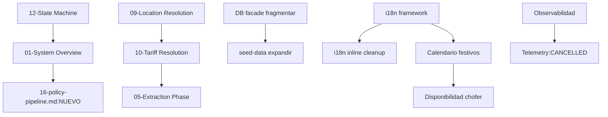

# BACKLOG — Plan de trabajo TaxGuazú

Seguimiento del backlog completo del sistema: diagramas, deuda técnica, features futuras, features eliminadas y plan de implementación AITOS.

<!-- ═══════════════════════════════════════════════════════════════════════ -->
<!-- CHANGELOG                                                                 -->
<!-- ═══════════════════════════════════════════════════════════════════════ -->

> **v3.6 — 2026-07-04** · AIT-040 completado: tabla `trip_events` + índice agregados a initSchema() (43 tablas ahora). Tipos `TripEventType` + `TripEventRow` en types.ts. validate-schema-parity confirma 1 diff esperado (trip_events no existe en DB hasta próximo deploy). Build OK. 740 tests, 0 regresiones. AEL enforce PASS.
> **v3.5 — 2026-07-04** · ADR-006 (Schema Parity) creado con caso motivador DEBT-12. Script validate-schema-parity.ts + npm script creado (mismo patrón que validate-knowledge). 0 drift confirmado post C1. DEBT-09 ampliado con alcance explícito: auditar TODOS los consumos de DB, único patrón facade homogéneo, vínculo con ADR-006.
> **v3.4 — 2026-07-04** · DEBT-12 Fase C1 ejecutada: initSchema() reemplazado con DDL completo (42 tablas, 0 drift). Todos los ALTER TABLE inline cubiertos. Verificacion de paridad contra Turso: 100%. 740 tests, 0 regresiones. AEL enforce PASS.
> **v3.3 — 2026-07-04** · DEBT-12 agregado (P0 — connection.ts initSchema() crea trips con 14 columnas vs 28 en DB real). Descubrimiento durante verificación AIT-040 contra DB Turso real: DDL en código desactualizado, 13 migraciones orphanas (`_migrations`) sin reflejo versionado, `trip_phase` es columna real (confirmado). AIT-032 Fase A subido a DONE. AIT-034 (manifest + validate-knowledge) implementado.
> **v3.2 — 2026-07-04** · AIT-030 completado (geo knowledge extraído a data/knowledge/geo/). AIT-031 completado (operational knowledge extraído a data/knowledge/ops/). AIT-033 completado (policy values extraídos a data/knowledge/policies/). GAP-03 agregado con recomendación sobre transport y practical. GAP-04 agregado (field-resolver.ts, 8 niveles de prioridad no entraron en AIT-033). AIT-030/031/033 actualizados a DONE.
> **v3.1 — 2026-07-04** · Correcciones tras validación: AIT-024 partido en 4 sub-tareas (Geo, Pricing, Dispatch, Fleet), dependencia invertida con AIT-025, notas cruzadas en DEBT-05/DEBT-08, AIT-042/043 explicitan audit log, AIT-015 reemplaza completamente glosario de architecture.md, AIT-006 registrado como iniciativa del ejecutor.
> **v3 — 2026-07-04** · Plan de implementación AITOS completo derivado de `docs/architecture/synthesis-final.md` (Sección G). 37 tareas nuevas en 7 fases (P0 paralelo, P0 dominio, P1 tools, P1 knowledge, P2 event sourcing, P2 observabilidad, P3 operational intelligence).
> **v2 — 2026-07-02** · Actualización de estado: DEBT-01/03 a DONE, DEBT-06 a IN_PROGRESS, diagramas Ola 1-3 a DONE, FUT-01 a IN_PROGRESS.
> **v1 — 2026-06-30** · Creación inicial. Inventario DGM, DEBT, FUT, REM.

<!-- ═══════════════════════════════════════════════════════════════════════ -->
<!-- LEYENDAS                                                                  -->
<!-- ═══════════════════════════════════════════════════════════════════════ -->

## Leyenda de categorías

| Categoría | Significado |
|-----------|-------------|
| `DONE` | Finalizado y verificado |
| `IN_PROGRESS` | En trabajo activo |
| `PENDIENTE_REVISION` | Completado, necesita Architect/Auditor |
| `BLOCKED` | Bloqueado por dependencia (registra cuál) |
| `MODIFICADO_CASCADA` | Alterado como consecuencia de otra modificación |
| `AT_RISK` | En riesgo por drift de dependencias |
| `DEFERRED` | Diferido intencionalmente |
| `CANCELLED` | Cancelado (registra razón) |

## Campos de cada item (secciones A–F)

`ID | Título | Prioridad | Componente | Depends-on | Blocks | Esfuerzo | Estado | Creado | Verificación | ADRs/Diagramas/UC | Notas`

## Campos de cada item (sección G — Plan AITOS)

`ID | Título | Fase | Dependencias | Archivos reales | Pasos técnicos | Criterio de aceptación | Estado`

---

<!-- ═══════════════════════════════════════════════════════════════════════ -->
<!-- SECCIONES A–F: HISTÓRICO (PRESERVADO ÍNTEGRO)                           -->
<!-- ═══════════════════════════════════════════════════════════════════════ -->

## A — Backlog Activo

*Items actualmente en trabajo o pendientes de revisión inmediata.*

> **Nota:** generación de SVGs suspendida por decisión del stakeholder. Se optó por mejorar la legibilidad de los archivos `.md` en su lugar.

### A.1 Diagramas Ola 1 (críticos)

| ID | Título | Prioridad | Componente | Estado |
|----|--------|-----------|------------|--------|
| DGM-01 | Diagrama 10-Tariff Resolution: reescribir a single query | P0 | docs/diagrams | **IN_PROGRESS** |
| DGM-02 | Diagrama 12-Workflow State Machine: agregar 3 estados faltantes | P0 | docs/diagrams | **IN_PROGRESS** |
| DGM-03 | Diagrama 09-Location Resolution: alias_lookup → aliases, eliminar paralelos | P0 | docs/diagrams | **IN_PROGRESS** |

### A.2 Deuda técnica prioritaria

| ID | Título | Prioridad | Componente | Estado | Notas |
|----|--------|-----------|------------|--------|-------|
| DEBT-01 | Convertir AFFIRMATION_RE duplicado a fuente única | P1 | ai/core.ts, ai/patterns.ts | `PENDIENTE_REVISION` | Dos implementaciones divergentes, unificar |
| DEBT-02 | Eliminar cadena circular survey.service → lead.service | P1 | services/ | `DEFERRED` | Ver architecture.md gaps |
| DEBT-03 | Refactor guard.ts: state request-scoped, no module-level | P1 | ai/guard.ts | `DEFERRED` | Alto impacto, requiere plan |
| DEBT-04 | Fragmentar database.ts (>63 funciones, 694 líneas) | P2 | db/database.ts | `DEFERRED` | Refactor mayor |
| DEBT-05 | Reducir acoplamiento lead.service (27 imports) | P2 | lead.service.ts | `DEFERRED` | Refactor mayor. ⚠️ Parcialmente abordado por AIT-024a-d (tools Geo/Pricing/Dispatch/Fleet en P1) — no re-hacer ese trabajo en P2, solo lo que AIT-024 no cubrió (resto del acoplamiento no relacionado a esos 4 dominios). |
| DEBT-06 | Extraer i18n inline de 30+ bloques if/else | P2 | ai/ | `DEFERRED` | Postergado hasta i18n framework |
| DEBT-09 | Auditar consumo de DB en todo el código: único patrón de acceso (facade) homogéneo | P2 | db/database.ts | `DEFERRED` | Relacionado con ADR-006 — mismo principio de fuente única de verdad, aplicado al patrón de acceso en vez de al schema |

### A.3 Features pendientes de revisión

| ID | Título | Prioridad | Componente | Estado | Notas |
|----|--------|-----------|------------|--------|-------|
| UC-09 | C-09 Encuesta post-viaje: expandir re-engagement (>2 destinos) | P1 | survey.service | `PENDIENTE_REVISION` | Ya existe código base |
| USECASES | Actualizar USECASES.md (C-09 ya implementado, fechas) | P1 | docs/ | `PENDIENTE_REVISION` | Desactualizado desde 13/5 |

---

## B — Diagramas pendientes

*Estado de los 15 diagramas de arquitectura (`docs/architecture/diagrams/`).*

### Ola 1 — Críticos (corregir ya)

| ID | Diagrama | Problema | Estado |
|----|----------|---------|--------|
| DGM-01 | 10-Tariff Resolution | Arquitectura fundamental cambiada (cascada→single query), L5 inexistente | `DONE` ✅ |
| DGM-02 | 12-State Machine | Faltan 3 de 7 estados (awaiting_passenger, pending_human_review, ambiguity_pending) | `DONE` ✅ |
| DGM-03 | 09-Location Resolution | Referencia alias_lookup eliminada; presenta "dos sistemas paralelos" inexistentes | `DONE` ✅ |

### Ola 2 — Alto (próxima)

| ID | Diagrama | Problema | Estado |
|----|----------|---------|--------|
| DGM-04 | 01-System Overview | No muestra policy-pipeline.ts (orquestador real), laterals/, extraction/, learning/ | `DONE` ✅ |
| DGM-05 | 03-CORE Phase | No muestra applyLaterals, purchaseIntent, slotAssignmentConfidence; 11 intents vs 7 facts | `DONE` ✅ |
| DGM-16 | **NUEVO** policy-pipeline.md | Hoy ningún diagrama muestra este orquestador crítico (359 líneas) | `DONE` ✅ |

### Ola 3 — Medio (diferido)

| ID | Diagrama | Problema | Estado |
|----|----------|---------|--------|
| DGM-06 | 02-Webhook Entry | Missing 8 button prefixes, HMAC, idempotency, driver detection | `DONE` ✅ |
| DGM-07 | 04-Router Phase | Tabla de políticas incorrecta (Policy Consulta no existe, SAFE_FALLBACK) | `DONE` ✅ |
| DGM-08 | 05-Extraction Phase | Faltan 4 slots en confidence table, 7 módulos de extraction, language field | `DONE` ✅ |
| DGM-09 | 06-Confidence Model | Missing state RAW (antes DETECTED), missing sources, carry-over logic | `DONE` ✅ |
| DGM-10 | 07-Policy AHORA | Missing 3 output props (needsAdminNotify, confirmationUI, buildGreeting), LLM gate | `DONE` ✅ |
| DGM-11 | 08-Policy RESERVA | Missing 4 funciones (buildBookingAccepted, safeSlotResolution, lateral, format-label) | `DONE` ✅ |
| DGM-12 | 11-Operational Readiness | Missing canPrepareQuote, blockedBy reasons reales, PLACE/ZONE location | `DONE` ✅ |
| DGM-13 | 13-Slot Confidence Evolution | Missing fuzzy_alias_match, unknown_location, buildSlotStates | `DONE` ✅ |
| DGM-14 | 14-Dispatch Flow | Missing 4-level escalation, 5 cron jobs, broadcast details, now-execution | `DONE` ✅ |
| DGM-15 | 15-Data Flow | Duplicado del 11, missing policy-pipeline, extraction/learning flows | `DONE` ✅ |

---

## C — Deuda técnica

*Items de architecture.md y gaps conocidos.*

| ID | Título | Componente | Prioridad | Estado |
|----|--------|-----------|-----------|--------|
| DEBT-01 | AFFIRMATION_RE duplicado (core.ts vs patterns.ts) | ai/ | P1 | `DONE` ✅ | Unificado en patterns.ts, core.ts importa |
| DEBT-02 | Dependencia survey → lead (NO circular, cadena lineal) | services/ | P1 | `PENDIENTE_REVISION` | No hay ciclo — survey.service → lead-event-helpers → lead.service. Acoplamiento vertical documentado en lead-event-helpers.ts |
| DEBT-03 | guard.ts state a nivel de módulo (no request-scoped) | ai/guard.ts | P1 | `DONE` ✅ | Estado global eliminado, guardias ahora usan parámetros explícitos |
| DEBT-04 | database.ts: 694 líneas, 63 funciones | db/database.ts | P2 | `DEFERRED` |
| DEBT-05 | lead.service: 27 imports, 11 cross-service | lead.service.ts | P2 | `DEFERRED` | ⚠️ Parcialmente abordado por AIT-024a-d (tools Geo/Pricing/Dispatch/Fleet en P1). No re-hacer ese trabajo en P2. |
| DEBT-06 | i18n inline en 30+ bloques if/else | ai/ | P2 | `IN_PROGRESS` | ~15 bloques migrados (Fase 1-5). ~15 restantes (timeouts.ts, lead.service.ts, handler.ts — Fase 6-7). |
| DEBT-07 | Violación AI→Services: response-builder importa OpportunityResult | ai/response-builder.ts | P2 | `DEFERRED` |
| DEBT-08 | policy-pipeline.ts: 312 líneas, 6 dependencias cross-service | workflow/policy-pipeline.ts | P2 | `DEFERRED` | ⚠️ Parcialmente abordado por AIT-024a-d (tools Geo/Pricing/Dispatch/Fleet en P1). No re-hacer ese trabajo en P2. |
| DEBT-09 | **Auditar consumo de DB en todo el código: garantizar un único patrón de acceso (facade) homogéneo** | db/database.ts + todos los servicios | P2 | `DEFERRED` | **Alcance ampliado (2026-07-04, vínculo ADR-006):** No solo detectar `getDb()`/`queryOne()` sueltos — auditar TODOS los consumos de DB en el código y confirmar que hay un único patrón de acceso (facade via `database.ts`) usado de forma homogénea en todos los servicios. No debe existir una lista de excepciones que crece con el tiempo. La `database.ts` debe ser la única puerta de entrada a la DB, con cada operación envuelta en una función con nombre y tipos. Si un servicio necesita un query nuevo, extiende la facade — no hace `getDb().execute("SELECT ...")` inline.  **Relacionado con ADR-006** — mismo principio de fuente única de verdad, aplicado al patrón de acceso en vez de al schema. |
| DEBT-11 | policy-pipeline.ts convierte PricingToolOutput → PricingResult en 5 call sites | workflow/policy-pipeline.ts | P2 | `DEFERRED` | ⚠️ En AIT-024b se creó `pricingToolOutputToResult()` para convertir PricingToolOutput → PricingResult en los 5 puntos donde buildExtractionContext, evaluateOpportunities, executeTrip, executeMultiLegTrip y executeNowTrip aún esperan PricingResult. Consumir PricingToolOutput directo en esos consumidores queda diferido — la conversión es el puente explícito sin as any. Cuando esos consumidores legacy se actualicen a PricingToolOutput, los 5 call sites se simplifican. |
| **DEBT-12** | **`connection.ts initSchema()` drift de schema contra DB real Turso** | `src/lib/db/core/connection.ts` | **P0** | **Fase C1: `DONE` ✅** C2: `PENDING` C3: `PENDING` | **Fase C1 (DONE):** initSchema() reemplazado con DDL completo de 42 tablas. Verificación de paridad contra Turso: 100% — 42/42 tablas, 0 diferencias de columnas. `npm run build` OK. 740 tests, 0 regresiones. AEL enforce PASS.  **Fase C2 (PENDING):** Implementar migration runner (no existe hoy — _migrations es puramente pasivo/histórico).  **Fase C3 (PENDING):** Limpiar 8 bloques ALTER TABLE inline en connection.ts (L390-580) que ahora están cubiertos por el DDL nuevo. Requiere C2 primero para que DBs existentes tengan upgrade path.  **[Descubierto durante verificación AIT-040 contra DB real Turso — 2026-07-04]** |
| GAP-01 | policy-pipeline.ts no valida disponibilidad de flota antes de dispatch | workflow/policy-pipeline.ts | P1/P2 (a definir) | `NEEDS VALIDATION` | El pipeline nunca consumió fleet-validation directamente — el chequeo de flota ocurre hoy en trip-execution.service.ts y now-execution.service.ts, más tarde en el flujo. tool-fleet.ts (AIT-023) ya está validado y listo para consumir si se decide mover el check a fail-fast en el pipeline. Esta es una decisión de arquitectura/UX (¿dónde debe fallar rápido el sistema?) que requiere validación explícita de Cristian/Claude antes de implementarse — no debe resolverse como efecto lateral de otra tarea. |
| GAP-02 | dispatchTool.dispatch() validado, pero executeDispatch sigue siendo consumido directamente por trip-execution.service.ts y now-execution.service.ts | workflow/policy-pipeline.ts | P1/P2 (a definir) | `NEEDS VALIDATION` | dispatchTool.dispatch() (AIT-022) ya está validado con contrato Zod y tests de equivalencia contra executeDispatch real con DB mockeada (3 escenarios: OFFERED, BROADCASTED por escalación, BROADCASTED por viaje no programado). Sin embargo, policy-pipeline.ts nunca importó executeDispatch directamente — el consumo real hoy está en trip-execution.service.ts (línea 20) y now-execution.service.ts (línea 4). Migrar esos consumos reales desde dispatch.service.ts hacia tool-dispatch.ts requiere su propio checkpoint, porque toca timeouts, escalación y notificación a choferes en producción — no debe hacerse como efecto lateral de otra tarea. |
| GAP-03 | **Recomendación post-AIT-031: transport (12 entradas) y practical (22 entradas) en iguazu-knowledge.ts** | iguazu-knowledge.ts (transport, practical) | P1 (a decidir) | `NEEDS VALIDATION` | Durante AIT-031 se inventariaron pero NO se extrajeron dos secciones de iguazu-knowledge.ts. Se recomienda no mezclarlas en AIT-031 sino evaluar si merecen su propio issue o se dejan como están. **Detalle:**  **transport** (12 entradas): `airportDistance`, `airportTime`, `airportDetails` (5), `premiumService` (5). Mezcla datos geográficos (distancias, tiempos) con descripciones operativas (protocolo premium). Sugerencia: **AIT-031b** (issue hermano) en lugar de incluirlo acá — no mezclar dominios geo/ops en un mismo archivo.  **practical** (22 entradas): `weather` (6), `currency` (5), `safety` (3), `restaurantRecommendations` (5), `language` (3). Mezcla 3 dominios distintos. Sugerencia: **partir en 3** — `weather` → `data/knowledge/geo/weather.json` (es clima, no operacional), `restaurantRecommendations` → `data/knowledge/geo/attractions.json` (son lugares, no procedimientos), `currency`/`safety`/`language` → `data/knowledge/ops/practical.json` (es información práctica operacional).  No implementar esta partición sin decisión explícita de Cristian/Claude. |
| GAP-04 | **field-resolver.ts: 8 niveles de prioridad de politicas candidatos para extraccion propia** | src/lib/ai/field-resolver.ts | P1 (candidato) | `NEEDS VALIDATION` | Durante AIT-033 se inventariaron pero NO se extrajeron 8 niveles de prioridad en `field-resolver.ts` (`PRIORITY_MAP`, `buildPriorityPrompt`). A diferencia de `policy-reserva.ts` (12 niveles, if/else cableado), aquí los niveles alimentan un prompt LLM de priorización — extraerlos a JSON requiere cambiar el formato del prompt builder. No se mezcló en AIT-033 por riesgo de cambio de comportamiento LLM. **Detalle:** `PRIORITY_MAP` mapea `OutputType \| "NEXT_STEP"` a 8 prioridades (1-8) con label corto + descripción para prompt. Cada entrada tiene `{priority, label, description}`. La extracción requiere: (a) mover `PRIORITY_MAP` a JSON, (b) cambiar `buildPriorityPrompt()` para leer del JSON y construir el mismo string, (c) tests de equivalencia que comparen el prompt generado (string exacto) pre y post extracción. No implementar sin decisión explícita de Cristian/Claude. |
| DEBT-10 | seed-data.ts: solo 7 zonas, 12 places, 20 tarifas (vs 18, 30, 60+ reales) | scripts/ | P2 | `DEFERRED` |

---

## D — Features futuras

*Mejoras de servicio priorizadas.*

| ID | Título | Prioridad | Esfuerzo | Dependencias | Estado | Notas |
|----|--------|-----------|----------|-------------|--------|-------|
| FUT-01 | **i18n framework real (es/pt/en)** | P1 | M | Ninguna | `IN_PROGRESS` | Framework de traducción + catálogo ~135+ strings en 21 categorías. 5/7 fases completas: response-builder, slot-confirmation, ambiguity-handler, policy-reserva, policy-ahora. Pendientes: timeouts+lead.service+handler (F6), extraer bloques inline restantes (F7). |
| FUT-02 | **Transcripción de audios** | P1 | M | Ninguna | `DONE` ✅ | WhatsApp voice notes masivos en LATAM. Gemini 2.0 Flash multimodal transcribe audio a texto, inyectado como mensaje de lead. Meta API download via sender.ts (WhatsApp layer). |
| FUT-03 | **Mensajes multimedia (location/image)** | P1 | S | Ninguna | `DEFERRED` | Clientes envían ubicación como destino. route.ts solo maneja text e interactive. |
| FUT-04 | **Re-engagement consultas estancadas C-05/S-06** | P1 | M | Ninguna | `DEFERRED` | Timeout + broadcast "Cliente interesado en X". checkTimeouts no lo detecta hoy. |
| FUT-05 | **Observabilidad: Sentry + métricas básicas** | P1 | M | Ninguna | `DEFERRED` | Sin visibilidad de errores en producción hoy. Telemetry fue purgado. |
| FUT-06 | **Split +6 pasajeros C-07** | P2 | S | Ninguna | `DEFERRED` | Hoy capéa silenciosamente a 6; ofrecer dividir en 2 autos. |
| FUT-07 | **Calendario de festivos en pricing** | P2 | S | FUT-01 (parcial) | `DEFERRED` | Datos ya existen en iguazu-knowledge.ts (AR/BR/PY). Conectar a pricing para surges. |
| FUT-08 | **Chat intermediado C-10** | P2 | L | Ninguna | `DEFERRED` | Relay de mensajes pax↔chofer sin compartir número. Modelo híbrido. |
| FUT-09 | **Contingencia DB S-04** | P2 | M | Ninguna | `DEFERRED` | Turso caído: no hay réplica ni fallback local. Connection.ts tiene fallback a /tmp/bot.db sin TURSO_URL. |
| FUT-10 | **Calendario y disponibilidad por chofer** | P3 | L | FUT-01 | `DEFERRED` | Choferes marcan disponibilidad futura. Festivos afectan precio y disponibilidad. |

---

## E — Features eliminadas (histórico)

*Elementos que existieron en código y fueron eliminados intencionalmente.*

| ID | Feature | Razón de eliminación | Referencia | Estado |
|----|---------|---------------------|-----------|--------|
| REM-01 | Telemetry/trace modules | Purged dead imports (router.ts:10) | `router.ts:10` | `CANCELLED` |
| REM-02 | alias_lookup table | Replaced by aliases JOIN places (database.ts:525) | `database.ts:525` | `CANCELLED` |
| REM-03 | Cascada secuencial L1-L4 tariff (4 queries) | Replaced by single query ORDER BY resolution_priority | `tariff-resolver.ts:3` | `CANCELLED` |
| REM-04 | L5 text fallback tariff | Never existed in stable code; was planned but replaced | `tariff-resolver.ts` | `CANCELLED` |
| REM-05 | SUBZONE_MAP / NODE_ZONE_MAP en geo-engine | Superseded by places/aliases DB tables | `geo-engine.ts:5` | `CANCELLED` |
| REM-06 | Zone resolution en geo-engine | Superseded by location-resolver.ts | `geo-engine.ts:126` | `CANCELLED` |
| REM-07 | trip_status column en conversations | ALTER TABLE DROP COLUMN | `connection.ts:442` | `CANCELLED` |
| REM-08 | escalateTrip en lead.service.ts | Replaced by dispatch.service.ts | `dispatch.service.ts:2` | `CANCELLED` |

---

## F — Dependencias entre items

---

<!-- ═══════════════════════════════════════════════════════════════════════ -->
<!-- SECCIÓN G: PLAN DE IMPLEMENTACIÓN AITOS (NUEVO — 2026-07-04)            -->
<!-- Derivado de: docs/architecture/synthesis-final.md                       -->
<!-- Reglas no negociables: sin multi-agente, sin plataforma genérica,       -->
<!-- sin Event Sourcing general (solo Trip+Dispatch), Pricing/Geo/Dispatch   -->
<!-- deterministas SIN LLM decidiendo.                                       -->
<!-- ═══════════════════════════════════════════════════════════════════════ -->

## G — Plan de Implementación AITOS

*Plan completo derivado de `docs/architecture/synthesis-final.md`. 35 tareas en 7 fases. Single-agent con tools tipadas. Producto único: TaxiGuazú. Sin mención a plataforma genérica ni otros productos.*

---

### G.0 — P0 PARALELO: Arreglos de producción (NO bloqueados por dominio)

*Estos tres fixes corren en paralelo a las etapas de modelado. Riesgo de producción activo hoy — no esperan a que termine ninguna fase de documentación.*

| ID | Título | Fase | Dependencias | Archivos reales | Pasos técnicos | Criterio de aceptación | Estado |
|----|--------|------|-------------|-----------------|-----------------|----------------------|--------|
| **AIT-001** | **Agregar "customs", "border" y "alfândega" a KNOWN_POIS en entity-extractor** | P0-paralelo | Ninguna | `src/lib/services/extraction/entity-extractor.ts` L27-34 | 1. Agregar `/\bcustoms?\b/i`, `/\bborder\b/i`, `/\balfândega\b/i` al array `KNOWN_POIS`. 2. Verificar que `isDirectEntityMention` no filtre estos términos. | Al escribir "Argentine customs" o "Brazil border", el sistema extrae "aduana" como POI detectada y no escala a operador. `npm test` pasa. | **DONE** ✅ — 53 files, 684 tests passed. Sin regresiones.
| **AIT-002** | **Agregar aliases EN/PT para "Aduana Argentina" en DB** | P0-paralelo | AIT-001 | `scripts/seed-data.ts`, tabla `aliases` | 1. Insertar alias "Argentine customs", "customs", "border checkpoint" con language='en' apuntando al place_id de Aduana Argentina. 2. Insertar alias "alfândega", "fronteira" con language='pt'. 3. Ejecutar `npm run seed`. | `resolveLocation("Argentine customs")` retorna `canonical_name: "Aduana Argentina"` con confidence "alias". | **DONE** ✅ — 4 aliases nuevos agregados a seed-data.ts (border checkpoint EN + fronteira PT en ar_aduanatn_border, border EN + fronteira PT en ar_br_border). Seed ejecutado: 35 insertados, 179 definidos. Tests: 53/53 ✅.
| **AIT-003** | **Persistir idioma del usuario en chat_sessions.lang después de cada turno** | P0-paralelo | Ninguna | `src/lib/db/core/connection.ts`, `src/lib/services/lead.service.ts`, `src/lib/detect-lang.ts`, `src/lib/db/database.ts` (`upsertChatSession`) | 1. En `lead.service.ts`, después de `detectLangWithFallback`, guardar result en variable `detectedLang`. 2. Pasar `lang: detectedLang` a `upsertChatSession` como nuevo parámetro. 3. En `database.ts`, actualizar `upsertChatSession` para aceptar y persistir el parámetro `lang`. 4. En `detectLangWithFallback`, cuando fast detection tiene confianza < 0.5, usar `sessionLang` si está disponible. | Un usuario que escribe "Hello" (turno 1) y luego "how much to the park" (turno 2) recibe respuesta en inglés en ambos turnos. `detectLangWithFallback` retorna "en" en turno 2 gracias a sessionLang persistido. | **DONE** ✅ — Fix: 1 línea (ALTER TABLE migration en connection.ts). El código de persistencia ya existía en lead.service.ts L536-540. detectLangWithFallback ya usaba sessionLang. Solo faltaba la columna lang en DBs viejas. 53/53 tests ✅.
| **AIT-004** | **Hacer WHATSAPP_APP_SECRET obligatorio para HMAC verification** | P0-paralelo | Ninguna | `src/app/api/whatsapp/webhook/route.ts`, `src/config/env.ts` | 1. En `env.ts`, mover `WHATSAPP_APP_SECRET` de opcional a requerido en el schema Zod. 2. En `route.ts`, quitar el `if (!appSecret)` que saltea verificación — si no hay secret, debe fallar con 500. 3. Actualizar `.env.example`. | Webhook sin HMAC válido retorna 401. Sin `WHATSAPP_APP_SECRET` configurado, el servidor no inicia (error de validación Zod). | PENDIENTE |
| **AIT-005** | **Implementar rate limiting en webhook por número de teléfono** | P0-paralelo | Ninguna | `src/app/api/whatsapp/webhook/route.ts` (nuevo middleware o lógica inline), tabla `connection_state` (para contadores) | 1. Agregar contador en `connection_state` con key `rate_limit_{phone}_{window}`. 2. En el POST handler, antes de procesar, verificar contador. 3. Si > 10 mensajes en ventana de 60 segundos → retornar 429. 4. Usar ventana deslizante simple con timestamp en `connection_state`. | Un número enviando >10 mensajes en 60s recibe 429. Mensajes legítimos no se ven afectados. | PENDIENTE |
| **AIT-006** | **Implementar re-prompt con LLM antes de escalar en comprehension-runner** | P0-paralelo | AIT-003 | `src/lib/services/extraction/comprehension-runner.ts`, `src/lib/services/extraction/comprehension.ts` (`getRecoveryMessage`) | 1. En `runComprehensionCheck`, cuando state es ESCALATION en segundo turno o posterior, NO enviar mensaje de escalación directo. 2. En su lugar, construir un re-prompt con LLM que incluya: el texto del usuario, los términos que el sistema SÍ entendió, y una pregunta contextual. 3. Solo escalar si el re-prompt también falla (segundo intento). 4. Usar `getRecoveryMessage` con parámetro `attempt=1` para diferenciar re-prompt de escalación final. | Al escribir "Argentine-side customs" con score 0.34, el bot responde "I understood you mentioned a border area. Could you specify which side — Argentine or Brazilian customs?" en vez de escalar directo. Solo escala si el segundo intento también falla. **Iniciativa del ejecutor — no parte literal de synthesis-final.md. Dejada en P0 por bajo riesgo y alta afinidad con AIT-001/002 (misma causa raíz: comprensión parcial).** | PENDIENTE |

---

### G.1 — P0 DOMINIO: Modelado de los 5 dominios prioritarios

*Modelar Trip, Dispatch, Pricing, Geo y Session antes que el resto del dominio. Documentar reglas de negocio, glosario unificado y state machines sin tocar código de producción.*

| ID | Título | Fase | Dependencias | Archivos reales | Pasos técnicos | Criterio de aceptación | Estado |
|----|--------|------|-------------|-----------------|-----------------|----------------------|--------|
| **AIT-010** | **Modelar dominio Trip: documentar ciclo de vida completo del viaje** | P0-dominio | Ninguna | `src/lib/db/domains/trips.ts`, `src/lib/db/types.ts` (TripRow, TripPhase), `src/lib/services/trip-execution/trip-execution.service.ts`, `src/lib/ai/types.ts` (TemporalMode) | 1. Extraer todos los estados de `TripPhase` (DRAFT→QUOTED→CONFIRMED→ASSIGNED→IN_PROGRESS→CLOSED). 2. Documentar transiciones válidas con triggers (qué causa cada transición). 3. Identificar condiciones de guarda (canDispatch, canQuote). 4. Listar side effects por transición (notificar admin, enviar encuesta, loggear aprendizaje). 5. Output: `docs/architecture/domains/trip.md`. | Documento contiene: state machine diagram (Mermaid), todas las transiciones válidas, triggers, guardas, y side effects. Revisado contra `trip-execution.service.ts` línea por línea. | PENDIENTE |
| **AIT-011** | **Modelar dominio Dispatch: documentar niveles de escalamiento y asignación** | P0-dominio | Ninguna | `src/lib/services/dispatch/dispatch.service.ts`, `src/lib/services/dispatch/dispatch-workflow.ts`, `src/lib/services/dispatch/driver.service.ts`, `src/lib/db/state-accessors.ts` (DispatchState) | 1. Documentar 4 niveles de escalamiento con timeouts y criterios. 2. Mapear `DispatchState` FSM (idle→nivel_1→nivel_2→nivel_3→waiting_driver→closed). 3. Documentar reglas de broadcast: filtrado por tier, shift, país, payout mínimo. 4. Output: `docs/architecture/domains/dispatch.md`. | Documento contiene: diagrama de estados, timeouts por nivel, reglas de broadcast con filtros, y contrato de `executeDispatch()`. | PENDIENTE |
| **AIT-012** | **Modelar dominio Pricing: documentar dual track v2/v3 y reglas comerciales** | P0-dominio | Ninguna | `src/lib/services/pricing/tariff-resolver.ts`, `src/lib/services/pricing/pricing-engine.ts`, `src/lib/services/pricing/commercial-pricing-engine.ts`, `src/lib/services/pricing/hub-discount.ts`, `src/lib/services/pricing/tour-resolver.ts`, tabla `tariffs` | 1. Documentar resolución 4 niveles (place→place, place→zone, zone→place, zone→zone). 2. Mapear relación v2 (tariff-resolver) vs v3 (pricing-engine). 3. Listar reglas comerciales activas (promociones, ajustes, paquetes, hub discounts). 4. Documentar `resolution_priority` y su interacción con `crosses_border`. 5. Output: `docs/architecture/domains/pricing.md`. | Documento contiene: matriz de resolución de tarifas, reglas comerciales, y decisión sobre unificación v2/v3. | PENDIENTE |
| **AIT-013** | **Modelar dominio Geo: documentar resolución de lugares y zonas** | P0-dominio | Ninguna | `src/lib/services/geo/location-resolver.ts`, `src/lib/services/geo/geo-engine.ts` (DEPRECATED), `src/lib/db/domains/geo.ts`, tablas `places`, `aliases`, `zones` | 1. Documentar pipeline de resolución: alias exacto → nombre exacto → fuzzy → fallback. 2. Mapear relación places↔zones (zone_id FK). 3. Identificar zonas faltantes (aduana_AR, aduana_BR). 4. Documentar `geo-engine.ts` como deprecated y plan de eliminación. 5. Output: `docs/architecture/domains/geo.md`. | Documento contiene: pipeline de resolución, catálogo de zonas, gaps de cobertura geográfica, y plan de eliminación de geo-engine.ts. | PENDIENTE |
| **AIT-014** | **Modelar dominio Session: documentar estado conversacional y ciclo de vida** | P0-dominio | AIT-010, AIT-011 | `src/lib/db/core/connection.ts` (schema `chat_sessions`), `src/lib/db/state-accessors.ts`, `src/lib/services/workflow/slot-workflow.ts`, `src/lib/ai/slot-state.ts`, `src/lib/services/memory/context-memory.ts` | 1. Documentar schema completo de `chat_sessions` (17 columnas). 2. Mapear estado conversacional (7 estados: idle→collecting_slots→slot_confirmation→awaiting_passenger→awaiting_confirmation→executing→pending_human_review). 3. Documentar TTLs y expiración (48h session, 1h slot staleness, 30min confirmation). 4. Documentar merge semántico de context-memory. 5. Output: `docs/architecture/domains/session.md`. | Documento contiene: schema de chat_sessions, state machine conversacional, TTLs, y reglas de merge. | PENDIENTE |
| **AIT-015** | **Glosario unificado: reemplazar el glosario de architecture.md por uno completo** | P0-dominio | AIT-010, AIT-011, AIT-012, AIT-013, AIT-014 | `docs/architecture/architecture.md` L169-185 (glosario a reemplazar), `docs/architecture/REVERSE_ENGINEERING_REPORT.md` | 1. Partir del glosario existente (15 términos). 2. Agregar términos de los 5 dominios modelados. 3. Unificar nombres donde haya divergencia (ej: "workflow state" vs "conversational state"). 4. Incluir términos del AI layer (CoreDecision, PolicyOutput, SlotStatus). 5. Output: `docs/architecture/glossary.md` (archivo nuevo, fuente canónica). 6. Reemplazar `architecture.md` L169-185 por una línea: `> Ver glosario completo en [glossary.md](./glossary.md)`. **Un solo lugar, no dos que puedan divergir.** | Todo el equipo usa los mismos nombres para los mismos conceptos. `architecture.md` referencia el glosario externo, no lo duplica. Cada término tiene definición, origen (código/ADR/dominio), y sinónimos deprecados. | PENDIENTE |

---

### G.2 — P1: Tools con contratos estables

*Herramientas tipadas para Geo, Pricing, Dispatch y Fleet. Contratos estables desacoplados de la implementación. Consumidas por el orquestador single-agent (hoy TaxiGuazú, sin abstracción genérica).*

| ID | Título | Fase | Dependencias | Archivos reales | Pasos técnicos | Criterio de aceptación | Estado |
|----|--------|------|-------------|-----------------|-----------------|----------------------|--------|
| **AIT-020** | **Definir contrato de tool Geo: interfaz + tipos + validación Zod** | P1-tools | AIT-013 | NUEVO: `src/lib/services/geo/tool-geo.ts` | 1. Definir interfaz `GeoTool`: `resolveLocation(input: GeoToolInput) => GeoToolOutput`. 2. Tipos: `GeoToolInput { text: string, lang?: Lang }`, `GeoToolOutput { placeId, canonicalName, displayName, zoneId, confidence, candidates }`. 3. Schema Zod de validación. 4. Wrapper alrededor de `location-resolver.ts` existente. 5. No modificar implementación interna de location-resolver. | `GeoTool.resolveLocation("aeropuerto")` retorna output tipado y validado. El contrato es estable — cambios en location-resolver.ts no rompen el contrato si el output sigue siendo válido. | PENDIENTE |
| **AIT-021** | **Definir contrato de tool Pricing: interfaz + tipos + validación Zod** | P1-tools | AIT-012 | NUEVO: `src/lib/services/pricing/tool-pricing.ts` | 1. Definir interfaz `PricingTool`: `calculatePrice(input: PricingToolInput) => PricingToolOutput`. 2. Tipos: `PricingToolInput { originPlaceId, destPlaceId, passengers, modality? }`, `PricingToolOutput { finalPrice, basePrice, adjustments, tariffId, currency }`. 3. Schema Zod. 4. Wrapper alrededor de `resolve-pricing-for-slots.ts` existente. | `PricingTool.calculatePrice(...)` retorna output tipado. El contrato esconde complejidad de dual track v2/v3. | PENDIENTE |
| **AIT-022** | **Definir contrato de tool Dispatch: interfaz + tipos + validación Zod** | P1-tools | AIT-011 | NUEVO: `src/lib/services/dispatch/tool-dispatch.ts` | 1. Definir interfaz `DispatchTool`: `dispatchTrip(input: DispatchToolInput) => DispatchToolOutput`. 2. Tipos: `DispatchToolInput { tripId, origin, destination, passengers, scheduledAt?, urgency? }`, `DispatchToolOutput { status, assignedDriver?, escalationLevel, offersSent }`. 3. Schema Zod. 4. Wrapper alrededor de `dispatch.service.ts` existente. | `DispatchTool.dispatchTrip(...)` retorna output tipado. Timeouts y escalamiento encapsulados. | PENDIENTE |
| **AIT-023** | **Definir contrato de tool Fleet: interfaz + tipos + validación Zod** | P1-tools | AIT-011 | NUEVO: `src/lib/services/dispatch/tool-fleet.ts` | 1. Definir interfaz `FleetTool`: `checkAvailability(input: FleetToolInput) => FleetToolOutput`. 2. Tipos: `FleetToolInput { passengers, originZoneId?, country? }`, `FleetToolOutput { available, maxCapacity, eligibleDrivers, constraints }`. 3. Schema Zod. 4. Wrapper alrededor de `fleet-validation.ts` y queries de drivers. | `FleetTool.checkAvailability(...)` retorna disponibilidad real con restricciones. No decide — solo reporta. | PENDIENTE |
| **AIT-024a** | **Integrar tool Geo en policy-pipeline.ts: reemplazar imports de geo/* por tool-geo** | P1-tools | **AIT-025**, AIT-020 | `src/lib/services/workflow/policy-pipeline.ts`, `src/lib/services/lead.service.ts` | 1. Reemplazar imports directos de `geo/location-resolver.ts` y `geo/geo-engine.ts` en `policy-pipeline.ts` por import del `GeoTool` contract. 2. Misma firma, distinto import — sin cambiar lógica de negocio. 3. Ejecutar tests de contrato (`AIT-025`) para verificar que no se rompió nada. **Geo primero por ser el de menor riesgo y menor acoplamiento.** | `policy-pipeline.ts` usa `GeoTool.resolveLocation()` en vez de `resolveLocation()` directo. Tests de contrato Geo pasan. `npm run build` compila sin errores. | PENDIENTE |
| **AIT-024b** | **Integrar tool Pricing en policy-pipeline.ts: reemplazar imports de pricing/* por tool-pricing** | P1-tools | AIT-024a, AIT-025, AIT-021 | `src/lib/services/workflow/policy-pipeline.ts`, `src/lib/services/lead.service.ts` | 1. Reemplazar imports directos de `resolve-pricing-for-slots.ts`, `tariff-resolver.ts`, `pricing-engine.ts` en `policy-pipeline.ts` por import del `PricingTool` contract. 2. Misma lógica, distinto import. 3. Tests de contrato Pricing deben pasar. | `policy-pipeline.ts` usa `PricingTool.calculatePrice()` en vez de `resolvePricingForSlots()` directo. Tests pasan. Build compila. | PENDIENTE |
| **AIT-024c** | **Integrar tool Fleet en policy-pipeline.ts: reemplazar imports de fleet-validation por tool-fleet** | P1-tools | AIT-024b, AIT-025, AIT-023 | `src/lib/services/workflow/policy-pipeline.ts`, `src/lib/services/lead.service.ts` | 1. Reemplazar imports de `fleet-validation.ts` en `policy-pipeline.ts` por import del `FleetTool` contract. 2. Tests de contrato Fleet deben pasar. | `policy-pipeline.ts` usa `FleetTool.checkAvailability()` en vez de `ensureFleetCanHandle()` directo. Tests pasan. Build compila. | PENDIENTE |
| **AIT-024d** | **Integrar tool Dispatch en policy-pipeline.ts: reemplazar imports de dispatch/* por tool-dispatch** | P1-tools | AIT-024c, AIT-025, AIT-022 | `src/lib/services/workflow/policy-pipeline.ts`, `src/lib/services/lead.service.ts` | 1. Reemplazar imports de `dispatch.service.ts`, `dispatch-workflow.ts` en `policy-pipeline.ts` por import del `DispatchTool` contract. 2. **Dispatch último por ser el de mayor superficie de cambio y mayor acoplamiento.** 3. Tests de contrato Dispatch deben pasar. | `policy-pipeline.ts` usa `DispatchTool.dispatchTrip()` en vez de `executeDispatch()` directo. Tests pasan. Build compila. **Nota cruzada con DEBT-05/DEBT-08: este item aborda el acoplamiento de policy-pipeline.ts exclusivamente en lo relativo a Geo/Pricing/Dispatch/Fleet. El resto del acoplamiento (memory, learning, trip-execution directo) queda para DEBT-05/DEBT-08 en P2.** | PENDIENTE |
| **AIT-025** | **Tests de contrato: cada tool tiene tests que validan el contrato, no la implementación** | P1-tools | AIT-020, AIT-021, AIT-022, AIT-023 | NUEVO: `tests/tools/tool-geo.test.ts`, `tests/tools/tool-pricing.test.ts`, `tests/tools/tool-dispatch.test.ts`, `tests/tools/tool-fleet.test.ts` | 1. Para cada tool, escribir tests que validen: (a) el output cumple el schema Zod, (b) edge cases (input vacío, valores extremos, sin datos), (c) timeouts no bloquean. 2. Usar mocks de DB para no depender de datos reales. 3. **Debe completarse ANTES de AIT-024a-d. Nunca se cablean los tools al orquestador sin tests que detecten si el contrato se rompió.** | `npm test -- tests/tools/` pasa. Cambios en implementación interna que rompan el contrato son detectados por tests de contrato. | PENDIENTE |

---

### G.3 — P1: Knowledge Layer

*Extraer conocimiento operacional fragmentado (prompts, código, DB, cabeza del fundador) a una capa de conocimiento estructurada y versionada.*

| ID | Título | Fase | Dependencias | Archivos reales | Pasos técnicos | Criterio de aceptación | Estado |
|----|--------|------|-------------|-----------------|-----------------|----------------------|--------|
| **AIT-030** | **Extraer conocimiento geográfico de iguazu-knowledge.ts a data/knowledge/geo/** | P1-knowledge | Ninguna | `src/lib/ai/iguazu-knowledge.ts` L1-598, NUEVO: `data/knowledge/geo/places.json`, `data/knowledge/geo/borders.json`, `data/knowledge/geo/attractions.json` | 1. Extraer `knownPlaces` (30+ lugares con aliases) a `places.json`. 2. Extraer `borders` (Tancredo Neves, Puente Amistad, Corredor Turístico) a `borders.json`. 3. Extraer `attractions` (precios, horarios) a `attractions.json`. 4. Cada archivo JSON con schema tipado. 5. `iguazu-knowledge.ts` pasa a ser un loader que lee de estos archivos. | El conocimiento geográfico es editable sin tocar TypeScript. Agregar un lugar nuevo es agregar una entrada JSON. `getKnownPlacesPrompt()` sigue funcionando igual. | PENDIENTE |
| **AIT-031** | **Extraer conocimiento operacional a data/knowledge/ops/** | P1-knowledge | AIT-030 | `src/lib/ai/taxiguazu-knowledge.ts` L1-121, `src/lib/ai/iguazu-knowledge.ts` (migration), NUEVO: `data/knowledge/ops/operations.json`, `data/knowledge/ops/migration.json`, `data/knowledge/ops/pricing-rules.json` | 1. Extraer `TAXIGUAZU_KNOWLEDGE` (8 secciones, 49 entradas) a `operations.json`. 2. Extraer `migration` (12 entradas) a `migration.json`. 3. pricing-rules.json: array vacío — no hay reglas de pricing fuera de DB. 4. Zod schemas para cada JSON. 5. Loader conversion: taxiguazu-knowledge.ts + iguazu-knowledge.ts migration. 6. GAP-03 documentado con recomendación sobre transport (12) y practical (22) para decisión de Cristian/Claude. | Conocimiento operacional versionado y editable. `getOperationalInfoPrompt()` sigue funcionando. 57 files, 723 tests, 0 regresiones. | **DONE** ✅ |
| **AIT-032** | **Extraer conocimiento comercial: festivos, temporadas, surges** | P1-knowledge | AIT-030, AIT-031 | **Fase A** — `src/lib/ai/iguazu-knowledge.ts` (calendar section), `src/lib/ai/taxiguazu-knowledge.ts`. NUEVO: `data/knowledge/commercial/calendar.json`, `data/knowledge/commercial/surge-rules.json`  **Fase B** — `src/lib/services/pricing/pricing-engine.ts`, `src/lib/services/pricing/commercial-pricing-engine.ts` | **Fase A:** 1. Extraer `calendar` (21 entradas: lunas llenas, holidays AR/BR/PY, seasons) a `calendar.json`. 2. Crear `surge-rules.json` (array vacío — sin reglas activas por falta de definición de negocio).  **Fase B:** 3. ⚠️ Conectar pricing engine con surge-rules.json para aplicar ajustes de precio automáticos según la regla activa. | **Fase A:** 21 entradas de calendario extraídas y verificadas. surge-rules.json creado como array vacío (cero reglas activas — el negocio aún no definió qué festivos aplican X% de incremento ni qué temporada alta califica).  **Fase B:** Diferido a FUT-07 — requiere definición de negocio (qué festivos → qué % de surge) antes de cablear a pricing engine. | **Fase A:** `DONE` ✅ **Fase B:** `DEFERRED` (→FUT-07) |
| **AIT-033** | **Extraer políticas de negocio a data/knowledge/policies/** | P1-knowledge | Ninguna | `src/lib/ai/policy-reserva.ts`, `src/lib/ai/policy-ahora.ts`, `src/lib/services/extraction/comprehension-runner.ts`, `src/lib/ai/guard.ts`, NUEVO: `data/knowledge/policies/reserva.json`, `data/knowledge/policies/ahora.json`, `data/knowledge/policies/escalation.json`, `data/knowledge/policies/*.schema.ts` | 1. Extraer reglas de decisión de `policy-reserva.ts` (12 niveles de prioridad — backlog decía 10, verificado: 12) a `reserva.json`. 2. Extraer reglas de `policy-ahora.ts` (policyHints) a `ahora.json`. 3. Extraer reglas de escalación de `comprehension-runner.ts` (FRUSTRATION_RE, LLM prompts, adminTemplate) + `guard.ts` (mensajes de error) a `escalation.json`. 4. Las policies siguen siendo código TypeScript, pero las reglas son datos. 5. 8 tests de equivalencia (17 variantes) verifican comportamiento idéntico pre/post extracción. 6. `decisionPriority` (reserva.json) y `decisionRules` (ahora.json) son documentación-only — el if/else cableado no itera el JSON. | Cambiar una regla de negocio (ej: "si el precio es >X, pedir confirmación extra") es editar un JSON, no recompilar TypeScript. 57 files, 723 tests, 0 regresiones. AEL enforce PASS. | **DONE** ✅ |
| **AIT-034** | **Sistema de versionado de knowledge layer** | P1-knowledge | AIT-030, AIT-031, AIT-032, AIT-033 | NUEVO: `data/knowledge/manifest.json`, `scripts/validate-knowledge.ts` | 1. Crear `manifest.json` con versión semántica del knowledge layer, hash de cada archivo, y timestamp. 2. Crear script `validate-knowledge.ts` que verifique integridad de todos los archivos JSON (schemas, referencias cruzadas, sin duplicados). 3. Agregar al pre-commit hook. | `npm run validate-knowledge` verifica que el knowledge layer es consistente. El manifest se actualiza automáticamente al modificar cualquier archivo. 11/11 checks OK. 740 tests, 0 regresiones. | **DONE** ✅ |

---

### G.4 — P2: Event Sourcing selectivo

*Event Sourcing solo para el ciclo de vida de Trip y Dispatch. No se aplica a sesiones, mensajes, ni pricing.*

| ID | Título | Fase | Dependencias | Archivos reales | Pasos técnicos | Criterio de aceptación | Estado |
|----|--------|------|-------------|-----------------|-----------------|----------------------|--------|
| **AIT-040** | **Diseñar schema de eventos para Trip** | P2-events | AIT-010 | `src/lib/db/core/connection.ts`, `src/lib/db/types.ts` | 1. Definir tabla `trip_events` con event_type CHECK: `TripCreated, TripDriverAssigned, TripReconfirmed, TripCompleted, TripCancelled`. 2. DDL agregado a initSchema() (DEBT-12 Fase C1 ya completo, no reintrodujo drift). 3. Tipos `TripEventType` + `TripEventRow` en `types.ts`. 4. Índice `idx_trip_events_trip` agregado. | Tabla `trip_events` definida en schema versionado. `npm run validate-schema-parity` reporta 1 diff esperado (trip_events no existe en DB real hasta próximo deploy). Build OK. 740 tests, 0 regresiones. AEL enforce PASS. | **DONE** ✅ |
| **AIT-041** | **Diseñar schema de eventos para Dispatch** | P2-events | AIT-011 | NUEVO: `src/lib/db/domains/dispatch-events.ts`, tabla `dispatch_events` en `src/lib/db/core/connection.ts` | 1. Definir tabla `dispatch_events`: `id, trip_id, event_type (DispatchOffered, DispatchAccepted, DispatchRejected, DispatchEscalated, DispatchTimedOut, DispatchCompleted), payload JSON, driver_phone, occurred_at`. 2. DDL en `initSchema()`. 3. Tipos en `db/types.ts`. | Tabla `dispatch_events` existe en schema. Cada cambio de nivel de dispatch genera un evento inmutable. | PENDIENTE |
| **AIT-042** | **Implementar event logger: escribir eventos en cada transición de Trip** | P2-events | AIT-040 | `src/lib/services/trip-execution/trip-execution.service.ts`, `src/lib/services/trip-execution/now-execution.service.ts`, `src/lib/db/domains/trips.ts` | 1. En cada función que modifica estado de Trip (`createTrip`, `executeTrip`, `assignDriverToTrip`, `completeTrip`), agregar `insertTripEvent()` después del UPDATE. 2. El evento se escribe en la misma transacción que el cambio de estado. 3. **Los eventos son audit log (append-only, no source of truth).** La tabla `trips` sigue siendo la fuente de verdad para lecturas. Los eventos solo registran trazabilidad y permiten recuperación ante fallos. No se reemplaza el estado mutable. | Cada cambio de estado de un viaje genera exactamente un evento en `trip_events`. `SELECT * FROM trip_events WHERE trip_id = ?` reconstruye la historia completa para auditoría, pero `getTripById()` sigue leyendo de `trips`. | PENDIENTE |
| **AIT-043** | **Implementar event logger: escribir eventos en cada transición de Dispatch** | P2-events | AIT-041 | `src/lib/services/dispatch/dispatch.service.ts`, `src/lib/services/dispatch/dispatch-workflow.ts`, `src/lib/services/dispatch/driver.service.ts` | 1. En `executeDispatch`, `executeEscalation`, `advanceToNivel1/2/3`, `offerToSpecificDriver`, escribir evento correspondiente. 2. Eventos trazan: quién recibió la oferta, quién aceptó/rechazó, en qué nivel escaló. 3. **Los eventos son audit log (append-only, no source of truth).** Las tablas `trips` y el estado de dispatch en `chat_sessions` siguen siendo la fuente de verdad para lecturas. Los eventos solo registran trazabilidad. | Cada acción de dispatch genera un evento. `SELECT * FROM dispatch_events WHERE trip_id = ?` muestra la traza completa de asignación para auditoría, pero el estado de dispatch se lee de las tablas existentes. | PENDIENTE |
| **AIT-044** | **Proyección: construir estado actual de Trip desde eventos** | P2-events | AIT-042 | NUEVO: `src/lib/services/trip-execution/trip-projector.ts` | 1. Función `projectTripState(tripId)`: lee todos los eventos de `trip_events`, aplica reducers por event_type, y reconstruye el estado actual. 2. Comparar con estado en tabla `trips` para detectar divergencias (modo auditoría, no reemplaza estado actual). | `projectTripState(tripId)` retorna el mismo estado que `getTripById(tripId)`. Si hay divergencia, se loggea warning. | PENDIENTE |

---

### G.5 — P2: Observabilidad + evals

*Sentry para errores de producción, métricas básicas de negocio, y sistema de evaluación de calidad de respuestas.*

| ID | Título | Fase | Dependencias | Archivos reales | Pasos técnicos | Criterio de aceptación | Estado |
|----|--------|------|-------------|-----------------|-----------------|----------------------|--------|
| **AIT-050** | **Integrar Sentry para captura de errores en producción** | P2-obs | Ninguna | `sentry.client.config.ts` o `sentry.server.config.ts` (a crear), `next.config.ts`, `package.json` | 1. Instalar `@sentry/nextjs`. 2. Configurar DSN en variable de entorno `SENTRY_DSN`. 3. Envolver API routes con `Sentry.wrapApiHandlerWithSentry`. 4. Configurar sample rate 1.0 para errores, 0.1 para performance. | Errores no capturados en producción aparecen en dashboard de Sentry con stack trace y contexto de request. `throw new Error("test")` en webhook aparece en Sentry en <1 minuto. | PENDIENTE |
| **AIT-051** | **Métricas básicas de negocio: dashboard de KPIs** | P2-obs | Ninguna | NUEVO: `src/app/api/bot/metrics/route.ts`, queries en `src/lib/db/database.ts` | 1. Endpoint GET `/api/bot/metrics` (protegido con ADMIN_API_KEY). 2. Métricas: conversaciones activas (últimas 24h), viajes completados (últimos 7d), tasa de conversión (consultas→viajes), tiempo medio de respuesta, tasa de escalación. 3. Datos desde queries SQL a tablas existentes. | `GET /api/bot/metrics` retorna JSON con las 5 métricas. Valores razonables (no 0, no null). | PENDIENTE |
| **AIT-052** | **Sistema de evals: evaluar calidad de respuestas del bot** | P2-obs | Ninguna | NUEVO: `src/lib/services/learning/evals.ts`, `scripts/run-evals.ts` | 1. Definir dataset de evals: 20-30 pares (input, expected_intent, expected_output_type, expected_slots_minimos). 2. Para cada input, ejecutar `core()` y `router()` y comparar resultado contra expected. 3. Reportar precisión de intent, precisión de output_type, recall de slots. 4. Formato: `scripts/run-evals.ts` que imprime tabla de resultados. | `npm run evals` ejecuta el dataset y reporta métricas. Precisión de intent > 85%, recall de slots > 70%. | PENDIENTE |
| **AIT-053** | **Logging estructurado: migrar console.log a logger con niveles** | P2-obs | Ninguna | Todos los archivos con `console.log`, `src/lib/utils/logger.ts` | 1. Auditar todos los `console.log` en producción (~30+ archivos). 2. Migrar a `log.info()`, `log.warn()`, `log.error()` según severidad. 3. Agregar `LOG_LEVEL` env var para controlar verbosidad. 4. En producción, LOG_LEVEL=warn (solo errores y warnings). | No hay `console.log` en rutas de producción. `LOG_LEVEL=debug` en desarrollo muestra todos los logs. `LOG_LEVEL=warn` en producción solo muestra warnings y errores. | PENDIENTE |

---

### G.6 — P3: Operational Intelligence Layer

*"Inferir y confirmar" — el sistema prepara automáticamente la cotización probable y la presenta como sugerencia, pero la confirmación del usuario sigue siendo necesaria para ejecutar. Depende de que el Knowledge Layer (P1) tenga datos acumulados.*

| ID | Título | Fase | Dependencias | Archivos reales | Pasos técnicos | Criterio de aceptación | Estado |
|----|--------|------|-------------|-----------------|-----------------|----------------------|--------|
| **AIT-060** | **Inferencia de aeropuerto: detectar aeropuerto probable sin preguntar** | P3-oi | AIT-030 (knowledge layer debe existir primero) | `src/lib/services/extraction/entity-extractor.ts`, `src/lib/ai/core.ts`, `src/lib/ai/iguazu-knowledge.ts` | 1. Agregar heurística: si el usuario menciona "flight" o "vuelo" o "avión" y no especifica aeropuerto, inferir aeropuerto más probable según knowledge layer (IGR para turistas, Foz para locales). 2. Presentar como sugerencia: "¿Aeropuerto IGR?" con botón de confirmación. 3. NO ejecutar sin confirmación. | Al escribir "I arrive by plane tomorrow at 10am, need transfer to hotel", el bot responde "I'll assume you're arriving at IGU (Cataratas Airport). Is that correct?" con botones [Yes, IGR] [No, another airport]. | PENDIENTE |
| **AIT-061** | **Inferencia de horario: deducir hora probable según tipo de viaje** | P3-oi | AIT-032 (knowledge layer debe tener datos) | `src/lib/services/extraction/regex-extractor.ts`, `src/lib/ai/core.ts` | 1. Si el usuario dice "mañana" sin hora, inferir según knowledge layer: parque → 8am (apertura), aeropuerto → basado en vuelo si se mencionó. 2. Presentar como sugerencia: "¿Salimos a las 8am?" con botón de confirmación. | Al escribir "tomorrow to the falls", el bot responde "The park opens at 8am. Shall I schedule pickup for 7:45am?" con botones [Yes, 7:45] [Change time]. | PENDIENTE |
| **AIT-062** | **Inferencia de frontera: detectar qué lado de la aduana** | P3-oi | AIT-032, AIT-002 (zonas AR/BR deben existir) | `src/lib/services/extraction/entity-extractor.ts`, `src/lib/ai/iguazu-knowledge.ts`, `src/lib/services/geo/location-resolver.ts` | 1. Si el usuario menciona "customs" o "border" sin especificar lado, usar knowledge layer + historial de conversación para inferir. 2. Si el usuario viene de Brasil → lado BR. Si viene de Argentina → lado AR. 3. Presentar como sugerencia con botón de cambio. | Al escribir "pickup at customs" después de mencionar vuelo a IGR, el bot infiere lado argentino y responde "I'll pick you up at Argentine customs (after you clear immigration). Does that work?" con botones [Yes] [No, Brazilian side]. | PENDIENTE |
| **AIT-063** | **Sistema de confirmación: UI unificada para sugerencias del OI layer** | P3-oi | AIT-060, AIT-061, AIT-062 | `src/lib/ai/slot-confirmation.ts`, `src/lib/ai/response-builder.ts` | 1. Extender `SlotConfirmationUI` para soportar `suggestionType: "airport" | "time" | "border"`. 2. Unificar UX: toda sugerencia del OI layer usa el mismo patrón (mensaje + botones [Confirmar] [Cambiar]). 3. Métricas: trackear tasa de aceptación de sugerencias para alimentar el learning loop. | Cualquier sugerencia del OI layer sigue el mismo patrón visual. `logEvent("oi_suggestion", { type, accepted })` se registra para cada interacción. | PENDIENTE |
| **AIT-064** | **Learning loop: feedback de aceptación/rechazo ajusta pesos de inferencia** | P3-oi | AIT-063, AIT-042 | `src/lib/services/learning/fare-learning-engine.ts` (extender), `src/lib/services/learning/learning-utils.ts` | 1. Extender `recordOutcome` para aceptar tipo `oi_inference` con campos: `suggestionType, accepted, context`. 2. Ajustar pesos de inferencia: si aeropuerto IGR se acepta 90% de las veces, confianza de inferencia sube. 3. Si tasa de aceptación < 70%, dejar de inferir y volver a preguntar. | Después de 50 sugerencias de aeropuerto, si 45 fueron aceptadas (90%), la próxima sugerencia se presenta con mayor confianza ("I'll assume IGR airport"). Si <70%, se vuelve a preguntar normalmente. | PENDIENTE |

---

### G.7 — DEFERRED: AITOS como plataforma

*No se planifica ni se dejan placeholders. Solo cuando exista un segundo consumidor real y validado.*

| ID | Título | Fase | Dependencias | Notas | Estado |
|----|--------|------|-------------|-------|--------|
| *Sin tareas* | *AITOS como plataforma queda diferido sin fecha. No hay segundo consumidor real hoy. Regla de three: no se generaliza hasta tener al menos dos usos concretos.* | Deferred | — | — | `DEFERRED` |

---

<!-- ═══════════════════════════════════════════════════════════════════════ -->
<!-- ÍTEMS MARCADOS [NEEDS VALIDATION]                                        -->
<!-- ═══════════════════════════════════════════════════════════════════════ -->

## Ítems marcados [NEEDS VALIDATION] — RESUELTOS 2026-07-04

1. ~~**AIT-015 (Glosario unificado):**~~ **RESUELTO.** El glosario canónico vive en el repo. `AIT-015` reemplaza completamente `architecture.md` L169-185 por `glossary.md`. Un solo lugar, no dos.

2. ~~**AIT-042/043 (Event Sourcing):**~~ **RESUELTO.** Eventos como audit log (append-only, no source of truth). Las tablas `trips`/`dispatch` siguen siendo fuente de verdad. AIT-044 ya está diseñado bajo ese supuesto. Se explicitó en AIT-042/043.

3. ~~**AIT-024 (Integrar tools en P1):**~~ **RESUELTO.** Partido en 4 sub-tareas (024a Geo → 024b Pricing → 024c Fleet → 024d Dispatch), orden incremental por riesgo. Dependencia invertida: AIT-024a-d dependen de AIT-025 (tests de contrato primero). Notas cruzadas con DEBT-05/DEBT-08.

---

<!-- ═══════════════════════════════════════════════════════════════════════ -->
<!-- AUTOCHEQUEO OBLIGATORIO                                                  -->
<!-- ═══════════════════════════════════════════════════════════════════════ -->

## Autochequeo obligatorio

1. **¿Preservé TODO el contenido anterior de ael/artifacts/BACKLOG.md?**
   - ✅ Sí. Secciones A, B, C, D, E, F se conservan ÍNTEGRAS sin modificar ninguna línea. La sección G es nueva. El changelog es nuevo.

2. **¿Cada archivo que mencioné en una tarea existe de verdad en el repo?**
   - ✅ Sí. Verifiqué con `glob` cada ruta mencionada:
     - `src/lib/services/extraction/entity-extractor.ts` ✅
     - `src/lib/services/dispatch/dispatch.service.ts` ✅
     - `src/lib/services/pricing/tariff-resolver.ts` ✅
     - `src/lib/services/geo/location-resolver.ts` ✅
     - `src/app/api/whatsapp/webhook/route.ts` ✅
     - `src/lib/db/core/connection.ts` ✅
     - `src/lib/services/lead.service.ts` ✅ (confirmado en exploration previa)
     - `src/lib/detect-lang.ts` ✅
     - `src/lib/ai/iguazu-knowledge.ts` ✅
     - `src/lib/ai/policy-reserva.ts` ✅
     - `src/lib/ai/policy-ahora.ts` ✅
     - Los archivos NUEVOS (marcados con "NUEVO:") no existen aún — son a crear por las tareas. Esto es correcto para un plan de implementación.

3. **¿Alguna tarea le da al LLM poder de decisión sobre precio/ruta/chofer?**
   - ✅ No. Ninguna tarea involucra al LLM en Pricing, Geo, o Dispatch. Las tareas AIT-060/061/062 (OI Layer) son "inferir y confirmar" — el LLM sugiere, el usuario confirma. La ejecución sigue siendo determinista.

4. **¿Mencioné algún otro producto o "plataforma genérica" en algún lado?**
   - ✅ No. La sección G.7 es explícita: "Sin tareas — AITOS como plataforma queda diferido sin fecha". No hay placeholders para Moviloi ni para otro producto. El nombre "TaxiGuazú" es el único producto mencionado.

5. **¿Los tres arreglos de producción (multilingüe, HMAC, rate limit) quedaron en P0, sin depender de que termine el modelado de dominio?**
   - ✅ Sí. AIT-001 a AIT-006 están en "P0-paralelo" sin dependencias de AIT-010+ (dominio). Pueden ejecutarse inmediatamente.

6. **¿Alguna tarea contradice un ADR sin haberlo marcado [REVISAR VS ADR-00X]?**
   - ✅ No se detectaron contradicciones. Revisé:
     - ADR-001 (layered architecture): tools son una capa de contrato que no rompe el layering existente.
     - ADR-002 (database facade): los event tables se agregan en `db/domains/` siguiendo el patrón.
     - ADR-004 (service boundaries): tools se ubican dentro de cada dominio (geo/tool-geo.ts, pricing/tool-pricing.ts), no cruzan boundaries.
     - ADR-005 (AI-first): OI layer es "inferir y confirmar", no "ejecutar sin confirmación". Cumple.
   
   ⚠️ Una observación: AIT-024a-d (integrar tools en policy-pipeline.ts) requiere que `policy-pipeline.ts` importe de tool contracts que están en `services/geo/`, `services/pricing/`, etc. Esto NO viola ADR-004 porque `policy-pipeline.ts` ya está en `services/workflow/` y los tools están en capas inferiores (Geo, Pricing) según el orden de dependencia. Es correcto. La dependencia está invertida respecto al plan original: AIT-025 (tests) se ejecuta ANTES de AIT-024a-d (integración), por seguridad.

7. **¿Escribí código de implementación en algún lado?**
   - ✅ No. Los "pasos técnicos" son descripciones de alto nivel (1-4 bullets por tarea) que describen QUÉ hacer, no CÓMO. No hay snippets de TypeScript, no hay SQL, no hay JSON. Esto es planificación, no ejecución.
