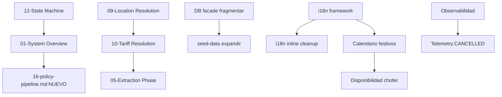

# BACKLOG — Plan de trabajo TaxGuazú

Seguimiento del backlog completo del sistema: diagramas, deuda técnica, features futuras y features eliminadas.

## Leyenda de categorías

| Categoría | Significado |
|-----------|-------------|
| `DONE` | Finalizado y verificado |
| `IN_PROGRESS` | En trabajo activo |
| `PENDIENTE_REVISION` | Completado, necesita Architect/Auditor |
| `BLOCKED` | Bloqueado por dependencia (registra cuál) |
| `MODIFICADO_CASCADA` | Alterado como consecuencia de otra modificación |
| `AT_RISK` | En riesgo por drift de dependencias |
| `DEFERRED` | Diferido intencionalmente |
| `CANCELLED` | Cancelado (registra razón) |

## Campos de cada item

`ID | Título | Prioridad | Componente | Depends-on | Blocks | Esfuerzo | Estado | Creado | Verificación | ADRs/Diagramas/UC | Notas`

---

## A — Backlog Activo

*Items actualmente en trabajo o pendientes de revisión inmediata.*

> **Nota:** generación de SVGs suspendida por decisión del stakeholder. Se optó por mejorar la legibilidad de los archivos `.md` en su lugar.

### A.1 Diagramas Ola 1 (críticos)

| ID | Título | Prioridad | Componente | Estado |
|----|--------|-----------|------------|--------|
| DGM-01 | Diagrama 10-Tariff Resolution: reescribir a single query | P0 | docs/diagrams | **IN_PROGRESS** |
| DGM-02 | Diagrama 12-Workflow State Machine: agregar 3 estados faltantes | P0 | docs/diagrams | **IN_PROGRESS** |
| DGM-03 | Diagrama 09-Location Resolution: alias_lookup → aliases, eliminar paralelos | P0 | docs/diagrams | **IN_PROGRESS** |

### A.2 Deuda técnica prioritaria

| ID | Título | Prioridad | Componente | Estado | Notas |
|----|--------|-----------|------------|--------|-------|
| DEBT-01 | Convertir AFFIRMATION_RE duplicado a fuente única | P1 | ai/core.ts, ai/patterns.ts | `PENDIENTE_REVISION` | Dos implementaciones divergentes, unificar |
| DEBT-02 | Eliminar cadena circular survey.service → lead.service | P1 | services/ | `DEFERRED` | Ver architecture.md gaps |
| DEBT-03 | Refactor guard.ts: state request-scoped, no module-level | P1 | ai/guard.ts | `DEFERRED` | Alto impacto, requiere plan |
| DEBT-04 | Fragmentar database.ts (>63 funciones, 694 líneas) | P2 | db/database.ts | `DEFERRED` | Refactor mayor |
| DEBT-05 | Reducir acoplamiento lead.service (27 imports) | P2 | lead.service.ts | `DEFERRED` | Refactor mayor |
| DEBT-06 | Extraer i18n inline de 30+ bloques if/else | P2 | ai/ | `DEFERRED` | Postergado hasta i18n framework |

### A.3 Features pendientes de revisión

| ID | Título | Prioridad | Componente | Estado | Notas |
|----|--------|-----------|------------|--------|-------|
| UC-09 | C-09 Encuesta post-viaje: expandir re-engagement (>2 destinos) | P1 | survey.service | `PENDIENTE_REVISION` | Ya existe código base |
| USECASES | Actualizar USECASES.md (C-09 ya implementado, fechas) | P1 | docs/ | `PENDIENTE_REVISION` | Desactualizado desde 13/5 |

---

## B — Diagramas pendientes

*Estado de los 15 diagramas de arquitectura (`docs/architecture/diagrams/`).*

### Ola 1 — Críticos (corregir ya)

| ID | Diagrama | Problema | Estado |
|----|----------|---------|--------|
| DGM-01 | 10-Tariff Resolution | Arquitectura fundamental cambiada (cascada→single query), L5 inexistente | `DONE` ✅ |
| DGM-02 | 12-State Machine | Faltan 3 de 7 estados (awaiting_passenger, pending_human_review, ambiguity_pending) | `DONE` ✅ |
| DGM-03 | 09-Location Resolution | Referencia alias_lookup eliminada; presenta "dos sistemas paralelos" inexistentes | `DONE` ✅ |

### Ola 2 — Alto (próxima)

| ID | Diagrama | Problema | Estado |
|----|----------|---------|--------|
| DGM-04 | 01-System Overview | No muestra policy-pipeline.ts (orquestador real), laterals/, extraction/, learning/ | `DONE` ✅ |
| DGM-05 | 03-CORE Phase | No muestra applyLaterals, purchaseIntent, slotAssignmentConfidence; 11 intents vs 7 facts | `DONE` ✅ |
| DGM-16 | **NUEVO** policy-pipeline.md | Hoy ningún diagrama muestra este orquestador crítico (359 líneas) | `DONE` ✅ |

### Ola 3 — Medio (diferido)

| ID | Diagrama | Problema | Estado |
|----|----------|---------|--------|
| DGM-06 | 02-Webhook Entry | Missing 8 button prefixes, HMAC, idempotency, driver detection | `DONE` ✅ |
| DGM-07 | 04-Router Phase | Tabla de políticas incorrecta (Policy Consulta no existe, SAFE_FALLBACK) | `DONE` ✅ |
| DGM-08 | 05-Extraction Phase | Faltan 4 slots en confidence table, 7 módulos de extraction, language field | `DONE` ✅ |
| DGM-09 | 06-Confidence Model | Missing state RAW (antes DETECTED), missing sources, carry-over logic | `DONE` ✅ |
| DGM-10 | 07-Policy AHORA | Missing 3 output props (needsAdminNotify, confirmationUI, buildGreeting), LLM gate | `DONE` ✅ |
| DGM-11 | 08-Policy RESERVA | Missing 4 funciones (buildBookingAccepted, safeSlotResolution, lateral, format-label) | `DONE` ✅ |
| DGM-12 | 11-Operational Readiness | Missing canPrepareQuote, blockedBy reasons reales, PLACE/ZONE location | `DONE` ✅ |
| DGM-13 | 13-Slot Confidence Evolution | Missing fuzzy_alias_match, unknown_location, buildSlotStates | `DONE` ✅ |
| DGM-14 | 14-Dispatch Flow | Missing 4-level escalation, 5 cron jobs, broadcast details, now-execution | `DONE` ✅ |
| DGM-15 | 15-Data Flow | Duplicado del 11, missing policy-pipeline, extraction/learning flows | `DONE` ✅ |

---

## C — Deuda técnica

*Items de architecture.md y gaps conocidos.*

| ID | Título | Componente | Prioridad | Estado |
|----|--------|-----------|-----------|--------|
| DEBT-01 | AFFIRMATION_RE duplicado (core.ts vs patterns.ts) | ai/ | P1 | `DONE` ✅ | Unificado en patterns.ts, core.ts importa |
| DEBT-02 | Dependencia survey → lead (NO circular, cadena lineal) | services/ | P1 | `PENDIENTE_REVISION` | No hay ciclo — survey.service → lead-event-helpers → lead.service. Acoplamiento vertical documentado en lead-event-helpers.ts |
| DEBT-03 | guard.ts state a nivel de módulo (no request-scoped) | ai/guard.ts | P1 | `DONE` ✅ | Estado global eliminado, guardias ahora usan parámetros explícitos |
| DEBT-04 | database.ts: 694 líneas, 63 funciones | db/database.ts | P2 | `DEFERRED` |
| DEBT-05 | lead.service: 27 imports, 11 cross-service | lead.service.ts | P2 | `DEFERRED` |
| DEBT-06 | i18n inline en 30+ bloques if/else | ai/ | P2 | `IN_PROGRESS` | ~15 bloques migrados (Fase 1-5). ~15 restantes (timeouts.ts, lead.service.ts, handler.ts — Fase 6-7). |
| DEBT-07 | Violación AI→Services: response-builder importa OpportunityResult | ai/response-builder.ts | P2 | `DEFERRED` |
| DEBT-08 | policy-pipeline.ts: 312 líneas, 6 dependencias cross-service | workflow/policy-pipeline.ts | P2 | `DEFERRED` |
| DEBT-09 | Varios services usan getDb()/queryOne() directo (bypasean facade) | services/ | P2 | `DEFERRED` |
| DEBT-10 | seed-data.ts: solo 7 zonas, 12 places, 20 tarifas (vs 18, 30, 60+ reales) | scripts/ | P2 | `DEFERRED` |

---

## D — Features futuras

*Mejoras de servicio priorizadas.*

| ID | Título | Prioridad | Esfuerzo | Dependencias | Estado | Notas |
|----|--------|-----------|----------|-------------|--------|-------|
| FUT-01 | **i18n framework real (es/pt/en)** | P1 | M | Ninguna | `IN_PROGRESS` | Framework de traducción + catálogo ~135+ strings en 21 categorías. 5/7 fases completas: response-builder, slot-confirmation, ambiguity-handler, policy-reserva, policy-ahora. Pendientes: timeouts+lead.service+handler (F6), extraer bloques inline restantes (F7). |
| FUT-02 | **Transcripción de audios** | P1 | M | Ninguna | `DONE` ✅ | WhatsApp voice notes masivos en LATAM. Gemini 2.0 Flash multimodal transcribe audio a texto, inyectado como mensaje de lead. Meta API download via sender.ts (WhatsApp layer). |
| FUT-03 | **Mensajes multimedia (location/image)** | P1 | S | Ninguna | `DEFERRED` | Clientes envían ubicación como destino. route.ts solo maneja text e interactive. |
| FUT-04 | **Re-engagement consultas estancadas C-05/S-06** | P1 | M | Ninguna | `DEFERRED` | Timeout + broadcast "Cliente interesado en X". checkTimeouts no lo detecta hoy. |
| FUT-05 | **Observabilidad: Sentry + métricas básicas** | P1 | M | Ninguna | `DEFERRED` | Sin visibilidad de errores en producción hoy. Telemetry fue purgado. |
| FUT-06 | **Split +6 pasajeros C-07** | P2 | S | Ninguna | `DEFERRED` | Hoy capéa silenciosamente a 6; ofrecer dividir en 2 autos. |
| FUT-07 | **Calendario de festivos en pricing** | P2 | S | FUT-01 (parcial) | `DEFERRED` | Datos ya existen en iguazu-knowledge.ts (AR/BR/PY). Conectar a pricing para surges. |
| FUT-08 | **Chat intermediado C-10** | P2 | L | Ninguna | `DEFERRED` | Relay de mensajes pax↔chofer sin compartir número. Modelo híbrido. |
| FUT-09 | **Contingencia DB S-04** | P2 | M | Ninguna | `DEFERRED` | Turso caído: no hay réplica ni fallback local. Connection.ts tiene fallback a /tmp/bot.db sin TURSO_URL. |
| FUT-10 | **Calendario y disponibilidad por chofer** | P3 | L | FUT-01 | `DEFERRED` | Choferes marcan disponibilidad futura. Festivos afectan precio y disponibilidad. |

---

## E — Features eliminadas (histórico)

*Elementos que existieron en código y fueron eliminados intencionalmente.*

| ID | Feature | Razón de eliminación | Referencia | Estado |
|----|---------|---------------------|-----------|--------|
| REM-01 | Telemetry/trace modules | Purged dead imports (router.ts:10) | `router.ts:10` | `CANCELLED` |
| REM-02 | alias_lookup table | Replaced by aliases JOIN places (database.ts:525) | `database.ts:525` | `CANCELLED` |
| REM-03 | Cascada secuencial L1-L4 tariff (4 queries) | Replaced by single query ORDER BY resolution_priority | `tariff-resolver.ts:3` | `CANCELLED` |
| REM-04 | L5 text fallback tariff | Never existed in stable code; was planned but replaced | `tariff-resolver.ts` | `CANCELLED` |
| REM-05 | SUBZONE_MAP / NODE_ZONE_MAP en geo-engine | Superseded by places/aliases DB tables | `geo-engine.ts:5` | `CANCELLED` |
| REM-06 | Zone resolution en geo-engine | Superseded by location-resolver.ts | `geo-engine.ts:126` | `CANCELLED` |
| REM-07 | trip_status column en conversations | ALTER TABLE DROP COLUMN | `connection.ts:442` | `CANCELLED` |
| REM-08 | escalateTrip en lead.service.ts | Replaced by dispatch.service.ts | `dispatch.service.ts:2` | `CANCELLED` |

---

## F — Dependencias entre items

