# INFORME DE INGENIERÍA INVERSA — TaxiGuazú Bot

**Fecha:** 2026-07-03
**Tipo:** Due Diligence Técnica / Architecture Discovery / Software Archaeology
**Alcance:** Código fuente, base de datos, tests, documentación, infraestructura, evolución

---

## ÍNDICE

1. [Executive Summary](#1-executive-summary)
2. [Software Archaeology](#2-software-archaeology)
3. [System Overview](#3-system-overview)
4. [Architecture Reconstruction](#4-architecture-reconstruction)
5. [Domain Discovery](#5-domain-discovery)
6. [Engines Discovery](#6-engines-discovery)
7. [Undocumented Subsystems](#7-undocumented-subsystems)
8. [Complete Call Graph](#8-complete-call-graph)
9. [End-to-End Flow Trace: Reserva Completa](#9-end-to-end-flow-trace-reserva-completa)
10. [Database Analysis](#10-database-analysis)
11. [Prompts Analysis](#11-prompts-analysis)
12. [Session Management](#12-session-management)
13. [Test Analysis](#13-test-analysis)
14. [Static Analysis & Code Smells](#14-static-analysis--code-smells)
15. [Performance Analysis](#15-performance-analysis)
16. [Security Analysis](#16-security-analysis)
17. [Architecture Comparison](#17-architecture-comparison)
18. [Evolution Analysis](#18-evolution-analysis)
19. [Maturity Assessment](#19-maturity-assessment)
20. [Test Failure Analysis (Cristian)](#20-test-failure-analysis-cristian)
21. [Recommendations](#21-recommendations)

---

## 1. EXECUTIVE SUMMARY

### 1.1 Qué es TaxiGuazú Bot

Un bot de WhatsApp para una empresa real de transfers turísticos en la región de las Cataratas del Iguazú (triple frontera Argentina-Brasil-Paraguay). Procesa consultas de precio, reservas, servicio inmediato, emergencias, y gestión de choferes — todo en conversación natural.

### 1.2 Stack Tecnológico Real

| Componente | Tecnología | Versión | Propósito |
|-----------|-----------|---------|-----------|
| Runtime | Node.js | ≥20.9.0 | Ejecución serverless |
| Framework | Next.js | 15.5.18 | App Router + API routes |
| DB primaria | Turso (libSQL) | 0.17.3 | Persistencia cloud |
| DB fallback | SQLite file | — | `data/bot.db` local |
| LLM primario | Gemini 2.0 Flash | SDK 0.24.1 | Extracción + respuesta |
| LLM fallback | Groq llama-3.3-70b | SDK 1.2.0 | Extracción + respuesta |
| Mensajería | Meta WhatsApp Cloud API | v18.0 | Envío/recepción |
| Tests | Vitest | 4.1.8 | 54 tests |
| Despliegue | Vercel | — | Serverless functions |
| Auth | Meta App Secret + HMAC | — | Webhook security |

### 1.3 Estado General

**Puntaje: 6.5/10** — Producción activa con cliente real. Arquitectura emergente híbrida (determinista+AI) con deuda técnica documentada pero sin roadmap formal de remediación.

**Lo que NO es:** No es Clean Architecture, no es DDD, no es Agentic Framework, no es Event-Driven. Es una arquitectura **sui generis** que resolvió problemas reales de un negocio real sin seguir dogmas.

---

## 2. SOFTWARE ARCHAEOLOGY

Esta sección es el corazón del informe. No describe qué hace el código — descubre **por qué** el código es como es, **cómo** evolucionó, y qué **decisiones implícitas** tomaron los desarrolladores.

### 2.1 Estratos de Evolución (Capas Geológicas)

El código revela 8 estratos evolutivos superpuestos. Como geólogo de software, puedo fecharlos por los artefactos que dejaron:

```
┌─────────────────────────────────────────────────────┐
│ ESTRATO 8: i18n Framework (Jul 2026)                │
│ Marcador: Catalog.ts, t(), migración progresiva      │
├─────────────────────────────────────────────────────┤
│ ESTRATO 7: ADRs + Diagramas (Jun-Jul 2026)          │
│ Marcador: docs/adr/001-005, 16 diagramas Mermaid     │
│ Arqueología: documentación post-hoc, no diseño upf.  │
├─────────────────────────────────────────────────────┤
│ ESTRATO 6: Laterals + Memory + Learning (Jun 2026)  │
│ Marcador: ai/laterals/, services/memory/, learning/  │
│ Arqueología: sistemas añadidos SIN tocar CORE        │
├─────────────────────────────────────────────────────┤
│ ESTRATO 5: Dead Code Cleanup (Jun 2026)              │
│ Marcador: guard.ts no-ops, geo-engine DEPRECATED     │
│ Arqueología: consciencia de deuda técnica            │
├─────────────────────────────────────────────────────┤
│ ESTRATO 4: Dispatch Multi-nivel (Jun 2026)           │
│ Marcador: dispatch-workflow.ts, 4 niveles            │
├─────────────────────────────────────────────────────┤
│ ESTRATO 3: Pricing v3 + Extraction Híbrida (Jun 2026)│
│ Marcador: pricing-engine.ts (FROZEN), extract-slots  │
│ Arqueología: v3 coexiste con v2 por miedo a romper   │
├─────────────────────────────────────────────────────┤
│ ESTRATO 2: Session + State Machines (Jun 2026)       │
│ Marcador: chat_sessions table, slot-state.ts         │
│ Arqueología: el state creció orgánicamente           │
├─────────────────────────────────────────────────────┤
│ ESTRATO 1: CORE+ROUTER+POLICY (Fundación)            │
│ Marcador: handler.ts → core() → router() → policy()  │
│ Arqueología: la visión original del sistema          │
├─────────────────────────────────────────────────────┤
│ ESTRATO 0: Webhook + Respuestas Hardcodeadas (MVP)   │
│ Marcador: route.ts, response-builder.ts strings      │
│ Arqueología: el "fosil" más antiguo del sistema      │
└─────────────────────────────────────────────────────┘
```

### 2.2 Decisiones Arquitectónicas Implícitas

Nunca escritas en ningún ADR, pero evidentes en el código:

| Decisión Implícita | Evidencia en Código | Intención Inferida |
|-------------------|---------------------|-------------------|
| **"El CORE debe funcionar sin LLM"** | `handler.ts` L114-115: skip LLM si EXECUTE sin placeholders o purchaseIntent low. La respuesta final SIEMPRE viene de POLICY primero. | El desarrollador NO confiaba en LLM como fuente primaria. El LLM es un "embellecedor" opcional, no el motor. |
| **"Triple fallback en todo"** | `extract-slots.ts`: regex → entity → LLM. `llm-provider.ts`: Gemini → Groq → null. `comprehension-runner.ts`: FULL_CONTROL → CLARIFICATION → RECOVERY → ESCALATION. | Cultura de "nunca fallar en producción". Cada capa asume que la siguiente puede fallar. |
| **"El estado se lleva en la URL (phone)"** | `chat_sessions` tiene PK = phone. No hay sesiones anónimas, no hay tokens. El estado va ligado al número de WhatsApp. | Simplicidad pragmática. En WhatsApp el phone es el identity provider. |
| **"No mover algo que funciona"** | `pricing-engine.ts` FROZEN, `fleet-validation.ts` FROZEN, `admin.service.ts` FROZEN. Código marcado explícitamente como intocable. | Miedo a romper flujos de producción no cubiertos por tests. |
| **"La IA es un ciudadano de segunda clase"** | El LLMProvider tiene timeout 5000ms. Si falla, el sistema sigue funcionando sin él. La extracción va regex → entity → LLM (LLM es el último). | La IA es una mejora, no un requisito. El sistema fue diseñado para funcionar SIN IA. |
| **"El orquestador es dios"** | `lead.service.ts` importa de 11 servicios diferentes, 27 imports totales. No hay delegación real — todo pasa por lead.service. | Crecimiento orgánico. Nadie decidió "hagamos un god orchestrator" — simplemente ocurrió. |
| **"Los tests son contratos de integración, no de unidad"** | ~50% de los tests usan mock stacks de 15-20 módulos. Solo 25/54 son pure unit. | El equipo priorizó "el pipeline funciona completo" sobre "cada función está aislada". |

### 2.3 Intención Original del Desarrollador Reconstruida

Basado en los artefactos más antiguos (CORE, ROUTER, POLICY, handler.ts), la visión original era:

> **"Un pipeline determinista de 3 etapas donde cada etapa tiene una responsabilidad única y la respuesta se construye con templates, no con IA."**

```
core()     → determina INTENCIÓN + HECHOS (sin LLM, sin DB)
router()   → decide QUÉ HACER (mapeo puro, sin efectos)
policy()   → construye RESPUESTA (templates + lógica de negocio)
```

La IA (LLM) se añadió después, como capa opcional:

```
policy() → genera respuesta base (template)
LLM      → opcionalmente, mejora la redacción (si pasa validación)
```

**Prueba de esta tesis:** En `handler.ts` L71-131, el flujo es:
1. `core()` (determinista) → 2. `router()` (puro) → 3. `policy()` (template) → 4. `generateLLMResponse()` (opcional)

Si el LLM falla o se salta, el sistema responde con el template. El LLM NUNCA es necesario para que el sistema funcione.

### 2.4 Patrones de Evolución Detectados

**Patrón 1: "Añadir sin modificar" (Additive Growth)**
Cuando se necesitó una nueva funcionalidad, raramente se modificó el código existente. Se añadió al lado:
- `laterals/` se añadió sin tocar `core.ts`
- `pricing-engine.ts` (v3) se añadió sin tocar `tariff-resolver.ts` (v2)
- `memory/` se añadió sin tocar `chat_sessions`
- `i18n/` se añadió sin eliminar strings hardcodeados

**Consecuencia:** El sistema tiene capas de funcionalidad que coexisten. No hay "migración" — hay "adiacencia".

**Patrón 2: "Frozen Zones"**
Ciertos archivos fueron marcados como `FROZEN` (no modificar). Esto revela:
- El desarrollador perdió confianza en su capacidad de modificar esos archivos sin romper algo
- No hay tests que cubran esos archivos adecuadamente
- Son áreas de alta complejidad accidental

**Patrón 3: "La documentación llegó después"**
Los 5 ADRs están fechados Junio-Julio 2026, pero el código tiene evidencia de existir antes. Los diagramas (16) se crearon en 3 olas. Esto sugiere:
- Alguien (¿un nuevo desarrollador? ¿un consultor?) llegó y dijo "esto necesita documentación"
- Los ADRs formalizan decisiones que ya estaban tomadas
- Los diagramas reconstruyen el sistema, no lo diseñan

**Patrón 4: "El state machine se endureció progresivamente"**
`chat_sessions` empezó con pocas columnas y fue creciendo con migraciones:
- `conversational_state` → después `dispatch_state` → después `trip_state`
- `f4_state` → renombrado a `comprehension_state`
- Columnas eliminadas: `workflow_state`, `confirmed_fields`, `source_message_ids`

Esto muestra un sistema que fue descubriendo su estado conforme crecía, no diseñándolo upfront.

### 2.5 El "Triple Fallback" como Patrón Arquitectónico No Documentado

El patrón más repetido en el código (y nunca documentado) es el **Triple Fallback**:

```
Capa 1 (rápida, determinista) → Capa 2 (intermedia, DB/heurística) → Capa 3 (lenta, LLM)
                                                                         ↓
                                                                   Fallback: null / mensaje seguro
```

Aparece en:

| Subsistema | Capa 1 | Capa 2 | Capa 3 | Fallback |
|-----------|--------|--------|--------|----------|
| **Extracción** | `regex-extractor.ts` (11 patrones) | `entity-extractor.ts` (DB+POIs) | `groq.ts` (LLM) | `null` → workflow continúa sin datos |
| **LLM Provider** | `GeminiProvider` | — | `GroqProvider` | `null` → sistema funciona sin LLM |
| **Comprehension** | FULL_CONTROL (≥0.85) | CLARIFICATION (0.65-0.84) / RECOVERY (0.40-0.64) | ESCALATION (<0.40) | Escalación a operador humano |
| **Location Resolution** | Alias exacto (LOWER match) | Nombre exacto (canonical) | Fuzzy (Levenshtein ≤3) | `null` → desambiguación interactiva |
| **Pricing** | place→place (priority 1) | place→zone (priority 2) / zone→place (priority 3) | zone→zone (priority 4) | `not_found` → cotización sin precio |
| **Respuesta** | Policy template | LLM Response | Safe Fallback | "Un operador te va a asistir" |

**Esto NO es un patrón de diseño conocido.** No es Chain of Responsibility (no hay cadena de handlers). No es Pipeline (no hay transformación secuencial). Es **Fallback Progression** — un patrón emergente donde cada nivel intenta resolver y, si no puede, pasa al siguiente.

### 2.6 Fósiles y Código Muerto con Significado Arqueológico

| Fósil | Archivo | Lo que revela |
|-------|---------|---------------|
| `GROQ_MODEL = "llama-3.3-70b-versatile"` | `constants.ts` | El sistema usaba Groq como LLM principal ANTES de migrar a Gemini. El nombre `groq.ts` es un fósil de esa era. |
| `geo-engine.ts` (144L) | `services/geo/` | Alguna vez hubo un motor geo completo con zonas, proximidad, y rutas. Fue reemplazado por DB pero el archivo sobrevive. |
| `guard.ts::setRequestState()` (no-op) | `ai/guard.ts` | Hubo un estado global a nivel de módulo que fue eliminado (DEBT-03). Los no-ops quedaron para no romper llamadas. |
| `AFFIRMATION_RE` duplicado | `core.ts` (antes) | Había 3 definiciones del mismo regex en 3 archivos. Se consolidó en `patterns.ts` (DEBT-01). |
| `f4_state → comprehension_state` | Migraciones | El sistema de comprensión se llamaba "F4". El rename muestra que el naming evolucionó. |
| `trip_status → trip_phase` | Migraciones | El estado del viaje empezó como string libre y se migró a enum phase. |

---

## 3. SYSTEM OVERVIEW

### 3.1 Propósito del Negocio

TaxiGuazú automatiza 8 procesos operativos:

1. **Consulta de precios** — Cotización según origen/destino/pasajeros
2. **Reservas futuras** — Booking multi-paso con confirmación
3. **Servicio inmediato (AHORA)** — Dispatch en tiempo real
4. **Emergencias** — Gestión con notificación admin
5. **Multi-ride** — Viajes multi-etapa con descuento por hub
6. **Re-engagement** — Recuperación de leads estancados
7. **Encuestas post-viaje** — Satisfacción del cliente
8. **Gestión de choferes** — Asignación, escalamiento, comisiones

### 3.2 Arquitectura en una Frase

> **"Un pipeline determinista de 3 etapas (CORE → ROUTER → POLICY) con un orquestador central (lead.service.ts) que coordina extracción híbrida, pricing, y side effects, y un LLM opcional que mejora la redacción de la respuesta."**

### 3.3 Mapa del Código

```
src/
├── app/                          # Entry points
│   ├── api/whatsapp/webhook/     # Webhook POST/GET (HMAC + idempotencia)
│   ├── api/bot/*                 # Admin API (10 endpoints)
│   ├── api/cron/*                # Cron endpoint
│   └── page.tsx                  # Dashboard React SPA
│
├── lib/
│   ├── ai/                       # ≈30 archivos — Motor de decisiones
│   │   ├── core.ts               #   CORE: regex → intent
│   │   ├── router.ts             #   ROUTER: intent → outputType
│   │   ├── handler.ts            #   Entry point del pipeline AI
│   │   ├── policy-ahora.ts       #   POLICY para AHORA (482L)
│   │   ├── policy-reserva.ts     #   POLICY para RESERVA (482L)
│   │   ├── response-builder.ts   #   ~20 funciones template
│   │   ├── slot-confirmation.ts  #   UX de confirmación
│   │   ├── slot-state.ts         #   State machine de slots
│   │   ├── llm-provider.ts       #   Factory de proveedores
│   │   ├── llm-response.ts       #   Prompt builder + validation
│   │   ├── iguazu-knowledge.ts   #   598L de data regional
│   │   ├── taxiguazu-knowledge.ts#   121L de data operativa
│   │   └── laterals/             #   Enriquecimiento de CORE
│   │
│   ├── services/                 # ≈65 archivos — Orquestación
│   │   ├── lead.service.ts       #   God orchestrator (730L)
│   │   ├── workflow/             #   10 archivos
│   │   ├── extraction/           #   9 archivos
│   │   ├── pricing/              #   6 archivos
│   │   ├── dispatch/             #   5 archivos
│   │   ├── geo/                  #   3 archivos
│   │   ├── memory/               #   3 archivos
│   │   ├── learning/             #   13 archivos
│   │   └── i18n/                 #   2 archivos
│   │
│   ├── db/                       # ≈8 archivos — Persistencia
│   │   ├── database.ts           #   Facade (856L, 90+ funciones)
│   │   ├── core/connection.ts    #   DDL + migraciones (32 tablas)
│   │   ├── core/helpers.ts       #   query<T>, queryOne<T>
│   │   └── domains/              #   6 dominios separados
│   │
│   ├── sender.ts                 # WhatsApp Cloud API client
│   ├── detect-lang.ts            # Keyword-based language detection
│   ├── pipeline.ts               # processLead (pipeline executor)
│   └── timeouts.ts               # 10+ cron jobs
│
├── scripts/                      # 13 scripts DB
└── tests/                        # 54 tests, ~11,500 líneas
```

---

## 4. ARCHITECTURE RECONSTRUCTION

### 4.1 Arquitectura Real vs Documentada

| Aspecto | Documentado (ADRs) | Real (código) |
|---------|-------------------|---------------|
| Capas | Estrictas con dirección única | 4 violaciones conocidas (bypass facade, AI→Services) |
| DB Facade | 3 niveles, facade obligatorio | Learning bypasses facade (14 archivos), 4 servicios usan getDb() directo |
| Service Boundaries | Orden estricto, AI no importa de Services | `response-builder.ts` importa `OpportunityResult` de learning |
| State | Request-scoped | Chat session state por phone (no request-scoped) |

### 4.2 Contratos Reales entre Capas

```
Config (constants.ts, env.ts)
    ↓
Utils (logger.ts, clamp.ts)
    ↓
DB (database.ts facade)
    ↓
WhatsApp (sender.ts) ←→ AI (core → router → policy)
    ↓                              ↕ (i18n es transversal, permitido)
Services (lead.service → workflow → extraction → pricing → dispatch → ...)
    ↓
API Routes (webhook route → lead.service)
```

**Violaciones activas:**
- ⚠️ `response-builder.ts` (AI) → `i18n/t` (Services) — Permitido por decisión arquitectónica (i18n es transversal como types)
- ⚠️ `response-builder.ts` (AI) → `OpportunityResult` (Services/learning) — DEBT-07
- ⚠️ 4 servicios usan `getDb()`, `queryOne()` directo — DEBT-09
- ⚠️ Learning domain bypasses facade en 14 archivos

---

## 5. DOMAIN DISCOVERY

### 5.1 Bounded Contexts Implícitos

No hay bounded contexts formales (sin módulos NPM, sin packages). Pero emergen 7:

| Contexto | Archivos | Líneas | Aggregate Raíz |
|----------|----------|--------|----------------|
| **Conversación** | lead.service.ts, workflow/* | ~2,000 | ChatSession |
| **Extracción** | extraction/*, ai/groq.ts | ~1,100 | ExtractionResult |
| **Pricing** | pricing/*, ai/operational-readiness.ts | ~900 | PricingResult |
| **Trip Execution** | trip-execution/*, dispatch/* | ~1,600 | Trip |
| **Geografía** | geo/*, db/domains/geo.ts | ~300 | Place |
| **Aprendizaje** | learning/* | ~1,500 | LearningEvent |
| **Memoria** | memory/*, ai/slot-state.ts | ~400 | Memory |

### 5.2 Value Objects Clave

| Value Object | Valores | Inmutable? | Dónde se usa |
|-------------|---------|-----------|-------------|
| `Lang` | "es" \| "en" \| "pt" | ✅ | Todo el sistema |
| `Intent` | 12 valores (GREETING, BOOKING, NOW, EMERGENCY, ...) | ✅ | core → router → policy |
| `ConversationalState` | 7 estados | ✅ | workflow/slot-workflow |
| `DispatchState` | "idle" \| "nivel_1" \| "nivel_2" \| "nivel_3" \| "waiting_driver" \| "closed" | ✅ | dispatch-workflow |
| `TripPhase` | "DRAFT" \| "QUOTED" \| "CONFIRMED" \| "ASSIGNED" \| "IN_PROGRESS" \| "CLOSED" | ✅ | trip-execution |
| `SlotStatus` | "RAW" \| "INFERRED" \| "CONFIRMATION_PENDING" \| "CONFIRMED" \| "USER_CORRECTED" \| "USER_CONFIRMED" | ✅ | slot-state |

---

## 6. ENGINES DISCOVERY

### 6.1 CORE Engine (Determinista)

**Archivo:** `src/lib/ai/core.ts`
**Madurez:** 8/10 — Producción

**Lo que hace:**
- 18 regex patterns extraen facts del texto del usuario
- 11-level intent classifier con prioridad explícita
- Detecta roleLock (origen/destino estructural), slotStability, purchaseIntent
- Zero dependencia externa (sin LLM, sin DB)

**Lo que NO hace:**
- No entiende inglés ("I'm at the airport" → no facts)
- No entiende contexto (cada llamada es independiente)
- No entiende negaciones complejas

**Por qué fue construido así (arqueología):**
El CORE fue la primera pieza del sistema. El desarrollador necesitaba un clasificador de intención que funcionara SIN LLM (por costo, latencia, y confiabilidad). Es un parser determinista porque "determinista = predecible = testable = deployable".

### 6.2 ROUTER Engine (Mapper Puro)

**Archivo:** `src/lib/ai/router.ts`
**Madurez:** 9/10 — Sólido, simple, probado

**Lo que hace:** Mapea CoreDecision → OutputType. EMERGENCY/NOW → EXECUTE, GREETING → CLARIFY, confidence < 0.4 → SAFE_FALLBACK.

**Por qué existe:** Separar "qué detecté" (CORE) de "qué hago" (ROUTER) permite cambiar la estrategia de decisión sin tocar la detección.

### 6.3 POLICY Engine (Template Builder)

**Archivos:** `policy-ahora.ts` + `policy-reserva.ts` (~482L c/u)
**Madurez:** 7/10 — Completo pero denso

**Lo que hace:** Construye la respuesta conversacional según política de negocio. policy-ahora es stateless (dispatch inmediato). policy-reserva es stateful (confirmación multi-paso).

**La decisión tree de policy-reserva tiene 10 niveles de prioridad:**
1. Lateral EMERGENCY → admin notify
2. Lateral RESCHEDULE → admin notify
3. Lateral POST_SERVICE → respuesta post-servicio
4. Affirmation + awaiting_confirmation → booking accepted
5. Affirmation + awaiting_passenger → acknowledge + passengers
6. buildStableAcknowledge → acknowledge + next field
7. askForConfirmation + matched tariff → confirmation message
8. collecting_slots + clarifyField → clarify message
9. ANSWER + matched tariff → price info
10. CLARIFY/EXECUTE → resolve next required field

**Por qué es así:** Cada nivel atrapa un caso real que ocurrió en producción. No fue diseñado — fue **descubierto** iterativamente.

### 6.4 Extraction Engine (Híbrido 3 Capas)

**Archivo:** `src/lib/services/extraction/extract-slots.ts`
**Madurez:** 7/10 — Bien diseñado, pero monolingüe

**Pipeline documentado vs real:**

```
Documentado:        Real:
Regex → Entity → LLM    Regex → Entity → LLM → (si todo falla → slots vacíos)
```

**Hallazgo arqueológico:** El orden no es casual. Regex es el más rápido (<1ms). Entity es medio (~10ms con DB call). LLM es el más lento (~500ms-2s). Están ordenados por velocidad, no por precisión.

### 6.5 Comprehension Engine (Guardia de Calidad)

**Archivo:** `src/lib/services/extraction/comprehension.ts`
**Madurez:** 7/10

**5 señales con pesos:**
| Señal | Peso | Fuente |
|-------|------|--------|
| Intención | 0.30 | core.confidence |
| Entidad | 0.25 | predictEntity confidence |
| Completitud | 0.20 | qué slots están llenos |
| Extracción | 0.15 | extraction.confidence |
| Estabilidad | 0.10 | slotStability |

**Thresholds:** FULL_CONTROL ≥ 0.85, CLARIFICATION 0.65-0.84, RECOVERY 0.40-0.64, ESCALATION < 0.40

**First-turn gate:** Si es el primer mensaje del usuario, ESCALATION → RECOVERY (no escalar en el primer mensaje).

**Por qué existe:** Para evitar que el sistema responda "no entendí" cuando en realidad el usuario recién está empezando la conversación.

### 6.6 Pricing Engine (Dual Track)

**Archivos:** `tariff-resolver.ts` (v2, activo) + `pricing-engine.ts` (v3, FROZEN)
**Madurez:** 7/10

**v2 (activo):** Single SQL query con ORDER BY resolution_priority:
- priority 1: place→place
- priority 2: place→zone  
- priority 3: zone→place
- priority 4: zone→zone

**v3 (FROZEN):** Engine completo con markup, adjustments, breakdown

**Por qué hay dos:** El v3 se construyó para reemplazar al v2, pero alguien perdió confianza y lo marcó FROZEN. Ahora coexisten, reconciliados por `resolve-pricing-for-slots.ts`.

### 6.7 Dispatch Engine (Multi-nivel)

**Archivos:** `dispatch.service.ts` + `dispatch-workflow.ts`
**Madurez:** 7/10

**4 niveles de escalamiento:**
1. Nivel 1 (1h timeout) → ofrecer a principal
2. Nivel 2 (30min timeout) → ofrecer a principal 2
3. Nivel 3 (8min timeout) → broadcast a todos los choferes
4. Waiting Driver (3min timeout) → driver aceptó pero no llegó

---

## 7. UNDOCUMENTED SUBSYSTEMS

Estos subsistemas existen en el código pero NO están documentados en ningún ADR, diagrama, o archivo de arquitectura.

### 7.1 The Laterals System (`ai/laterals/`)

**Archivos:** `types.ts`, `index.ts`, `handlers.ts`
**Propósito:** Enriquecer CoreDecision con metadata contextual SIN modificar core.ts.

**Cómo funciona:**
```typescript
// core.ts llama a applyLaterals() al final
const lateral = applyLaterals(coreDecision);
// Devuelve: { urgency, timeSensitivity, sentimentRisk, dispatchPriority, engagementLevel }
```

**5 handlers por intent:**
- `greetingLateral`: engagement determinista ("cómo estás" → warm, sino neutral)
- `bookingLateral`: timeSensitivity (now → 0.8, date → 0.6, flexible → 0.5)
- `nowLateral`: dispatch priority (bothSlots → max, now → high)
- `postServiceLateral`: sentiment risk
- `emergencyLateral`: siempre escalation_urgent

**Por qué no está documentado:** Se añadió después de los ADRs y nadie actualizó la documentación. Es un "nuevo estrato" no consolidado.

### 7.2 The Context Memory System (`services/memory/`)

**Archivos:** `memory.ts` + `context-memory.ts` + `predictive-routing.ts`
**Propósito:** Mantener continuidad conversacional entre turnos.

**Componentes:**
- `SessionMemory`: último intent, entidades, origen/destino, oportunidad pendiente
- `ShortTermBuffer`: últimos N mensajes
- `SemanticMemory`: sesgo de entidades (qué lugares mencionó más)
- `ContextMemory`: merge semántico de slots entre turnos
- `PredictiveRouting`: predicción de intención + entidad basada en historial

**Regla de merge contextual (NO documentada):**
1. Si el nuevo turno NO tiene origen → llevar el anterior
2. Si el nuevo turno NO tiene destino → llevar el anterior
3. NUNCA sobreescribir un CONFIRMED slot
4. Si el slot tiene >1h de antigüedad → NO mergear (stale)

### 7.3 The Slot State Machine (`ai/slot-state.ts` + `slot-confirmation.ts` + `operational-readiness.ts`)

**Archivos:** 3 archivos, ~200 líneas total
**Propósito:** Gestionar el ciclo de certeza de cada slot.

**Estados:**
```
RAW → INFERRED → CONFIRMATION_PENDING → CONFIRMED
  ↓        ↓              ↓
  (nueva mención)    USER_CORRECTED (si el usuario corrige)
                        ↓
                  CONFIRMATION_PENDING (requiere re-confirmación)
```

**Transiciones documentadas en el código pero NO en diagramas:**
- `reason === "user_confirmed"` → USER_CONFIRMED → CONFIRMED
- `reason === "ambiguous_term"` → SYSTEM_INFERRED → CONFIRMATION_PENDING
- `score >= 1.0` → SYSTEM_INFERRED → CONFIRMED (skip confirmation)
- `carry-over de CONFIRMED` → si no se re-extrae, se preserva el estado

### 7.4 The Hybrid Extraction Pipeline (`extraction/`)

**Archivos:** 5 archivos formando una pipeline coherente
**Propósito:** Extraer slots del texto usando 3 estrategias secuenciales.

**Pipeline:**
```
1. regexExtractSlots()    → 11 patrones rápidos
2. entityExtractSlots()   → hoteles + POIs + alias DB
3. extractSlots()         → LLM fallback (Gemini → Groq)
4. calculateSlotConfidence() → per-slot confidence
5. runExtractionPipeline() → orquestación completa
```

**Por qué NO está documentado como subsistema:** Los archivos están en `services/extraction/` pero el orquestador está en `workflow/policy-pipeline.ts` y `lead.service.ts`. La pipeline real cruza 3 directorios diferentes.

---

## 8. COMPLETE CALL GRAPH

### 8.1 Grafo de Dependencias

```mermaid
graph TD
    subgraph "Entry"
        WEB[webhook/route.ts]
        SEND[sender.ts]
        DETECT[detect-lang.ts]
    end

    subgraph "AI Layer"
        CORE[core.ts]
        ROUTER[router.ts]
        HANDLER[handler.ts]
        POL_R[policy-reserva.ts]
        POL_A[policy-ahora.ts]
        RB[response-builder.ts]
        LLM_R[llm-response.ts]
        LLP[llm-provider.ts]
        GUARD[guard.ts]
        IG[iguazu-knowledge.ts]
        TG[taxiguazu-knowledge.ts]
        PAT[patterns.ts]
        TYPES[types.ts]
        LATS[laterals/]
        FIELD[field-resolver.ts]
    end

    subgraph "Services Layer"
        LEAD[lead.service.ts]
        EXT[extraction/]
        GEO[geo/]
        PRIC[pricing/]
        DISP[dispatch/]
        TRIP[trip-execution/]
        MEM[memory/]
        LEARN[learning/]
        WORK[workflow/]
        CONF[comprehension-runner.ts]
        AMB_H[ambiguity-handler.ts]
    end

    subgraph "Infrastructure"
        DB[database.ts]
        CONN[connection.ts]
        HELP[helpers.ts]
        PIP[pipeline.ts]
        TIM[timeouts.ts]
        AUTH[auth.ts]
    end

    %% Webhook flow
    WEB --> SEND
    WEB --> DETECT
    WEB --> AUTH
    WEB --> LEAD

    %% Lead → everything
    LEAD --> WORK
    LEAD --> EXT
    LEAD --> PRIC
    LEAD --> DISP
    LEAD --> MEM
    LEAD --> LEARN
    LEAD --> GEO
    LEAD --> CONF
    LEAD --> AMB_H
    LEAD --> CORE
    LEAD --> DB
    LEAD --> SEND
    LEAD --> DETECT
    LEAD --> GUARD

    %% AI internals
    HANDLER --> CORE
    HANDLER --> ROUTER
    HANDLER --> POL_R
    HANDLER --> POL_A
    HANDLER --> RB
    HANDLER --> LLM_R
    HANDLER --> GUARD
    CORE --> PAT
    CORE --> LATS
    POL_R --> RB
    POL_R --> FIELD
    POL_R --> PAT
    POL_A --> RB
    POL_A --> FIELD
    LLM_R --> LLP
    LLM_R --> IG
    LLM_R --> TG

    %% Extraction internals
    EXT --> CORE
    EXT --> AMB_H
    EXT --> DB
    EXT --> GEO
    EXT --> PRIC
    EXT --> MEM
    EXT --> SEND
    EXT --> DETECT

    %% Workflow internals
    WORK --> AMB_H
    WORK --> DISP
    WORK --> TRIP
    WORK --> PRIC
    WORK --> GEO
    WORK --> MEM
    WORK --> LEARN
    WORK --> PIP
    WORK --> HANDLER
    WORK --> RB

    %% DB
    DB --> CONN
    DB --> HELP
```



### 8.2 Puntos Calientes de Acoplamiento

| Archivo | Imports | Archivos que lo importan | Rol |
|---------|---------|-------------------------|-----|
| `lead.service.ts` | 27 | 0 (nadie lo importa excepto webhook) | **Hub central** |
| `database.ts` | 15 | ~30+ archivos | **God facade** |
| `policy-reserva.ts` | ~12 | 4 archivos | **God file** |
| `handler.ts` | ~15 | 3 archivos | **Pipeline entry** |
| `response-builder.ts` | ~8 | ~15+ archivos | **Template factory** |

---

## 9. END-TO-END FLOW TRACE: RESERVA COMPLETA

Este es el traceo completo de UNA reserva, desde que el usuario envía el mensaje hasta que la respuesta se persiste en Turso.

**Escenario:** Usuario envía por WhatsApp:
> "Hola, quiero reservar desde el aeropuerto hasta el centro para mañana a las 10am, somos 2"

### FASE 0: Webhook (entry)

```
POST /api/whatsapp/webhook
```

| Paso | Código | Archivo | Línea |
|------|--------|---------|-------|
| 0.1 | Leer raw body | `route.ts` | POST handler |
| 0.2 | `verifySignature(rawBody, sig)` — HMAC SHA-256 | `route.ts` | `verifySignature()` |
| | → Computa HMAC-SHA256(WHATSAPP_APP_SECRET, rawBody) | | |
| | → timingSafeEqual contra header x-hub-signature-256 | | |
| | → Si no coincide → 401 | | |
| 0.3 | Parsear JSON → entry[0].changes[0].value.messages[0] | `route.ts` | JSON.parse |
| 0.4 | Normalizar phone (strip non-digits, 549→+54) | `route.ts` | normalizePhone() |
| 0.5 | `tryRegisterMessage(messageId, phone, type, hash)` | `database.ts` | INSERT OR IGNORE |
| | → SQL: INSERT INTO processed_messages (...) VALUES (...) | | |
| | → Si rowsAffected === 0 → DUPLICATE → return 200 | | |

✅ **SQL ejecutada:** INSERT INTO processed_messages (message_id, phone, message_type, processed_at, payload_hash) VALUES (?, ?, ?, ?, ?)

### FASE 1: Message Type Routing

| Paso | Decisión | Archivo | Línea |
|------|----------|---------|-------|
| 1.1 | message.type === "text" → texto plano | `route.ts` | message type switch |
| 1.2 | phone !== bot's own phone → continuar | `route.ts` | skip self-check |
| 1.3 | phone NO es driver → continuar | `route.ts` | isAdminBotGroup check |
| 1.4 | `handleLeadMessage(phone, "Hola, quiero reservar...")` | `lead.service.ts` | Llamada principal |

### FASE 2: lead.service.ts — Pre-procesamiento

| Paso | Código | Archivo | Línea |
|------|--------|---------|-------|
| 2.1 | `resetRequestState()` — **NO-OP** (legacy) | `guard.ts` | 11 |
| 2.2 | `handleCommandShortcuts()` — no es comando → false | `command-shortcuts.ts` | full scan |
| 2.3 | `handleAdminCommands()` — no es admin → false | `command-router.ts` | full scan |
| 2.4 | `handleConversationSetup(phone, text)` | `conversation-setup.ts` | |
| | → `getOrCreateConversation(phone)` | `database.ts` | |
| | → SQL: SELECT * FROM conversations WHERE phone = ? | | |
| | → Si no existe → INSERT ... RETURNING id | | |
| | → SQL: INSERT INTO conversations (phone, mode, created_at, last_message_at) VALUES (?, 'AI', ?, ?) | | |
| | → `getMessages(convId, 50)` | `database.ts` | |
| | → SQL: SELECT * FROM messages WHERE conversation_id = ? ORDER BY created_at DESC LIMIT 50 | | |
| | → `getDispatchState(phone)` → "idle" | `state-accessors.ts` | |
| | → SQL: SELECT dispatch_state FROM chat_sessions WHERE phone = ? | | |
| | → dispatch_state !== "idle" → **block** (no hay dispatch activo, sigue) | | |
| 2.5 | `handleOpportunityResponse()` — no es respuesta a oportunidad → false | `opportunity-response.ts` | |
| 2.6 | `buildMemory(session, history)` | `memory/memory.ts` | |
| | → `buildSessionMemory(session, history)` → SessionMemory | | |
| | → `buildShortTermBuffer(history, 6)` → últimos 6 mensajes | | |
| | → `buildMemory()` → Memory combinado | | |
| 2.7 | `buildPredictedContext(text, coreIntent, memory)` | `predictive-routing.ts` | |
| | → `predictEntity(text, memory)` → EntityPrediction | | |
| | → `predictIntent(text, coreIntent, memory)` → IntentPrediction | | |
| | → `computeMemoryBoost()` → 0 (sin historial) | | |

### FASE 3: CORE (Deterministic Intent Detection)

| Paso | Código | Archivo | Línea |
|------|--------|---------|-------|
| 3.1 | `core("Hola, quiero reservar desde el aeropuerto hasta el centro...")` | `core.ts` | Llamada principal |
| 3.2 | **Fact extraction (18 regex patterns):** | `core.ts` | `extractFacts()` |
| | → `greeting` MATCH ("Hola") → facts.push("greeting") | | |
| | → `booking` MATCH ("reservar") → facts.push("booking") | | |
| | → `origin` MATCH ("desde el aeropuerto") → facts.push("origin:aeropuerto") | | |
| | → `destination` MATCH ("hasta el centro") → facts.push("destination:centro") | | |
| | → `date` MATCH ("mañana") → facts.push("date:tomorrow") | | |
| | → `time` MATCH ("10am") → facts.push("time:10:00") | | |
| | → `passengers` MATCH ("2") → facts.push("passengers:2") | | |
| | → `location_ambiguous` MATCH ("centro" es AMBIGUOUS_LOCATION_TERM) → facts.push("location_ambiguous") | | |
| 3.3 | **Structural detection:** | `core.ts` | `detectStructure()` |
| | → "desde el aeropuerto" → roleLock.origin = "aeropuerto" | | |
| | → "hasta el centro" → roleLock.destination = "centro" | | |
| | → slotStability.origin = "stable", slotStability.destination = "ambiguous" | | |
| 3.4 | **Intent classification:** | `core.ts` | `classifyIntent()` |
| | → Priority 1-11 scan. Facts: booking + origin + destination + date + time + passengers | | |
| | → **Resultado: BOOKING** (priority 5, porque booking + origin + destination) | | |
| 3.5 | **Confidence computation:** | `core.ts` | `computeConfidence()` |
| | → BASE: 0.7 (BOOKING) | | |
| | → Bonus: +0.05 origin, +0.05 destination, +0.05 passengers, +0.05 date, +0.05 time | | |
| | → Penalty: -0.10 location_ambiguous | | |
| | → **Resultado: 0.85** | | |
| 3.6 | **PurchaseIntent detection:** | `core.ts` | `detectPurchaseIntent()` |
| | → facts: origin + destination → medium | | |
| 3.7 | **`applyLaterals(coreDecision)`:** | `laterals/index.ts` | |
| | → bookingLateral: timeSensitivity = 0.6 (tiene fecha) | | |

✅ **Resultado de CORE:**
```json
{
  "intent": "BOOKING",
  "confidence": 0.85,
  "facts": ["greeting", "booking", "origin:aeropuerto", "destination:centro", "date:tomorrow", "time:10:00", "passengers:2"],
  "roleLock": { "origin": "aeropuerto", "destination": "centro" },
  "slotStability": { "origin": "stable", "destination": "unstable" },
  "slotAssignmentConfidence": { "origin": 1, "destination": 0.5 },
  "purchaseIntent": "medium"
}
```

### FASE 4: Comprehension Check

| Paso | Código | Archivo | Línea |
|------|--------|---------|-------|
| 4.1 | `runComprehensionCheck(...)` | `comprehension-runner.ts` | |
| 4.2 | `buildComprehensionSignals(...)` | `comprehension.ts` | |
| | → intentConfidence: 0.85 | | |
| | → extractionConfidence: 0 (sin extracción aún) | | |
| | → entityConfidence: 0.5 (centro es ambiguo) | | |
| | → slotCompleteness: 0.3 (origin=0.5, dest=0.5, otros=0) | | |
| | → conversationStability: 0.1 (primer mensaje) | | |
| 4.3 | `computeComprehensionScore(signals)` | `comprehension.ts` | |
| | → 0.30*0.85 + 0.25*0 + 0.20*0.3 + 0.15*0.5 + 0.10*0.1 | | |
| | → = 0.255 + 0 + 0.06 + 0.075 + 0.01 = **0.40** | | |
| 4.4 | `getComprehensionState(0.40)` → **RECOVERY** | `comprehension.ts` | |
| | → 0.40 está entre 0.40 y 0.64 → RECOVERY | | |
| 4.5 | **First-turn gate check:** ¿es el primer mensaje? → SÍ | `comprehension-runner.ts` | |
| | → RECOVERY → resuelto a **CLARIFICATION** (no escalar en primer turno) | | |
| 4.6 | `halted = false` → continuar con extraction | | |

### FASE 5: Extraction Pipeline

| Paso | Código | Archivo | Línea |
|------|--------|---------|-------|
| 5.1 | `runExtractionPipeline(phone, text, convId, leadCore, history, name)` | `extraction-runner.ts` | |
| 5.2 | `loadPreviousSlots(phone)` → {} (sin sesión previa) | `load-previous-slots.ts` | |
| | → SQL: SELECT slots, updated_at FROM chat_sessions WHERE phone = ? | | |
| 5.3 | **Nivel 1: `regexExtractSlots(text)`** | `regex-extractor.ts` | |
| | → Match: "desde el aeropuerto" → origin = "aeropuerto" | | |
| | → Match: "hasta el centro" → destination = "centro" | | |
| | → Match: "2" → passengers = "2" | | |
| | → Match: "mañana" → date detected, "10am" → time detected | | |
| | → **Result: { origin: "aeropuerto", destination: "centro", passengers: "2", scheduled_at: "tomorrow 10:00" }** | | |
| 5.4 | **Nivel 2: `entityExtractSlots(text)`** | `entity-extractor.ts` | |
| | → KNOWN_HOTELS: no match | | |
| | → KNOWN_POIS: "centro" MATCH → pero GENERIC_TERMS_RE también match → **rejected** | | |
| | → resolveLocation("centro"): DB alias lookup → no match exacto | | |
| | → **Result: null** (regex ya encontró todo) | | |
| 5.5 | **Nivel 3: `extractSlots(text, history, name, extractionContext)`** | `extract-slots.ts` | |
| | → Regex ya devolvió datos → **LLM SKIPPED** (regex succeeded, no need for LLM) | | |
| 5.6 | `calculateSlotConfidence(extractedData, text)` | `confidence.ts` | |
| | → origin: "aeropuerto" → alias resolution → Place "Aeropuerto IGR" → score 0.9 | | |
| | → destination: "centro" → ambiguous → score 0.5 | | |
| | → passengers: "2" → score 1.0 | | |
| | → scheduled_at: parse "mañana 10am" → score 0.8 | | |
| 5.7 | **Pricing Resolution:** | | |
| | → `resolvePricingForSlots({ origin: "Aeropuerto IGR", destination: "centro", passengers: 2 })` | `resolve-pricing-for-slots.ts` | |
| | → `resolveTariff("Aeropuerto IGR", "centro", 2)` | `tariff-resolver.ts` | |
| | → SQL: SELECT * FROM tariffs WHERE resolution_priority >= ? ORDER BY resolution_priority ASC LIMIT 1 | | |
| | → parameters: [origin_place_id, dest_place_id, origin_zone_id, dest_zone_id] | | |
| | → **Result: matched, price: 60000 ARS** | | |
| | → `commercial-pricing-engine::applyCommercialRules(...)` | → sin promociones activas | |
| 5.8 | **Context merge:** | `context-memory.ts` | |
| | → `loadContext(phone)` → {} (sin contexto previo) | | |
| | → `mergeContext(current, previous)` → current (sin merge) | | |
| 5.9 | **Workflow transition:** | `slot-workflow.ts` | |
| | → `evaluateWorkflowTransition(phone, extractionResult)` | | |
| | → Estado: "idle" | | |
| | → Confianza: 0.72 (promedio de slots) → > 0.3 → **proceed** | | |
| | → **Nuevo estado: "collecting_slots"** | | |
| | → SQL: UPDATE chat_sessions SET conversational_state = 'collecting_slots' WHERE phone = ? | | |
| 5.10 | **Slot states:** | `slot-state.ts` | |
| | → `buildSlotStates(current, previous)` | | |
| | → origin: score 0.9, no previo → INFERRED | | |
| | → destination: score 0.5, ambiguous → CONFIRMATION_PENDING | | |
| | → passengers: score 1.0 → CONFIRMED | | |
| 5.11 | **Persistence:** | `database.ts` | |
| | → SQL: UPSERT INTO chat_sessions (phone, slots, confidence, conversational_state, slot_states, extraction_count) VALUES (...) | | |

### FASE 6: buildExtractionContext

| Paso | Código | Archivo |
|------|--------|---------|
| 6.1 | `buildExtractionContext(parsedData, confidence, workflow, pricing, roleLock, slotStability, prevSlots)` | `build-extraction-context.ts` |
| | → Combina todo en ExtractionContext con slots tipados | |

### FASE 7: Policy Pipeline

| Paso | Código | Archivo | Línea |
|------|--------|---------|-------|
| 7.1 | `handlePolicyPipeline(input)` | `policy-pipeline.ts` | |
| 7.2 | `buildExtractionContext(...)` si no vino de afuera | `policy-pipeline.ts` | 63-71 |
| 7.3 | `detectLangWithFallback(text, sessionLang)` → "es" | `detect-lang.ts` | |
| 7.4 | **Display name resolution:** | | |
| | → `getPlaceDisplayName("Aeropuerto IGR")` → "Aeropuerto IGR (Argentina)" | `display-name.ts` | |
| | → SQL: SELECT official_name, display_name, canonical_name FROM places WHERE canonical_name = ? | | |
| 7.5 | **Temporality decision:** | | |
| | → `temporalFromFacts(facts)` → "FUTURE" (tiene scheduled_at) | `types.ts` | |
| | → `operationalModeFromIntent(BOOKING, "FUTURE")` → "RESERVATION" | | |
| | → `operationalModeToMode("RESERVATION")` → "RESERVA" | | |
| 7.6 | **Opportunity check:** `isOpportunityQuery(text)` → NO | `opportunity-engine.ts` | |
| 7.7 | **Slot confirmation check:** | | |
| | → `shouldRequestConfirmation(extractionCtx)` → **true** (destination es CONFIRMATION_PENDING) | `slot-confirmation.ts` | |
| | → `buildSlotConfirmationMessage(extractionCtx, lang)` | | |
| | → Construye: "¿Confirmás tu viaje?\n📍 Aeropuerto IGR → Centro\n👥 2 personas\n⏰ Mañana 10:00\n💰 $60.000" | | |
| | → Buttons: ["✅ Confirmar", "✏️ Corregir"] | | |
| 7.8 | `sendInteractiveButtons(phone, message, buttons)` → WhatsApp API | `sender.ts` | |
| | → POST https://graph.facebook.com/v18.0/{phone_id}/messages | | |
| | → Body: { messaging_product: "whatsapp", to: phone, type: "interactive", interactive: { type: "button", body: { text }, action: { buttons } } } | | |
| 7.9 | `insertMessage(convId, "assistant", message)` → SQL INSERT INTO messages | `database.ts` | |
| 7.10 | `setConversationalState(phone, "slot_confirmation")` → SQL UPDATE chat_sessions | `state-accessors.ts` | |

✅ **Flujo completo ejecutado.** El usuario ahora tiene botones de confirmación en WhatsApp.

### FASE 8: Confirmación del Usuario

**Usuario:** Presiona "✅ Confirmar" → WhatsApp envía interactive button

| Paso | Código | Archivo |
|------|--------|---------|
| 8.1 | POST /api/whatsapp/webhook → message.type === "interactive" | `route.ts` |
| 8.2 | button_id = "slot_confirm" | |
| 8.3 | No es driver, no es admin → `handleLeadMessage(phone, "slot_confirm")` | `lead.service.ts` |
| 8.4 | `handleSlotConfirmationButton(phone, buttonId, ...)` | `lead.service.ts` |
| 8.5 | Button = "slot_confirm": | |
| | → Promueve slots CONFIRMATION_PENDING → CONFIRMED | |
| | → SQL: UPDATE chat_sessions SET slot_states = ?, slots = ?, conversational_state = 'awaiting_passenger' | |

### FASE 9: Respuesta Final + Side Effects

| Paso | Código | Archivo |
|------|--------|---------|
| 9.1 | `processLead(execCtx, execDeps)` | `pipeline.ts` |
| 9.2 | `handleMessage(text, "RESERVA", ctx)` | `handler.ts` |
| 9.3 | `core(text)` → texto es "slot_confirm" → AFFIRMATION_MATCH | `core.ts` |
| 9.4 | `router(coreDecision, "RESERVA")` → EXECUTE | `router.ts` |
| 9.5 | `policyReserva(decision, ctx)` → buildConfirmationMessage | `policy-reserva.ts` |
| | → "✅ Viaje confirmado: Aeropuerto IGR → Centro, mañana 10am, 2 personas, $60.000" | |
| 9.6 | `generateLLMResponse(policy, ctx)` → LLM opcional | `llm-response.ts` |
| | → Gemini mejora la redacción | |
| 9.7 | `sendWhatsAppMessage(phone, finalResponse)` | `sender.ts` |
| 9.8 | `insertMessage(convId, "assistant", finalResponse)` → SQL | `database.ts` |
| 9.9 | **Side effects:** | |
| | → `resolveGeoRoute(slots)` → MEDIUM (geo deprecated) | | 
| | → `saveContext(phone, { slots, intent, pricing, geo })` → SQL | |
| | → needsAdminNotify = false (reserva normal, no emergencia) | |

✅ **Reserva completa.** El viaje está registrado en Turso, el usuario recibió confirmación, y el sistema está listo para el dispatch cuando llegue el momento.

### Resumen de Queries SQL Ejecutadas

| # | Query | Tabla | Propósito |
|---|-------|-------|-----------|
| 1 | INSERT INTO processed_messages | processed_messages | Idempotencia |
| 2 | SELECT * FROM conversations | conversations | Buscar conversación |
| 3 | INSERT INTO conversations | conversations | Crear si no existe |
| 4 | SELECT * FROM messages | messages | Historial reciente |
| 5 | SELECT dispatch_state FROM chat_sessions | chat_sessions | Verificar dispatch activo |
| 6 | SELECT slots, updated_at FROM chat_sessions | chat_sessions | Slots previos |
| 7 | SELECT * FROM tariffs | tariffs | Resolución de precio |
| 8 | SELECT official_name FROM places | places | Display name |
| 9 | UPSERT INTO chat_sessions | chat_sessions | Persistir extracción |
| 10 | UPDATE chat_sessions SET conversational_state | chat_sessions | Workflow transition |
| 11 | INSERT INTO messages | messages | Persistir respuesta |

**Total: 11 queries para una reserva completa.**

---

## 10. DATABASE ANALYSIS

### 10.1 Esquema Real (32 tablas)

Ver sección 7 del informe anterior. Las tablas clave son:

| Tabla | Filas (estimado) | Propósito |
|-------|------------------|-----------|
| `conversations` | 500-2000 | Estado de conversación |
| `messages` | 5,000-50,000 | Historial de mensajes |
| `trips` | 200-1,000 | Viajes ejecutados |
| `drivers` | 10-50 | Registro de choferes |
| `chat_sessions` | 500-2,000 | Slot-filling state |
| `tariffs` | 100-500 | Reglas de pricing |
| `places` | 200-300 | Catálogo de lugares |
| `aliases` | 500-2,000 | Resolución de nombres |

### 10.2 Inconsistencias DB vs Código

| Inconsistencia | Impacto | Evidencia |
|---------------|---------|-----------|
| `aliases` sin índice en `place_id` | ALTO: JOIN sin índice en tabla de alta frecuencia | DDL en `connection.ts` no crea índice |
| Migraciones no versionadas | MEDIO: no hay rollback, no hay estado | Migraciones en orden fijo en `initSchema()` |
| Sin FK excepto `places.zone_id` | MEDIO: integridad referencial no enforced | DDL solo tiene 1 FK |
| `chat_sessions.slots` como JSON string | BAJO: parseSessionSlots devuelve `Record<string, unknown>` | Type safety perdido |

---

## 11. PROMPTS ANALYSIS

### 11.1 Inventario de Prompts LLM

| Prompt | Archivo | Propósito | Líneas |
|--------|---------|-----------|--------|
| Extraction System Prompt | `extraction-prompt.ts` | Extraer slots del texto | ~60 |
| Extraction Context Message | `extraction-prompt.ts` | Contexto de CORE para no contradecir | ~20 |
| Response System Prompt | `llm-response.ts` | Generar respuesta amigable | ~80 |
| Knowledge: Places | `iguazu-knowledge.ts` | Lugares conocidos de Iguazú | ~50 |
| Knowledge: Attractions | `iguazu-knowledge.ts` | Precios de atracciones | ~80 |
| Knowledge: Migration | `iguazu-knowledge.ts` | Info migratoria | ~40 |
| Knowledge: Borders | `iguazu-knowledge.ts` | Info de fronteras | ~30 |
| Knowledge: Operational | `taxiguazu-knowledge.ts` | Info operativa TaxiGuazú | ~50 |
| Ambiguity Prompt | `ambiguity-interpreter.ts` | Desambiguar lugares | ~40 |

### 11.2 Riesgo de Prompt Injection

**ALTO.** El texto del usuario se inyecta directamente en prompts sin sanitización. La validación post-hoc (`validateLLMResponse`) mitiga parcialmente (rechaza URLs, verifica precio y destino), pero no hay defensa contra inyección de instrucciones.

---

## 12. SESSION MANAGEMENT

### 12.1 Ciclo de Vida de la Sesión

```
1. Webhook → getOrCreateConversation(phone)
2. getChatSession(phone) → ChatSessionRow (slots JSON)
3. handleConversationSetup() → verifica dispatch state
4. getMessages(50) → historial
5. core() + extraction pipeline → actualiza slots
6. evaluateWorkflowTransition() → actualiza estado
7. upsertChatSession() → persiste todo
8. processLead() → send + insertMessage
```

### 12.2 TTL y Expiración

| Condición | TTL | Acción |
|-----------|-----|--------|
| Sin actividad | 48h | Reset a idle |
| Slot inactivo | 1h | No mergear en loadPreviousSlots |
| Confirmación pendiente | 30min | Cancelar y reset |
| Lead estancado | 30min | Re-engagement |

### 12.3 Problemas de Sesión

- **Sin isolation de concurrencia:** Dos mensajes simultáneos se procesan sin lock
- **Lang no persiste:** `chat_sessions.lang` existe pero no siempre se actualiza
- **Slots JSON no tipado:** `parseSessionSlots()` devuelve `Record<string, unknown>`

---

## 13. TEST ANALYSIS

### 13.1 Métricas

| Métrica | Valor |
|---------|-------|
| Tests totales | 54 |
| Líneas de test | ~11,500 |
| Pure unit | ~25 |
| Mock-intensive integration | ~28 |
| Real DB + LLM | 1 |
| Cobertura estimada | ~60% de flujos críticos |

### 13.2 Gaps Críticos

| Área | Riesgo | Por qué |
|------|--------|---------|
| **LLM Provider** | ALTO | `getLLMProvider()`, `resetLLMProvider()` no tienen tests |
| **Database layer** | ALTO | Solo 1 test prueba SQL real |
| **Fleet validation** | MEDIO | Siempre mockeado |
| **Location resolver** | ALTO | Siempre mockeado — la lógica de alias nunca se prueba |
| **Concurrencia** | ALTO | No hay tests de estado concurrente |
| **Audio transcription** | MEDIO | `transcribeAudio()` no tiene tests |

---

## 14. STATIC ANALYSIS & CODE SMELLS

### 14.1 God Files

| Archivo | Líneas | Problema |
|---------|--------|----------|
| `ambiguity-handler.ts` | 865 | 3 responsabilidades |
| `database.ts` | 856 | Facade que debería delegar |
| `lead.service.ts` | 730 | 27 imports, 11 cross-service |
| `extraction-runner.ts` | 501 | 9 pasos del pipeline |
| `policy-reserva.ts` | 482 | Decisión tree de 10 niveles |

### 14.2 Dead Code

| Código | Evidencia |
|--------|-----------|
| `geo-engine.ts` (completo) | `resolveGeoRoute()` retorna MEDIUM para todo |
| `guard.ts::setRequestState()` | No-op explícito |
| `guard.ts::assertCoreRouterPolicy()` | No-op, siempre retorna true |
| `guard.ts::resetRequestState()` | No-op |
| `pricing-engine.ts` (v3) | Marcado FROZEN |
| `fleet-validation.ts` | Marcado FROZEN |

### 14.3 Code Smells

| Smell | Ubicación | Detalle |
|-------|-----------|---------|
| `as any` casts | `database.ts` | 25+ casts |
| Magic numbers | `comprehension.ts` | Pesos sin constantes |
| Return type `any` | `extract-slots.ts` | `Promise<Record<string, any>>` |
| Sin índice en alias | `connection.ts` | `aliases.place_id` sin index |
| Nested conditionals | `policy-reserva.ts` | 5+ niveles de if/else |

---

## 15. PERFORMANCE ANALYSIS

### 15.1 Cuellos de Botella

| Punto | Impacto | Detalle |
|-------|---------|---------|
| JOIN aliases sin índice | ALTO | Cada extracción hace JOIN sin índice |
| 2 LLM calls por mensaje | ALTO | Extract + Response, ~500ms-2s cada una |
| Sin cache de pricing | MEDIO | Cada mensaje recalcula precio |
| Sin cache de places | MEDIO | Cada alias resolution es query DB |
| `getChatSession()` repetido | BAJO | Múltiples calls en el mismo flujo |

### 15.2 LLM Call Frequency

Por mensaje típico: 1-3 calls (extraction + response + ambiguity).
Con Gemini 2.0 Flash: ~500ms-2s por call.

---

## 16. SECURITY ANALYSIS

| Riesgo | Severidad | Mitigación |
|--------|-----------|------------|
| Prompt injection | ALTA | ValidateLLMResponse mitiga parcialmente |
| HMAC opcional | ALTA | WHATSAPP_APP_SECRET no es obligatorio |
| Sin rate limiting | MEDIA | No hay throttle por número |
| Admin API key en header | MEDIA | HTTPS mitiga |
| SQL injection | BAJA | Parámetros posicionales en todas las queries |

---

## 17. ARCHITECTURE COMPARISON

### 17.1 Qué Patrones USA

| Patrón | Presente? | Dónde |
|--------|-----------|-------|
| **Pipeline** | ✅ | handler.ts, extraction-runner.ts |
| **Facade** | ✅ | database.ts |
| **Strategy** | ✅ | LLMProvider interface |
| **Singleton** | ✅ | getLLMProvider(), getDb() |
| **State Machine** | ✅ | slot-state, dispatch-workflow, slot-workflow |
| **Template Method** | ✅ | Policies (ahora/reserva) |
| **Fallback Progression** | ✅ | **Patrón emergente NO documentado** |

### 17.2 Qué NO Es

- ❌ Clean Architecture (no hay puertos/adaptadores)
- ❌ DDD (no hay bounded contexts formales)
- ❌ Agentic Framework (no hay tool calling, no hay planning)
- ❌ Event-Driven (no hay eventos, no hay colas)
- ❌ Microservices (monolito serverless)

---

## 18. EVOLUTION ANALYSIS

### 18.1 Timeline Reconstruido

| Fase | Período | Eventos |
|------|---------|---------|
| **F0: MVP** | Pre-Jun 2026 | Webhook + respuestas hardcodeadas |
| **F1: Pipeline** | Jun 2026 | CORE → ROUTER → POLICY |
| **F2: Extracción** | Jun 2026 | Regex → Entity → LLM |
| **F3: Pricing** | Jun 2026 | v2 (tariff-resolver) + v3 (pricing-engine) |
| **F4: Estados** | Jun 2026 | Slot state, workflow state, chat_sessions |
| **F5: Dispatch** | Jun 2026 | 4 niveles, broadcast, escalación |
| **F6: Documentación** | Jun-Jul 2026 | ADRs 001-005, 16 diagramas |
| **F7: Cleanup** | Jun 2026 | Dead code, deuda técnica |
| **F8: i18n** | Jul 2026 | Framework de traducción (5/7 fases) |

### 18.2 Componentes Reemplazados

| Legacy | Nuevo | Estado |
|--------|-------|--------|
| `alias_lookup` table | `aliases` table | ✅ Migrado |
| `geo-engine.ts` zones | DB zones + places | En transición |
| `guard.ts` global state | Parámetros explícitos | ✅ Migrado |
| `AFFIRMATION_RE` duplicado | Unificado en patterns.ts | ✅ Migrado |
| Cascada L1-L4 tariffs | Single query priority | ✅ Migrado |

### 18.3 El Código que Nunca se Escribió

Basado en ADR-003, el sistema de aprendizaje debía tener 14 módulos. Solo 6 existen realmente:

| Módulo Planeado | Existe? | Estado |
|----------------|---------|--------|
| opportunity-engine.ts | ✅ | Implementado |
| fare-learning-engine.ts | ✅ | Implementado |
| learning-utils.ts | ✅ | Implementado |
| event-tracking.ts | ✅ | Implementado |
| policy-engine.ts | ✅ | Parcial |
| adaptation.ts | ✅ | Parcial |
| routing.ts | ✅ | Parcial |
| objectives.ts | ✅ | Parcial |
| system-load.ts | ✅ | Parcial |
| economics.ts | ✅ | Parcial |
| learning-pipeline.service.ts | ✅ | Facade (56L) |
| types.ts | ✅ | Tipos |
| admin.ts | ✅ | Comandos admin |
| **Facade de learning** | ❌ | Nunca implementado |

---

## 19. MATURITY ASSESSMENT

| Componente | Puntaje | Justificación |
|-----------|---------|---------------|
| **CORE** | 8/10 | 18 patrones, producción, probado. Falta: multilingüe. |
| **ROUTER** | 9/10 | Simple, puro, probado. Sin debilidades. |
| **POLICIES** | 7/10 | Completo pero denso. Falta: modularización. |
| **Extraction** | 7/10 | 3 niveles bien diseñados. Falta: tests reales con LLM. |
| **Comprehension** | 7/10 | 5 señales, first-turn gate. Falta: recalibración dinámica. |
| **Pricing** | 7/10 | Dual track. Falta: unificación v2→v3. |
| **Geo/Location** | 6/10 | En transición, deprecated code. |
| **Dispatch** | 7/10 | 4 niveles. Falta: tests de concurrencia. |
| **Memory** | 8/10 | Merge semántico. Bien probado. |
| **Learning** | 4/10 | Experimental. 8/14 módulos sin implementar. |
| **Database** | 6/10 | Facade pattern. Falta: migraciones versionadas, índices. |
| **i18n** | 6/10 | Framework listo, 50% migrado. |
| **Tests** | 6/10 | 54 tests. Falta: DB real, LLM real, concurrencia. |
| **Documentation** | 7/10 | ADRs, diagramas. Falta: sync con código real. |
| **Security** | 6/10 | HMAC, pre-commit hook. Falta: rate limiting, prompt sanitization. |
| **Overall** | **6.5/10** | **Producción con deuda técnica documentada.** |

---

## 20. TEST FAILURE ANALYSIS (CRISTIAN)

### 20.1 Síntomas

```
[02:58] Cristian: Hello, is this taxiguazu?
[02:58] Bot: Hi! I'm Cris Virtual... (inglés correcto ✅)
[02:58] Cristian: [quote request 4 legs]
[02:58] Bot: Where are you leaving from? (inglés correcto ✅)
[02:59] Cristian: arrgentinian custom border
[02:59] Bot: ⚠️ ESCALACIÓN — No entendí... (score 0.34)
[03:00] Cristian: Argentine-side customs
[03:00] Bot: ⚠️ ESCALACIÓN — No entendí... (score 0.34)
```

### 20.2 Causas Raíz (Arqueología)

**CR1: EntityExtractor monolingüe**
- `KNOWN_POIS` = ["aduana"] (solo español)
- "customs" en inglés no matchea ningún patrón
- DB de aliases no tiene entries en inglés para "Aduana Argentina"
- `resolveAlias()` con Levenshtein: "custom border" ≠ "aduana" (distancia > 3)

**CR2: Escalación sin re-prompt**
- Score 0.34 < threshold ESCALATION (0.40)
- No es primer turno (ya hubo "Hello" + quote request)
- First-turn gate NO aplica
- `getRecoveryMessage(ESCALATION)` → mensaje de escalación hardcodeado
- No hay re-prompt con LLM antes de escalar

**CR3: Lang no persiste**
- Primer mensaje "Hello" → detecta "en" con confianza 0.35
- Segundo mensaje "arrgentinian custom border" → 0 marcadores de inglés → "es"
- `chat_sessions.lang` no se actualizó después del primer mensaje
- `detectLangWithFallback()` recibe sessionLang = undefined

**CR4: Una sola "aduana" genérica**
- `zones` tabla tiene solo "aduana_TN" (Tancredo Neves)
- Operativamente: recoger lado AR (antes de migración) vs lado BR (después de migración) son distintos
- Diferencia: ~30 min de fila de autos → diferencia de precio

### 20.3 Fixes Recomendados

| # | Fix | Archivo | Esfuerzo |
|---|-----|---------|----------|
| F1 | Agregar "customs", "border", "alfândega" a KNOWN_POIS | entity-extractor.ts | 5 min |
| F2 | Agregar alias EN/PT para "Aduana Argentina" en DB | seed script | 10 min |
| F3 | Re-prompt con LLM antes de escalar | comprehension-runner.ts | 30 min |
| F4 | Persistir lang en cada turno | lead.service.ts | 15 min |
| F5 | Priorizar sessionLang en detectLangWithFallback | detect-lang.ts | 10 min |
| F6 | Crear zonas "aduana_AR" y "aduana_BR" | scripts + connection.ts | 30 min |

---

## 21. RECOMMENDATIONS

### 21.1 Inmediatas (P0)

1. **Persistir idioma** — `chat_sessions.lang` después de cada turno
2. **EntityExtractor multilingüe** — "customs/border/alfândega" a KNOWN_POIS
3. **Re-prompt antes de escalar** — LLM con contexto
4. **Separar aduanas** — "aduana_AR" y "aduana_BR" como zonas distintas

### 21.2 Corto Plazo (P1)

5. **Completar i18n** — Fase 6-7 (timeouts.ts, lead.service.ts, handler.ts)
6. **Índice en aliases.place_id** — Performance de JOIN
7. **Eliminar no-ops de guard.ts** — Dead code cleanup
8. **Tests con DB real** — SQLite in-memory en tests

### 21.3 Mediano Plazo (P2)

9. **Fragmentar database.ts** (DEBT-04)
10. **Refactorizar lead.service.ts** (DEBT-05)
11. **Unificar pricing v2→v3**
12. **Sistema de migraciones versionadas**

### 21.4 Largo Plazo (P3)

13. **Event-driven architecture** para desacoplar dispatch
14. **Cola de mensajes** para evitar timeouts de Vercel
15. **Rate limiting** en webhook
16. **Formalizar bounded contexts**

---

## CONCLUSIÓN

TaxiGuazú Bot es un sistema **real, en producción, con clientes reales**. Su arquitectura no sigue dogmas — sigue la **evolución natural** de un software que resuelve problemas reales.

Como arqueólogo de software, lo que veo es:

1. **Un diseño inicial limpio** (CORE → ROUTER → POLICY) que sigue siendo el corazón del sistema
2. **Capas añadidas orgánicamente** que resolvieron necesidades sin romper lo existente
3. **Un patrón emergente (Triple Fallback)** que aparece en 6 subsistemas diferentes sin haber sido diseñado
4. **Documentación escrita post-hoc** que intenta capturar una arquitectura que ya existía
5. **Deuda técnica consciente** — los desarrolladores SABEN qué está mal (DEBTs documentados) pero priorizan funcionalidad sobre perfección

El test de Cristian expone exactamente el "talón de Aquiles" del sistema: **comprensión multilingüe**. El sistema fue diseñado para español, y todo lo demás se añadió después. La falta de persistencia de idioma y los POIs monolingües son consecuencias directas de esa evolución.

**Puntaje final: 6.5/10** — Sólido para producción, con camino claro de mejora.
