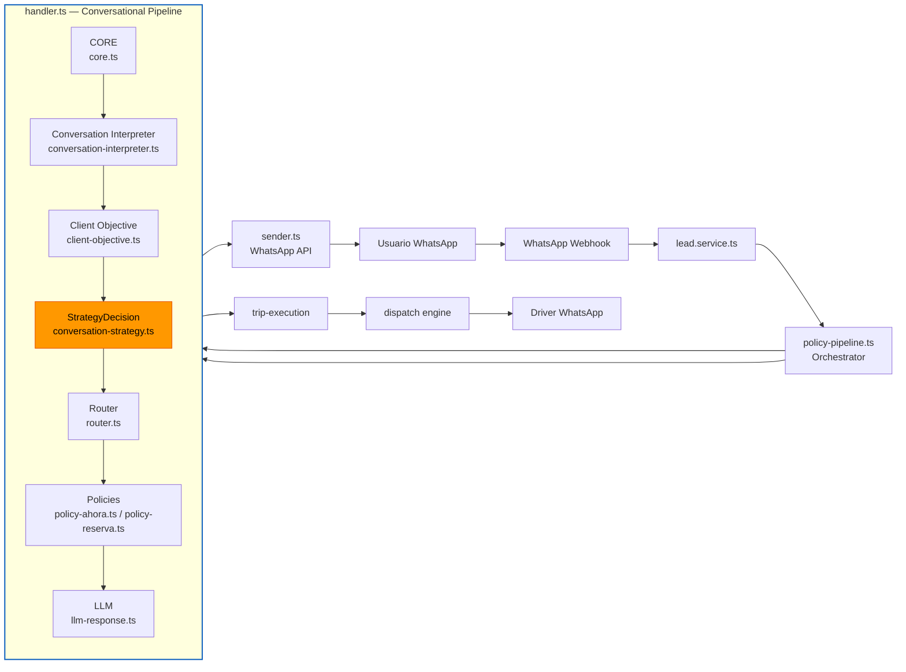
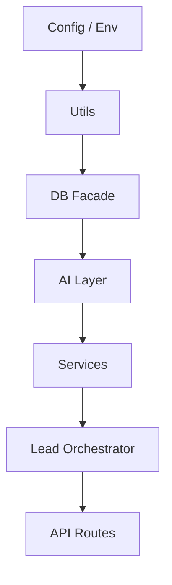

# Architecture — AI Transportation Operating System (AITOS)

> Executive index. This file is the entry point to all architectural documentation.
> For the AI agent minimum context, start at `docs/ai/ARCHITECTURE_BIBLE.md`.

---

## What this system is

The **AI Transportation Operating System (AITOS)** converts ambiguous human language — received primarily via WhatsApp — into executable transportation logistics operations.

It is **not** a chatbot. It is **not** a WhatsApp bot. It is an operating system whose current primary channel is WhatsApp.

---

## Architecture story

AITOS was not designed as a chatbot that grew features. It was built as a
dispatch operating system that uses conversation as its input channel.

The architecture evolved through several realizations:

1. **From regex bot to slot model.** Early versions responded with hardcoded
   flows. The system now translates every message into a structured operational
   model (slots) before deciding what to do.

2. **From LLM-first to deterministic core.** Initial experiments relied on the
   LLM for intent and extraction. The current design uses deterministic regex
   and heuristics for the core path, reserving the LLM for ambiguity and
   refinement.

3. **From single query to layered fallback.** Pricing, extraction, and location
   resolution all use fast-path-first fallback chains so the system keeps
   working when an external service is slow or unavailable.

4. **From chat history to operational state.** The conversation state machine
   manages turn flow, but the real truth lives in `chat_sessions.slots` and the
   trip tables.

5. **From reactive to learning.** Event tracking, opportunity scoring, and fare
   learning turn every trip into feedback for future decisions.

This evolution produced the current shape: a deterministic core, a policy gate,
a service layer of domain engines, and a learning loop.

---

## Reader profiles

This documentation is organized by reader. Pick your path:

| Reader | Start here | Then read |
|--------|------------|-----------|
| Founder / investor / new team member | [`../SYSTEM_BIBLE.md`](../SYSTEM_BIBLE.md) | [`system-overview.md`](./system-overview.md), [`Architecture story`](#architecture-story) |
| AI agent about to change code | [`docs/ai/ARCHITECTURE_BIBLE.md`](../ai/ARCHITECTURE_BIBLE.md) | [`docs/ai/CONTRACTS.md`](../ai/CONTRACTS.md), [`operational-model.md`](./operational-model.md) |
| Engineer designing a feature | [`operational-model.md`](./operational-model.md) | [`decision-architecture.md`](./decision-architecture.md), [`design-principles.md`](./design-principles.md) |
| Architect validating a design | [`../adr/`](../adr/) | [`bounded-contexts.md`](./bounded-contexts.md), [`engines.md`](./engines.md) |
| Operator debugging production | [`system-map.md`](./system-map.md) | [`diagrams/02-webhook-entry.md`](./diagrams/02-webhook-entry.md), [`knowledge-map.md`](./knowledge-map.md) |
| Product manager planning roadmap | [`capability-map.md`](./capability-map.md) | [`maturity-model.md`](./maturity-model.md), [`ael/artifacts/BACKLOG.md`](../../ael/artifacts/BACKLOG.md) |

---

## Quick navigation

| Document | Purpose |
|----------|---------|
| [`docs/SYSTEM_BIBLE.md`](../SYSTEM_BIBLE.md) | Non-technical constitution of the system. |
| [`docs/ai/ARCHITECTURE_BIBLE.md`](../ai/ARCHITECTURE_BIBLE.md) | **Read first.** Canonical truth for AI agents. |
| [`docs/ai/ARCHITECTURE_RULES.md`](../ai/ARCHITECTURE_RULES.md) | Strict architectural rules. |
| [`docs/ai/CONTRACTS.md`](../ai/CONTRACTS.md) | Engine contracts. |
| [`docs/ai/INVARIANTS.md`](../ai/INVARIANTS.md) | Architectural invariants. |
| [`docs/ai/DECISION_TREE.md`](../ai/DECISION_TREE.md) | Runtime decision tree. |
| [`system-overview.md`](./system-overview.md) | Conversation → Operational Model → Execution → Learning. |
| [`operational-model.md`](./operational-model.md) | The heart of the system: slots, states, pipelines. |
| [`decision-architecture.md`](./decision-architecture.md) | How the system decides what to do. |
| [`knowledge-map.md`](./knowledge-map.md) | Where knowledge lives. |
| [`capability-map.md`](./capability-map.md) | What the system can do. |
| [`maturity-model.md`](./maturity-model.md) | Maturity levels and investment priorities. |
| [`design-principles.md`](./design-principles.md) | Principles with code examples. |
| [`fractal-architecture.md`](./fractal-architecture.md) | Patterns that repeat at every scale. |
| [`bounded-contexts.md`](./bounded-contexts.md) | Real bounded contexts derived from code. |
| [`ADR_INDEX.md`](./ADR_INDEX.md) | Navigable index of architecture decisions. |
| [`GOVERNANCE.md`](./GOVERNANCE.md) | How documentation evolves. |
| [`DIAGRAMS.md`](./DIAGRAMS.md) | Diagram lifecycle and regeneration. |
| [`dashboard.md`](./dashboard.md) | Live architecture dashboard. |
| [`metrics.md`](./metrics.md) | Architectural metrics. |
| [`ARCHITECTURE_BASELINE.md`](./ARCHITECTURE_BASELINE.md) | Current architectural snapshot. |
| [`engines.md`](./engines.md) | Detailed engine documentation. |
| [`system-map.md`](./system-map.md) | Operational map: "If I need to modify X, look at Y." |
| [`glossary.md`](./glossary.md) | Canonical terminology. |
| [`reverse-engineering/architecture-graphs.md`](./reverse-engineering/architecture-graphs.md) | Auto-generated dependency graphs. |
| [`../adr/`](../adr/) | Architecture Decision Records. |
| [`../security/secrets.md`](../security/secrets.md) | Secret management and environment variables. |
| [`../history/`](../history/) | Historical snapshots and superseded documents. |

---

## Authority

1. **Code is the ultimate source of truth.**
2. **AI Context Pack** (`docs/ai/`) is the canonical guide for agents.
3. **ADRs** (`docs/adr/`) record permanent decisions.
4. **This index** points to the above; it does not duplicate them.

---

## Core pipeline (ADR-008)

---

## Layers

---

## Architecture decisions

- `docs/adr/001-layered-architecture.md` — Layered architecture
- `docs/adr/002-database-facade.md` — Database facade pattern
- `docs/adr/003-learning-domain.md` — Learning as first-class domain
- `docs/adr/004-service-boundaries.md` — Service boundaries and dependency order
- `docs/adr/005-ai-first-interpretation.md` — AI-first interpretation with deterministic core
- `docs/adr/006-schema-parity.md` — Schema parity between code and database
- `docs/adr/007-conversation-interpreter.md` — Conversation Interpreter pipeline stage
- `docs/adr/008-conversational-decision-architecture.md` — StrategyDecision + Architecture Freeze

---

## What makes AITOS different

Most conversational systems optimize for the conversation. AITOS optimizes for
the operation.

### Versus a chatbot

A chatbot replies to messages. AITOS executes trips.

| Chatbot | AITOS |
|---------|-------|
| Conversation is the product | Conversation is the input channel |
| State is the chat history | State is the operational slot model |
| AI generates answers | AI interprets; policy decides |
| Failure means a bad reply | Failure means a missed trip |

### Versus a booking engine

A booking engine assumes forms. AITOS assumes ambiguity.

| Booking engine | AITOS |
|----------------|-------|
| Structured input required | Free-text, multilingual, typo-tolerant |
| Fixed workflow | State machine adapts to missing information |
| Price is a lookup | Price is a resolution cascade with commercial rules |
| Location is a dropdown | Location is resolved from aliases and context |

### Versus a CRM

A CRM manages relationships. AITOS manages operations.

| CRM | AITOS |
|-----|-------|
| Contact-centric | Trip-centric |
| Tracks interactions | Tracks executions |
| Humans dispatch | System dispatches automatically |
| Reports on pipeline | Learns from outcomes |

### What this enables

Because AITOS is an operating system:

1. **Channel independence.** The same logic works via WhatsApp today and via a
   partner API tomorrow.
2. **Operational reliability.** Deterministic core + fallback chains keep the
   system working when AI providers fail.
3. **Continuous improvement.** Every trip produces events that feed learning.
4. **Clear accountability.** Policy gates make every decision traceable.

---

## Status legend for architecture documents

| Tag | Meaning |
|-----|--------|
| Implemented | Exists in code and documented |
| Partial | Implemented with known limitations or violations |
| In Progress | Being implemented |
| Planned | In backlog, not yet implemented |
| Not Implemented | Explicitly not implemented |

---

*Last updated: 2026-07-10*
