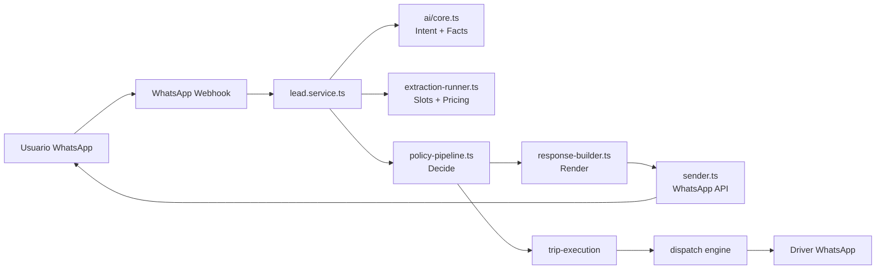
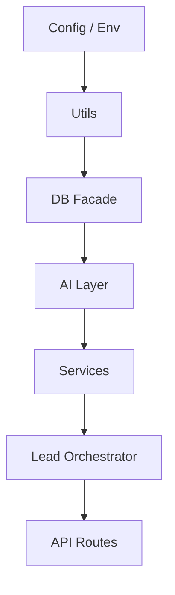

# Architecture — AI Transportation Operating System (AITOS)

> Executive index. This file is the entry point to all architectural documentation.
> For the AI agent minimum context, start at `docs/ai/ARCHITECTURE_BIBLE.md`.

---

## What this system is

The **AI Transportation Operating System (AITOS)** converts ambiguous human language — received primarily via WhatsApp — into executable transportation logistics operations.

It is **not** a chatbot. It is **not** a WhatsApp bot. It is an operating system whose current primary channel is WhatsApp.

---

## Quick navigation

| Document | Purpose |
|----------|---------|
| [`docs/ai/ARCHITECTURE_BIBLE.md`](../ai/ARCHITECTURE_BIBLE.md) | **Read first.** Canonical truth for AI agents. |
| [`docs/ai/ARCHITECTURE_RULES.md`](../ai/ARCHITECTURE_RULES.md) | Strict architectural rules. |
| [`docs/ai/CONTRACTS.md`](../ai/CONTRACTS.md) | Engine contracts. |
| [`docs/ai/INVARIANTS.md`](../ai/INVARIANTS.md) | Architectural invariants. |
| [`docs/ai/DECISION_TREE.md`](../ai/DECISION_TREE.md) | Runtime decision tree. |
| [`system-overview.md`](./system-overview.md) | Conversation → Operational Model → Execution → Learning. |
| [`bounded-contexts.md`](./bounded-contexts.md) | Real bounded contexts derived from code. |
| [`engines.md`](./engines.md) | Detailed engine documentation. |
| [`system-map.md`](./system-map.md) | Operational map: "If I need to modify X, look at Y." |
| [`glossary.md`](./glossary.md) | Canonical terminology. |
| [`reverse-engineering/architecture-graphs.md`](./reverse-engineering/architecture-graphs.md) | Auto-generated dependency graphs. |
| [`../adr/`](../adr/) | Architecture Decision Records. |

---

## Authority

1. **Code is the ultimate source of truth.**
2. **AI Context Pack** (`docs/ai/`) is the canonical guide for agents.
3. **ADRs** (`docs/adr/`) record permanent decisions.
4. **This index** points to the above; it does not duplicate them.

---

## Core pipeline

---

## Layers

---

## Architecture decisions

- `docs/adr/001-layered-architecture.md` — Layered architecture
- `docs/adr/002-database-facade.md` — Database facade pattern
- `docs/adr/003-learning-domain.md` — Learning as first-class domain
- `docs/adr/004-service-boundaries.md` — Service boundaries and dependency order
- `docs/adr/005-ai-first-interpretation.md` — AI-first interpretation with deterministic core
- `docs/adr/006-schema-parity.md` — Schema parity between code and database

---

## Status legend for architecture documents

| Tag | Meaning |
|-----|---------|
| ✅ Implemented | Exists in code and documented |
| ⚠️ Partial | Implemented with known limitations or violations |
| 🚧 In Progress | Being implemented |
| 📋 Planned | In backlog, not yet implemented |
| ❌ Not Implemented | Explicitly not implemented |

---

*Last updated: 2026-07-06*
