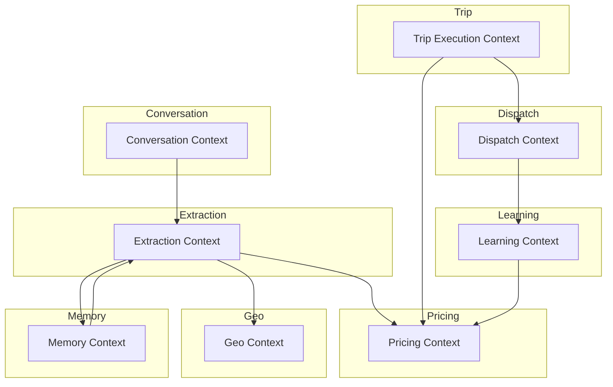
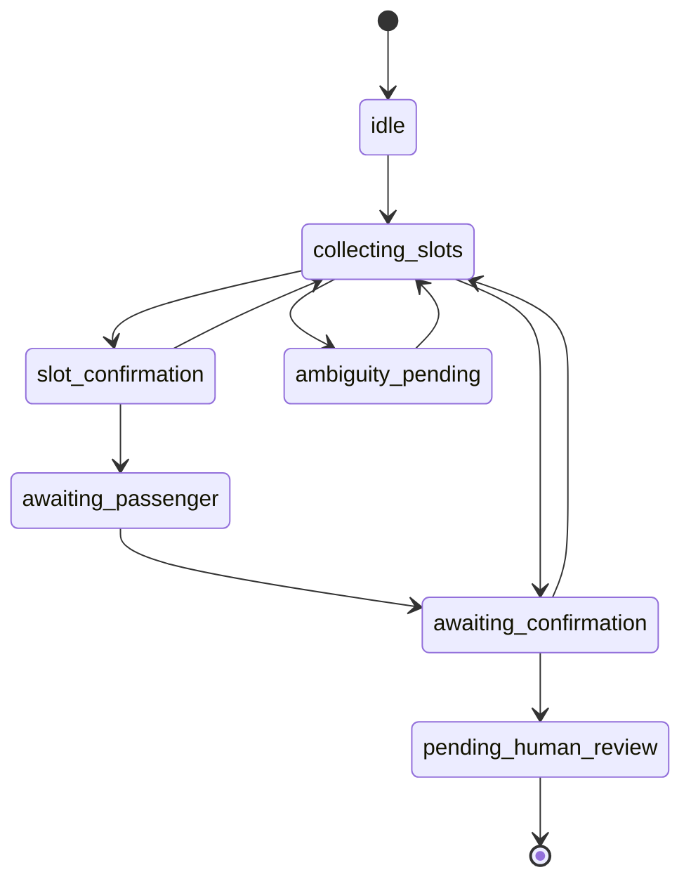
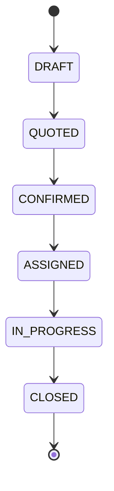
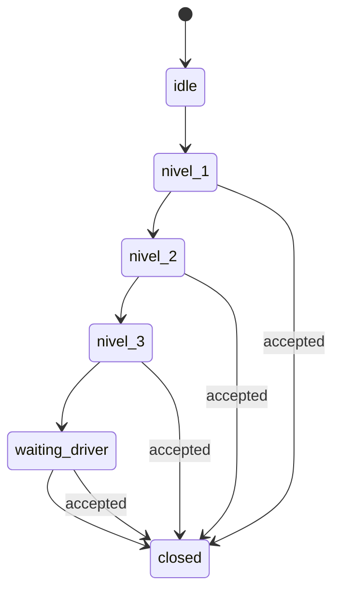

# Bounded Contexts — AITOS

> Real bounded contexts derived from the source code.
> No formal modules exist; these contexts emerge from file organization and import patterns.

---

## Methodology

Bounded contexts were identified by:

1. Directory structure under `src/lib/services/`, `src/lib/ai/`, `src/lib/db/domains/`.
2. Import graph analysis (`docs/architecture/reverse-engineering/architecture-graphs.md`).
3. Aggregate roots in the database schema.
4. State machines and lifecycle ownership.

---

## Context map

---

## 1. Conversation Context

**Ownership**: `src/lib/services/lead.service.ts`, `src/lib/services/workflow/`, `src/app/api/whatsapp/webhook/`

**Responsibilities**:
- Receive incoming messages
- Maintain conversational state machine
- Route messages to the correct handler
- Coordinate the overall pipeline
- Interface with the WhatsApp channel

**Inputs**:
- Normalized `(phone, text)` from webhook
- Session state from `chat_sessions`
- Message history from `messages`

**Outputs**:
- WhatsApp response to user
- Updated session state
- Operational side effects (trip creation, dispatch)

**Aggregate root**: `ChatSession` (`chat_sessions.phone`)

**Dependencies**:
- Extraction Context
- Pricing Context
- Trip Execution Context
- Dispatch Context
- Memory Context
- AI Layer

**State machine**:

---

## 2. Extraction Context

**Ownership**: `src/lib/services/extraction/`, `src/lib/ai/extraction-schema.ts`, `src/lib/ai/extraction-prompt.ts`

**Responsibilities**:
- Convert natural language into structured slots
- Calculate confidence scores
- Resolve slot status lifecycle
- Merge new extraction with previous slots
- Trigger pricing resolution

**Inputs**:
- Raw user text
- Previous slots
- Core decision (intent, roleLock, slotStability)
- Conversation history

**Outputs**:
- `ExtractionResult` with slots, confidence, pricing, workflow state

**Aggregate root**: `ExtractionResult`

**Key entities/value objects**:
- `Slot`: origin, destination, passengers, scheduled_at, flight, price
- `SlotStatus`: RAW, INFERRED, CONFIRMATION_PENDING, CONFIRMED, USER_CORRECTED, USER_CONFIRMED
- `ConfidenceResult`: score + reason per slot

**Dependencies**:
- Geo Context (location resolution)
- Pricing Context (tariff lookup)
- Memory Context (previous slots)
- LLM Layer (optional fallback)

---

## 3. Pricing Context

**Ownership**: `src/lib/services/pricing/`

**Responsibilities**:
- Resolve tariffs for origin/destination/passengers
- Apply commercial rules, promotions, provider adjustments
- Calculate public price and driver payout
- Support multi-ride package discounts

**Inputs**:
- Origin and destination (text or place_id)
- Passenger count
- Optional modifiers (promotions, adjustments)

**Outputs**:
- `PricingResult` with final_price, base_price, adjustments, explanation

**Aggregate root**: `Tariff` (`tariffs.id`)

**Key entities/value objects**:
- `Tariff`: origin/destination prices, resolution priority
- `PricingResult`: resolved price + metadata
- `MultiRideBreakdown`: hub discounts for multi-leg trips

**Dependencies**:
- Geo Context (place/zone resolution)
- DB `tariffs`, `promotions`, `provider_adjustments`

---

## 4. Geo Context

**Ownership**: `src/lib/services/geo/`

**Responsibilities**:
- Resolve free-text locations to canonical places
- Provide reverse geocoding (GPS → address)
- Manage place aliases in multiple languages

**Inputs**:
- Free-text location string
- Optional country hint

**Outputs**:
- `GeoResolutionResult`: place_id, canonical_name, zone_id, country, match_level

**Aggregate root**: `Place` (`places.place_id`)

**Key entities/value objects**:
- `Place`: canonical location with coordinates
- `Alias`: alternative name in a language
- `Zone`: operational area for pricing/dispatch

**Dependencies**:
- DB `places`, `aliases`, `zones`
- External Nominatim API (reverse geocode)

---

## 5. Trip Execution Context

**Ownership**: `src/lib/services/trip-execution/`

**Responsibilities**:
- Create trips from confirmed slots
- Manage trip lifecycle
- Execute immediate (NOW) trips
- Handle post-service surveys

**Inputs**:
- Confirmed slots
- Pricing result
- Customer information

**Outputs**:
- `TripRow` in `trips`
- Trip events in `trip_events`

**Aggregate root**: `Trip` (`trips.trip_id`)

**State machine**:

**Dependencies**:
- Pricing Context
- Dispatch Context
- Conversation Context

---

## 6. Dispatch Context

**Ownership**: `src/lib/services/dispatch/`

**Responsibilities**:
- Offer trips to drivers
- Escalate through priority levels
- Handle driver responses
- Prevent double assignment

**Inputs**:
- Confirmed trip
- Driver pool

**Outputs**:
- Driver assignment
- Dispatch events

**Aggregate root**: `DispatchEvent` (`dispatch_events.id`)

**State machine**:

**Dependencies**:
- Trip Execution Context
- Learning Context (driver scoring)
- WhatsApp sender

---

## 7. Learning Context

**Ownership**: `src/lib/services/learning/`

**Responsibilities**:
- Track operational events
- Generate post-confirmation opportunities
- Adjust weights based on outcomes
- Compute system load and driver acceptance scores

**Inputs**:
- Events from conversation, pricing, dispatch, trip execution

**Outputs**:
- `learning_weights` updates
- Opportunity recommendations
- Decision log entries

**Aggregate root**: `LearningEvent` (`f9_events.id`)

**Key entities/value objects**:
- `OpportunityRule`: when to offer upgrades/discounts
- `LearningWeight`: calibrated parameters
- `DecisionLog`: record of opportunity decisions

**Dependencies**:
- Pricing Context
- DB `f9_events`, `learning_weights`, `opportunity_log`, `decision_log`

**Note**: Currently bypasses DB facade in some paths (known violation).

---

## 8. Memory Context

**Ownership**: `src/lib/services/memory/`

**Responsibilities**:
- Build session memory from persistent state
- Merge previous slots with new extraction
- Provide predictive routing hints

**Inputs**:
- `chat_sessions` row
- Recent message history

**Outputs**:
- `Memory` object
- Merged slot context

**Dependencies**:
- DB `chat_sessions`, `messages`

---

## Context dependency matrix

| Context | Depends on | Depended on by |
|---------|-----------|----------------|
| Conversation | All | Webhook, Admin APIs |
| Extraction | Geo, Pricing, Memory, LLM | Conversation |
| Pricing | Geo | Extraction, Trip, Learning |
| Geo | DB | Extraction, Pricing |
| Trip Execution | Pricing, Dispatch, Conversation | Dispatch, Learning |
| Dispatch | Trip Execution, Learning, Sender | Trip Execution |
| Learning | Pricing, DB | Conversation, Dispatch |
| Memory | DB | Conversation, Extraction |

---

*Last updated: 2026-07-06*
