# Conversation Pipeline — ADR-008

> **El pipeline conversacional completo de AITOS, desde el webhook hasta la respuesta final.**
> Este documento integra todos los componentes en una visión unificada del flujo de datos y decisiones.

---

## 1. Pipeline completo

```mermaid
flowchart TB
    subgraph Entry["Entrada"]
        WH[WhatsApp Webhook<br/>route.ts]
        HMAC[HMAC Validation<br/>Rate Limit<br/>Idempotency]
    end

    subgraph Lead["Orquestación (lead.service.ts)"]
        LS[handleLeadMessage]
        SH[Shortcuts: .limpiar, admin, etc.]
        SETUP[Conversation Setup]
        MEM[Memory + CORE]
        CI1[Conversation Interpreter]
        GREET[GREETING Shortcut]
        STATES[Slot States:<br/>slot_confirmation<br/>awaiting_passenger<br/>awaiting_confirmation<br/>ambiguity]
        COMP[Comprehension Check]
        EXTR[Extraction Pipeline<br/>slots, pricing, workflow]
    end

    subgraph PolicyPipe["Pipeline de Políticas (policy-pipeline.ts)"]
        PP[handlePolicyPipeline]
        BUILD[buildExtractionContext]
        LANG[Language Detection]
        DISP[Display Names Resolution]
        TEMP[Temporality: temporalFromFacts]
        OPP[Opportunity Query?]
        CONF[Awaiting Confirmation?]
        SLOT_UI[Slot Confirmation UI?]
        OR[Operational Readiness<br/>canPrepareQuote / canQuote / canDispatch]
        DISPATCH[Dispatch? → executeNowTrip]
    end

    subgraph Handler["Pipeline Conversacional ADR-008 (handler.ts)"]
        CORE2[CORE<br/>core.ts]
        ROUTER[Router<br/>router.ts]
        CI2[Conversation Interpreter<br/>interpretMessage]
        CO[Client Objective<br/>computeClientObjective]
        SD[StrategyDecision<br/>computeStrategyDecision]
        ENRICH[enrichedCtx<br/>HandlerContext]
        POLICIES[Policies<br/>policyAhora / policyReserva]
        GUARD[Guardrails<br/>assertOutputSource<br/>assertPipelineComplete]
        LLM_GATE[LLM Gate<br/>skipLLM?]
        LLM[LLM Response<br/>generateLLMResponse]
    end

    subgraph Output["Salida"]
        SEND[Send WhatsApp<br/>sender.ts]
        PERSIST[Persist Message<br/>database.ts]
        GEO[Geo + Context Save]
        ADMIN[Admin Notify]
        TRIP[Trip Execution<br/>executeTrip / executeNowTrip]
    end

    WH --> HMAC
    HMAC --> LS
    LS --> SH
    SH --> SETUP
    SETUP --> MEM
    MEM --> CI1
    CI1 --> GREET
    GREET -->|Si es GREETING| PP
    GREET -->|Si no| STATES
    STATES --> COMP
    COMP --> EXTR
    EXTR --> PP

    PP --> BUILD
    BUILD --> LANG
    LANG --> DISP
    DISP --> TEMP
    TEMP --> OPP
    OPP -->|Sí + quote OK| SEND
    OPP -->|No| CONF
    CONF -->|Afirmativo + OK| TRIP
    CONF -->|No| SLOT_UI
    SLOT_UI -->|Sí| SEND
    SLOT_UI -->|No| OR
    OR --> DISPATCH
    DISPATCH -->|Sí| TRIP
    DISPATCH -->|No| PROCESS

    PROCESS[processLead] --> CORE2
    CORE2 --> ROUTER
    CORE2 --> CI2
    CI2 --> CO
    CO --> SD
    SD --> ENRICH
    ENRICH --> POLICIES
    POLICIES --> GUARD
    GUARD --> LLM_GATE
    LLM_GATE -->|skipLLM=false| LLM
    LLM_GATE -->|skipLLM=true| NO_LLM[Template directo]
    LLM --> POLICIES2[policy.finalResponse = llmResponse]
    NO_LLM --> POLICIES2

    POLICIES2 --> SEND
    SEND --> PERSIST
    PERSIST --> GEO
    GEO --> ADMIN
    ADMIN --> TRIP

    style SD fill:#ff9800,stroke:#e65100,color:#000
    style Handler stroke:#1565c0,stroke-width:2px
    style PolicyPipe stroke:#2e7d32,stroke-width:2px
```



---

## 2. Etapas del pipeline

### Etapa 0: Entrada (Webhook)

| Aspecto | Detalle |
|---------|---------|
| **Archivo** | `src/app/api/whatsapp/webhook/route.ts` |
| **Validación** | HMAC signature, rate limiting por phone, idempotency |
| **Input** | `(phone, text)` desde WhatsApp |
| **Output** | Llamada a `handleLeadMessage(phone, text)` |

### Etapa 1: Orquestación (lead.service.ts)

| Aspecto | Detalle |
|---------|---------|
| **Archivo** | `src/lib/services/lead.service.ts` |
| **Función** | `handleLeadMessage(phone, text)` |
| **Sub-etapas** | Shortcuts → Setup → CORE → Interpreter → Comprehension → Extraction |
| **Output** | Llamada a `handlePolicyPipeline({...})` |

### Etapa 2: Pipeline de Políticas (policy-pipeline.ts)

| Aspecto | Detalle |
|---------|---------|
| **Archivo** | `src/lib/services/workflow/policy-pipeline.ts` |
| **Función** | `handlePolicyPipeline(input)` |
| **Responsabilidad** | Construir ExecutionContext, resolver temporalidad, manejar oportunidades, confirmaciones, readiness, dispatch |
| **Output** | `processLead(execCtx, execDeps)` donde `execDeps.handler = handleMessage` |

### Etapa 3: Pipeline Conversacional (handler.ts) — ADR-008

| Sub-etapa | Componente | Archivo | Responsabilidad |
|-----------|------------|---------|-----------------|
| 3a | **CORE** | `core.ts` | Extracción determinista: intent, facts, purchaseIntent |
| 3b | **Router** | `router.ts` | CoreDecision → OutputType (EXECUTE, ANSWER, CLARIFY, SAFE_FALLBACK) |
| 3c | **Conversation Interpreter** | `conversation-interpreter.ts` | Clasificar rol conversacional (MessageType) |
| 3d | **Client Objective** | `client-objective.ts` | Sintetizar objetivo del cliente |
| 3e | **StrategyDecision** | `conversation-strategy.ts` | **Decisión estratégica central** |
| 3f | **enrichedCtx** | `handler.ts` | Propagar señales + SD a policies y LLM |
| 3g | **Policies** | `policy-ahora.ts`, `policy-reserva.ts` | Ejecutar decisión, producir PolicyOutput |
| 3h | **Guardrails** | `guard.ts` | Assert outputSource=POLICY, pipeline complete |
| 3i | **LLM Gate + Response** | `handler.ts`, `llm-response.ts` | Gatear LLM según skipLLM; generar prompt con SD context |

### Etapa 4: Ejecución

| Acción | Archivo | Condición |
|--------|---------|-----------|
| Send WhatsApp | `sender.ts` | Siempre |
| Persist message | `database.ts` | Siempre |
| Save geo context | `context-memory.ts` | `policy.needsGeo === true` |
| Admin notify | `admin.service.ts` | `policy.needsAdminNotify === true` |
| Trip execution | `trip-execution.service.ts` | Si dispatch o confirmación afirmativa |

---

## 3. Contrato ADR-008

El pipeline sigue estrictamente el principio de responsabilidad única por etapa:

```
CORE                     → Produce hechos. No decide estrategia.
Conversation Interpreter → Produce señales. No decide comportamiento.
Client Objective         → Produce objetivo. No decide respuesta.
StrategyDecision         → Única autoridad en decisiones estratégicas.
Policies                 → Ejecutan decisiones. Consumen SD. No reinterpretan.
LLM                      → Expresa estrategia. No modifica.
```

### Violaciones prohibidas

- **CORE no puede importar de Services** (ADR-001)
- **AI no puede decidir estrategia fuera de StrategyDecision** (ADR-008)
- **Policies no pueden leer señales originales** (R5)
- **LLM no puede cambiar la decisión** (guardrails)

---

## 4. Archivos clave

| Archivo | Rol en el pipeline |
|---------|-------------------|
| `src/lib/services/lead.service.ts` | Orquestador principal |
| `src/lib/services/workflow/policy-pipeline.ts` | Pipeline de políticas (outer) |
| `src/lib/pipeline.ts` | processLead — conector entre outer e inner pipeline |
| `src/lib/ai/handler.ts` | Pipeline conversacional ADR-008 (inner) |
| `src/lib/ai/core.ts` | CORE — extracción determinista |
| `src/lib/ai/router.ts` | Router — mapeo a OutputType |
| `src/lib/ai/conversation-interpreter.ts` | Conversation Interpreter |
| `src/lib/ai/client-objective.ts` | Client Objective |
| `src/lib/ai/conversation-strategy.ts` | StrategyDecision |
| `src/lib/ai/policy-ahora.ts` | Policy AHORA |
| `src/lib/ai/policy-reserva.ts` | Policy RESERVA |
| `src/lib/ai/llm-response.ts` | LLM prompt + response |
| `src/lib/ai/guard.ts` | Guardrails |
| `src/lib/ai/types.ts` | Tipos compartidos |

---

*Last updated: 2026-07-10*
*Authority: ADR-008, `src/lib/ai/handler.ts`, código fuente*
