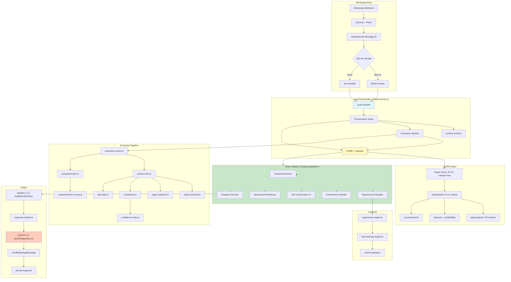

# 01 — System Overview

> **Resumen:** Vista de alto nivel del pipeline completo: desde el webhook de WhatsApp hasta la respuesta final, pasando por los orquestadores reales del sistema.


Pipeline principal del sistema TaxGuazú. El orquestador real del flujo conversacional es `lead.service.ts`, que coordina extracción, CORE, policy-pipeline y salida.



## Fases conversacionales (resumen)

```
CORE ‚Üí ROUTER ‚Üí POLICY ‚Üí OUTPUT
(CORE) (policy-pipeline) (handler) (guard + sender)
```

| Fase | Responsable real | Qué hace |
|------|-----------------|---------|
| **Extracción** | `services/extraction/*` | Extrae slots con LLM + scoring de confianza |
| **CORE** | `ai/core.ts` + `ai/laterals/` | Detecta intención y hechos de forma determinista |
| **Routing/Temporal** | `policy-pipeline.ts` | CORE + temporal ‚Üí operationalMode ‚Üí Mode (AHORA/RESERVA/INFO) |
| **Policy** | `ai/handler.ts` + `policy-ahora.ts` + `policy-reserva.ts` | Genera respuesta seg√∫n reglas sin LLM |
| **Guard** | `ai/guard.ts` | Valida outputSource y pipeline completion |
| **Output** | `sender.ts` | Envía mensaje por WhatsApp y persiste |

## Módulos nuevos (vs diagrama anterior)

| Módulo | Rol | Referencia |
|--------|-----|-----------|
| `policy-pipeline.ts` | Orquestador real que combina CORE + temporal + pricing + dispatch | `src/lib/services/workflow/policy-pipeline.ts` |
| `laterals/` | 5 intents con metadata de riesgo/prioridad | `src/lib/ai/laterals/` |
| `extraction/*` | 9 archivos del pipeline de extracción | `src/lib/services/extraction/*.ts` |
| `learning/*` | 14 archivos: opportunity, fare-learning, event-tracking | `src/lib/services/learning/*.ts` |
| `context-memory.ts` | Carga/guarda contexto conversacional | `src/lib/services/memory/context-memory.ts` |

## Referencias

- Entry point: `src/app/api/whatsapp/webhook/route.ts`
- Lead orchestrator: `src/lib/services/lead.service.ts`
- Policy pipeline: `src/lib/services/workflow/policy-pipeline.ts`
- CORE: `src/lib/ai/core.ts`
- Laterals: `src/lib/ai/laterals/index.ts`
- Handler: `src/lib/ai/handler.ts`
- Guard: `src/lib/ai/guard.ts`
---

## Diagramas relacionados

- [16-policy-pipeline.md](16-policy-pipeline.md) ó policy-pipeline
- [03-core-phase.md](03-core-phase.md) ó core-phase
- [14-dispatch-flow.md](14-dispatch-flow.md) ó dispatch-flow
