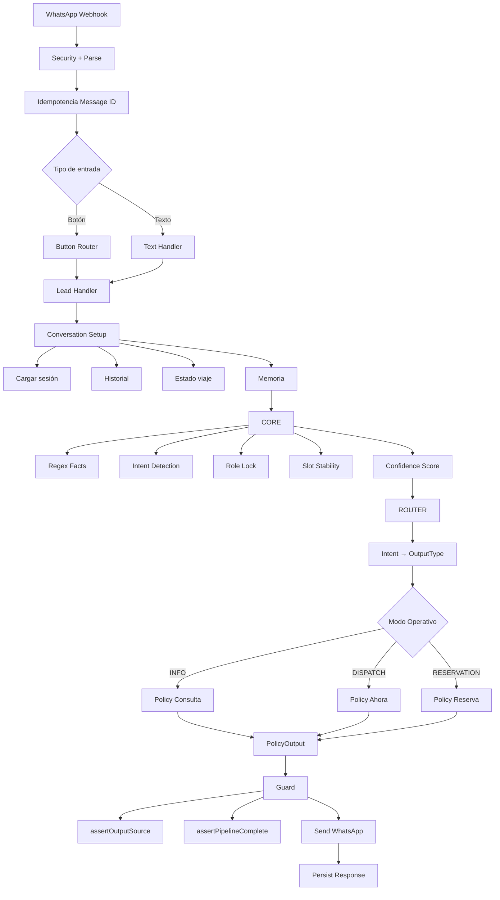

# 01 — System Overview

Pipeline principal de 5 fases del sistema TaxGuazú.

## Referencia

- Entry point: `src/app/api/whatsapp/webhook/route.ts`
- Pipeline: `src/lib/ai/handler.ts:70-89`
- Guard: `src/lib/ai/guard.ts`
