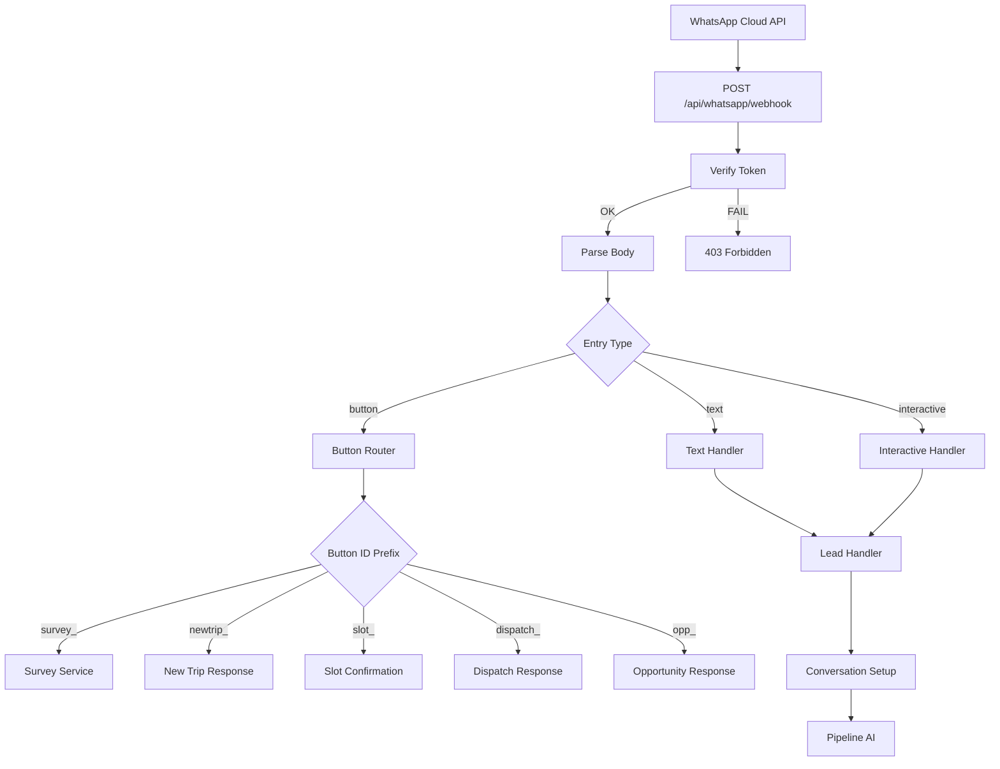

# 02 — Webhook Entry

Punto de entrada de mensajes WhatsApp y routing inicial.

## Referencia

- Webhook: `src/app/api/whatsapp/webhook/route.ts`
- Button router: `src/app/api/whatsapp/webhook/route.ts:80-120`
- Lead handler: `src/lib/services/lead.service.ts`
