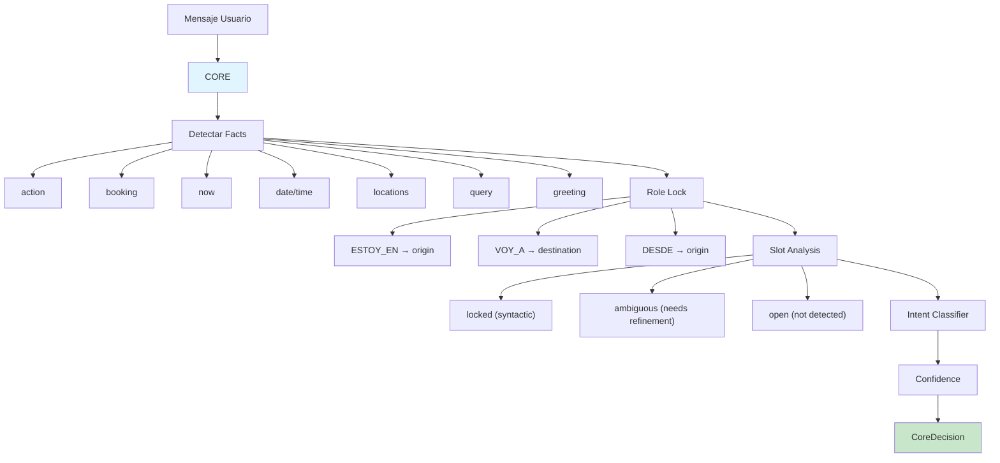

# 03 — CORE Phase

Detección determinista de intención y extracción de hechos. Sin LLM, sin inferencia.



## CoreDecision Output

```typescript
interface CoreDecision {
  intent: Intent;           // 11 valores posibles
  facts: string[];          // hechos extraídos
  confidence: number;       // 0.0 - 1.0
  slotStability: SlotStabilityMap;
  roleLock: RoleLock;
}
```

## Referencia

- Facts extraction: `src/lib/ai/core.ts:120-200`
- Role lock: `src/lib/ai/core.ts:60-107`
- Intent classification: `src/lib/ai/core.ts:226-299`
- Confidence: `src/lib/ai/core.ts:301-341`
