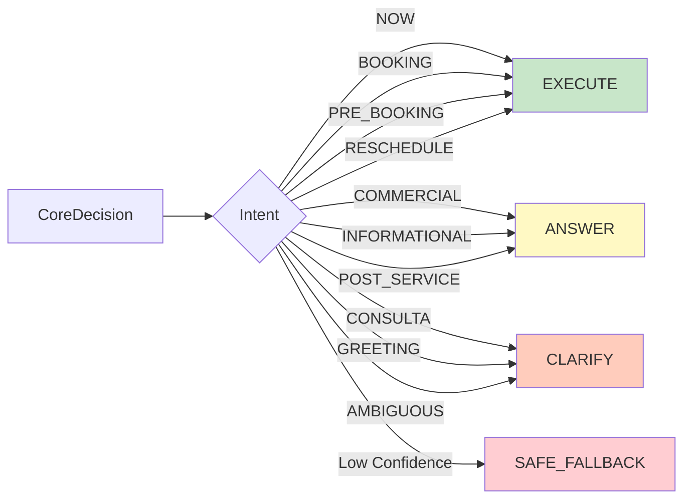

# 04 — Router Phase

Mapeo determinista de Intent → OutputType. Sin lógica de decisión.

## OutputType → Acción

| OutputType | Acción | Políticas que lo manejan |
|------------|--------|-------------------------|
| `EXECUTE` | Ejecutar viaje/despacho | Policy Ahora, Policy Reserva |
| `ANSWER` | Responder consulta | Policy Consulta |
| `CLARIFY` | Pedir más información | Policy Ahora, Policy Reserva |
| `SAFE_FALLBACK` | Respuesta segura genérica | Policy Ahora, Policy Reserva |

## Referencia

- Router: `src/lib/ai/router.ts:14-32`
- Handler: `src/lib/ai/handler.ts:70-89`
