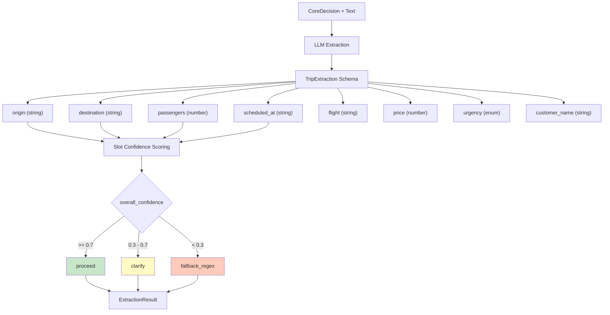

# 05 — Extraction Phase

Extracción de slots mediante LLM + scoring de confianza por campo.

## Confidence Scores por Slot

| Slot | Score 1.0 | Score 0.6 | Score 0.0 |
|------|-----------|-----------|-----------|
| origin | exact_alias_match | ambiguous_term | missing |
| destination | exact_alias_match | ambiguous_term | missing |
| passengers | direct_extraction | ambiguous_mention | missing |
| scheduled_at | valid_iso_date | relative_date_computed | missing |

## Referencia

- Schema: `src/lib/ai/extraction-schema.ts`
- Runner: `src/lib/services/extraction/extraction-runner.ts`
- Confidence: `src/lib/services/extraction/confidence.ts`
