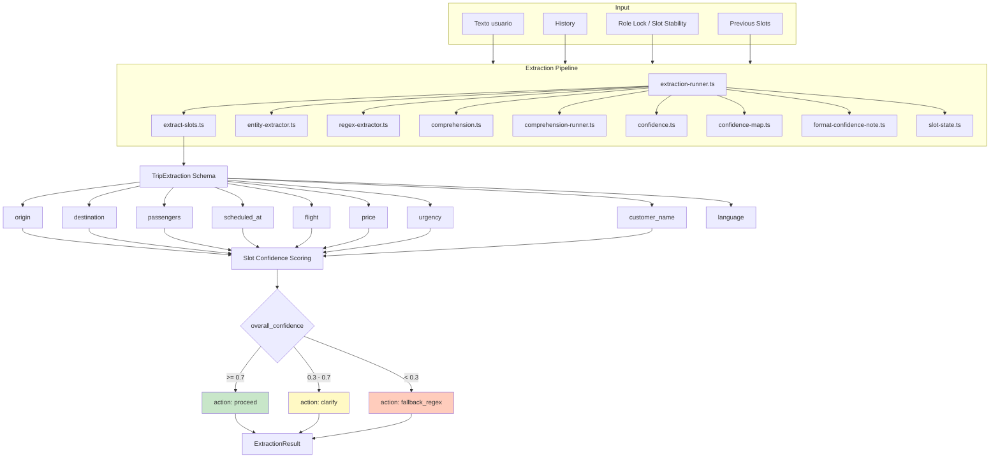

# 05 — Extraction Phase

> **Resumen:** ExtracciÛn de slots mediante LLM: schema de 9 campos, scoring de confianza y pipeline de 9 mÛdulos.

Extracción de slots mediante LLM + scoring de confianza por campo.

## TripExtraction Schema

| Campo | Tipo | Descripción |
|-------|------|-------------|
| `origin` | string | Origen del viaje |
| `destination` | string | Destino del viaje |
| `passengers` | number | Cantidad de pasajeros |
| `scheduled_at` | string | Fecha/hora ISO o relativa |
| `flight` | string | N√∫mero de vuelo |
| `price` | number | Precio mencionado por el usuario |
| `urgency` | enum | `now`, `today`, `future` |
| `customer_name` | string | Nombre del cliente |
| `language` | enum | `es`, `en`, `pt`, `fr`, `de`, `it`, `zh` |

## Confidence Dimensions

| Slot | Score 1.0 | Score 0.6 | Score 0.0 |
|------|-----------|-----------|-----------|
| origin | exact_alias_match | ambiguous_term / fuzzy_alias_match | unknown_location / missing |
| destination | exact_alias_match | ambiguous_term / fuzzy_alias_match | unknown_location / missing |
| passengers | direct_extraction | ambiguous_mention | missing |
| scheduled_at | valid_iso_date | relative_date_computed | missing |

## Pipeline de módulos

| Módulo | Función |
|--------|---------|
| `extraction-runner.ts` | Orquesta extracción LLM + regex |
| `extract-slots.ts` | Prepara prompt y parsea respuesta estructurada |
| `entity-extractor.ts` | Patrones específicos de entidades (hoteles, landmarks) |
| `regex-extractor.ts` | Fallback regex para slots |
| `comprehension.ts` | Evalúa calidad/comprensión del mensaje |
| `comprehension-runner.ts` | Runner de comprehension check |
| `confidence.ts` | Asigna scores por slot |
| `confidence-map.ts` | Mapa multidimensional de confianza |
| `slot-state.ts` | Determina status final (CONFIRMED, INFERRED, etc.) |

## Referencias

- Schema: `src/lib/ai/extraction-schema.ts`
- Runner: `src/lib/services/extraction/extraction-runner.ts`
- Confidence: `src/lib/services/extraction/confidence.ts`
- Slot state: `src/lib/ai/slot-state.ts`
- Thresholds: `src/config/constants.ts:44-45`
---

## Diagramas relacionados

- [06-confidence-model.md](06-confidence-model.md) ó confidence-model
- [13-slot-confidence-evolution.md](13-slot-confidence-evolution.md) ó slot-confidence-evolution
- [03-core-phase.md](03-core-phase.md) ó core-phase
