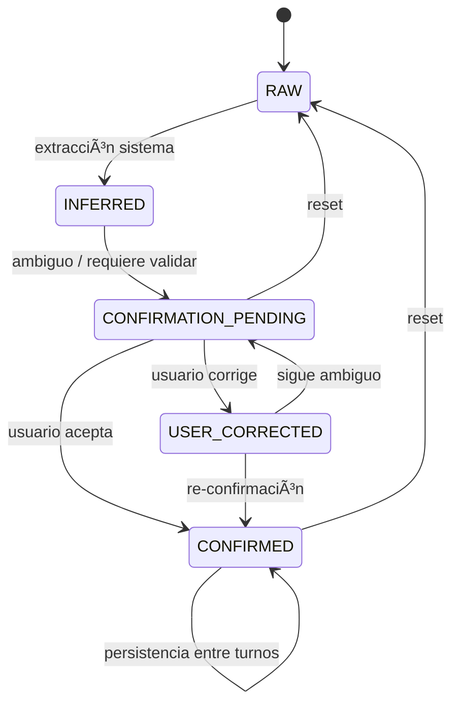
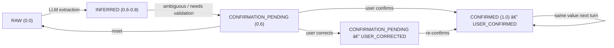

# 06 — Confidence Model

> **Resumen:** Estados de certeza de los slots: RAW, INFERRED, CONFIRMATION_PENDING y CONFIRMED, con fuentes y carry-over.

Estados de certeza de slots y sus transiciones.

## Estados reales

| Estado | Score típico | Significado | ¿Permite avanzar? |
|--------|--------------|-------------|-------------------|
| `RAW` | 0.0 | Extraído sin validación | � No |
| `INFERRED` | 0.6-0.8 | Inferido de contexto o score intermedio | ⚠� Requiere confirmación |
| `CONFIRMATION_PENDING` | 0.6 | Detectado pero ambiguo/no verificado | ⚠� Requiere confirmación |
| `CONFIRMED` | 1.0 | Usuario confirmó o score 1.0 | ✅ Sí |

## Fuentes de slot

| Source | Significado |
|--------|-------------|
| `SYSTEM_INFERRED` | El sistema extrajo/infirió el valor |
| `USER_CONFIRMED` | El usuario confirmó explícitamente |
| `USER_CORRECTED` | El usuario corrigió un valor previo |

## buildSlotStates

`buildSlotStates(currentSlots, previousSlotStates, hasCorrection, hasAffirmation, prevSlotValues)` en `slot-state.ts:13`:

1. Determina source/status base según `reason` + `score`
2. Preserva `CONFIRMED` si el valor no cambió y no hay corrección/afirmación
3. Aplica override `USER_CORRECTED` si hay corrección y cambió el valor
4. Aplica override `USER_CONFIRMED` si hay afirmación
5. Carry-over: mantiene slots previos no re-extraídos

## Transiciones

## Referencias

- Slot states: `src/lib/ai/slot-state.ts`
- Confidence scoring: `src/lib/services/extraction/confidence.ts`
- Thresholds: `src/config/constants.ts:44-45`
---

## Diagramas relacionados

- [13-slot-confidence-evolution.md](13-slot-confidence-evolution.md) — slot-confidence-evolution
- [05-extraction-phase.md](05-extraction-phase.md) — extraction-phase
- [12-workflow-state-machine.md](12-workflow-state-machine.md) — workflow-state-machine
