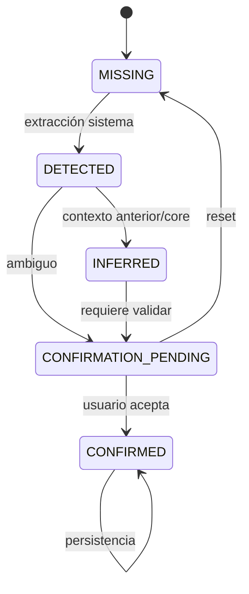
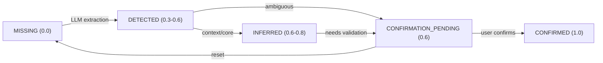

# 06 — Confidence Model

Estados de certeza de slots y sus transiciones.

## Detalle de Estados

| Estado | Score | Significado | ¿Permite avanzar? |
|--------|-------|-------------|-------------------|
| `MISSING` | 0.0 | No extraído | ❌ No |
| `DETECTED` | 0.3-0.6 | Raw extraction del LLM | ⚠️ Requiere validación |
| `INFERRED` | 0.6-0.8 | Inferido de contexto | ⚠️ Requiere confirmación |
| `CONFIRMATION_PENDING` | 0.6 | Detectado pero no verificado | ⚠️ Requiere confirmación |
| `CONFIRMED` | 1.0 | Usuario confirmó explícitamente | ✅ Sí |

## Transiciones

## Referencia

- Slot states: `src/lib/ai/slot-state.ts`
- Confidence scoring: `src/lib/services/extraction/confidence.ts`
- Thresholds: `src/config/constants.ts:42-43`
