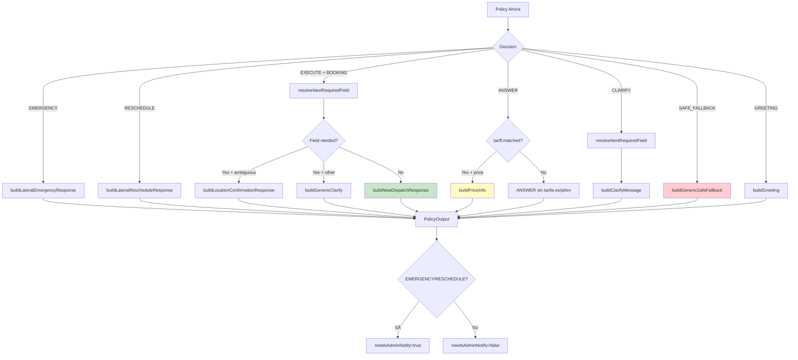

# 07 — Policy AHORA

> **Resumen:** Flujo de ejecución inmediata: lateral intents, dispatch, respuestas informativas y fallback seguro.

Flujo de ejecución inmediata. Stateless, sin LLM en la decisión final.

## Output Properties

| Propiedad | Valor | Descripción |
|-----------|-------|-------------|
| `outputSource` | `"POLICY"` | Siempre, enforced por guard |
| `mode` | `"AHORA"` | Siempre |
| `needsGeo` | `false` | AHORA no hace geo resolution |
| `requiresConfirmation` | `false` | AHORA no pide confirmación |
| `requiresUserInput` | `true` solo si CLARIFY | |
| `confirmationUI` | presente si ambigüedad | Botones interactivos |
| `needsAdminNotify` | `true` si EMERGENCY/RESCHEDULE | Notifica al titular |
| `adminNotifyBody` | string | Cuerpo de notificación admin |

## Lateral intents

| Intent | Respuesta | Admin notify |
|--------|-----------|--------------|
| EMERGENCY | `"🚨 Estamos notificando a nuestro equipo..."` | ✅ |
| RESCHEDULE | `"Entendido. Un operador va a revisar tu reserva..."` | ✅ |

## Referencias

- Policy: `src/lib/ai/policy-ahora.ts`
- Response builder: `src/lib/ai/response-builder.ts`
- Lateral responses: `src/lib/ai/policy-reserva.ts:buildLateralEmergencyResponse`
- Field resolver: `src/lib/ai/field-resolver.ts`
---

## Diagramas relacionados

- [08-policy-reserva.md](08-policy-reserva.md) — policy-reserva
- [04-router-phase.md](04-router-phase.md) — router-phase
- [16-policy-pipeline.md](16-policy-pipeline.md) — policy-pipeline
