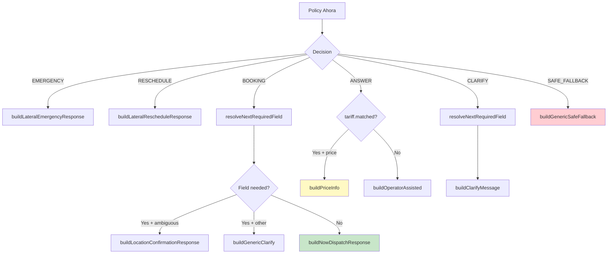

# 07 — Policy AHORA

Flujo de ejecución inmediata. Stateless, sin LLM, sin confirmación.

## Output Properties

| Propiedad | Valor | Descripción |
|-----------|-------|-------------|
| `outputSource` | `"POLICY"` | Siempre, enforced por guard |
| `needsGeo` | `false` | AHORA nunca hace geo resolution |
| `requiresConfirmation` | `false` | AHORA nunca pide confirmación |
| `requiresUserInput` | `true` solo si CLARIFY | |

## Referencia

- Policy: `src/lib/ai/policy-ahora.ts:75-141`
- Response builder: `src/lib/ai/response-builder.ts`
