# 08 — Policy RESERVA

> **Resumen:** Flujo de reserva multi-paso: detección de ambigüedad, confirmación obligatoria y lateral intents.

Flujo de reserva multi-paso con confirmación obligatoria en EXECUTE.

```mermaid
flowchart TD
    A[Policy Reserva] --> B{Estado Slots / Intent}

    B -->|EMERGENCY| C1[buildLateralEmergencyResponse]
    B -->|RESCHEDULE| C2[buildLateralRescheduleResponse]
    B -->|POST_SERVICE| C3[buildLateralPostServiceResponse]

    B -->|affirmation + awaiting_confirmation/awaiting_passenger| D1{tariff matched?}
    D1 -->|Sí| D2[buildBookingAcceptedResponse]
    D1 -->|No| D3[buildBookingAcceptedNoPriceResponse]

    B --> E[buildReservaFinalResponse]

    E --> F{Stable slots?}
    F -->|Sí + ambigüedad| G[buildStableAcknowledge]
    F -->|Sí + tarifa| H[buildConfirmationMessage]
    F -->|No + clarifyField| I[buildClarifyMessage]
    F -->|No + awaiting_confirmation| J[buildNoTariffConfirmation]

    E --> K{ANSWER + tariff?}
    K -->|Sí| L[buildPriceInfo]
    K -->|No| M[Respuesta informativa]

    E --> N{CLARIFY}
    N -->|ambiguous| O[buildLocationConfirmationResponse]
    N -->|other| P[buildGenericClarify]

    E --> Q{EXECUTE sin extraction}
    Q -->|Faltan datos| R[resolveNextRequiredField + buildGenericClarify]
    Q -->|Completo| S[buildConfirmationMessage]

    style D2 fill:#c8e6c9
    style H fill:#c8e6c9
    style L fill:#fff9c4
    style O fill:#ffccbc
```

## Decision Tree (Prioridad)

1. **Laterales** → EMERGENCY, RESCHEDULE, POST_SERVICE
2. **Booking acceptance** → affirmation + awaiting_confirmation/awaiting_passenger
3. **Stable acknowledge** → origin + destination present, evaluar ambigüedad
4. **Confirmation with tariff** → askForConfirmation + tariff.matched
5. **Clarify during collection** → collecting_slots + clarifyField
6. **No-tariff confirmation** → awaiting_confirmation sin tariff
7. **ANSWER + tariff** → price info
8. **CLARIFY** → resolve next field (ambiguous or missing)
9. **EXECUTE sin extraction** → gather missing data
10. **Default fallback** → safe fallback

## Funciones clave

| Función | Propósito | Referencia |
|---------|-----------|-----------|
| `isAmbiguous()` | Detecta términos genéricos + hoteles/landmarks | `policy-reserva.ts:18-23` |
| `safeSlotResolution()` | No infiere ni reordena slots | `policy-reserva.ts:27-47` |
| `formatHotelLandmarkLabel()` | Label cosmético para hoteles | `policy-reserva.ts:53-63` |
| `buildStableAcknowledge()` | Acknowledge de slots estables | `policy-reserva.ts:180-187` |
| `buildConfirmationMessage()` | Mensaje de confirmación con tarifa | `policy-reserva.ts:189-194` |
| `buildBookingAcceptedResponse()` | Usuario confirmó y hay tarifa | `policy-reserva.ts:162-167` |
| `buildBookingAcceptedNoPriceResponse()` | Usuario confirmó sin tarifa | `policy-reserva.ts:168-172` |
| `buildLateralPostServiceResponse()` | Post-servicio | `policy-reserva.ts:511` |

## Output Properties

| Propiedad | Valor |
|-----------|-------|
| `outputSource` | `"POLICY"` |
| `mode` | `"RESERVA"` |
| `requiresConfirmation` | `true` si EXECUTE |
| `requiresUserInput` | `true` si CLARIFY o EXECUTE+askForConfirmation |
| `needsGeo` | `true` si EXECUTE+askForConfirmation+tariff.matched |
| `needsSaveContext` | igual que needsGeo |
| `needsAdminNotify` | `true` si EMERGENCY/RESCHEDULE |

## Referencias

- Policy: `src/lib/ai/policy-reserva.ts`
- Ambiguity detection: `src/lib/ai/policy-reserva.ts:18-47`
- Confirmation builder: `src/lib/ai/policy-reserva.ts:189-194`
- Response builder: `src/lib/ai/response-builder.ts`
---

## Diagramas relacionados

- [07-policy-ahora.md](07-policy-ahora.md) — policy-ahora
- [04-router-phase.md](04-router-phase.md) — router-phase
- [11-operational-readiness.md](11-operational-readiness.md) — operational-readiness
