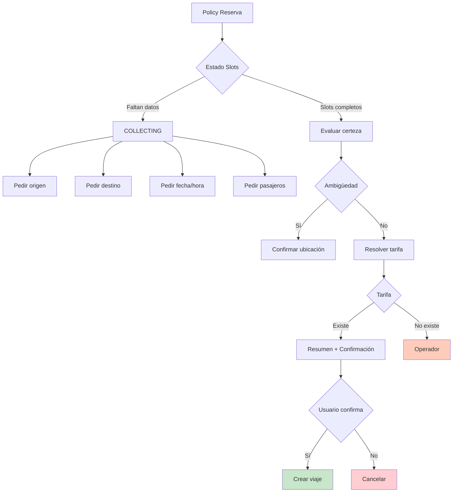

# 08 — Policy RESERVA

Flujo de reserva multi-paso con confirmación obligatoria.

## Decision Tree (Prioridad)

1. **Laterales** → EMERGENCY, RESCHEDULE, POST_SERVICE
2. **Booking acceptance** → awaiting_confirmation + affirmation
3. **Stable acknowledge** → origin + destination present, evaluar ambigüedad
4. **Confirmation with tariff** → askForConfirmation + tariff.matched
5. **Clarify during collection** → collecting_slots + clarifyField
6. **No-tariff confirmation** → awaiting_confirmation sin tariff
7. **ANSWER + tariff** → price info
8. **CLARIFY** → resolve next field
9. **EXECUTE without extraction** → gather missing data
10. **Default fallback** → safe fallback

## Output Properties

| Propiedad | Valor |
|-----------|-------|
| `outputSource` | `"POLICY"` |
| `requiresConfirmation` | `true` solo si EXECUTE |
| `requiresUserInput` | `true` si CLARIFY o EXECUTE+askForConfirmation |
| `needsGeo` | `true` si EXECUTE+askForConfirmation+tariff.matched |

## Referencia

- Policy: `src/lib/ai/policy-reserva.ts:139-271`
- Ambiguity detection: `src/lib/ai/policy-reserva.ts:18-47`
- Confirmation builder: `src/lib/ai/policy-reserva.ts:273-318`
