# 09 — Location Resolution

> **Resumen:** Resolución de ubicación: texto del usuario ? alias ? place/zone, usando la tabla unificada `aliases`.

Pipeline de resolución de ubicación: texto → entidad operativa.

## Pipeline de Resolución

```mermaid
flowchart TD
    A["Texto: 'aeropuerto'"] --> B[resolveLocation]

    B --> C[resolveAlias]
    B --> D[resolveLocationToPlaceId]

    C --> E["aliases a JOIN places p\nAccent-insensitive + Levenshtein ≤3"]
    E --> F["canonical_name, place_id, zone_id, confidence"]

    F --> G{Resuelto?}

    G -->|Sí - place_id| H[resolveTariffByPriority\nplace_place / place_zone]
    G -->|Sí - zone_id| I[resolveTariffByPriority\nzone_place / zone_zone]
    G -->|No| J["unknown → not_found → operator assisted\n(o fallback a LLM ambiguity)"]

    H --> K[TariffV2Match]
    I --> K
```

## Dos funciones de resolución

| Función | Tabla | Fuzzy | Retorna | Usado por |
|---------|-------|-------|---------|-----------|
| `resolveAlias()` | `aliases a JOIN places p` | Accent-insensitive + Levenshtein ≤ 3 | `{place_id, canonical_name, zone_id, confidence}` | Location resolver, legacy (replaced alias_lookup) |
| `resolveLocation()` | `aliases a JOIN places p` | Accent-insensitive | `{place_id, zone_id, confidence}` | Tariff resolver, pricing |

> **Nota histórica:** `alias_lookup` fue reemplazado por `aliases JOIN places`.
> Ambos sistemas ahora usan la misma tabla. No hay dos sistemas paralelos.

## Funciones complementarias

- `resolveLocationToPlaceId()` (`location-resolver.ts:61-64`) — shortcut que retorna solo place_id
- `findPlaceByName()` (`geo.ts:15-20`) — búsqueda directa en tabla `places`

## Estado de `geo-engine.ts`

`geo-engine.ts` está marcado como **DEPRECATED** (línea 2) pero aún existe y tiene
`classifyTripLeg()` usado por `trip-execution.service.ts`. Contiene:
- `SUBZONE_MAP` / `NODE_ZONE_MAP` — eliminados (superseded by places/aliases DB)
- Zone resolution — eliminada (superseded by location-resolver.ts)
- Hotel weight map — parcial, solo Z_HOTEL_ZONE genérica

## Referencias

- Alias resolver: `src/lib/db/domains/geo.ts:3-13` — `resolveAlias()`
- Location resolver: `src/lib/services/geo/location-resolver.ts:26-59` — `resolveLocation()`
- Legacy note (alias_lookup replaced): `src/lib/db/database.ts:525-528`
- findTariffByPriority: `src/lib/db/domains/trips.ts` — single query con ORDER BY
---

## Diagramas relacionados

- [10-tariff-resolution.md](10-tariff-resolution.md) — tariff-resolution
- [05-extraction-phase.md](05-extraction-phase.md) — extraction-phase
- [15-data-flow.md](15-data-flow.md) — data-flow
