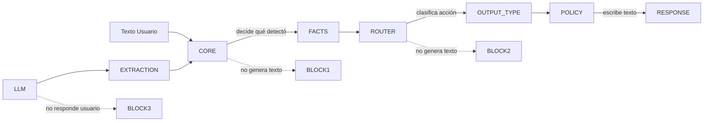
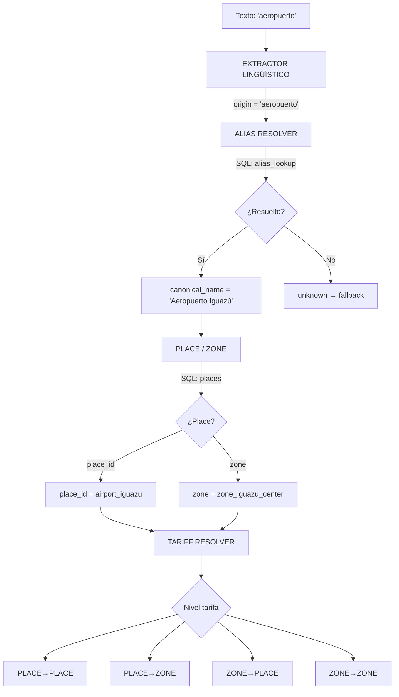

# 09 — Location Resolution

Pipeline de resolución de ubicación: texto → entidad operativa.

## Pipeline de Resolución

## Dos Sistemas Paralelos

| Sistema | Tabla | Fuzzy | Retorna | Usado por |
|---------|-------|-------|---------|-----------|
| `resolveAlias()` | `alias_lookup` | Levenshtein ≤ 3 | `canonical_name[]` | Legacy |
| `resolveLocation()` | `aliases` JOIN `places` | Accent-insensitive | `{place_id, canonical_name, zone, confidence}` | Tariff, Pricing |

## Referencia

- Alias resolver: `src/lib/db/database.ts:539-572`
- Place resolver: `src/lib/db/domains/geo.ts:3-13`
- Location resolver: `src/lib/services/geo/location-resolver.ts:26-59`
