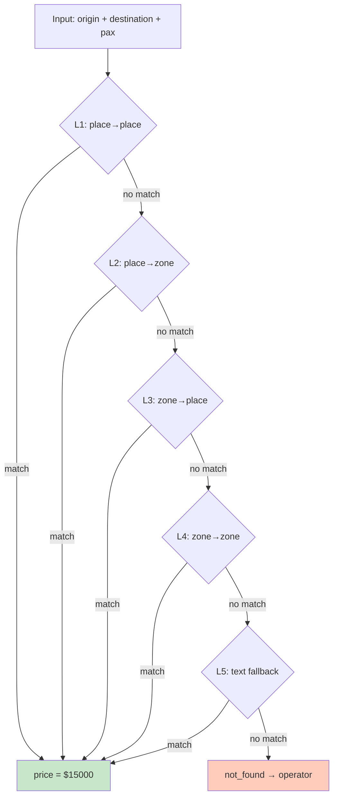

# 10 — Tariff Resolution

Cascada de 5 niveles para resolución de tarifas.

## Niveles de Resolución

| Nivel | Origen | Destino | Ejemplo |
|-------|--------|---------|---------|
| L1 | place_id | place_id | "Aeropuerto IGR" → "Hotel Amerian" |
| L2 | place_id | zone | "Aeropuerto IGR" → "centro" |
| L3 | zone | place_id | "centro" → "Hotel Amerian" |
| L4 | zone | zone | "centro" → "aeropuerto" |
| L5 | text | text | fallback sin structured data |

## Decisiones Clave

- **ZONE→ZONE SÍ cotiza** — siempre que exista tarifa registrada
- **Despacho AHORA** requiere PLACE→PLACE o PLACE→ZONE (precio exacto)
- **Reserva futura** acepta ZONE→ZONE (chofer completa después)

## Referencia

- Tariff resolver: `src/lib/services/pricing/tariff-resolver.ts`
- Pricing engine: `src/lib/services/pricing/pricing-engine.ts`
- Resolve for slots: `src/lib/services/pricing/resolve-pricing-for-slots.ts`
