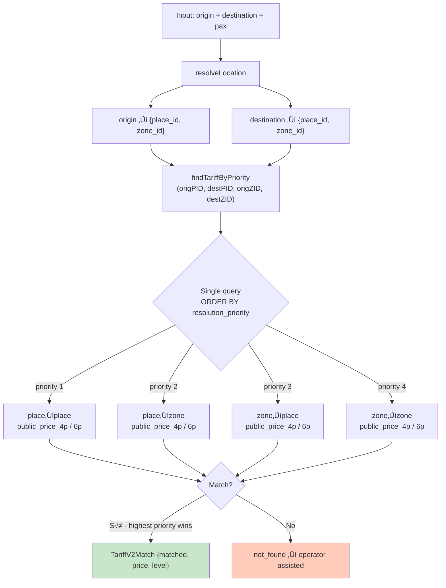

# 10 — Tariff Resolution

> **Resumen:** ResoluciÛn de tarifas en una sola query SQL ordenada por `resolution_priority`, con pricing 4p/6p.

Resolución unificada en single query con `ORDER BY resolution_priority`.
Reemplaza el enfoque secuencial L1-L4 (4 queries) por una sola consulta SQL
que eval√∫a los 4 niveles y retorna el de mayor prioridad.

## Niveles de Resolución

| Prioridad | Nivel | Origen | Destino | Ejemplo |
|-----------|-------|--------|---------|---------|
| 1 | place_place | place_id | place_id | "Aeropuerto IGR" ‚Üí "Hotel Amerian" |
| 2 | place_zone | place_id | zone_id | "Aeropuerto IGR" ‚Üí "centro" |
| 3 | zone_place | zone_id | place_id | "centro" ‚Üí "Hotel Amerian" |
| 4 | zone_zone | zone_id | zone_id | "centro" ‚Üí "aeropuerto" |

## Pricing por capacidad

| Pax | Precio p√∫blico | Precio chofer |
|-----|---------------|---------------|
| 1-4 | `public_price_4p` | `driver_price_4p` |
| 5-6 | `public_price_6p` | `driver_price_6p` |
| >6 | Capéa a 6 (Pendiente: split en 2 autos — ver FUT-06) |

## Decisiones Clave

- **ZONE→ZONE SÍ cotiza** — siempre que exista tarifa registrada
- **Reserva futura** acepta ZONE→ZONE (chofer completa después)
- **Despacho AHORA** requiere PLACE→PLACE o PLACE→ZONE (precio exacto) — verificación en `operational-readiness.ts`, no en tariff-resolver

## Referencias

- Tariff resolver (single query): `src/lib/services/pricing/tariff-resolver.ts`
  - `resolveTariff()` — línea 69, single query con `findTariffByPriority` (línea 83)
  - `buildMatch()` — línea 17, construye TariffV2Match con pricing 4p/6p
  - `notFound()` — línea 44, retorna match=false
- Pricing engine: `src/lib/services/pricing/pricing-engine.ts`
- Resolve for slots: `src/lib/services/pricing/resolve-pricing-for-slots.ts`
- Single query: `src/lib/db/domains/trips.ts` — `findTariffByPriority`
- Location resolution: `src/lib/services/geo/location-resolver.ts:26-59`
---

## Diagramas relacionados

- [09-location-resolution.md](09-location-resolution.md) ó location-resolution
- [11-operational-readiness.md](11-operational-readiness.md) ó operational-readiness
- [15-data-flow.md](15-data-flow.md) ó data-flow
