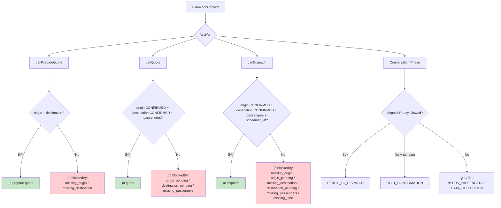

# 11 — Operational Readiness

> **Resumen:** QuÈ datos mÌnimos habilitan cada acciÛn: preparar cotizaciÛn, cotizar y despachar.

Qué datos habilitan qué acciones del sistema.

## Funciones

| Función | Requiere | Devuelve |
|---------|----------|----------|
| `canPrepareQuote` | origin + destination | `{allowed, blockedBy[]}` |
| `canQuote` | origin CONFIRMED + destination CONFIRMED + passengers | `{allowed, blockedBy[]}` |
| `canDispatch` | quote reqs + (scheduled_at si no es NOW) | `{allowed, blockedBy[]}` |

## blockedBy reasons

| Reason | Significado |
|--------|-------------|
| `no_extraction_context` | No hay extractionCtx |
| `missing_origin` | Sin origen |
| `origin_pending` | Origen no est√° CONFIRMED |
| `missing_destination` | Sin destino |
| `destination_pending` | Destino no est√° CONFIRMED |
| `missing_passengers` | Sin pasajeros |
| `missing_time` | Reserva futura sin scheduled_at |

## Nota importante

`canDispatch` **no verifica tariff**. La distinción PLACE vs ZONE se resuelve en `tariff-resolver.ts` (single query con `resolution_priority`), no en operational readiness.

## Referencias

- Operational readiness: `src/lib/ai/operational-readiness.ts`
- Field resolver: `src/lib/ai/field-resolver.ts`
- Conversation phase log: `src/lib/services/workflow/policy-pipeline.ts:301-324`
---

## Diagramas relacionados

- [16-policy-pipeline.md](16-policy-pipeline.md) ó policy-pipeline
- [10-tariff-resolution.md](10-tariff-resolution.md) ó tariff-resolution
- [12-workflow-state-machine.md](12-workflow-state-machine.md) ó workflow-state-machine
