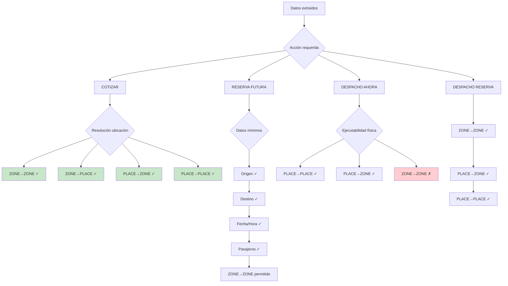

# 11 — Operational Readiness

Qué datos habilitan qué acciones del sistema.

## Tabla de Suficiencia

| Acción | Requiere | Puede aceptar | No puede aceptar |
|--------|----------|---------------|------------------|
| **Detectar intención** | Texto | Cualquier texto | Nada (siempre funciona) |
| **Responder consulta** | Intent clasificado | Cualquier intent ≠ AMBIGUOUS | Sin classification |
| **Cotizar** | origin + destination + passengers | ZONE→ZONE, PLACE→ZONE, ZONE→PLACE, PLACE→PLACE | origin o destination vacíos |
| **Crear reserva** | origin + destination + passengers + scheduled_at | ZONE→ZONE + fecha/hora | Sin fecha |
| **Confirmar reserva** | Todos + tariff + affirmation | PLACE→PLACE | Sin tariff |
| **Despacho AHORA** | origin + destination + passengers (CONFIRMED) | PLACE→PLACE, PLACE→ZONE | ZONE→ZONE |
| **Despacho RESERVA** | origin + destination + passengers + scheduled_at | ZONE→ZONE | Sin scheduled_at |

## Referencia

- Operational readiness: `src/lib/ai/operational-readiness.ts`
- Field resolver: `src/lib/ai/field-resolver.ts`
