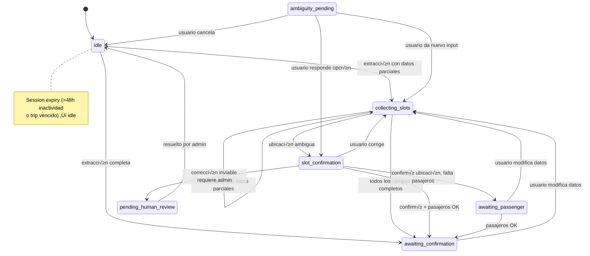

# 12 — Workflow State Machine

> **Resumen:** M·quina de estados conversacionales con 7 estados y lÛgica de expiraciÛn de sesiÛn.

M√°quina de estados conversacionales del sistema.
Define 7 estados con transiciones validades por `VALID_SLOT_TRANSITIONS`.

## Detalle de Estados

| Estado | Significado | Transiciones v√°lidas |
|--------|-------------|---------------------|
| `idle` | Sin conversación activa | → collecting_slots, awaiting_confirmation |
| `collecting_slots` | Recolectando datos del viaje | ‚Üí collecting_slots, slot_confirmation, awaiting_confirmation |
| `slot_confirmation` | Confirmando ubicación ambigua | → collecting_slots, awaiting_passenger, awaiting_confirmation, pending_human_review |
| `awaiting_passenger` | Esperando n√∫mero de pasajeros | ‚Üí collecting_slots, awaiting_confirmation |
| `awaiting_confirmation` | Todos los datos, esperando OK | ‚Üí collecting_slots |
| `pending_human_review` | Requiere intervención de admin | → idle |
| `ambiguity_pending` | Desambiguando ubicación con LLM | → slot_confirmation, idle, collecting_slots |

## Session Expiry

- **Inactividad >48h**: `checkSessionExpiry()` resetea a `idle` (`slot-workflow.ts:33-56`)
- **Trip vencido**: Si `scheduled_at` está en pasado, resetea sesión
- Ambos casos registran log y persisten el reset

## Referencias

- Type definition: `src/lib/ai/types.ts:17` — 7 estados literales
- State machine transitions: `src/lib/services/workflow/slot-workflow.ts:23-31`
- Session expiry: `src/lib/services/workflow/slot-workflow.ts:33-56`
- Evaluate transition: `src/lib/services/workflow/slot-workflow.ts:58-117`
- State accessors: `src/lib/db/state-accessors.ts`
---

## Diagramas relacionados

- [06-confidence-model.md](06-confidence-model.md) ó confidence-model
- [13-slot-confidence-evolution.md](13-slot-confidence-evolution.md) ó slot-confidence-evolution
- [16-policy-pipeline.md](16-policy-pipeline.md) ó policy-pipeline
