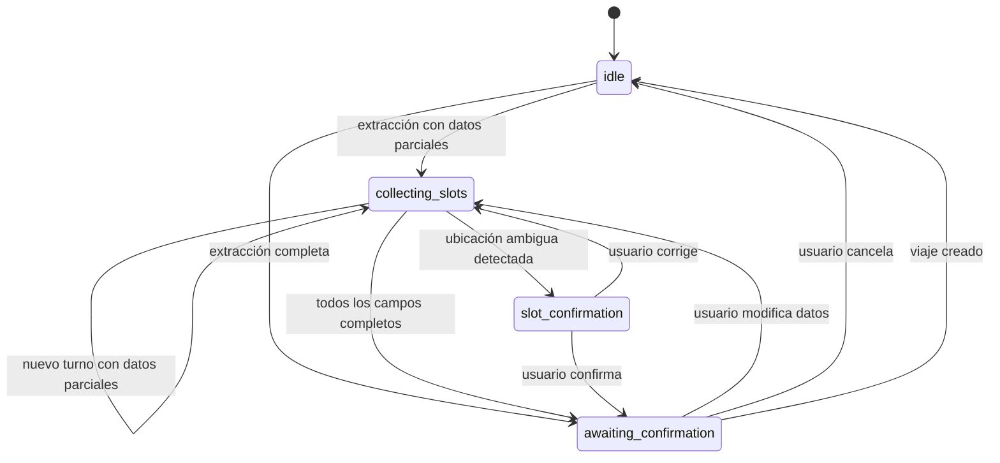

# 12 — Workflow State Machine

Máquina de estados conversacionales.



## Detalle de Estados

| Estado | Significado | Acciones permitidas |
|--------|-------------|---------------------|
| `idle` | Sin conversación activa | Recibir nuevo mensaje |
| `collecting_slots` | Recolectando datos | Pedir origin, destination, passengers, time |
| `slot_confirmation` | Confirmando ubicación ambigua | Confirmar o corregir ubicación |
| `awaiting_confirmation` | Todos los datos, esperando OK | Confirmar, modificar, o cancelar |

## Transiciones Válidas

```
idle                 → [collecting_slots, awaiting_confirmation]
collecting_slots     → [collecting_slots, slot_confirmation, awaiting_confirmation]
slot_confirmation    → [collecting_slots, awaiting_confirmation]
awaiting_confirmation → [collecting_slots]
```

## Referencia

- State machine: `src/lib/services/workflow/slot-workflow.ts:23-28`
- State accessors: `src/lib/db/state-accessors.ts`
- Evaluate transition: `src/lib/services/workflow/slot-workflow.ts:55-114`
