# 13 — Slot Confidence Evolution

> **Resumen:** Ejemplo de cómo evoluciona la certeza de los slots a lo largo de 3 turnos de conversación.

Evolución de certeza de slots entre turnos de conversación.

```mermaid
sequenceDiagram
    participant U as Usuario
    participant C as CORE
    participant E as Extraction
    participant S as slot-state.ts
    participant P as POLICY

    U->>C: estoy en aeropuerto quiero ir al centro

    C->>C: origin=aeropuerto (ambiguous)
    C->>C: destination=centro (ambiguous)
    C->>C: roleLock aplicado

    C->>E: extraer slots
    E->>S: buildSlotStates
    S-->>P: extractionContext

    P->>P: RESERVA / CLARIFY

    P-->>U: Tengo origen aeropuerto y destino centro.<br/>¿A qué hora necesitás el viaje?
```

## Evolución Típica

### Turno 1: "estoy en el aeropuerto quiero ir al centro"

| Slot | Value | Score | Status | Source | Reason |
|------|-------|-------|--------|--------|--------|
| origin | "aeropuerto" | 0.6 | CONFIRMATION_PENDING | SYSTEM_INFERRED | ambiguous_term |
| destination | "centro" | 0.6 | CONFIRMATION_PENDING | SYSTEM_INFERRED | ambiguous_term |
| passengers | null | 0.0 | — | — | missing |
| **overallConfidence** | **0.4** | | | | → action: clarify |

### Turno 2: "4 personas, a las 10"

| Slot | Value | Score | Status | Source | Reason |
|------|-------|-------|--------|--------|--------|
| origin | "aeropuerto" | 0.6 | CONFIRMATION_PENDING | SYSTEM_INFERRED | (preservado) |
| destination | "centro" | 0.6 | CONFIRMATION_PENDING | SYSTEM_INFERRED | (preservado) |
| passengers | 4 | 1.0 | CONFIRMED | SYSTEM_INFERRED | direct_extraction |
| scheduled_at | "10:00" | 0.8 | INFERRED | SYSTEM_INFERRED | time_parsed |
| **overallConfidence** | **0.75** | | | | → action: proceed |

### Turno 3: "sí, correcto" (confirma ubicaciones)

| Slot | Value | Score | Status | Source | Reason |
|------|-------|-------|--------|--------|--------|
| origin | "aeropuerto" | 1.0 | CONFIRMED | USER_CONFIRMED | affirmation |
| destination | "centro" | 1.0 | CONFIRMED | USER_CONFIRMED | affirmation |
| passengers | 4 | 1.0 | CONFIRMED | SYSTEM_INFERRED | (preservado) |
| scheduled_at | "10:00" | 0.8 | INFERRED | SYSTEM_INFERRED | (preservado) |
| **overallConfidence** | **1.0** | | | | → proceed → cotización |

## Reasons adicionales

| Reason | Score | Significado |
|--------|-------|-------------|
| `exact_alias_match` | 1.0 | Alias exacto en DB |
| `fuzzy_alias_match` | 0.6 | Alias aproximado |
| `ambiguous_term` | 0.6 | Término genérico (centro, hotel, aeropuerto) |
| `unknown_location` | 0.0 | No resolvió alias |
| `direct_extraction` | 1.0 | Valor explícito (pax, vuelo) |

## Carry-over de slots

`buildSlotStates` mantiene slots previos que no fueron re-extraídos en el turno actual (`slot-state.ts:76-80`).

## Referencias

- Confidence scoring: `src/lib/services/extraction/confidence.ts`
- Slot states: `src/lib/ai/slot-state.ts`
- Thresholds: `src/config/constants.ts:44-45`
---

## Diagramas relacionados

- [06-confidence-model.md](06-confidence-model.md) — confidence-model
- [05-extraction-phase.md](05-extraction-phase.md) — extraction-phase
- [12-workflow-state-machine.md](12-workflow-state-machine.md) — workflow-state-machine
