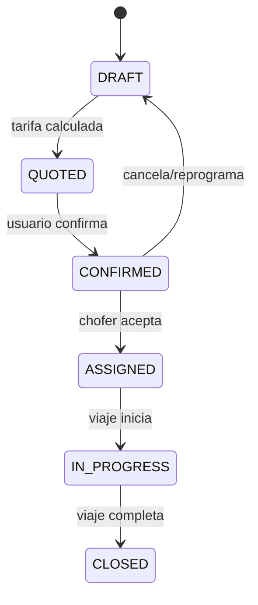

# 14 — Dispatch Flow

> **Resumen:** Flujo de asignaciÛn de choferes: 4 niveles de escalamiento, broadcast y cron jobs post-viaje.


Flujo de ejecución de viaje y asignación a chofer.

```mermaid
flowchart TD

    A[Trip Created] --> B{Modo}

    B -->|AHORA| C[advanceToWaitingDriver]
    B -->|RESERVA| D[advanceToNivel1]

    D --> E[Principal driver]
    E -->|No responde| F[advanceToNivel2]
    F --> G[Principal2 driver]
    G -->|No responde| H[advanceToNivel3]
    H --> I[broadcastTripToDrivers]

    C --> I

    I --> J[Fleet Validation]
    J --> K{¬øHay choferes?}

    K -->|Sí| L[Broadcast a choferes filtrados]
    K -->|No| M[notifyAdmin: sin chofer]

    L --> N{¬øAlguien acepta?}
    N -->|Sí| O[assignWorkflowAtomic]
    O --> P[Trip ASSIGNED]
    N -->|Timeout| Q[executeEscalation]

    Q --> R{nivel_3 / waiting_driver}
    R -->|nivel_3 expirado| S[notifyAdmin + closeWorkflow]
    R -->|waiting_driver + >4 pax| T[Contingencia 2 autos]
    R -->|waiting_driver simple| U[notifyAdmin + closeWorkflow]

    P --> V[Trip IN_PROGRESS]
    V --> W[Driver: "llegué" / "en viaje" / "realizado"]
    W --> X[Trip CLOSED]

    style P fill:#c8e6c9
    style X fill:#c8e6c9
    style M fill:#ffcdd2
    style S fill:#ffcdd2
    style U fill:#ffcdd2
```

## Estados del Viaje



## Niveles de dispatch (scheduled trips)

| Nivel | Destinatario | Timeout |
|-------|-------------|---------|
| `nivel_1` | Principal driver | `TIMEOUT_NIVEL_1_MS` |
| `nivel_2` | Principal2 driver | `TIMEOUT_NIVEL_2_MS` |
| `nivel_3` | Broadcast general | `TIMEOUT_NIVEL_3_MS` |

## Nivel AHORA

| Estado | Acción |
|--------|--------|
| `waiting_driver` | Broadcast inmediato a todos los choferes disponibles |

## Cron jobs (checkTimeouts)

| Job | Descripción | Trigger |
|-----|-------------|---------|
| `sendPendingSurveys` | Encuestas post-viaje | Cada corrida |
| `checkReconfirmacion24hs` | Pide confirmación al chofer 24h antes | Viaje en ventana 24h |
| `checkMensajeFelicidad12hs` | Mensaje al cliente 12h antes | Viaje en ventana 12h |
| `checkCierreChofer` | Cierra viaje y pide confirmación comisión 2h post | Viaje pendiente close |
| `checkDiscrepanciaComision` | Notifica admin si chofer no declaró comisión 24h post | Viaje con comisión pendiente |
| `checkDolarApiNotification` | Cotizaciones diarias ARS/BRL | Una vez al día |
| `checkSessionCleanup` | Archiva trips expirados, cierra workflows huérfanos | Una vez al día |

## Referencias

- Dispatch service: `src/lib/services/dispatch/dispatch.service.ts`
- Dispatch workflow: `src/lib/services/dispatch/dispatch-workflow.ts`
- Fleet validation: `src/lib/services/dispatch/fleet-validation.ts`
- Trip execution: `src/lib/services/trip-execution/trip-execution.service.ts`
- Now execution: `src/lib/services/trip-execution/now-execution.service.ts`
- Timeouts: `src/lib/timeouts.ts`
- Cron: `src/app/api/cron/check-timeouts/route.ts`
---

## Diagramas relacionados

- [01-system-overview.md](01-system-overview.md) ó system-overview
- [11-operational-readiness.md](11-operational-readiness.md) ó operational-readiness
- [02-webhook-entry.md](02-webhook-entry.md) ó webhook-entry
