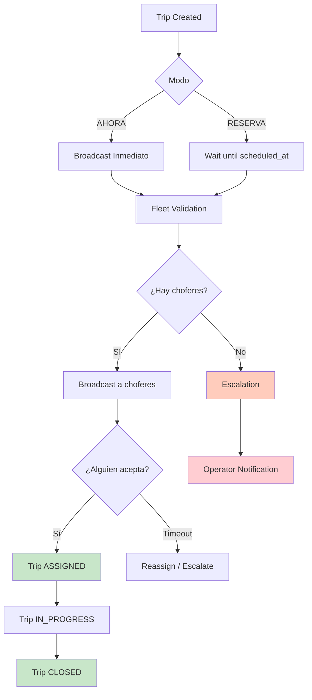
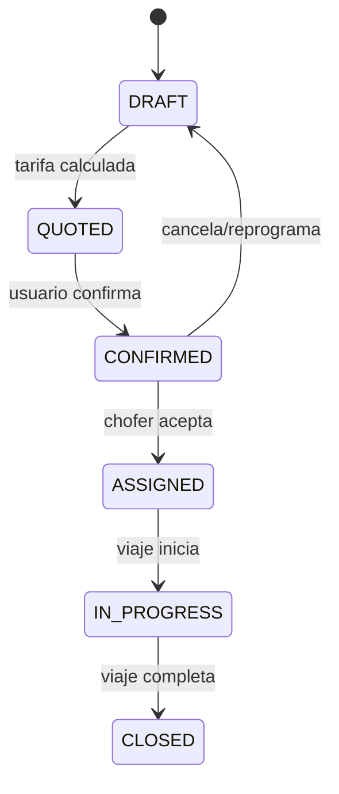

# 14 — Dispatch Flow

Flujo de ejecución de viaje y asignación a chofer.

## Estados del Viaje

## Referencia

- Dispatch service: `src/lib/services/dispatch/dispatch.service.ts`
- Fleet validation: `src/lib/services/dispatch/fleet-validation.ts`
- Trip execution: `src/lib/services/trip-execution/trip-execution.service.ts`
