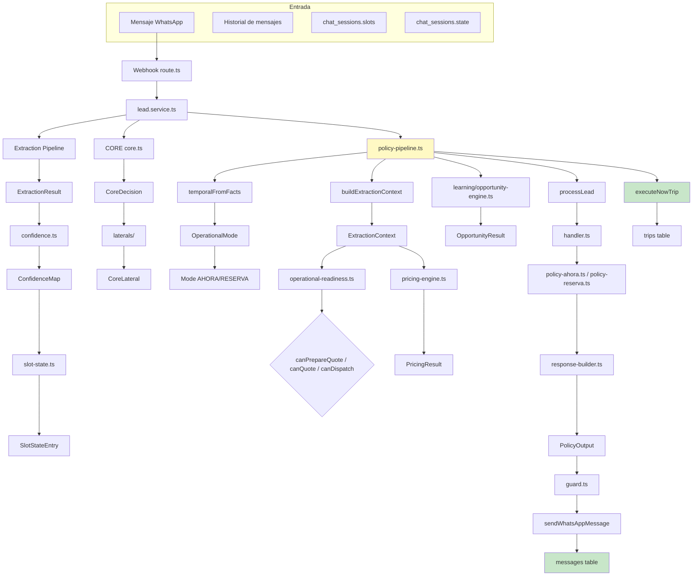
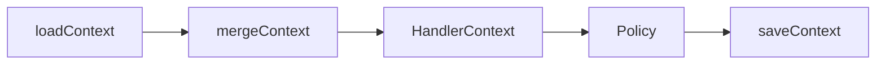

# 15 — Data Flow

> **Resumen:** Flujo completo de datos entre extracción, CORE, policy pipeline, pricing, dispatch y salida.

Flujo completo de datos a través del sistema.

## Datos por Fase

| Fase | Input | Output | Almacena en |
|------|-------|--------|-------------|
| CORE | Texto | CoreDecision | memory (transient) |
| EXTRACTION | Texto + History | ExtractionResult | chat_sessions.slots |
| CONFIDENCE | Slots | ConfidenceMap | chat_sessions.confidence |
| SLOT STATE | ConfidenceMap + prev states | SlotStateEntry[] | chat_sessions.slots |
| POLICY PIPELINE | CoreDecision + ExtractionContext + Pricing | PolicyOutput | — (orquesta) |
| POLICY | HandlerContext | PolicyOutput | — (stateless) |
| DISPATCH | Trip + Fleet | Assignment | trips |
| OUTPUT | PolicyOutput | WhatsApp message | messages |
| LEARNING | Pricing + context | Opportunities | learning tables |

## Flujo de contexto

## Referencias

- Context builder: `src/lib/services/workflow/build-extraction-context.ts`
- Context memory: `src/lib/services/memory/context-memory.ts`
- Policy pipeline: `src/lib/services/workflow/policy-pipeline.ts`
- Types: `src/lib/ai/types.ts`
---

## Diagramas relacionados

- [01-system-overview.md](01-system-overview.md) — system-overview
- [16-policy-pipeline.md](16-policy-pipeline.md) — policy-pipeline
- [09-location-resolution.md](09-location-resolution.md) — location-resolution
