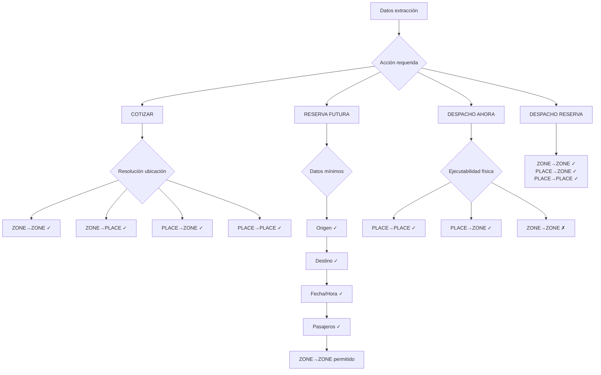
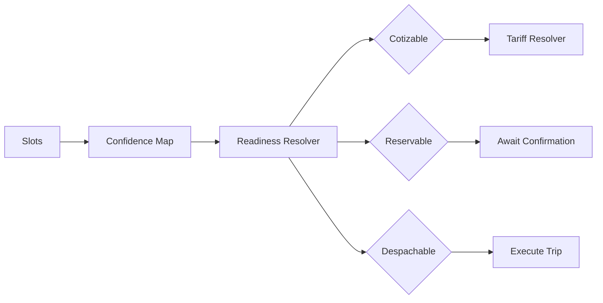

# 15 — Data Flow

Flujo completo de datos a través del sistema.

## Flujo de Datos por Fase

## Datos por Fase

| Fase | Input | Output | Almacena en |
|------|-------|--------|-------------|
| CORE | Texto | CoreDecision | memory |
| EXTRACTION | Texto + History | ExtractionResult | chat_sessions.slots |
| CONFIDENCE | Slots | ConfidenceMap | chat_sessions.confidence |
| POLICY | ExtractionContext | PolicyOutput | — (stateless) |
| DISPATCH | Trip + Fleet | Assignment | trips |
| OUTPUT | PolicyOutput | WhatsApp message | messages |

## Referencia

- Context builder: `src/lib/services/workflow/build-extraction-context.ts`
- Types: `src/lib/ai/types.ts`
- Memory: `src/lib/services/memory/context-memory.ts`
