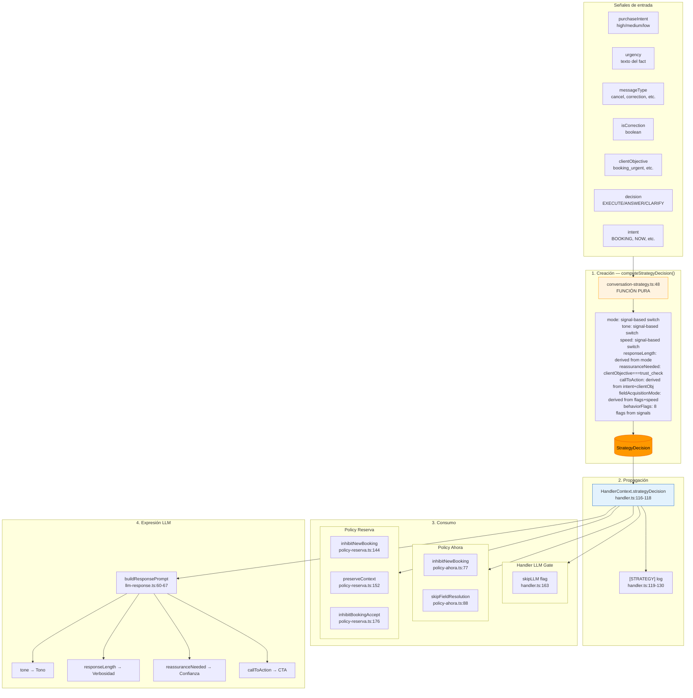

# 17 — StrategyDecision Flow

> **Ciclo de vida completo de StrategyDecision: creación, propagación, consumo y expresión en LLM.**

---

## Diagrama de flujo

---

## Detalle de consumo

| # | Consumer | Archivo | Línea | Campo | Efecto |
|---|----------|---------|-------|-------|--------|
| 1 | Handler LLM Gate | `handler.ts` | 163 | `behaviorFlags.skipLLM` | Salta generación LLM si purchaseIntent=low |
| 2 | Policy Ahora | `policy-ahora.ts` | 77 | `behaviorFlags.inhibitNewBooking` | Cancel: respuesta de cancelación |
| 3 | Policy Ahora | `policy-ahora.ts` | 88 | `behaviorFlags.skipFieldResolution` | booking_urgent: dispatch directo |
| 4 | Policy Reserva | `policy-reserva.ts` | 144 | `behaviorFlags.inhibitNewBooking` | Cancel: respuesta de cancelación |
| 5 | Policy Reserva | `policy-reserva.ts` | 152 | `behaviorFlags.preserveContext` | Corrección: no reiniciar flujo |
| 6 | Policy Reserva | `policy-reserva.ts` | 176 | `behaviorFlags.inhibitBookingAccept` | inquiry_price: no cerrar booking |
| 7 | LLM Prompt | `llm-response.ts` | 61-67 | `tone`, `responseLength`, `reassuranceNeeded`, `callToAction` | Inyectados como contexto estratégico en prompt |

---

## Invariantes

1. **StrategyDecision se crea ANTES de enrichedCtx** (handler.ts:106 antes de 116)
2. **Todos los consumos usan `?.` para runtime safety** (R5)
3. **No existen `??` fallbacks desde señales originales** (R5)
4. **StrategyDecision es el ÚNICO punto de decisión estratégica** (ADR-008)
5. **Las policies ya NO reinterpretan señales originales** (R5)

---

*Diagrama: 17-strategy-decision-flow*
*Last updated: 2026-07-10*
