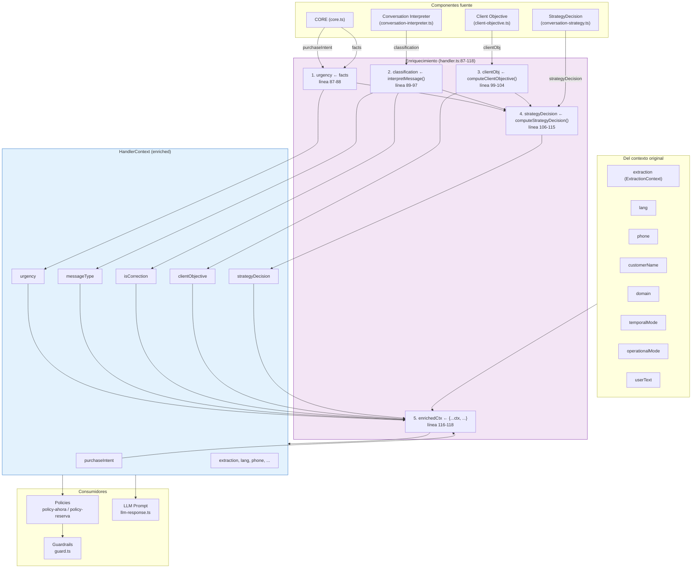

# 18 — HandlerContext Flow

> **Enriquecimiento y propagación del contexto conversacional desde CORE hasta LLM.**

---

## Diagrama de flujo

---

## Orden de enriquecimiento

| Paso | Línea | Acción | Depende de |
|------|-------|--------|------------|
| 1 | 87-88 | Extraer `urgency` de `decision.core.facts` | CORE completado |
| 2 | 89-97 | Clasificar mensaje via `interpretMessage()` | CORE (intent, facts) |
| 3 | 99-104 | Computar `clientObjective` via `computeClientObjective()` | CORE (facts, purchaseIntent) + CI (messageType) |
| 4 | 106-115 | Computar `strategyDecision` via `computeStrategyDecision()` | CORE + CI + CO |
| 5 | 116-118 | Construir `enrichedCtx` con spread de ctx + nuevas señales | Pasos 1-4 completados |

**Regla crítica**: StrategyDecision se computa antes de construir enrichedCtx (paso 4 antes de paso 5).

---

## Campos y consumidores

| Campo | Consumidor principal | Uso |
|-------|---------------------|-----|
| `strategyDecision.behaviorFlags.*` | Policies | Decisiones de comportamiento |
| `strategyDecision.tone` | LLM Prompt | Tono de respuesta |
| `strategyDecision.responseLength` | LLM Prompt | Verbosidad |
| `strategyDecision.reassuranceNeeded` | LLM Prompt | Flag de confianza |
| `strategyDecision.callToAction` | LLM Prompt | Intensidad de CTA |
| `clientObjective` | LLM Prompt | Reglas de objetivo (CLIENT_OBJ_RULES) |
| `extraction` | Policies | Slots, tariff, estado |
| `lang` | Policies, LLM | Idioma de respuesta |
| `customerName` | Policies, LLM | Personalización |

---

*Diagrama: 18-handler-context-flow*
*Last updated: 2026-07-10*
