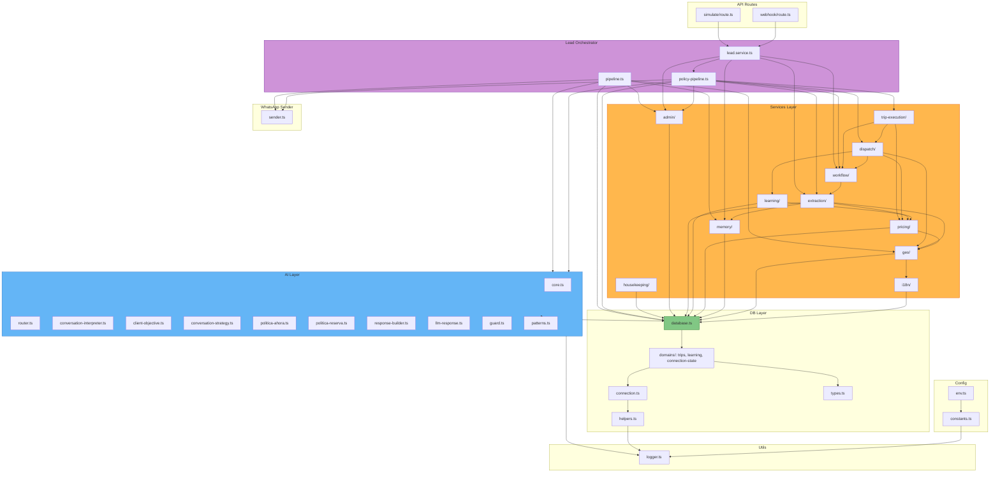

# 19 — Module Dependency Map

> **Dependencias reales entre módulos del sistema, derivadas del código fuente.**

---

## Diagrama de dependencias



---

## Orden de dependencia (estricto)

```
Config → Utils
   ↓
DB Facade
   ↓
AI Layer (CORE, Router, CI, CO, SD, Policies, LLM)
   ↓
Services Layer:
  i18n → Geo → Memory → Pricing → Learning → Extraction → Workflow
  → Dispatch → Trip-execution → Admin → Housekeeping
   ↓
Lead Orchestrator (lead.service → policy-pipeline → pipeline.ts)
   ↓
API Routes / Sender
```

### Reglas de dependencia (ADR-001, ADR-004)

1. **AI no importa de Services** — ni siquiera type-only imports (gap conocido: `response-builder.ts` importa `OpportunityResult`)
2. **Services importan DB solo a través de la facade** (`database.ts`)
3. **No hay dependencias circulares** — verificable con `ael/contracts/enforce.sh`
4. **Cada capa solo importa de capas inferiores**

---

*Diagrama: 19-module-dependency-map*
*Last updated: 2026-07-10*
