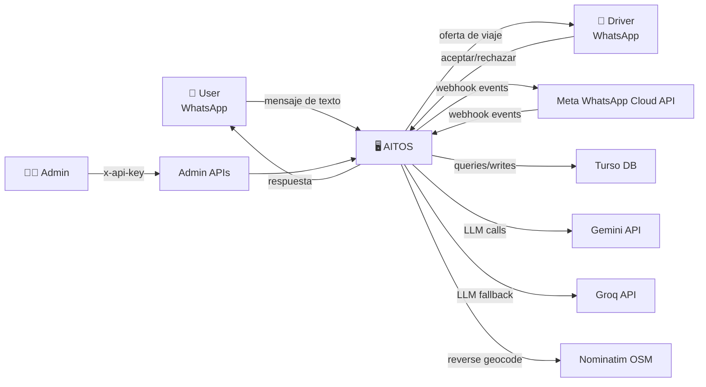
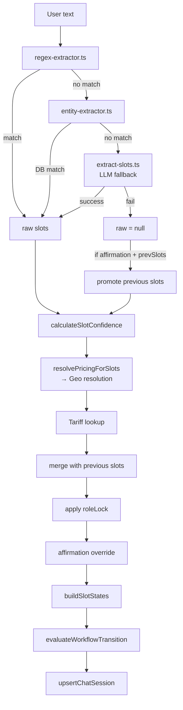
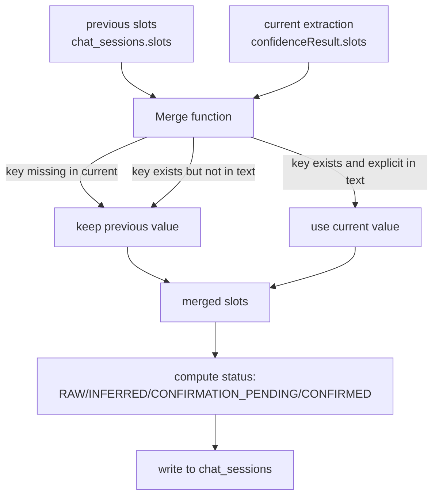

# Data Flow Diagrams — AITOS

> DFD levels 0-3 derived from the actual runtime flow.
> Source: `src/app/api/whatsapp/webhook/route.ts`, `src/lib/services/lead.service.ts`, `src/lib/services/extraction/extraction-runner.ts`, `src/lib/services/workflow/policy-pipeline.ts`.

---

## Level 0 — Context Diagram



---

## Level 1 — System Decomposition

```mermaid
flowchart LR
    User -->|1. message| Webhook["WhatsApp Webhook"]
    Webhook -->|2. normalized (phone,text)| Lead["Lead Orchestrator"]
    Lead -->|3a. classify| CORE["CORE Engine"]
    Lead -->|3b. load context| Memory["Memory Engine"]
    Lead -->|3c. extract slots| Extraction["Extraction Engine"]
    Extraction -->|resolve places| Geo["Geo Engine"]
    Extraction -->|resolve price| Pricing["Pricing Engine"]
    Extraction -->|update state| Workflow["Workflow Engine"]
    Lead -->|4. decide| Policy["Policy Engine"]
    Policy -->|5a. create trip| Trip["Trip Execution"]
    Trip -->|6. assign| Dispatch["Dispatch Engine"]
    Policy -->|5b. render| Output["Output Engine"]
    Output -->|7. send| Sender["WhatsApp Sender"]
    Sender --> User
    Dispatch -->|offer| Driver
    Driver -->|response| Webhook
    Policy -->|events| Learning["Learning Engine"]
    Learning -->|opportunities| Policy
    Lead -->|read/write| DB[("Turso DB")]
    Extraction -.->|fallback| LLM["LLM Layer"]
    Output -.->|refine| LLM
```

---

## Level 2 — Extraction Flow



---

## Level 3 — Slot Merge Detail



---

*Last updated: 2026-07-06*
