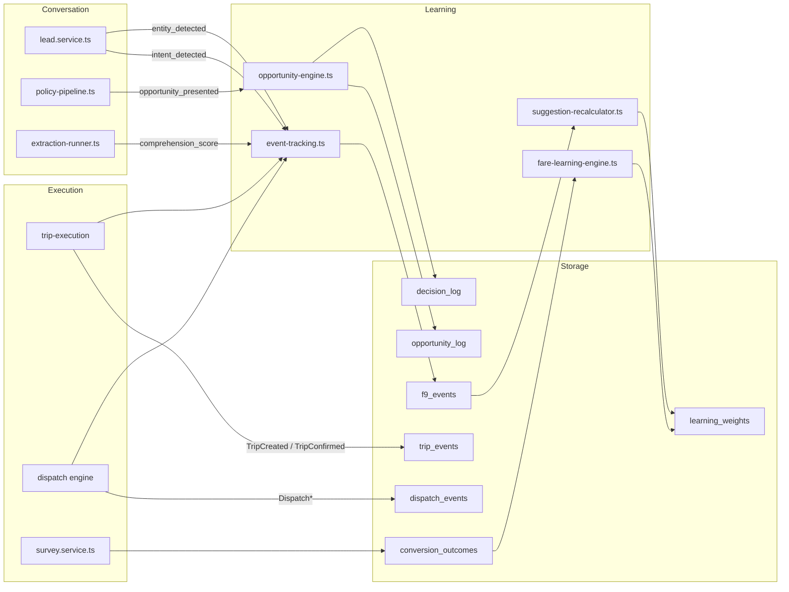
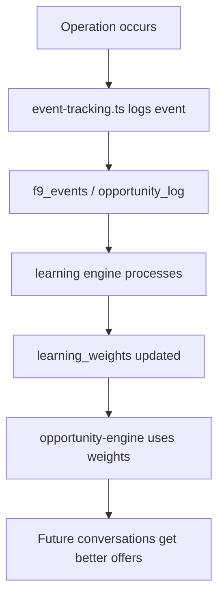

# Event Flow — AITOS

> How operational events flow through the system for learning and auditing.
> Source: `src/lib/services/learning/event-tracking.ts`, `src/lib/services/dispatch/dispatch.service.ts`, `src/lib/services/trip-execution/trip-execution.service.ts`.

---

## Event producers

| Producer | Events produced | Tables written |
|----------|----------------|----------------|
| `lead.service.ts` | `intent_detected`, `entity_detected` | `f9_events`, `conversation_events` |
| `extraction-runner.ts` | extraction success/failure | `conversation_f4_log` |
| `policy-pipeline.ts` | opportunity presented | `opportunity_log` |
| `trip-execution.service.ts` | `TripCreated`, `TripConfirmed` | `trip_events` |
| `dispatch.service.ts` | `DispatchInitiated`, `DispatchOffered`, `DispatchAccepted`, `DispatchAbandoned` | `dispatch_events` |
| `survey.service.ts` | survey responses | `conversion_outcomes` |
| `admin-commands.ts` | admin actions | `f9_admin_commands` |

---

## Event flow diagram

---

## Learning feedback loop

---

*Last updated: 2026-07-06*
