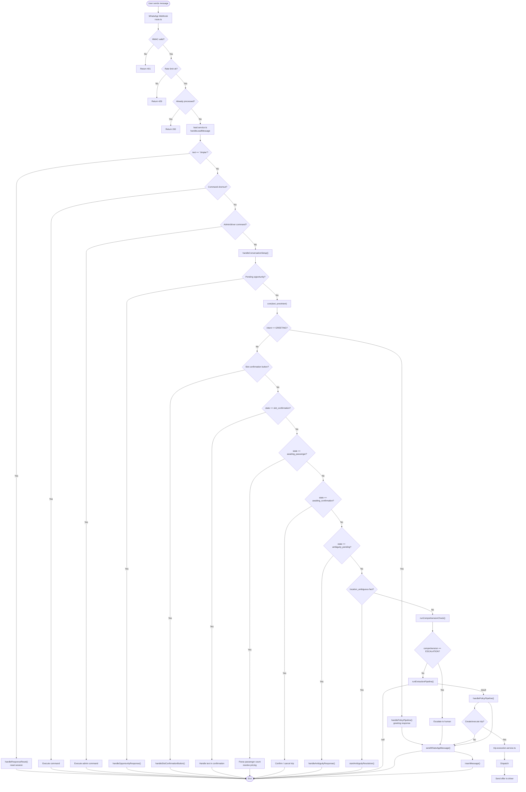
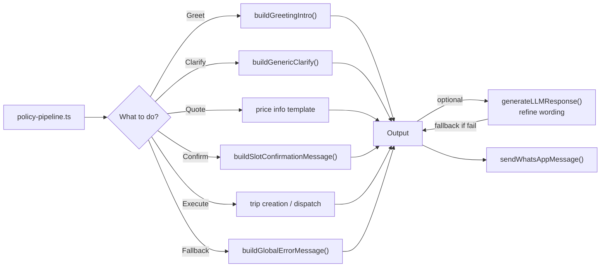

# Runtime Flow — AITOS

> End-to-end runtime flow from message arrival to response.
> Source: `src/lib/services/lead.service.ts`.

---

## Main runtime flow

---

## Response generation flow

---

*Last updated: 2026-07-06*
