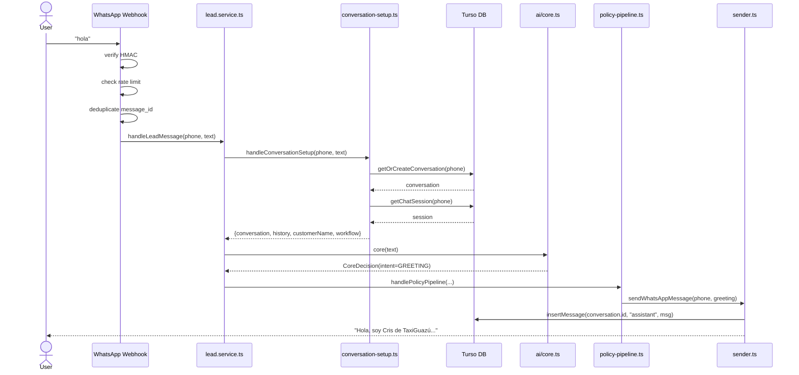
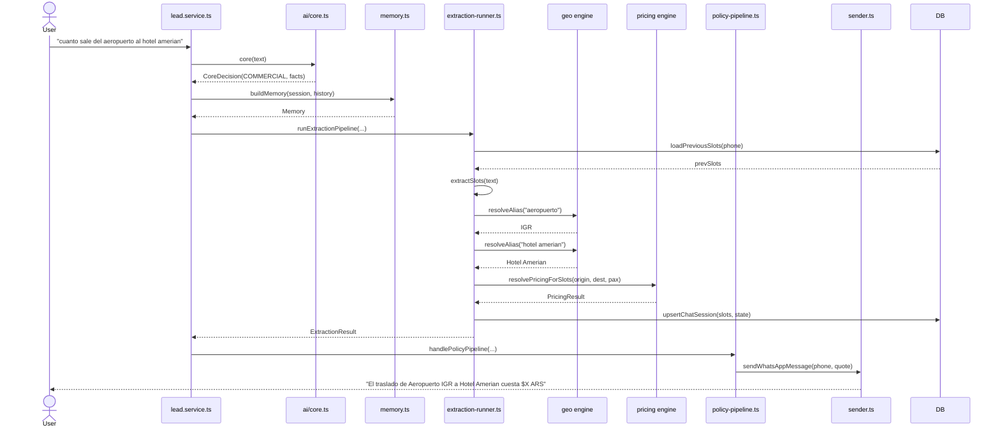
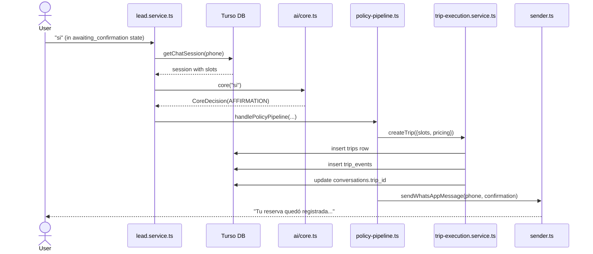
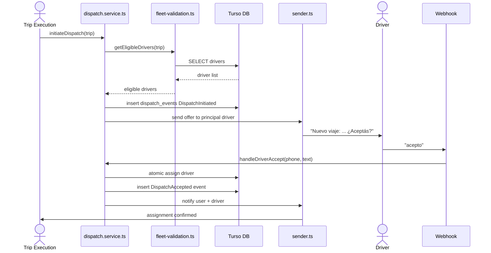
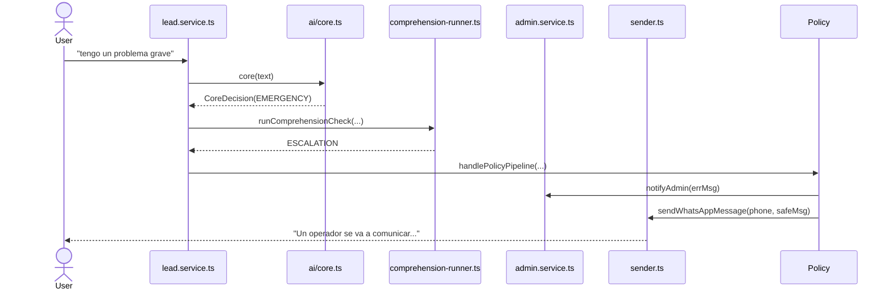
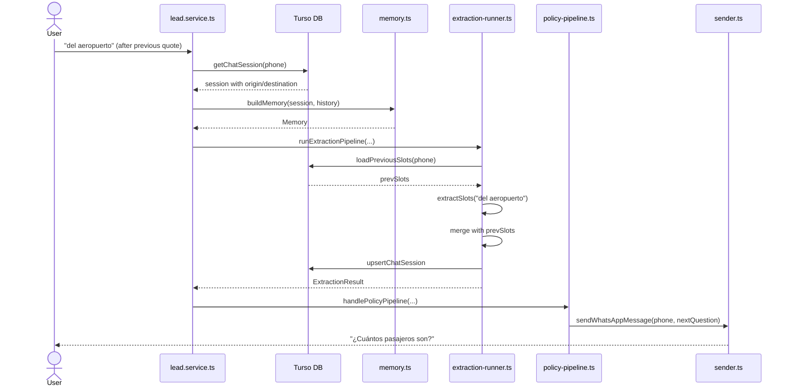
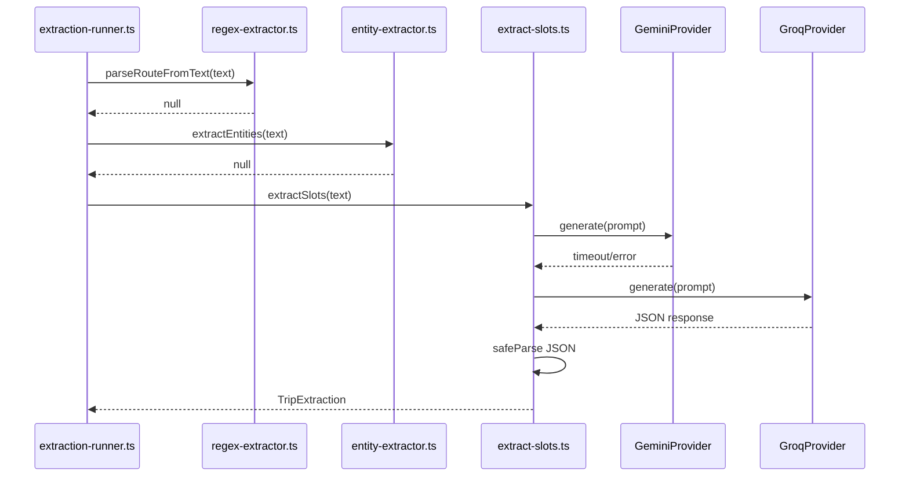

# Sequence Diagrams — AITOS

> Sequence diagrams for key scenarios, derived from the actual call flow.
> Source: `src/app/api/whatsapp/webhook/route.ts`, `src/lib/services/lead.service.ts`, `src/lib/services/extraction/extraction-runner.ts`, `src/lib/services/workflow/policy-pipeline.ts`.

---

## 1. New Conversation

---

## 2. Quote Request

---

## 3. Reservation Confirmation

---

## 4. Driver Assignment

---

## 5. Human Escalation

---

## 6. Context Resumption

---

## 7. LLM Usage (Triple Fallback)

---

*Last updated: 2026-07-06*
