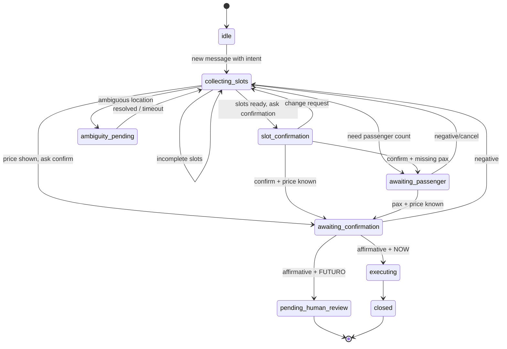
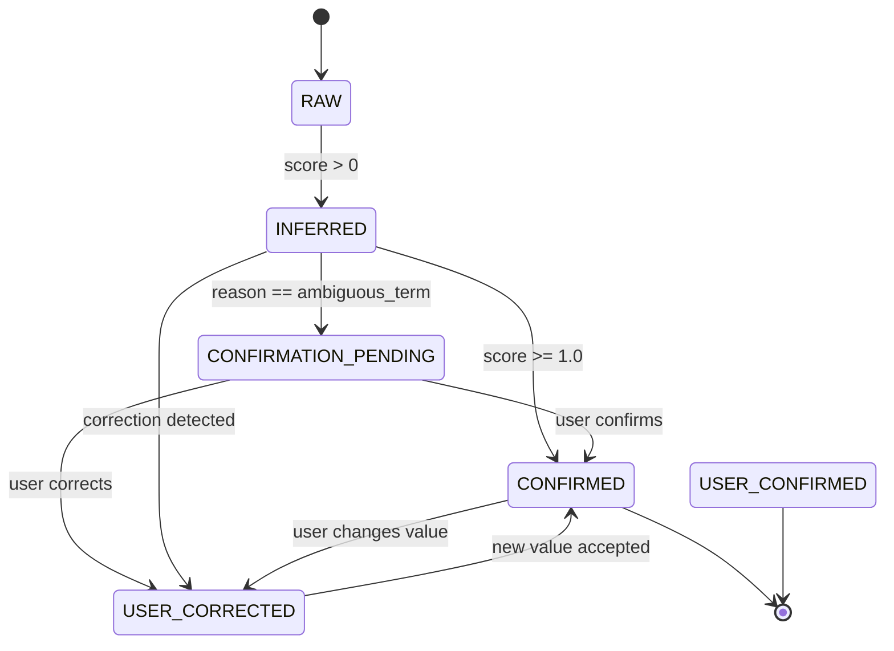
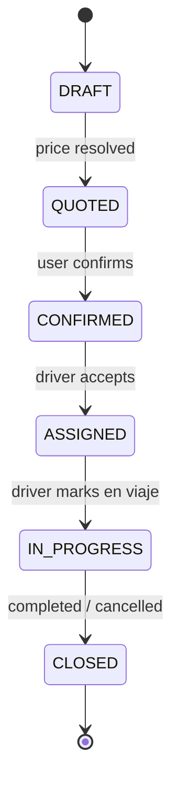
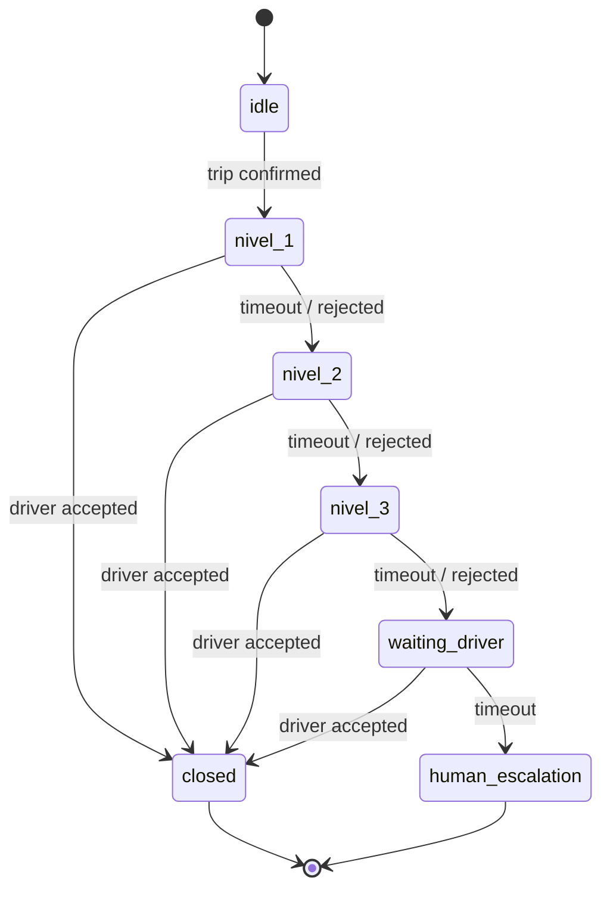
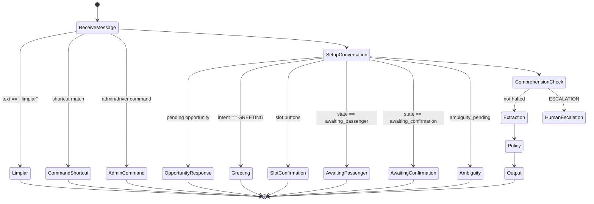

# State Machines — AITOS

> State machines derived from the actual code.
> Sources: `src/lib/services/workflow/slot-workflow.ts`, `src/lib/db/types.ts`, `src/lib/services/dispatch/dispatch-workflow.ts`.

---

## 1. Conversational State Machine

Source: `src/lib/services/workflow/slot-workflow.ts`, `src/lib/db/state-accessors.ts`

---

## 2. Slot Status Lifecycle

Source: `src/lib/ai/slot-state.ts`

---

## 3. Trip Lifecycle

Source: `src/lib/db/types.ts`, `src/lib/services/trip-execution/trip-execution.service.ts`

---

## 4. Dispatch State Machine

Source: `src/lib/services/dispatch/dispatch-workflow.ts`, `src/lib/services/dispatch/dispatch.service.ts`

---

## 5. Lead Message Handler Flow

Source: `src/lib/services/lead.service.ts`

---

*Last updated: 2026-07-06*
