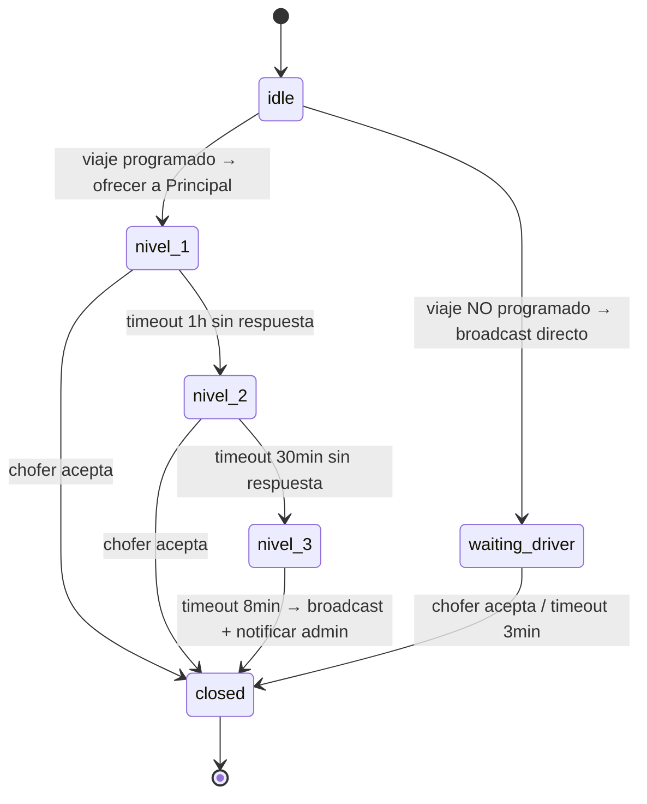

# Dominio Dispatch — Modelo de Dominio

> Derivado de: `src/lib/services/dispatch/dispatch.service.ts`, `dispatch-workflow.ts`, `driver.service.ts`, `fleet-validation.ts`, `src/lib/db/state-accessors.ts`
> Fecha: 2026-07-04 · AIT-011

---

## 1. Propósito

Asignar un viaje a un chofer mediante un sistema de escalamiento multi-nivel con timeouts. Si ningún chofer acepta, se escala a broadcast. Si nadie toma el viaje, se notifica al administrador.

---

## 2. State Machine



### 2.1 Transiciones válidas

```typescript
const VALID_TRANSITIONS: Record<DispatchState, DispatchState[]> = {
  idle:             ["nivel_1", "waiting_driver", "closed"],
  nivel_1:          ["nivel_2", "closed"],
  nivel_2:          ["nivel_3", "closed"],
  nivel_3:          ["closed"],
  waiting_driver:   ["closed"],
  closed:           [],  // terminal
};
```

### 2.2 Estados (DispatchState)

| Estado | Significado | Timeout | Siguiente |
|--------|-------------|---------|-----------|
| `idle` | Sin dispatch activo | — | nivel_1 o waiting_driver |
| `nivel_1` | Ofrecido al chofer principal | 1 hora | nivel_2 o closed |
| `nivel_2` | Ofrecido al principal 2 | 30 min | nivel_3 o closed |
| `nivel_3` | Broadcast a todos los choferes | 8 min | closed |
| `waiting_driver` | Viaje no programado, broadcast directo | 3 min | closed |
| `closed` | Dispatch cerrado (aceptado, timeout, o cancelado) | — | — (terminal) |

---

## 3. Niveles de Escalamiento

### 3.1 Nivel 1 — Principal (1 hora)

| Aspecto | Detalle |
|---------|---------|
| Destinatario | Chofer marcado como `is_principal = 1` |
| Mensaje | "⭐ *NIVEL 1 — RESERVA*" con detalles del viaje |
| Condición | Principal activo + conversación reciente (24h expiry) |
| Timeout | `TIMEOUT_NIVEL_1_MS` = 3,600,000ms (1 hora) |
| Escalación | Si no responde → nivel 2 |

### 3.2 Nivel 2 — Principal 2 (30 min)

| Aspecto | Detalle |
|---------|---------|
| Destinatario | Chofer `PRINCIPAL_2_PHONE` (env var) |
| Condición | Principal 2 activo |
| Timeout | `TIMEOUT_NIVEL_2_MS` = 1,800,000ms (30 min) |
| Escalación | Si no responde → nivel 3 |

### 3.3 Nivel 3 — Broadcast (8 min)

| Aspecto | Detalle |
|---------|---------|
| Destinatario | Todos los choferes activos que cumplan filtros |
| Timeout | `TIMEOUT_NIVEL_3_MS` = 480,000ms (8 min) |
| Escalación | Si nadie acepta → notificar admin + cerrar |

### 3.4 Waiting Driver — No programado (3 min)

| Aspecto | Detalle |
|---------|---------|
| Destinatario | Broadcast directo a todos los choferes activos |
| Timeout | `TIMEOUT_WAITING_DRIVER_MS` = 180,000ms (3 min) |
| Escalación | Si nadie acepta → notificar admin + cerrar |

---

## 4. Broadcast — Filtros de Elegibilidad

`broadcastTripToDrivers()` envía oferta a todos los choferes activos que cumplan:

| Filtro | Cómo se aplica |
|--------|---------------|
| **Capacidad** | `car_capacity >= passengers` |
| **Tier** | Premium → Normal → Low (orden de envío) |
| **Min payout** | `driver_price >= min_payout * LOW_PISO_FACTOR` (80% del mínimo del chofer) |
| **Shift** | Si el viaje tiene horario, filtrar por turno (day/night) |
| **País** | `detectCountry()` del lugar de origen |
| **Paquete** | Si el chofer tiene `package_type` ("in_out", "three_leg"), usar precio del paquete |
| **Expiración** | Choferes sin actividad en 24h se excluyen |

---

## 5. Driver Service — Manejo de Respuestas

| Acción del Chofer | Trigger en WhatsApp | Handler |
|-------------------|--------------------|---------|
| Aceptar viaje | "acepto", "yo estoy", "yo voy", "lo tomo" | `handleDriverAccept()` |
| Aceptar vía botón | Botón `aceptar_N` | `handleDriverButtonAccept()` |
| Llegó al punto | "llegué" | `handleDriverArrived()` |
| En viaje | Botón `enviaje_N` | `handleDriverEnViaje()` |
| Completado | Botón `realizado_N` | `handleDriverCompleted()` |
| Rechazar | Botón `rechazar_N` | Log + ignorar |
| Tomar lead | Botón `tomar_lead_N` | `handleDriverTakeLead()` |
| Reconfirmar OK | Botón `reconfirm_ok_N` | `handleDriverReconfirmOk()` |
| Reconfirmar NO | Botón `reconfirm_no_N` | `handleDriverReconfirmNo()` → reasignar |
| Comisión OK | Botón `comision_ok_N` | `handleComisionOk()` |
| Comisión revisión | Botón `comision_revision_N` | `handleComisionRevision()` |
| Contingencia SÍ | Botón `contingencia_si_N` | `handleContingenciaSi()` |
| Contingencia NO | Botón `contingencia_no_N` | `handleContingenciaNo()` |

---

## 6. Fleet Validation

`ensureFleetCanHandle(pax, context)` verifica que la flota pueda manejar el viaje:

| Condición | Acción |
|-----------|--------|
| `maxCapacity >= pax` | ✅ Permitir |
| `maxCapacity < pax` | ❌ Bloquear, notificar admin |
| Sin choferes activos | ❌ Bloquear |

---

## 7. Comisiones y Payout

Al asignar un chofer (`assignDriverToTrip()`):

1. **Precio base:** `public_price_4p` o `public_price_6p` según pasajeros
2. **Descuentos:** Aplicar `driver_discounts` del chofer sobre la tarifa
3. **Piso:** `MIN_MARGIN` = 3000 ARS (comisión mínima para TaxiGuazú)
4. **Garantizado:** `garantizado_base = price * 0.85` (mínimo que recibe el chofer)
5. **Comisión:** `commission = final_price - driver_payout`

---

## 8. Funciones del Dominio

### 8.1 Entrada Principal

| Función | Descripción |
|---------|-------------|
| `executeDispatch(input)` | Punto de entrada: decidir nivel 1/2/3 o broadcast según scheduled_at |
| `executeEscalation(input)` | Escalar al siguiente nivel desde cron |

### 8.2 Workflow (FSM)

| Función | Descripción |
|---------|-------------|
| `advanceToNivel1()` | Transición a nivel 1 |
| `advanceToNivel2()` | Transición a nivel 2 |
| `advanceToNivel3()` | Transición a nivel 3 |
| `advanceToWaitingDriver()` | Transición a waiting_driver |
| `closeWorkflow()` | Cerrar dispatch |
| `resetToIdle()` | Resetear a idle |
| `getExpiredByState()` | Workflows vencidos por estado |
| `getStaleWorkflows()` | Workflows estancados |
| `assignWorkflowAtomic()` | Asignación optimista (evita race conditions) |

### 8.3 Broadcast y Ofertas

| Función | Descripción |
|---------|-------------|
| `broadcastTripToDrivers()` | Enviar oferta a todos los choferes elegibles |
| `offerToSpecificDriver()` | Enviar oferta a un chofer específico con botones |

### 8.4 Driver

| Función | Descripción |
|---------|-------------|
| `handleDriverAccept()` | Chofer acepta vía texto |
| `handleDriverButtonAccept()` | Chofer acepta vía botón |
| `handleDriverArrived()` | Chofer llegó al punto de recogida |
| `handleDriverEnViaje()` | Chofer inicia viaje |
| `handleDriverCompleted()` | Chofer completa viaje |
| `handleDriverReconfirmOk()` | Chofer reconfirma disponibilidad |
| `handleDriverReconfirmNo()` | Chofer no puede → reasignar |

---

## 9. Timeouts (definidos en `config/constants.ts`)

| Constante | Valor | Uso |
|-----------|-------|-----|
| `TIMEOUT_NIVEL_1_MS` | 3,600,000 (1h) | Escalar de nivel 1 → 2 |
| `TIMEOUT_NIVEL_2_MS` | 1,800,000 (30min) | Escalar de nivel 2 → 3 |
| `TIMEOUT_NIVEL_3_MS` | 480,000 (8min) | Escalar de nivel 3 → closed |
| `TIMEOUT_WAITING_DRIVER_MS` | 180,000 (3min) | Escalar waiting_driver → closed |
| `CONFIRMATION_TIMEOUT_S` | 1,800 (30min) | Timeout de confirmación de viaje |
| `STALE_WORKFLOW_THRESHOLD_S` | 86,400 (24h) | Limpiar workflows estancados |

---

## 10. Reglas de Negocio

1. **Orden de prioridad:** Principal → Principal 2 → Broadcast → Admin.
2. **Sin duplicados:** `assignWorkflowAtomic()` usa optimistic lock para evitar que dos choferes acepten el mismo viaje.
3. **Chofer expirado:** Si un chofer no tiene actividad en 24h, no recibe ofertas.
4. **Payout mínimo:** El chofer debe ganar al menos `min_payout * 0.8` para recibir la oferta.
5. **Shift matching:** Viajes diurnos se ofrecen a choferes con shift "day", nocturnos a "night".
6. **Paquete:** Choferes con `package_type` reciben precio de paquete en vez de tarifa normal.
7. **Contingencia:** Viajes con >4 pasajeros pueden requerir dos vehículos (`contingencia_si`).
8. **Comisión declarada:** 2h post-viaje, se pide al chofer que declare la comisión vía botones.

---

## 11. Gaps

| Gap | Severidad |
|-----|-----------|
| `fleet-validation.ts` marcado FROZEN — sin tests de integración real | MEDIA |
| Broadcast sin orden determinista (depende del orden de DB) | BAJA |
| Sin notificación al cliente cuando el dispatch escala de nivel | BAJA |
| Event sourcing (AIT-043) no implementado aún | MEDIA |
