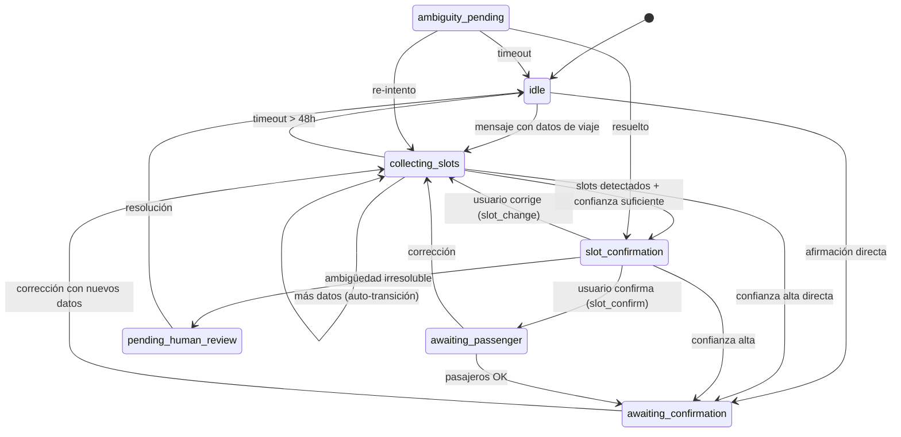

# Dominio Session — Modelo de Dominio

> Derivado de: `src/lib/db/core/connection.ts` (schema `chat_sessions`), `state-accessors.ts`, `slot-workflow.ts`, `slot-state.ts`, `context-memory.ts`
> Fecha: 2026-07-04 · AIT-014

---

## 1. Propósito

Mantener el estado conversacional del usuario entre turnos: qué slots se han extraído, con qué confianza, en qué fase de la conversación está, y qué idioma usa.

---

## 2. Entidad: ChatSession

### 2.1 Tabla `chat_sessions`

| Columna | Tipo | Descripción |
|---------|------|-------------|
| `phone` | TEXT PK | Teléfono WhatsApp del usuario |
| `slots` | TEXT (JSON) | Slots extraídos: `{ origin: {value,score,reason,status,source}, destination, passengers, scheduled_at, flight }` |
| `confidence` | TEXT (JSON) | Confianza por slot: `{ origin: 0.9, destination: 0.7 }` |
| `extraction_count` | INTEGER | Cantidad de extracciones realizadas |
| `last_extracted_at` | INTEGER | Timestamp de última extracción |
| `clarify_field` | TEXT | Campo que el sistema está pidiendo aclarar |
| `lang` | TEXT | Idioma detectado (es/en/pt) |
| `updated_at` | INTEGER | Timestamp de última modificación |
| `conversational_state` | TEXT | Estado de la conversación (7 estados) |
| `dispatch_state` | TEXT | Estado del dispatch (6 estados) |
| `trip_state` | TEXT | Estado del viaje |
| `slot_states` | TEXT (JSON) | Estados detallados por slot (RAW→CONFIRMED) |
| `comprehension_state` | TEXT | Estado de comprensión (FULL_CONTROL→ESCALATION) |
| `comprehension_score` | REAL | Score de comprensión |
| `escalation_reason` | TEXT | Razón de última escalación |
| `pending_opportunity` | TEXT (JSON) | Oportunidad pendiente de respuesta |

### 2.2 Slots (estructura JSON interna)

```typescript
interface SlotValue {
  value: string;          // "Aeropuerto IGR"
  score: number;          // 0.0 - 1.0
  reason: string;         // "alias_resolved" | "user_confirmed" | "system_inferred"
  status: SlotStatus;     // RAW → CONFIRMED
  source: SlotSource;     // "USER_CONFIRMED" | "SYSTEM_INFERRED" | "USER_CORRECTED"
}
```

---

## 3. State Machine Conversacional



### 3.1 Estados

| Estado | Significado | Qué espera el sistema |
|--------|-------------|----------------------|
| `idle` | Sin conversación activa | Primer mensaje del usuario |
| `collecting_slots` | Recolectando datos del viaje | Más datos (origen, destino, pasajeros, hora) |
| `slot_confirmation` | Mostrando confirmación al usuario | Botón "Confirmar" o "Corregir" |
| `awaiting_passenger` | Esperando cantidad de pasajeros | Número o texto con cantidad |
| `awaiting_confirmation` | Esperando confirmación final | Afirmación ("sí", "ok", "yes") |
| `pending_human_review` | Escalado a operador humano | Intervención del admin |
| `ambiguity_pending` | Esperando resolución de ambigüedad | Respuesta del usuario a opciones |

### 3.2 Transiciones Válidas (código real)

```typescript
// Fuente: src/lib/services/workflow/slot-workflow.ts L23-31
const VALID_SLOT_TRANSITIONS = {
  idle:                ["collecting_slots", "awaiting_confirmation"],
  collecting_slots:    ["collecting_slots", "slot_confirmation", "awaiting_confirmation"],
  slot_confirmation:   ["collecting_slots", "awaiting_passenger", "awaiting_confirmation", "pending_human_review"],
  awaiting_passenger:  ["collecting_slots", "awaiting_confirmation"],
  awaiting_confirmation: ["collecting_slots"],
  pending_human_review: ["idle"],
  ambiguity_pending:   ["slot_confirmation", "idle", "collecting_slots"],
};
```

---

## 4. Slot State Machine

Cada slot individual tiene su propio ciclo de certeza:

```
RAW → INFERRED → CONFIRMATION_PENDING → CONFIRMED
  ↓        ↓              ↓
  (nueva)  USER_CORRECTED → CONFIRMATION_PENDING → CONFIRMED
```

| Estado | Significado | Cómo se llega |
|--------|-------------|---------------|
| `RAW` | Primera mención del slot | Extracción inicial sin validación |
| `INFERRED` | Sistema infiere el valor | Score 0-0.99, fuente `SYSTEM_INFERRED` |
| `CONFIRMATION_PENDING` | Necesita confirmación del usuario | Término ambiguo o `USER_CORRECTED` |
| `CONFIRMED` | Confirmado por el usuario | Score 1.0+ o `USER_CONFIRMED` |
| `USER_CORRECTED` | Usuario cambió el valor | Corrección explícita |
| `USER_CONFIRMED` | Usuario confirmó explícitamente | Botón "Confirmar" |

---

## 5. TTLs y Expiración

| Condición | TTL | Acción |
|-----------|-----|--------|
| Sesión sin actividad | 48h (`SESSION_INACTIVITY_48H_S`) | Reset a `idle` |
| Slot sin re-extracción | 1h (`CONTEXT_SLOT_TIMEOUT_S`) | No mergear en `loadPreviousSlots()` |
| Confirmación pendiente | 30min (`CONFIRMATION_TIMEOUT_S`) | Cancelar y reset |
| Lead estancado | 30min (`STALE_LEAD_TIMEOUT_S`) | Re-engagement |
| Trip expirado | `scheduled_at` en pasado | Marcar CLOSED |

---

## 6. Context Memory — Merge Semántico

`context-memory.ts` implementa persistencia de contexto entre turnos:

### 6.1 Reglas de Merge

| Regla | Descripción |
|-------|-------------|
| **Carry-forward** | Si el nuevo turno NO tiene origen → usar el anterior |
| **Carry-forward** | Si el nuevo turno NO tiene destino → usar el anterior |
| **No overwrite** | NUNCA sobreescribir un slot CONFIRMED |
| **Staleness** | Si el slot tiene >1h de antigüedad → NO mergear |
| **Inyección** | Agregar `_confidence` a todos los campos mergeados |
| **Intent** | Llevar forward el intent previo si el nuevo es débil |

### 6.2 Funciones

| Función | Descripción |
|---------|-------------|
| `loadContext(phone)` | Cargar contexto persistido |
| `mergeContext(current, previous, confidence)` | Mergear nuevo con anterior |
| `saveContext(phone, input)` | Persistir slots + zonas + pricing |

---

## 7. Funciones del Dominio

### 7.1 CRUD de Sesión

| Función | Archivo | Descripción |
|---------|---------|-------------|
| `getChatSession(phone)` | `database.ts` | SELECT por phone |
| `upsertChatSession(phone, slots, conf, state, field, slotStates, lang)` | `database.ts` | UPSERT con merge |
| `updateChatSessionConversation(phone, state, field)` | `database.ts` | Solo estado conversacional |
| `updateChatSessionLang(phone, lang)` | `database.ts` | Solo idioma |
| `resetChatSession(phone)` | `database.ts` | DELETE (usado en .limpiar) |

### 7.2 State Accessors

| Función | Descripción |
|---------|-------------|
| `getConversationalState(phone)` | Leer estado conversacional |
| `setConversationalState(phone, state)` | Escribir estado conversacional |
| `getDispatchState(phone)` | Leer estado de dispatch |
| `setDispatchState(phone, state)` | Escribir estado de dispatch |
| `setTripState(phone, state)` | Escribir estado de viaje |
| `getComprehensionState(phone)` | Leer estado de comprensión |
| `setComprehensionState(phone, state, score)` | Escribir estado de comprensión |

### 7.3 Workflow

| Función | Descripción |
|---------|-------------|
| `evaluateWorkflowTransition(phone, extraction)` | Decidir próximo estado según confianza |
| `loadPreviousSlots(phone)` | Cargar slots previos (con staleness check) |
| `loadPreviousSlotStates(phone)` | Cargar slot_states previos |
| `buildSlotStates(current, previous, ...)` | Construir nuevos slot states |

---

## 8. Gaps

| Gap | Estado |
|-----|--------|
| Sin isolation de concurrencia | Dos mensajes simultáneos pueden generar race conditions |
| Slots JSON sin type safety | `parseSessionSlots()` devuelve `Record<string, unknown>` |
| `lang` no siempre se persiste | Corregido en AIT-003 (migración + código existente) |
| Sin cleanup automático de sesiones viejas | `checkSessionCleanup()` en timeouts.ts hace cleanup diario |
