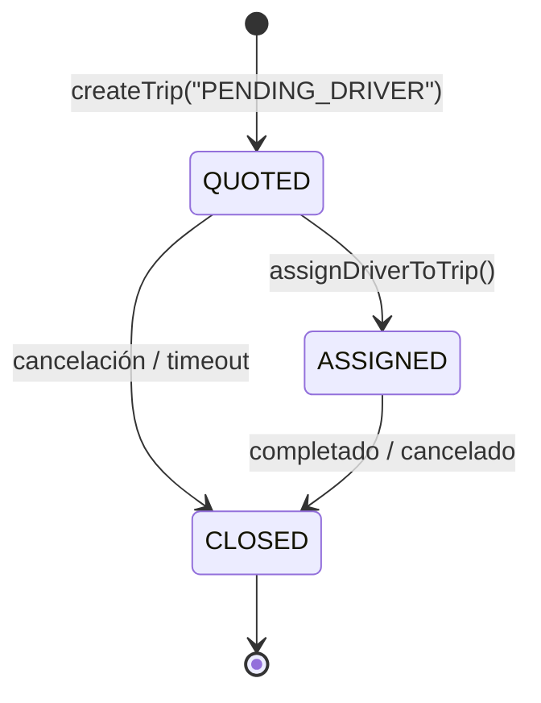

# Dominio Trip — Modelo de Dominio

> Derivado de: `src/lib/db/types.ts`, `src/lib/db/domains/trips.ts`, `src/lib/services/trip-execution/`, `src/lib/services/dispatch/`, `src/lib/ai/types.ts`
> Fecha: 2026-07-04
> Forma parte de: AIT-010 (Modelado P0)

---

## 1. Entidad: Trip

### 1.1 Definición

Un **trip** representa un traslado concreto entre un origen y un destino, con un número de pasajeros, un precio, y opcionalmente una fecha/hora programada.

### 1.2 Tabla: `trips`

| Columna | Tipo | Descripción |
|---------|------|-------------|
| `trip_id` | TEXT PK | Identificador único (`trip_{timestamp}`) |
| `client_phone` | TEXT | Teléfono WhatsApp del cliente |
| `origin` | TEXT | Lugar de origen (canonical_name) |
| `destination` | TEXT | Lugar de destino (canonical_name) |
| `status` | TEXT | Estado legacy (string libre) |
| `price_base` | REAL | Precio base del traslado |
| `passengers` | INTEGER | Cantidad de pasajeros |
| `assigned_driver_phone` | TEXT | Teléfono del chofer asignado |
| `scheduled_at` | INTEGER | Timestamp Unix de fecha/hora programada |
| `flight_number` | TEXT | Número de vuelo (si aplica) |
| `tariff_id` | INTEGER | FK a tabla `tariffs` |
| `piso_base` | REAL | Piso (costo mínimo para el chofer) |
| `garantizado_base` | REAL | Garantizado (85% del precio) |
| `commission_amount` | REAL | Comisión cobrada |
| `comision_declarada` | INTEGER | 1 = comisión declarada por el chofer |
| `driver_payout` | REAL | Pago al chofer |
| `survey_sent` | INTEGER | 1 = encuesta enviada |
| `post_trip_response` | TEXT | Respuesta a la encuesta |
| `created_at` | INTEGER | Timestamp de creación |
| `updated_at` | INTEGER | Timestamp de última modificación |
| `confirmed_at` | INTEGER | Timestamp de confirmación |
| `contact_shared_at` | INTEGER | Timestamp de contacto compartido |
| `trip_phase` | TEXT | Fase del viaje (enum: DRAFT→CLOSED) |
| `closure_reason` | TEXT | Razón de cierre (enum: 8 valores) |
| `discount_explicit` | INTEGER | Descuento explícito aplicado |

### 1.3 Value Objects del Dominio

**TripPhase** — Fase del ciclo de vida del viaje (derivada de `status` legacy):

| Fase | Mapeo desde status | Significado |
|------|-------------------|-------------|
| `QUOTED` | `consulta`, `PENDING_DRIVER` | Viaje creado, pendiente de asignación |
| `ASSIGNED` | `asignado_chofer`, `reconfirmado_24hs` | Chofer asignado al viaje |
| `CLOSED` | `completado`, `cancelado` | Viaje finalizado |

**Nota:** `trip_phase` es derivado de `status` (legacy string) vía `syncTripPhaseFromLegacyStatus()`. Las fases DRAFT, CONFIRMED, IN_PROGRESS existen como tipo pero NO están mapeadas en el código actual.

**TripClosureReason** — Solo aplica en CLOSED:

| Razón | Mapeo desde status |
|-------|-------------------|
| `completed` | `completado` |
| `cancelled` | `cancelado` |
| `cancelled_client` | (no mapeado actualmente) |
| `cancelled_driver` | (no mapeado actualmente) |
| `expired` | (no mapeado actualmente) |
| `failed` | (no mapeado actualmente) |
| `reassigned` | (no mapeado actualmente) |
| `system_cleanup` | (no mapeado actualmente) |

**TemporalMode** — Modo temporal del viaje:

| Modo | Detectado por | Efecto |
|------|--------------|--------|
| `NOW` | "ahora", "ya", urgencia | Modo AHORA → dispatch inmediato |
| `FUTURE` | Fecha/hora específica, "mañana" | Modo RESERVA → booking programado |
| `UNKNOWN` | Sin señal temporal | Se requiere clarificación |

---

## 2. Ciclo de Vida



### 2.1 Transiciones y Triggers

| Transición | Trigger | Archivo | Función |
|-----------|---------|---------|---------|
| [*] → QUOTED | `createTrip(tripId, ..., "PENDING_DRIVER")` | `trip-execution.service.ts` L283 | `executeTrip()` |
| QUOTED → ASSIGNED | `assignDriverToTrip(tripId, driverPhone)` | `db/domains/trips.ts` L137 | `assignDriverToTrip()` |
| ASSIGNED → CLOSED | `completeTrip(tripId)` | `db/domains/trips.ts` L147 | `completeTrip()` |
| QUOTED → CLOSED | Cancelación o timeout | Varios | `updateTripState(tripId, "cancelado")` |

### 2.1a Mapeo Legacy Status → TripPhase

```typescript
// Fuente: db/domains/trips.ts L152-159
const LEGACY_STATUS_TO_PHASE = {
  consulta:          { phase: "QUOTED" },
  PENDING_DRIVER:    { phase: "QUOTED" },
  asignado_chofer:   { phase: "ASSIGNED" },
  reconfirmado_24hs: { phase: "ASSIGNED" },
  completado:        { phase: "CLOSED", reason: "completed" },
  cancelado:         { phase: "CLOSED", reason: "cancelled" },
};

### 2.2 Guardas

| Guarda | Función | Condición |
|--------|---------|-----------|
| canPrepareQuote | `canPrepareQuote()` | origin + destination tienen valores |
| canQuote | `canQuote()` | origin CONFIRMED + destination CONFIRMED + passengers |
| canDispatch | `canDispatch()` | origin CONFIRMED + destination CONFIRMED + passengers + (scheduled_at o NOW) |
| Fleet capacity | `ensureFleetCanHandle()` | Al menos un chofer activo con capacidad ≥ pasajeros |
| Existing active trip | `getActiveTripByPhone()` | No crear duplicado si ya hay viaje activo |

### 2.3 Timeouts

| Timeout | Valor | Efecto |
|---------|-------|--------|
| Confirmación pendiente | 30 min (`CONFIRMATION_TIMEOUT_S`) | Reset a idle, cancelar viaje |
| Trip expirado | `scheduled_at` en pasado | Marcar CLOSED con razón `expired` |
| Espera driver nivel 1 | 1 hora | Escalar a nivel 2 |
| Espera driver nivel 2 | 30 min | Escalar a nivel 3 |
| Espera driver nivel 3 | 8 min | Broadcast a todos los choferes |
| Driver aceptó pero no llegó | 3 min | Reasignar |

---

## 3. Side Effects por Transición

| Transición | Side Effect | Función llamada |
|-----------|-------------|-----------------|
| Crear viaje | INSERT en `trips` | `createTrip()` |
| Crear viaje | INSERT en `trip_events` (P2 planificado) | — |
| Cotizar | UPDATE `tariff_id`, `piso_base`, `garantizado_base` | `updateTripTariff()` |
| Confirmar | SET `confirmed_at = now` | `completeTrip()` |
| Asignar chofer | UPDATE `assigned_driver_phone`, `commission_amount`, `driver_payout` | `assignDriverToTrip()` |
| Asignar chofer | Offer enviado al chofer vía WhatsApp | `offerToSpecificDriver()` |
| Chofer acepta | UPDATE `offers_accepted`, recalcular `acceptance_score` | `incrementOfferAccepted()` |
| Completar | SET `confirmed_at = now`, `comision_declarada` | `completeTrip()` |
| Completar | Log de aprendizaje (fare learning) | `recordOutcome()` |
| Encuesta | Enviar encuesta post-viaje | `sendPendingSurveys()` |
| Cierre (timeout) | Notificar admin | `notifyAdmin()` |

---

## 4. Multi-Ride (TripGroup + TripLeg)

El sistema soporta viajes multi-etapa (múltiples trayectos agrupados).

### 4.1 Entidades

**TripGroup** — Agrupa múltiples viajes relacionados:
- `trip_groups` table: `id`, `client_phone`, `total_price`, `passengers`, `status`

**TripLeg** — Un trayecto individual dentro de un grupo:
- `trip_legs` table: `id`, `group_id`, `seq`, `origin`, `destination`, `scheduled_at`, `price`, `trip_id`

### 4.2 Estados de TripGroup

| Estado | Significado |
|--------|-------------|
| `pending` | Grupo creado, sin viajes ejecutados |
| `quoted` | Precios cotizados para todos los legs |
| `confirmed` | Cliente confirmó el grupo |
| `executing` | Al menos un leg en ejecución |
| `completed` | Todos los legs completados |
| `cancelled` | Grupo cancelado |

### 4.3 Flujo Multi-Ride

1. `priceMultiRideLegs()` detecta hubs y calcula descuentos
2. `executeMultiLegTrip()` crea TripGroup + TripLegs
3. Cada leg se convierte en un Trip independiente (`createTrip()`)
4. Dispatch solo para el primer leg (resto manual por operador)

---

## 5. Funciones del Dominio

### 5.1 Creación y Ciclo de Vida

| Función | Archivo | Descripción |
|---------|---------|-------------|
| `createTrip()` | `db/domains/trips.ts` | INSERT en tabla `trips` |
| `getTripById()` | `db/domains/trips.ts` | SELECT por trip_id |
| `getActiveTripByPhone()` | `db/domains/trips.ts` | Último viaje no CLOSED del cliente |
| `getTripByAssignedDriver()` | `db/domains/trips.ts` | Viaje asignado a un chofer |
| `updateTripState()` | `db/domains/trips.ts` | Actualizar status + sync phase |
| `assignDriverToTrip()` | `db/domains/trips.ts` | Asignar chofer + calcular comisión |
| `completeTrip()` | `db/domains/trips.ts` | Marcar completado |
| `updateTripTariff()` | `db/domains/trips.ts` | Asignar tarifa + piso + garantizado |
| `setCommissionDeclared()` | `db/domains/trips.ts` | Marcar comisión declarada |

### 5.2 Multi-Ride

| Función | Archivo | Descripción |
|---------|---------|-------------|
| `createTripGroup()` | `db/domains/trips.ts` | INSERT en `trip_groups` |
| `insertTripLeg()` | `db/domains/trips.ts` | INSERT en `trip_legs` |
| `getTripGroup()` | `db/domains/trips.ts` | SELECT grupo |
| `getTripLegsByGroup()` | `db/domains/trips.ts` | SELECT legs ordenados |
| `updateTripGroupStatus()` | `db/domains/trips.ts` | Actualizar estado del grupo |
| `updateTripLegTripId()` | `db/domains/trips.ts` | Vincular leg a trip |

### 5.3 Scheduling y Housekeeping

| Función | Archivo | Descripción |
|---------|---------|-------------|
| `getTripsByScheduledAtWindow()` | `db/domains/trips.ts` | Viajes en ventana de horario |
| `getTripsPendingCloseOut()` | `db/domains/trips.ts` | Viajes sin comisión declarada (>2h) |
| `getExpiredTrips()` | `db/domains/trips.ts` | Viajes vencidos (scheduled_at pasado) |

### 5.4 Ejecución

| Función | Archivo | Descripción |
|---------|---------|-------------|
| `executeTrip()` | `trip-execution.service.ts` | Crear viaje + dispatch |
| `executeNowTrip()` | `now-execution.service.ts` | Viaje inmediato + dispatch |
| `executeMultiLegTrip()` | `trip-execution.service.ts` | Grupo multi-etapa + dispatch |

---

## 6. Reglas de Negocio

1. **Sin duplicados:** Si un cliente ya tiene un viaje activo (`getActiveTripByPhone()`), no se crea un nuevo viaje inmediato.
2. **Precio mínimo garantizado:** `garantizado_base = price_base * 0.85` — el chofer recibe al menos el 85% del precio.
3. **Comisión:** La comisión se calcula al asignar chofer aplicando posibles descuentos del chofer (`driver_discounts`).
4. **Encuesta:** Se envía encuesta post-viaje a trips en estado ASSIGNED/CLOSED que no hayan sido encuestados.
5. **Reconfirmación 24h:** Viajes programados dentro de las próximas 24h reciben mensaje de reconfirmación al chofer.
6. **Cierre de comisión 2h:** Viajes completados sin comisión declarada después de 2h reciben prompt al chofer.
7. **Multi-ride:** Descuento por hub detection (viajes que comparten destino como hub).

---

## 7. Gaps y Mejoras Pendientes

| Gap | Severidad | Plan |
|-----|-----------|------|
| `trip_status` (legacy string) vs `trip_phase` (enum) | MEDIA | Migrar completamente a trip_phase, eliminar status |
| Event sourcing (AIT-040) | MEDIA | Append-only audit log de transiciones de viaje |
| Sin validación de chofer asignado antes de marcar IN_PROGRESS | BAJA | Agregar guarda en `handleDriverEnViaje()` |
| TripLeg sin FK a trips | BAJA | Agregar FK constraint |
