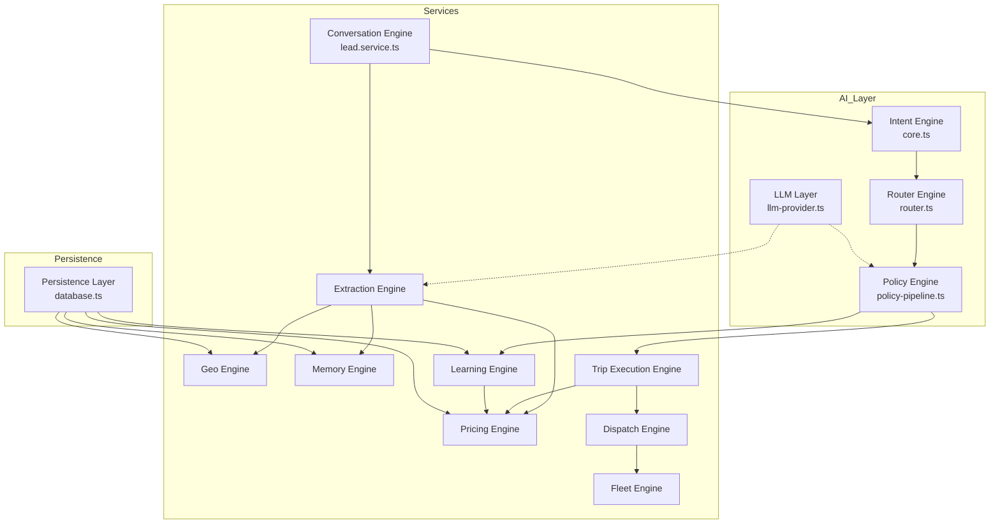

# Engines — AITOS

> Detailed documentation of each engine in the system.
> Each engine includes: purpose, inputs, outputs, responsibilities, dependencies, and contracts.
> For strict contracts, see `docs/ai/CONTRACTS.md`.

---

## Engine map

---

## 1. Conversation Engine

**File**: `src/lib/services/lead.service.ts`

**Purpose**: Orchestrate the entire request lifecycle.

**Inputs**:
- `phone: string`
- `text: string`

**Outputs**:
- WhatsApp response
- Updated session/trip/dispatch state

**Responsibilities**:
- Handle commands and shortcuts
- Set up conversation context
- Call CORE, comprehension, extraction, policy
- Manage error fallbacks
- Notify admin on failures

**Dependencies**: All other engines.

**Status**: ✅ Implemented, ⚠️ high coupling.

---

## 2. Intent Engine (CORE)

**File**: `src/lib/ai/core.ts`

**Purpose**: Deterministically classify intent and extract explicit facts.

**Inputs**:
- User text
- Optional previous intent

**Outputs**:
- `CoreDecision`: intent, facts, confidence, roleLock, slotStability, purchaseIntent, lateral

**Responsibilities**:
- Regex-based fact extraction
- 12-intent classification
- Syntactic role lock detection
- Purchase intent scoring

**Dependencies**: `ai/types.ts`, `ai/patterns.ts`, `ai/laterals/`

**Status**: ✅ Implemented

---

## 3. Router Engine

**File**: `src/lib/ai/router.ts`

**Purpose**: Map CoreDecision to OutputType and mode.

**Inputs**:
- `CoreDecision`

**Outputs**:
- `FinalDecision`: outputType (EXECUTE/ANSWER/CLARIFY/SAFE_FALLBACK), mode (AHORA/RESERVA)

**Responsibilities**:
- Pure mapping function
- No side effects
- Low-confidence fallback

**Dependencies**: `ai/types.ts`

**Status**: ✅ Implemented

---

## 4. Context Engine

**Files**: `src/lib/services/memory/memory.ts`, `src/lib/services/memory/context-memory.ts`

**Purpose**: Build and merge session context.

**Inputs**:
- `chat_sessions` row
- Message history

**Outputs**:
- `Memory` object
- Merged slot context

**Responsibilities**:
- Session memory construction
- Context merge semantics
- Predictive routing hints

**Dependencies**: DB facade

**Status**: ✅ Implemented

---

## 5. Geo Engine

**Files**: `src/lib/services/geo/geo-engine.ts`, `src/lib/services/geo/location-resolver.ts`, `src/lib/services/geo/reverse-geocode.ts`

**Purpose**: Resolve free-text locations to canonical places.

**Inputs**:
- Location string
- Optional country hint

**Outputs**:
- `GeoResolutionResult`: place_id, canonical_name, zone_id, country, match_level

**Responsibilities**:
- Alias exact match
- Canonical exact match
- Fuzzy match (Levenshtein ≤ 3)
- Reverse geocoding via Nominatim

**Dependencies**: DB `places`, `aliases`, `zones`; Nominatim API

**Status**: ✅ Implemented, ⚠️ `geo-engine.ts` partially deprecated

---

## 6. Pricing Engine

**Files**: `src/lib/services/pricing/pricing-engine.ts`, `src/lib/services/pricing/tariff-resolver.ts`, `src/lib/services/pricing/resolve-pricing-for-slots.ts`, `src/lib/services/pricing/commercial-pricing-engine.ts`, `src/lib/services/pricing/hub-discount.ts`

**Purpose**: Calculate prices from tariffs.

**Inputs**:
- Origin, destination, passengers
- Optional modifiers

**Outputs**:
- `PricingResult` with final_price, base_price, adjustments, explanation

**Responsibilities**:
- Tariff resolution by specificity
- Commercial rules and promotions
- Multi-ride hub discounts
- Public price / driver payout split

**Dependencies**: Geo engine, DB `tariffs`, `promotions`, `provider_adjustments`

**Status**: ✅ Implemented, ⚠️ dual track v2/v3

---

## 7. Extraction Engine

**Files**: `src/lib/services/extraction/extraction-runner.ts`, `src/lib/services/extraction/extract-slots.ts`, `src/lib/services/extraction/confidence.ts`, `src/lib/services/extraction/comprehension.ts`, `src/lib/services/extraction/comprehension-runner.ts`

**Purpose**: Convert text to structured slots with confidence.

**Inputs**:
- Text, history, core decision, previous slots

**Outputs**:
- `ExtractionResult` with slots, confidence, pricing, workflow state

**Responsibilities**:
- Triple fallback extraction (regex → entity → LLM)
- Confidence scoring
- Slot status lifecycle
- Previous slot merge

**Dependencies**: Geo, Pricing, Memory, LLM, Workflow

**Status**: ✅ Implemented

---

## 8. Policy Engine

**Files**: `src/lib/services/workflow/policy-pipeline.ts`, `src/lib/ai/policy-ahora.ts`, `src/lib/ai/policy-reserva.ts`

**Purpose**: Decide system response and operational actions.

**Inputs**:
- CoreDecision, extraction context, pricing, workflow state

**Outputs**:
- Response sent to user
- Operational side effects (trip, dispatch)

**Responsibilities**:
- Business rule evaluation
- Response template selection
- Trigger trip execution and dispatch
- Human escalation

**Dependencies**: Trip Execution, Dispatch, Learning, Output

**Status**: ✅ Implemented, ⚠️ large and multi-responsibility

---

## 9. Dispatch Engine

**Files**: `src/lib/services/dispatch/dispatch.service.ts`, `src/lib/services/dispatch/dispatch-workflow.ts`, `src/lib/services/dispatch/driver.service.ts`

**Purpose**: Assign trips to drivers through escalation workflow.

**Inputs**:
- Confirmed trip

**Outputs**:
- Driver assignment
- Dispatch events

**Responsibilities**:
- 4-level escalation
- Driver filtering by tier/shift/country
- Atomic assignment
- Driver response handling

**Dependencies**: Trip Execution, Fleet, WhatsApp sender

**Status**: ✅ Implemented

---

## 10. Trip Execution Engine

**Files**: `src/lib/services/trip-execution/trip-execution.service.ts`, `src/lib/services/trip-execution/now-execution.service.ts`, `src/lib/services/trip-execution/survey.service.ts`

**Purpose**: Create and execute trips.

**Inputs**:
- Confirmed slots and pricing

**Outputs**:
- Trip records
- Dispatch initiation (NOW trips)

**Responsibilities**:
- Trip creation
- Phase transitions
- Immediate dispatch trigger
- Post-service surveys

**Dependencies**: Pricing, Dispatch, Conversation

**Status**: ✅ Implemented

---

## 11. Learning Engine

**Files**: `src/lib/services/learning/event-tracking.ts`, `src/lib/services/learning/opportunity-engine.ts`, `src/lib/services/learning/fare-learning-engine.ts`, `src/lib/services/learning/suggestion-recalculator.ts`

**Purpose**: Track events and improve future decisions.

**Inputs**:
- Operational events

**Outputs**:
- Weight updates
- Opportunity recommendations

**Responsibilities**:
- Event logging
- Opportunity scoring
- Fare adjustment signals
- Suggestion acceptance tracking

**Dependencies**: Pricing, DB

**Status**: ✅ Implemented, ⚠️ bypasses DB facade in some paths

---

## 12. Fleet Engine

**Files**: `src/lib/services/dispatch/fleet-validation.ts`, `src/lib/services/dispatch/shift-utils.ts`, `src/lib/db/domains/drivers.ts`

**Purpose**: Manage driver fleet eligibility.

**Inputs**:
- Trip requirements
- Driver attributes

**Outputs**:
- Eligible driver list

**Responsibilities**:
- Driver tier/shift/country filtering
- Capacity validation
- Acceptance score ranking

**Dependencies**: DB `drivers`

**Status**: ✅ Implemented

---

## 13. LLM Layer

**Files**: `src/lib/ai/llm-provider.ts`, `src/lib/ai/providers/gemini-provider.ts`, `src/lib/ai/providers/groq-provider.ts`, `src/lib/ai/providers/fallback-provider.ts`, `src/lib/ai/llm-response.ts`

**Purpose**: Provide optional natural language extraction and response refinement.

**Inputs**:
- Prompt string

**Outputs**:
- String or parsed JSON or null

**Responsibilities**:
- Provider abstraction
- Timeout handling
- Fallback chain
- Response validation

**Dependencies**: External APIs (Gemini, Groq)

**Status**: ✅ Implemented

---

## 14. Persistence Layer

**Files**: `src/lib/db/database.ts`, `src/lib/db/core/connection.ts`, `src/lib/db/domains/*.ts`

**Purpose**: Provide data access.

**Inputs**:
- Queries from services

**Outputs**:
- Typed rows

**Responsibilities**:
- Turso/SQLite connection
- Schema management
- Migrations
- Facade surface

**Dependencies**: Turso/SQLite

**Status**: ✅ Implemented, ⚠️ facade is large

---

## Engine status summary

| Engine | Status | Notes |
|--------|--------|-------|
| Conversation | ✅ Implemented | High coupling in lead.service.ts |
| Intent (CORE) | ✅ Implemented | Deterministic, no LLM |
| Router | ✅ Implemented | Pure function |
| Context/Memory | ✅ Implemented | |
| Geo | ✅ Implemented | geo-engine.ts partially deprecated |
| Pricing | ✅ Implemented | v2/v3 dual track |
| Extraction | ✅ Implemented | Triple fallback |
| Policy | ✅ Implemented | Large, multi-responsibility |
| Dispatch | ✅ Implemented | 4-level escalation |
| Trip Execution | ✅ Implemented | |
| Learning | ✅ Implemented | Facade violations |
| Fleet | ✅ Implemented | |
| LLM Layer | ✅ Implemented | Optional fallback |
| Persistence | ✅ Implemented | Large facade |

---

*Last updated: 2026-07-06*
