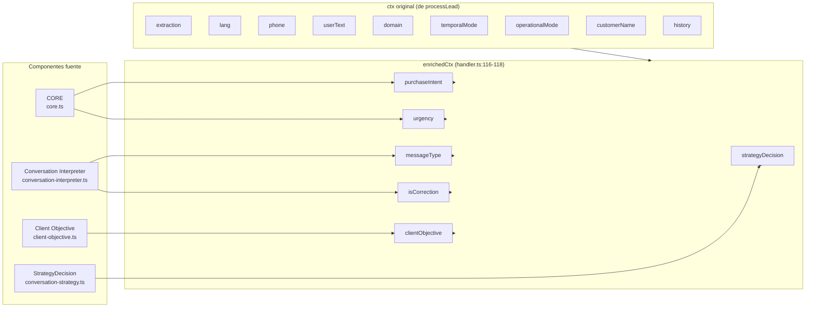
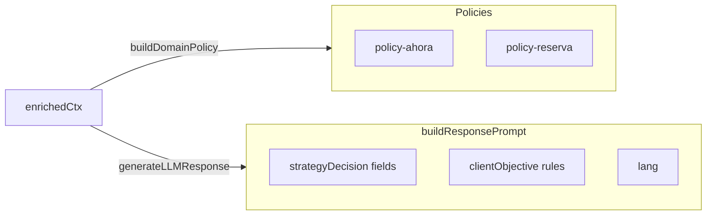

# HandlerContext — Enriquecimiento y Propagación

> **El contexto enriquecido que conecta CORE, Conversation Interpreter, Client Objective y StrategyDecision con Policies y LLM.**
> Este documento describe cómo se crea, enriquece y propaga HandlerContext.

---

## 1. Propósito

`HandlerContext` es la estructura que transporta todas las señales conversacionales desde los componentes de análisis (CORE, Conversation Interpreter, Client Objective, StrategyDecision) hasta los componentes de ejecución (Policies, LLM).

No es un contexto de petición HTTP — es el **contexto semántico enriquecido** que permite a Policies y LLM tomar decisiones informadas sin reinterpretar señales originales.

---

## 2. Interfaz

```typescript
interface HandlerContext {
  // ── Contexto original (de ExecutionContext) ──
  history?: Array<{ role: string; content: string; created_at: number }>;
  customerName?: string;
  extraction?: ExtractionContext;
  lang?: Lang;
  phone?: string;
  userText?: string;
  domain?: ConversationDomain;
  temporalMode?: TemporalMode;
  operationalMode?: OperationalMode;

  // ── Enriquecimiento E11: Señales semánticas ──
  purchaseIntent?: "high" | "medium" | "low";
  urgency?: string | null;

  // ── Enriquecimiento E11-B: Señales conversacionales ──
  messageType?: string;
  isCorrection?: boolean;

  // ── Enriquecimiento E12: Objetivo del cliente ──
  clientObjective?: ClientObjective;

  // ── Enriquecimiento R1+R5: Decisión estratégica ──
  strategyDecision?: StrategyDecision;
}
```

---

## 3. Creación y enriquecimiento

El enriquecimiento ocurre en `handler.ts` en orden estricto:



### Paso a paso (handler.ts):

| Paso | Línea | Acción | Fuente |
|------|-------|--------|--------|
| 1 | 87-88 | Extraer `urgency` de facts | `decision.core.facts` |
| 2 | 89-97 | Clasificar mensaje | `interpretMessage()` |
| 3 | 99-104 | Computar client objective | `computeClientObjective()` |
| 4 | 106-115 | Computar strategy decision | `computeStrategyDecision()` |
| 5 | 116-118 | Construir enrichedCtx | Spread de ctx + nuevas señales |

**Orden crítico**: StrategyDecision se computa **antes** de crear enrichedCtx (línea 106 antes de 116). Esto garantiza que cuando enrichedCtx se construye, StrategyDecision ya está disponible.

---

## 4. Propagación



---

## 5. Consumo por componente

### 5.1 Policies (policy-ahora.ts, policy-reserva.ts)

| Campo | Consumo | Propósito |
|-------|---------|-----------|
| `strategyDecision.behaviorFlags.inhibitNewBooking` | policy-ahora:77, policy-reserva:144 | Cancel: respuesta de cancelación |
| `strategyDecision.behaviorFlags.skipFieldResolution` | policy-ahora:88 | booking_urgent: dispatch directo |
| `strategyDecision.behaviorFlags.preserveContext` | policy-reserva:152 | Corrección: preservar contexto |
| `strategyDecision.behaviorFlags.inhibitBookingAccept` | policy-reserva:176 | inquiry_price: no cerrar booking |
| `extraction` | Ambos | Slots, tariff, estado conversacional |
| `lang` | Ambos | Idioma de respuesta |
| `customerName` | Ambos | Personalización de saludo |
| `purchaseIntent` | Logging | Solo observación |
| `urgency` | Logging | Solo observación |
| `messageType` | Logging | Solo observación |

### 5.2 LLM Prompt (llm-response.ts)

| Campo | Líneas | Uso |
|-------|--------|-----|
| `strategyDecision.tone` | 63 | Tono de la respuesta |
| `strategyDecision.reassuranceNeeded` | 64 | Flag de confianza |
| `strategyDecision.callToAction` | 65 | Intensidad del CTA |
| `strategyDecision.responseLength` | 66 | Verbosidad |
| `clientObjective` | 59 | Reglas de comportamiento por objetivo |
| `lang` | 14 | Idioma del prompt |
| `customerName` | 58 | Nombre del pasajero |
| `extraction.slots` | 10 | Datos operativos |
| `extraction.tariff` | 11 | Precio |

### 5.3 Handler LLM Gate (handler.ts)

| Campo | Línea | Uso |
|-------|-------|-----|
| `strategyDecision.behaviorFlags.skipLLM` | 163 | Controla si se invoca LLM |

---

## 6. Historial de evolución

| Etapa | Cambio | Impacto |
|-------|--------|---------|
| **Original** | HandlerContext básico: history, customerName, extraction, lang, phone, userText, domain | Contexto mínimo para policies |
| **E11** | `purchaseIntent` añadido | Señal de intención de compra a policies |
| **E11-B** | `urgency`, `messageType`, `isCorrection` añadidos | Señales semánticas a policies |
| **E12** | `clientObjective` añadido | Objetivo del cliente sintetizado |
| **R1-R5** | `strategyDecision` añadido | Decisiones estratégicas centralizadas |

---

## 7. Invariantes

1. **StrategyDecision siempre se computa antes de enrichedCtx** (handler.ts:106 antes de 116)
2. **StrategyDecision es opcional** (`?`) para runtime safety
3. **Las señales originales (purchaseIntent, urgency, messageType) solo se loguean** — sus decisiones migraron a StrategyDecision
4. **`clientObjective` tiene doble uso**: observable en policies y consumido por LLM prompt rules

---

*Last updated: 2026-07-10*
*Authority: `src/lib/ai/handler.ts`, `src/lib/ai/types.ts`*
