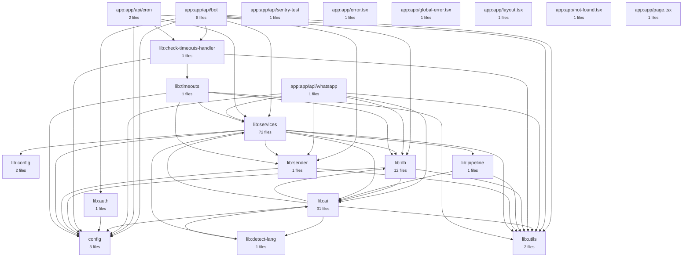
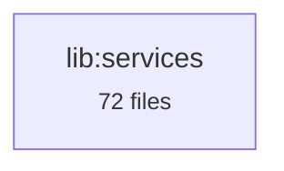
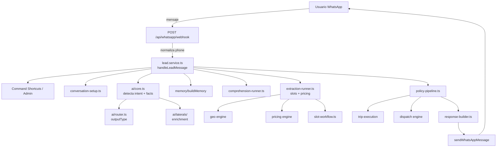

# Reverse Engineering — Architecture Graphs

> Generated at 2026-07-06T03:24:24.675Z from real source code.
> Do not edit manually — regenerate with `npx tsx scripts/architecture/generate-graphs.ts`.

## Summary

| Metric | Value |
|--------|-------|
| Total modules | 145 |
| Total packages | 21 |
| Import edges | 533 |
| Circular dependencies | 3 |
| Orphan files | 8 |
| Layer violations | 4 |

## Package Dependency Graph




## Import Graph (module level, top 80 connected modules)

```mermaid
flowchart TD
  app_api_bot_check_timeouts_route["app/api/bot/check-timeouts/route"]
  app_api_bot_connection_status_route["app/api/bot/connection/status/route"]
  app_api_bot_conversations_route["app/api/bot/conversations/route"]
  app_api_bot_conversations__id__route["app/api/bot/conversations/[id]/route"]
  app_api_bot_messages__id__route["app/api/bot/messages/[id]/route"]
  app_api_bot_metrics_route["app/api/bot/metrics/route"]
  app_api_bot_mode__id__route["app/api/bot/mode/[id]/route"]
  app_api_bot_simulate_route["app/api/bot/simulate/route"]
  app_api_cron_check_timeouts_route["app/api/cron/check-timeouts/route"]
  app_api_cron_recalculate_suggestions_route["app/api/cron/recalculate-suggestions/route"]
  app_api_whatsapp_webhook_route["app/api/whatsapp/webhook/route"]
  config_constants["config/constants"]
  config_env["config/env"]
  lib_ai_ambiguity_interpreter["lib/ai/ambiguity-interpreter"]
  lib_ai_core["lib/ai/core"]
  lib_ai_disambiguation_templates["lib/ai/disambiguation-templates"]
  lib_ai_display_name["lib/ai/display-name"]
  lib_ai_domain["lib/ai/domain"]
  lib_ai_extraction_prompt["lib/ai/extraction-prompt"]
  lib_ai_extraction_schema["lib/ai/extraction-schema"]
  lib_ai_field_resolver["lib/ai/field-resolver"]
  lib_ai_groq["lib/ai/groq"]
  lib_ai_guard["lib/ai/guard"]
  lib_ai_handler["lib/ai/handler"]
  lib_ai_iguazu_knowledge["lib/ai/iguazu-knowledge"]
  lib_ai_laterals_handlers["lib/ai/laterals/handlers"]
  lib_ai_laterals["lib/ai/laterals"]
  lib_ai_laterals_types["lib/ai/laterals/types"]
  lib_ai_llm_provider["lib/ai/llm-provider"]
  lib_ai_llm_response["lib/ai/llm-response"]
  lib_ai_operational_readiness["lib/ai/operational-readiness"]
  lib_ai_patterns["lib/ai/patterns"]
  lib_ai_policy_ahora["lib/ai/policy-ahora"]
  lib_ai_policy_reserva["lib/ai/policy-reserva"]
  lib_ai_providers_fallback_provider["lib/ai/providers/fallback-provider"]
  lib_ai_providers_gemini_provider["lib/ai/providers/gemini-provider"]
  lib_ai_providers_groq_provider["lib/ai/providers/groq-provider"]
  lib_ai_response_builder["lib/ai/response-builder"]
  lib_ai_router["lib/ai/router"]
  lib_ai_slot_confirmation["lib/ai/slot-confirmation"]
  lib_ai_slot_state["lib/ai/slot-state"]
  lib_ai_taxiguazu_knowledge["lib/ai/taxiguazu-knowledge"]
  lib_ai_transcribe["lib/ai/transcribe"]
  lib_ai_types["lib/ai/types"]
  lib_auth["lib/auth"]
  lib_check_timeouts_handler["lib/check-timeouts-handler"]
  lib_config_entity_catalog["lib/config/entity-catalog"]
  lib_config_lead_constants["lib/config/lead-constants"]
  lib_db_core_connection["lib/db/core/connection"]
  lib_db_core_helpers["lib/db/core/helpers"]
  lib_db_database["lib/db/database"]
  lib_db_domains_connection_state["lib/db/domains/connection-state"]
  lib_db_domains_dispatch_events["lib/db/domains/dispatch-events"]
  lib_db_domains_geo["lib/db/domains/geo"]
  lib_db_domains_learning["lib/db/domains/learning"]
  lib_db_domains_tours["lib/db/domains/tours"]
  lib_db_domains_trips["lib/db/domains/trips"]
  lib_db_domains_waitingRates["lib/db/domains/waitingRates"]
  lib_db_state_accessors["lib/db/state-accessors"]
  lib_db_types["lib/db/types"]
  lib_detect_lang["lib/detect-lang"]
  lib_pipeline["lib/pipeline"]
  lib_sender["lib/sender"]
  lib_services_admin_admin_commands["lib/services/admin/admin-commands"]
  lib_services_admin_admin_service["lib/services/admin/admin.service"]
  lib_services_dispatch_dispatch_workflow["lib/services/dispatch/dispatch-workflow"]
  lib_services_dispatch_dispatch_service["lib/services/dispatch/dispatch.service"]
  lib_services_dispatch_driver_service["lib/services/dispatch/driver.service"]
  lib_services_dispatch_fleet_validation["lib/services/dispatch/fleet-validation"]
  lib_services_dispatch_shift_utils["lib/services/dispatch/shift-utils"]
  lib_services_dispatch_tool_dispatch["lib/services/dispatch/tool-dispatch"]
  lib_services_dispatch_tool_fleet["lib/services/dispatch/tool-fleet"]
  lib_services_extraction_border_inference["lib/services/extraction/border-inference"]
  lib_services_extraction_comprehension_runner["lib/services/extraction/comprehension-runner"]
  lib_services_extraction_comprehension["lib/services/extraction/comprehension"]
  lib_services_extraction_confidence_map["lib/services/extraction/confidence-map"]
  lib_services_extraction_confidence["lib/services/extraction/confidence"]
  lib_services_extraction_entity_extractor["lib/services/extraction/entity-extractor"]
  lib_services_extraction_extract_slots["lib/services/extraction/extract-slots"]
  lib_services_extraction_extraction_runner["lib/services/extraction/extraction-runner"]
  app_api_bot_check_timeouts_route --> lib_check_timeouts_handler
  app_api_bot_connection_status_route --> lib_db_database
  app_api_bot_connection_status_route --> config_env
  app_api_bot_conversations_route --> lib_db_database
  app_api_bot_conversations_route --> lib_auth
  app_api_bot_conversations_route --> lib_utils_logger
  app_api_bot_conversations__id__route --> lib_db_database
  app_api_bot_conversations__id__route --> lib_auth
  app_api_bot_conversations__id__route --> lib_utils_logger
  app_api_bot_messages__id__route --> lib_db_database
  app_api_bot_messages__id__route --> lib_sender
  app_api_bot_messages__id__route --> lib_auth
  app_api_bot_messages__id__route --> lib_utils_logger
  app_api_bot_metrics_route --> lib_auth
  app_api_bot_metrics_route --> lib_db_database
  app_api_bot_metrics_route --> lib_utils_logger
  app_api_bot_mode__id__route --> lib_db_database
  app_api_bot_mode__id__route --> lib_auth
  app_api_bot_mode__id__route --> lib_utils_logger
  app_api_bot_simulate_route --> lib_services_lead_service
  app_api_bot_simulate_route --> lib_auth
  app_api_bot_simulate_route --> lib_utils_logger
  app_api_cron_check_timeouts_route --> lib_check_timeouts_handler
  app_api_cron_recalculate_suggestions_route --> lib_services_learning_suggestion_recalculator
  app_api_cron_recalculate_suggestions_route --> config_env
  app_api_cron_recalculate_suggestions_route --> lib_utils_logger
  app_api_whatsapp_webhook_route --> lib_services_lead_service
  app_api_whatsapp_webhook_route --> lib_services_dispatch_driver_service
  app_api_whatsapp_webhook_route --> lib_db_database
  app_api_whatsapp_webhook_route --> lib_services_trip_execution_survey_service
  app_api_whatsapp_webhook_route --> lib_services_geo_reverse_geocode
  app_api_whatsapp_webhook_route --> lib_sender
  app_api_whatsapp_webhook_route --> lib_ai_transcribe
  app_api_whatsapp_webhook_route --> config_env
  app_api_whatsapp_webhook_route --> lib_utils_logger
  lib_ai_ambiguity_interpreter --> lib_db_domains_geo
  lib_ai_ambiguity_interpreter --> lib_utils_logger
  lib_ai_ambiguity_interpreter --> lib_ai_iguazu_knowledge
  lib_ai_ambiguity_interpreter --> lib_ai_llm_provider
  lib_ai_core --> lib_ai_patterns
  lib_ai_core --> lib_ai_types
  lib_ai_core --> lib_ai_laterals
  lib_ai_display_name --> lib_db_core_helpers
  lib_ai_domain --> lib_ai_types
  lib_ai_extraction_prompt --> lib_ai_types
  lib_ai_extraction_prompt --> lib_ai_iguazu_knowledge
  lib_ai_field_resolver --> lib_ai_types
  lib_ai_groq --> lib_ai_extraction_prompt
  lib_ai_groq --> config_constants
  lib_ai_groq --> lib_ai_llm_provider
  lib_ai_groq --> lib_utils_logger
  lib_ai_guard --> lib_ai_types
  lib_ai_guard --> lib_utils_logger
  lib_ai_handler --> lib_ai_core
  lib_ai_handler --> lib_ai_router
  lib_ai_handler --> lib_ai_policy_ahora
  lib_ai_handler --> lib_ai_policy_reserva
  lib_ai_handler --> lib_ai_guard
  lib_ai_handler --> lib_ai_llm_response
  lib_ai_handler --> lib_ai_response_builder
  lib_ai_handler --> lib_ai_types
  lib_ai_handler --> lib_utils_logger
  lib_ai_laterals_handlers --> lib_ai_types
  lib_ai_laterals_handlers --> lib_ai_laterals_types
  lib_ai_laterals --> lib_ai_types
  lib_ai_llm_provider --> lib_utils_logger
  lib_ai_llm_provider --> lib_ai_providers_fallback_provider
  lib_ai_llm_provider --> lib_ai_providers_gemini_provider
  lib_ai_llm_provider --> lib_ai_providers_groq_provider
  lib_ai_llm_response --> config_constants
  lib_ai_llm_response --> lib_ai_llm_provider
  lib_ai_llm_response --> lib_ai_types
  lib_ai_llm_response --> lib_detect_lang
  lib_ai_llm_response --> lib_utils_logger
  lib_ai_llm_response --> lib_ai_iguazu_knowledge
  lib_ai_llm_response --> lib_ai_taxiguazu_knowledge
  lib_ai_operational_readiness --> lib_ai_types
  lib_ai_operational_readiness --> lib_utils_logger
  lib_ai_policy_ahora --> lib_ai_response_builder
  lib_ai_policy_ahora --> lib_ai_slot_confirmation
  lib_ai_policy_ahora --> lib_ai_policy_reserva
  lib_ai_policy_ahora --> lib_ai_types
  lib_ai_policy_ahora --> lib_ai_field_resolver
  lib_ai_policy_ahora --> lib_services_i18n_t
  lib_ai_policy_ahora --> lib_utils_logger
  lib_ai_policy_reserva --> lib_ai_response_builder
  lib_ai_policy_reserva --> lib_ai_slot_confirmation
  lib_ai_policy_reserva --> lib_ai_field_resolver
  lib_ai_policy_reserva --> lib_ai_patterns
  lib_ai_policy_reserva --> lib_ai_types
  lib_ai_policy_reserva --> lib_services_i18n_t
  lib_ai_policy_reserva --> lib_utils_logger
  lib_ai_providers_fallback_provider --> lib_utils_logger
  lib_ai_providers_fallback_provider --> lib_ai_llm_provider
  lib_ai_providers_fallback_provider --> lib_ai_providers_gemini_provider
  lib_ai_providers_fallback_provider --> lib_ai_providers_groq_provider
  lib_ai_providers_gemini_provider --> config_env
  lib_ai_providers_gemini_provider --> lib_utils_logger
  lib_ai_providers_gemini_provider --> lib_ai_llm_provider
  lib_ai_providers_groq_provider --> config_env
  lib_ai_providers_groq_provider --> config_constants
  lib_ai_providers_groq_provider --> lib_utils_logger
  lib_ai_providers_groq_provider --> lib_ai_llm_provider
  lib_ai_response_builder --> lib_ai_types
  lib_ai_response_builder --> lib_ai_slot_confirmation
  lib_ai_response_builder --> lib_services_i18n_t
  lib_ai_router --> lib_ai_types
  lib_ai_slot_confirmation --> lib_ai_types
  lib_ai_slot_confirmation --> lib_utils_logger
  lib_ai_slot_confirmation --> lib_services_i18n_t
  lib_ai_transcribe --> config_env
  lib_ai_transcribe --> lib_utils_logger
  lib_ai_types --> lib_ai_laterals_types
  lib_auth --> config_env
  lib_check_timeouts_handler --> lib_timeouts
  lib_check_timeouts_handler --> config_env
  lib_check_timeouts_handler --> lib_utils_logger
  lib_db_core_connection --> config_constants
  lib_db_core_helpers --> lib_db_core_connection
  lib_db_database --> lib_db_types
  lib_db_database --> lib_db_core_connection
  lib_db_database --> lib_db_core_helpers
  lib_db_database --> lib_db_domains_trips
  lib_db_database --> lib_db_domains_connection_state
  lib_db_database --> lib_utils_logger
  lib_db_database --> lib_db_domains_dispatch_events
  lib_db_database --> lib_db_domains_learning
  lib_db_database --> lib_db_domains_geo
  lib_db_domains_connection_state --> lib_db_core_helpers
  lib_db_domains_connection_state --> lib_db_core_connection
  lib_db_domains_connection_state --> lib_db_types
  lib_db_domains_dispatch_events --> lib_db_core_connection
  lib_db_domains_dispatch_events --> lib_db_types
  lib_db_domains_geo --> lib_db_core_helpers
  lib_db_domains_learning --> lib_db_core_connection
  lib_db_domains_learning --> lib_db_core_helpers
  lib_db_domains_tours --> lib_db_core_helpers
  lib_db_domains_tours --> lib_db_types
  lib_db_domains_trips --> lib_db_core_helpers
  lib_db_domains_trips --> lib_db_core_connection
  lib_db_domains_trips --> lib_db_types
  lib_db_domains_trips --> lib_utils_logger
  lib_db_domains_trips --> lib_db_domains_dispatch_events
  lib_db_domains_waitingRates --> lib_db_core_helpers
  lib_db_domains_waitingRates --> lib_db_types
  lib_db_state_accessors --> lib_db_database
  lib_db_state_accessors --> lib_db_domains_learning
  lib_db_state_accessors --> lib_db_core_connection
  lib_db_state_accessors --> lib_ai_types
  lib_detect_lang --> lib_ai_types
  lib_pipeline --> lib_ai_types
  lib_pipeline --> lib_utils_logger
  lib_sender --> config_env
  lib_sender --> lib_utils_logger
  lib_services_admin_admin_commands --> lib_sender
  lib_services_admin_admin_commands --> lib_db_database
  lib_services_admin_admin_commands --> config_constants
  lib_services_admin_admin_commands --> lib_services_shared_admin_helpers
  lib_services_admin_admin_service --> lib_sender
  lib_services_admin_admin_service --> lib_db_database
  lib_services_admin_admin_service --> config_env
  lib_services_admin_admin_service --> lib_utils_logger
  lib_services_dispatch_dispatch_workflow --> lib_db_database
  lib_services_dispatch_dispatch_workflow --> lib_db_state_accessors
  lib_services_dispatch_dispatch_workflow --> lib_ai_types
  lib_services_dispatch_dispatch_workflow --> lib_db_types
  lib_services_dispatch_dispatch_workflow --> lib_utils_logger
  lib_services_dispatch_dispatch_service --> lib_sender
  lib_services_dispatch_dispatch_service --> lib_db_database
  lib_services_dispatch_dispatch_service --> lib_services_pricing_tariff_resolver
  lib_services_dispatch_dispatch_service --> lib_db_types
  lib_services_dispatch_dispatch_service --> config_constants
  lib_services_dispatch_dispatch_service --> config_env
  lib_services_dispatch_dispatch_service --> lib_services_admin_admin_service
  lib_services_dispatch_dispatch_service --> lib_services_dispatch_dispatch_workflow
  lib_services_dispatch_dispatch_service --> lib_utils_logger
  lib_services_dispatch_driver_service --> lib_services_dispatch_dispatch_workflow
  lib_services_dispatch_driver_service --> lib_db_database
  lib_services_dispatch_driver_service --> lib_services_admin_admin_service
  lib_services_dispatch_driver_service --> lib_services_dispatch_dispatch_service
  lib_services_dispatch_driver_service --> lib_sender
  lib_services_dispatch_driver_service --> lib_services_dispatch_fleet_validation
  lib_services_dispatch_driver_service --> lib_services_pricing_tariff_resolver
  lib_services_dispatch_driver_service --> lib_utils_logger
  lib_services_dispatch_fleet_validation --> lib_db_database
  lib_services_dispatch_fleet_validation --> lib_sender
  lib_services_dispatch_fleet_validation --> lib_services_admin_admin_service
  lib_services_dispatch_fleet_validation --> lib_ai_response_builder
  lib_services_dispatch_fleet_validation --> lib_services_pricing_tariff_resolver
  lib_services_dispatch_fleet_validation --> lib_utils_logger
  lib_services_dispatch_tool_dispatch --> lib_services_dispatch_dispatch_service
  lib_services_dispatch_tool_dispatch --> lib_db_types
  lib_services_dispatch_tool_fleet --> lib_services_dispatch_fleet_validation
  lib_services_extraction_border_inference --> lib_db_database
  lib_services_extraction_comprehension_runner --> lib_db_database
  lib_services_extraction_comprehension_runner --> lib_ai_response_builder
  lib_services_extraction_comprehension_runner --> lib_services_memory_predictive_routing
  lib_services_extraction_comprehension_runner --> lib_services_learning_event_tracking
  lib_services_extraction_comprehension_runner --> lib_services_learning_learning_utils
  lib_services_extraction_comprehension_runner --> lib_services_extraction_comprehension
  lib_services_extraction_comprehension_runner --> lib_ai_domain
  lib_services_extraction_comprehension_runner --> lib_services_admin_admin_service
  lib_services_extraction_comprehension_runner --> lib_utils_logger
  lib_services_extraction_comprehension_runner --> lib_ai_types
  lib_services_extraction_comprehension_runner --> lib_db_types
  lib_services_extraction_comprehension_runner --> lib_services_shared_message_helpers
  lib_services_extraction_comprehension_runner --> lib_detect_lang
  lib_services_extraction_comprehension --> lib_db_types
  lib_services_extraction_comprehension --> lib_ai_types
  lib_services_extraction_comprehension --> lib_utils_clamp
  lib_services_extraction_comprehension --> lib_config_entity_catalog
  lib_services_extraction_comprehension --> lib_ai_response_builder
  lib_services_extraction_comprehension --> lib_services_i18n_t
  lib_services_extraction_comprehension --> lib_services_shared_session_helpers
  lib_services_extraction_comprehension --> lib_detect_lang
  lib_services_extraction_comprehension --> lib_utils_logger
  lib_services_extraction_confidence_map --> lib_ai_types
  lib_services_extraction_confidence_map --> lib_ai_extraction_schema
  lib_services_extraction_confidence --> lib_ai_extraction_schema
  lib_services_extraction_confidence --> lib_db_database
  lib_services_extraction_confidence --> config_constants
  lib_services_extraction_confidence --> lib_ai_patterns
  lib_services_extraction_entity_extractor --> lib_ai_extraction_schema
  lib_services_extraction_entity_extractor --> lib_services_geo_location_resolver
  lib_services_extraction_extract_slots --> lib_services_extraction_regex_extractor
  lib_services_extraction_extract_slots --> lib_services_extraction_entity_extractor
  lib_services_extraction_extract_slots --> lib_ai_groq
  lib_services_extraction_extract_slots --> lib_ai_extraction_prompt
  lib_services_extraction_extract_slots --> lib_utils_logger
  lib_services_extraction_extraction_runner --> lib_db_database
  lib_services_extraction_extraction_runner --> lib_services_extraction_extract_slots
  lib_services_extraction_extraction_runner --> lib_services_extraction_regex_extractor
  lib_services_extraction_extraction_runner --> lib_ai_response_builder
  lib_services_extraction_extraction_runner --> lib_ai_extraction_schema
  lib_services_extraction_extraction_runner --> lib_services_workflow_slot_workflow
  lib_services_extraction_extraction_runner --> lib_services_pricing_resolve_pricing_for_slots
  lib_services_extraction_extraction_runner --> lib_services_pricing_hub_discount
  lib_services_extraction_extraction_runner --> lib_db_types
  lib_services_extraction_extraction_runner --> lib_ai_patterns
  lib_services_extraction_extraction_runner --> lib_db_state_accessors
  lib_services_extraction_extraction_runner --> lib_ai_types
  lib_services_extraction_extraction_runner --> lib_ai_domain
  lib_services_extraction_extraction_runner --> lib_services_extraction_confidence
  lib_services_extraction_extraction_runner --> lib_services_extraction_time_inference
  lib_services_extraction_extraction_runner --> lib_services_extraction_border_inference
  lib_services_extraction_extraction_runner --> lib_services_extraction_confidence_map
  lib_services_extraction_extraction_runner --> lib_services_memory_context_memory
  lib_services_extraction_extraction_runner --> lib_detect_lang
  lib_services_extraction_extraction_runner --> lib_services_extraction_format_confidence_note
  lib_services_extraction_extraction_runner --> lib_services_workflow_load_previous_slots
  lib_services_extraction_extraction_runner --> lib_ai_slot_state
  lib_services_extraction_extraction_runner --> lib_services_workflow_evaluate_completeness
  lib_services_extraction_extraction_runner --> lib_utils_logger
  lib_services_extraction_extraction_runner --> lib_services_shared_session_helpers
  lib_services_extraction_extraction_runner --> lib_services_shared_message_helpers
  lib_services_extraction_format_confidence_note --> lib_ai_extraction_schema
  lib_services_extraction_format_confidence_note --> lib_services_workflow_slot_workflow
  lib_services_extraction_format_confidence_note --> lib_services_pricing_resolve_pricing_for_slots
  lib_services_extraction_format_confidence_note --> lib_db_types
  lib_services_extraction_regex_extractor --> lib_ai_extraction_schema
  lib_services_geo_location_resolver --> lib_db_database
  lib_services_geo_reverse_geocode --> lib_utils_logger
  lib_services_geo_tool_geo --> lib_services_geo_location_resolver
  lib_services_geo_tool_geo --> lib_db_domains_geo
  lib_services_i18n_catalog --> lib_ai_types
  lib_services_i18n_t --> lib_ai_types
  lib_services_i18n_t --> lib_services_i18n_catalog
  lib_services_i18n_t --> lib_utils_logger
  lib_services_lead_service --> lib_db_database
  lib_services_lead_service --> lib_ai_response_builder
  lib_services_lead_service --> lib_ai_guard
  lib_services_lead_service --> lib_ai_core
  lib_services_lead_service --> lib_ai_types
  lib_services_lead_service --> lib_ai_domain
  lib_services_lead_service --> lib_sender
  lib_services_lead_service --> lib_services_admin_admin_service
  lib_services_lead_service --> lib_services_workflow_build_extraction_context
  lib_services_lead_service --> lib_services_workflow_command_shortcuts
  lib_services_lead_service --> lib_services_workflow_response_reset
  lib_services_lead_service --> lib_services_workflow_command_router
  lib_services_lead_service --> lib_services_workflow_conversation_setup
  lib_services_lead_service --> lib_services_workflow_opportunity_response
  lib_services_lead_service --> lib_services_workflow_policy_pipeline
  lib_services_lead_service --> lib_services_memory_memory
  lib_services_lead_service --> lib_services_memory_predictive_routing
  lib_services_lead_service --> lib_services_learning_event_tracking
  lib_services_lead_service --> lib_services_extraction_comprehension_runner
  lib_services_lead_service --> lib_services_extraction_extraction_runner
  lib_services_lead_service --> lib_services_trip_execution_now_execution_service
  lib_services_lead_service --> lib_db_state_accessors
  lib_services_lead_service --> lib_ai_slot_confirmation
  lib_services_lead_service --> lib_services_workflow_ambiguity_handler
  lib_services_lead_service --> lib_detect_lang
  lib_services_lead_service --> lib_ai_extraction_schema
  lib_services_lead_service --> lib_services_pricing_resolve_pricing_for_slots
  lib_services_lead_service --> lib_services_pricing_tool_pricing
  lib_services_lead_service --> lib_services_extraction_extract_slots
  lib_services_lead_service --> lib_ai_extraction_prompt
  lib_services_lead_service --> lib_services_shared_session_helpers
  lib_services_lead_service --> lib_utils_logger
  lib_services_learning_adaptation --> lib_services_learning_types
  lib_services_learning_adaptation --> lib_services_learning_policy_engine
  lib_services_learning_adaptation --> lib_services_learning_learning_utils
  lib_services_learning_adaptation --> lib_db_database
  lib_services_learning_adaptation --> lib_utils_clamp
  lib_services_learning_adaptation --> lib_utils_logger
  lib_services_learning_admin --> lib_db_database
  lib_services_learning_admin --> lib_services_learning_learning_utils
  lib_services_learning_economics --> lib_services_learning_types
  lib_services_learning_economics --> lib_utils_clamp
  lib_services_learning_event_tracking --> lib_db_database
  lib_services_learning_event_tracking --> lib_utils_logger
  lib_services_learning_learning_pipeline_service --> lib_services_learning_objectives
  lib_services_learning_learning_pipeline_service --> lib_services_learning_routing
  lib_services_learning_learning_pipeline_service --> lib_services_learning_system_load
  lib_services_learning_learning_pipeline_service --> lib_services_learning_policy_engine
  lib_services_learning_learning_pipeline_service --> lib_services_learning_adaptation
  lib_services_learning_learning_pipeline_service --> lib_db_database
  lib_services_learning_learning_pipeline_service --> lib_services_learning_opportunity_types
  lib_services_learning_learning_pipeline_service --> lib_services_learning_types
  lib_services_learning_learning_utils --> lib_db_database
  lib_services_learning_objectives --> lib_services_learning_types
  lib_services_learning_objectives --> lib_services_learning_learning_utils
  lib_services_learning_objectives --> lib_utils_clamp
  lib_services_learning_opportunity_engine --> lib_db_types
  lib_services_learning_opportunity_engine --> lib_services_learning_opportunity_types
  lib_services_learning_opportunity_engine --> lib_services_pricing_pricing_engine
  lib_services_learning_opportunity_engine --> lib_db_database
  lib_services_learning_opportunity_engine --> lib_services_learning_learning_utils
  lib_services_learning_opportunity_engine --> lib_config_entity_catalog
  lib_services_learning_opportunity_engine --> lib_utils_logger
  lib_services_learning_opportunity_types --> lib_db_types
  lib_services_learning_opportunity_types --> lib_ai_types
  lib_services_learning_policy_engine --> lib_services_learning_types
  lib_services_learning_policy_engine --> lib_services_learning_economics
  lib_services_learning_policy_engine --> lib_utils_clamp
  lib_services_learning_policy_engine --> lib_services_shared_error_logger
  lib_services_learning_routing --> lib_services_learning_opportunity_types
  lib_services_learning_routing --> lib_services_learning_types
  lib_services_learning_routing --> lib_services_learning_economics
  lib_services_learning_routing --> lib_services_learning_objectives
  lib_services_learning_routing --> lib_services_learning_system_load
  lib_services_learning_suggestion_recalculator --> lib_db_database
  lib_services_learning_suggestion_recalculator --> lib_utils_logger
  lib_services_learning_system_load --> lib_services_learning_types
  lib_services_learning_system_load --> lib_db_database
  lib_services_learning_types --> lib_services_learning_opportunity_types
  lib_services_memory_context_memory --> lib_db_database
  lib_services_memory_context_memory --> lib_services_geo_geo_engine
  lib_services_memory_context_memory --> lib_services_shared_session_helpers
  lib_services_memory_memory --> lib_db_types
  lib_services_memory_memory --> lib_config_entity_catalog
  lib_services_memory_memory --> lib_services_shared_session_helpers
  lib_services_memory_predictive_routing --> lib_services_extraction_comprehension
  lib_services_memory_predictive_routing --> lib_services_memory_memory
  lib_services_memory_predictive_routing --> lib_utils_clamp
  lib_services_memory_predictive_routing --> lib_config_entity_catalog
  lib_services_pricing_commercial_pricing_engine --> lib_db_types
  lib_services_pricing_commercial_pricing_engine --> lib_db_database
  lib_services_pricing_hub_discount --> lib_db_types
  lib_services_pricing_hub_discount --> lib_services_geo_location_resolver
  lib_services_pricing_hub_discount --> lib_services_pricing_tariff_resolver
  lib_services_pricing_hub_discount --> lib_db_domains_tours
  lib_services_pricing_hub_discount --> lib_db_domains_geo
  lib_services_pricing_hub_discount --> lib_utils_logger
  lib_services_pricing_pricing_engine --> lib_services_geo_location_resolver
  lib_services_pricing_pricing_engine --> lib_services_pricing_tariff_resolver
  lib_services_pricing_pricing_engine --> lib_services_pricing_commercial_pricing_engine
  lib_services_pricing_resolve_pricing_for_slots --> lib_services_pricing_pricing_engine
  lib_services_pricing_resolve_pricing_for_slots --> lib_services_pricing_tariff_resolver
  lib_services_pricing_tariff_resolver --> lib_db_types
  lib_services_pricing_tariff_resolver --> lib_db_database
  lib_services_pricing_tariff_resolver --> lib_services_geo_location_resolver
  lib_services_pricing_tool_pricing --> lib_services_pricing_resolve_pricing_for_slots
  lib_services_pricing_tour_resolver --> lib_db_types
  lib_services_pricing_tour_resolver --> lib_db_domains_tours
  lib_services_pricing_tour_resolver --> lib_services_geo_location_resolver
  lib_services_shared_admin_helpers --> config_env
  lib_services_shared_admin_helpers --> lib_sender
  lib_services_shared_admin_helpers --> lib_db_database
  lib_services_shared_error_logger --> lib_db_database
  lib_services_shared_error_logger --> lib_utils_logger
  lib_services_shared_lead_event_helpers --> lib_services_lead_service
  lib_services_shared_lead_event_helpers --> lib_utils_logger
  lib_services_shared_message_helpers --> lib_sender
  lib_services_shared_message_helpers --> lib_db_database
  lib_services_shared_reset_helpers --> lib_db_database
  lib_services_shared_reset_helpers --> lib_services_dispatch_dispatch_workflow
  lib_services_shared_session_helpers --> lib_utils_logger
  lib_services_trip_execution_now_execution_service --> lib_db_domains_trips
  lib_services_trip_execution_now_execution_service --> lib_db_state_accessors
  lib_services_trip_execution_now_execution_service --> lib_services_dispatch_fleet_validation
  lib_services_trip_execution_now_execution_service --> lib_services_dispatch_dispatch_service
  lib_services_trip_execution_now_execution_service --> lib_services_pricing_pricing_engine
  lib_services_trip_execution_now_execution_service --> lib_utils_logger
  lib_services_trip_execution_survey_service --> lib_sender
  lib_services_trip_execution_survey_service --> lib_db_database
  lib_services_trip_execution_survey_service --> lib_services_shared_lead_event_helpers
  lib_services_trip_execution_survey_service --> lib_utils_logger
  lib_services_trip_execution_trip_execution_service --> lib_db_database
  lib_services_trip_execution_trip_execution_service --> lib_db_state_accessors
  lib_services_trip_execution_trip_execution_service --> lib_db_types
  lib_services_trip_execution_trip_execution_service --> lib_db_domains_trips
  lib_services_trip_execution_trip_execution_service --> lib_services_learning_opportunity_types
  lib_services_trip_execution_trip_execution_service --> lib_services_dispatch_fleet_validation
  lib_services_trip_execution_trip_execution_service --> lib_services_learning_fare_learning_engine
  lib_services_trip_execution_trip_execution_service --> lib_services_geo_geo_engine
  lib_services_trip_execution_trip_execution_service --> lib_services_learning_opportunity_engine
  lib_services_trip_execution_trip_execution_service --> lib_services_learning_event_tracking
  lib_services_trip_execution_trip_execution_service --> lib_ai_response_builder
  lib_services_trip_execution_trip_execution_service --> lib_services_dispatch_dispatch_service
  lib_services_trip_execution_trip_execution_service --> lib_sender
  lib_services_trip_execution_trip_execution_service --> lib_services_pricing_resolve_pricing_for_slots
  lib_services_trip_execution_trip_execution_service --> lib_ai_types
  lib_services_trip_execution_trip_execution_service --> lib_pipeline
  lib_services_trip_execution_trip_execution_service --> lib_utils_logger
  lib_services_workflow_ambiguity_handler --> lib_db_state_accessors
  lib_services_workflow_ambiguity_handler --> lib_db_domains_geo
  lib_services_workflow_ambiguity_handler --> lib_db_database
  lib_services_workflow_ambiguity_handler --> lib_ai_ambiguity_interpreter
  lib_services_workflow_ambiguity_handler --> lib_detect_lang
  lib_services_workflow_ambiguity_handler --> lib_services_shared_message_helpers
  lib_services_workflow_ambiguity_handler --> lib_db_types
  lib_services_workflow_ambiguity_handler --> lib_ai_types
  lib_services_workflow_ambiguity_handler --> lib_utils_logger
  lib_services_workflow_ambiguity_handler --> lib_ai_disambiguation_templates
  lib_services_workflow_ambiguity_handler --> lib_services_i18n_t
  lib_services_workflow_build_extraction_context --> lib_ai_types
  lib_services_workflow_build_extraction_context --> lib_ai_extraction_schema
  lib_services_workflow_build_extraction_context --> lib_services_workflow_slot_workflow
  lib_services_workflow_build_extraction_context --> lib_services_pricing_resolve_pricing_for_slots
  lib_services_workflow_build_extraction_context --> lib_utils_logger
  lib_services_workflow_command_router --> lib_sender
  lib_services_workflow_command_router --> lib_db_database
  lib_services_workflow_command_router --> lib_services_dispatch_shift_utils
  lib_services_workflow_command_router --> lib_services_admin_admin_commands
  lib_services_workflow_command_router --> lib_services_learning_admin
  lib_services_workflow_command_router --> lib_services_shared_admin_helpers
  lib_services_workflow_command_shortcuts --> lib_sender
  lib_services_workflow_command_shortcuts --> lib_db_database
  lib_services_workflow_command_shortcuts --> lib_services_dispatch_dispatch_workflow
  lib_services_workflow_command_shortcuts --> lib_config_lead_constants
  lib_services_workflow_command_shortcuts --> lib_services_admin_admin_service
  lib_services_workflow_conversation_setup --> lib_db_database
  lib_services_workflow_conversation_setup --> lib_services_shared_reset_helpers
  lib_services_workflow_conversation_setup --> lib_db_state_accessors
  lib_services_workflow_conversation_setup --> config_constants
  lib_services_workflow_conversation_setup --> lib_utils_logger
  lib_services_workflow_evaluate_completeness --> lib_ai_types
  lib_services_workflow_load_previous_slots --> lib_db_database
  lib_services_workflow_load_previous_slots --> config_constants
  lib_services_workflow_load_previous_slots --> lib_ai_slot_state
  lib_services_workflow_load_previous_slots --> lib_services_shared_session_helpers
  lib_services_workflow_opportunity_response --> lib_sender
  lib_services_workflow_opportunity_response --> lib_db_database
  lib_services_workflow_opportunity_response --> lib_services_shared_reset_helpers
  lib_services_workflow_opportunity_response --> lib_db_state_accessors
  lib_services_workflow_opportunity_response --> lib_ai_patterns
  lib_services_workflow_opportunity_response --> lib_ai_response_builder
  lib_services_workflow_opportunity_response --> lib_services_learning_event_tracking
  lib_services_workflow_opportunity_response --> lib_utils_logger
  lib_services_workflow_policy_pipeline --> lib_sender
  lib_services_workflow_policy_pipeline --> lib_ai_slot_confirmation
  lib_services_workflow_policy_pipeline --> lib_db_database
  lib_services_workflow_policy_pipeline --> lib_db_state_accessors
  lib_services_workflow_policy_pipeline --> lib_pipeline
  lib_services_workflow_policy_pipeline --> lib_services_geo_geo_engine
  lib_services_workflow_policy_pipeline --> lib_services_learning_opportunity_engine
  lib_services_workflow_policy_pipeline --> lib_ai_response_builder
  lib_services_workflow_policy_pipeline --> lib_ai_handler
  lib_services_workflow_policy_pipeline --> lib_services_memory_context_memory
  lib_services_workflow_policy_pipeline --> lib_services_admin_admin_service
  lib_services_workflow_policy_pipeline --> lib_ai_patterns
  lib_services_workflow_policy_pipeline --> lib_ai_display_name
  lib_services_workflow_policy_pipeline --> lib_ai_operational_readiness
  lib_services_workflow_policy_pipeline --> lib_services_trip_execution_trip_execution_service
  lib_services_workflow_policy_pipeline --> lib_services_trip_execution_now_execution_service
  lib_services_workflow_policy_pipeline --> lib_services_pricing_tool_pricing
  lib_services_workflow_policy_pipeline --> lib_ai_types
  lib_services_workflow_policy_pipeline --> lib_ai_extraction_schema
  lib_services_workflow_policy_pipeline --> lib_services_workflow_slot_workflow
  lib_services_workflow_policy_pipeline --> lib_detect_lang
  lib_services_workflow_policy_pipeline --> lib_services_workflow_build_extraction_context
  lib_services_workflow_policy_pipeline --> lib_ai_policy_reserva
  lib_services_workflow_policy_pipeline --> lib_services_shared_session_helpers
  lib_services_workflow_policy_pipeline --> lib_ai_core
  lib_services_workflow_policy_pipeline --> lib_db_types
  lib_services_workflow_policy_pipeline --> config_constants
  lib_services_workflow_policy_pipeline --> lib_utils_logger
  lib_services_workflow_response_reset --> lib_sender
  lib_services_workflow_response_reset --> lib_db_database
  lib_services_workflow_response_reset --> lib_services_shared_reset_helpers
  lib_services_workflow_slot_workflow --> lib_db_database
  lib_services_workflow_slot_workflow --> lib_db_state_accessors
  lib_services_workflow_slot_workflow --> config_constants
  lib_services_workflow_slot_workflow --> lib_ai_extraction_schema
  lib_services_workflow_slot_workflow --> lib_ai_types
  lib_services_workflow_slot_workflow --> lib_utils_logger
  lib_timeouts --> lib_services_dispatch_dispatch_workflow
  lib_timeouts --> lib_db_database
  lib_timeouts --> lib_services_admin_admin_service
  lib_timeouts --> lib_sender
  lib_timeouts --> lib_services_dispatch_dispatch_service
  lib_timeouts --> lib_services_trip_execution_survey_service
  lib_timeouts --> lib_utils_logger
  lib_timeouts --> config_constants
```


## Service Interaction Map




## Runtime Pipeline




## Circular Dependencies

- `lib/ai/llm-provider → lib/ai/providers/fallback-provider → lib/ai/llm-provider`
- `lib/ai/llm-provider → lib/ai/providers/fallback-provider → lib/ai/providers/gemini-provider → lib/ai/llm-provider`
- `lib/ai/llm-provider → lib/ai/providers/fallback-provider → lib/ai/providers/groq-provider → lib/ai/llm-provider`

## Orphan Files (not imported by any src module)

- `config/vitest.config`
- `lib/ai/laterals/handlers`
- `lib/db/domains/waitingRates`
- `lib/services/dispatch/tool-dispatch`
- `lib/services/dispatch/tool-fleet`
- `lib/services/geo/tool-geo`
- `lib/services/learning/learning-pipeline.service`
- `lib/services/pricing/tour-resolver`

## Layer Violations

- `lib/ai/policy-ahora → lib/services/i18n/t (AI imports Services)`
- `lib/ai/policy-reserva → lib/services/i18n/t (AI imports Services)`
- `lib/ai/response-builder → lib/services/i18n/t (AI imports Services)`
- `lib/ai/slot-confirmation → lib/services/i18n/t (AI imports Services)`
