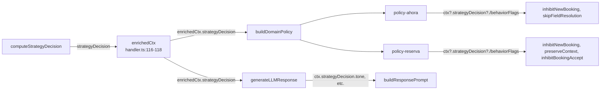

# StrategyDecision — Conversational Strategy (ADR-008)

> **Única fuente de verdad para todas las decisiones estratégicas conversacionales.**
> Este documento describe el ciclo de vida completo de StrategyDecision: creación, propagación, consumo y gobierno.

---

## 1. Propósito

`StrategyDecision` es el contrato central establecido por ADR-008. Centraliza todas las decisiones estratégicas de la conversación en una única estructura, eliminando la lógica distribuida que antes existía en Policies, Handler, Response Builder y LLM.

**Principio fundamental:**

> *Toda decisión estratégica conversacional deberá originarse exclusivamente en `computeStrategyDecision()`.*

---

## 2. Ciclo de vida

```mermaid
flowchart LR
    subgraph Inputs["Señales de entrada"]
        PI[purchaseIntent]
        U[urgency]
        MT[messageType]
        IC[isCorrection]
        CO[clientObjective]
        D[decision/OutputType]
        I[intent]
    end

    subgraph Creation["computeStrategyDecision()"]
        CS[conversation-strategy.ts<br/>FUNCIÓN PURA<br/>Sin side effects<br/>Sin DB<br/>Sin async]
    end

    subgraph SD["StrategyDecision"]
        M[mode]
        T[tone]
        S[speed]
        GL[greetingLength]
        RL[responseLength]
        RN[reassuranceNeeded]
        CTA[callToAction]
        FAM[fieldAcquisitionMode]
        FP[fieldPriority]
        BF[behaviorFlags]
    end

    subgraph Consumers["Consumidores"]
        P1[policy-ahora.ts<br/>inhibitNewBooking<br/>skipFieldResolution]
        P2[policy-reserva.ts<br/>inhibitNewBooking<br/>preserveContext<br/>inhibitBookingAccept]
        H[handler.ts<br/>skipLLM gate]
        LLM[llm-response.ts<br/>tone, responseLength<br/>reassuranceNeeded, callToAction]
    end

    Inputs --> CS
    CS --> SD
    SD --> Consumers
```



---

## 3. Creación

| Propiedad | Valor |
|-----------|-------|
| **Función** | `computeStrategyDecision()` |
| **Archivo** | `src/lib/ai/conversation-strategy.ts` |
| **Llamado desde** | `handler.ts:106` (antes de `enrichedCtx`) |
| **Tipo** | Función pura — sin side effects, sin DB, sin async |
| **Input** | `StrategyInput` (facts, purchaseIntent, urgency, messageType, isCorrection, clientObjective, decision, intent) |
| **Output** | `StrategyDecision` |

### Inputs detallados

| Input | Fuente | Descripción |
|-------|--------|-------------|
| `facts` | CORE (`core.ts`) | Array de hechos extraídos |
| `purchaseIntent` | CORE | "high" \| "medium" \| "low" |
| `urgency` | CORE facts | Valor del fact `urgency:` |
| `messageType` | Conversation Interpreter | Rol del mensaje |
| `isCorrection` | Conversation Interpreter | ¿Es corrección? |
| `clientObjective` | Client Objective | booking_urgent, inquiry_price, etc. |
| `decision` | Router | OutputType (EXECUTE, ANSWER, CLARIFY, SAFE_FALLBACK) |
| `intent` | CORE | Intent clasificado |

---

## 4. Estructura

```typescript
interface StrategyDecision {
  mode: ConversationMode;
  tone: ConversationTone;
  speed: ConversationSpeed;
  greetingLength: "short" | "full";
  responseLength: ResponseLength;
  reassuranceNeeded: boolean;
  callToAction: CTAIntensity;
  fieldAcquisitionMode: FieldAcquisitionMode;
  fieldPriority: string[];
  behaviorFlags: BehaviorFlags;
}
```

### Campos estratégicos

| Campo | Tipo | Valores posibles |
|-------|------|------------------|
| `mode` | ConversationMode | `execute_immediate`, `execute_confirm`, `clarify`, `answer`, `safe_fallback` |
| `tone` | ConversationTone | `urgent`, `warm`, `direct`, `gentle` |
| `speed` | ConversationSpeed | `fast`, `normal`, `slow` |
| `greetingLength` | `"short"\|"full"` | Derivado de speed |
| `responseLength` | ResponseLength | `short`, `normal`, `detailed` |
| `reassuranceNeeded` | boolean | `true` si trust_check |
| `callToAction` | CTAIntensity | `none`, `soft`, `direct` |
| `fieldAcquisitionMode` | FieldAcquisitionMode | `skip`, `minimal`, `normal` |
| `fieldPriority` | string[] | Orden canónico de campos |

### Behavior Flags

| Flag | Tipo | Señal original |
|------|------|----------------|
| `skipFieldResolution` | boolean | `clientObjective === "booking_urgent"` |
| `inhibitBookingAccept` | boolean | `clientObjective === "inquiry_price"` |
| `inhibitNewBooking` | boolean | `messageType === "cancel"` |
| `preserveContext` | boolean | `isCorrection === true` |
| `skipLLM` | boolean | `purchaseIntent === "low"` |
| `needsAdminNotify` | boolean | `intent === "EMERGENCY" \|\| "RESCHEDULE"` |
| `skipConfirmation` | boolean | `speed === "fast" && (skipFieldResolution \|\| inhibitNewBooking)` |
| `minimizeQuestions` | boolean | `speed === "fast"` |

---

## 5. Propagación



La `StrategyDecision` se almacena en `HandlerContext.strategyDecision` como campo opcional (`?`). Esto permite:
- **Runtime safety**: si por alguna razón no existe, `?.` evita crashes
- **Backward compatibility**: código anterior que no pasa SD sigue funcionando

---

## 6. Consumo

### 6.1 Handler — LLM Gate

| Archivo | Línea | Campo | Uso |
|---------|-------|-------|-----|
| `handler.ts` | 163 | `strategyDecision.behaviorFlags.skipLLM` | Saltar LLM si purchaseIntent=low |

### 6.2 Policy Ahora

| Archivo | Línea | Campo | Efecto |
|---------|-------|-------|--------|
| `policy-ahora.ts` | 77 | `ctx?.strategyDecision?.behaviorFlags.inhibitNewBooking` | Cancel: respuesta de cancelación |
| `policy-ahora.ts` | 88 | `ctx?.strategyDecision?.behaviorFlags.skipFieldResolution` | booking_urgent: dispatch directo sin preguntar datos |

### 6.3 Policy Reserva

| Archivo | Línea | Campo | Efecto |
|---------|-------|-------|--------|
| `policy-reserva.ts` | 144 | `ctx?.strategyDecision?.behaviorFlags.inhibitNewBooking` | Cancel: respuesta de cancelación |
| `policy-reserva.ts` | 152 | `ctx?.strategyDecision?.behaviorFlags.preserveContext` | Corrección: preservar contexto conversacional |
| `policy-reserva.ts` | 176 | `ctx?.strategyDecision?.behaviorFlags.inhibitBookingAccept` | inquiry_price: no interpretar afirmación como booking accept |

### 6.4 LLM Prompt

| Archivo | Líneas | Campos | Uso |
|---------|--------|--------|-----|
| `llm-response.ts` | 61-67 | `tone`, `reassuranceNeeded`, `callToAction`, `responseLength` | Inyectados en el prompt como directrices estratégicas |

**Nota:** Todos los consumos usan `?.` para runtime safety (R5). No existen `??` fallbacks desde señales originales.

---

## 7. Lógica de decisión

### Mode

| Condición | mode |
|-----------|------|
| `inhibitNewBooking` (cancel) | `answer` |
| `skipFieldResolution` (booking_urgent) | `execute_immediate` |
| `inhibitBookingAccept` (inquiry_price) | `answer` |
| `decision === "EXECUTE"` | `execute_confirm` |
| `decision === "ANSWER"` | `answer` |
| `decision === "CLARIFY"` | `clarify` |
| default | `safe_fallback` |

### Tone

| Condición | tone |
|-----------|------|
| Cancel | `direct` |
| booking_urgent | `urgent` |
| inquiry_price | `direct` |
| EXECUTE | `warm` |
| ANSWER | `direct` |
| CLARIFY | `gentle` |

### Speed

| Condición | speed |
|-----------|-------|
| Cancel | `fast` |
| booking_urgent | `fast` |
| inquiry_price | `normal` |
| EXECUTE | `normal` |
| ANSWER | `normal` |
| CLARIFY | `slow` |

### ResponseLength

| Condición | responseLength |
|-----------|---------------|
| Cancel o booking_urgent | `short` |
| ANSWER | `detailed` |
| CLARIFY | `short` |
| default | `normal` |

---

## 8. Ownership (ADR-008 §7)

| Concern | Owner |
|---------|-------|
| Purchase Intent | **StrategyDecision** |
| Conversation Speed | **StrategyDecision** |
| Conversation Tone | **StrategyDecision** |
| Field Acquisition | **StrategyDecision** |
| Pricing | Pricing Engine |
| Slot Resolution | Field Resolver |
| Workflow | Slot Workflow |
| Dispatch | Policy |
| Geo Resolution | CORE |

Ownership compartido está prohibido salvo ADR explícito.

---

## 9. Evolución futura

Antes de agregar un nuevo campo a `StrategyDecision`, deben responderse **afirmativamente** todas estas preguntas (ADR-008 §8):

1. ¿Es una decisión estratégica?
2. ¿No pertenece ya a otro dominio?
3. ¿Existe una única forma correcta de decidirla?
4. ¿Será consumida por más de un componente?
5. ¿Reduce duplicación?
6. ¿Mantiene una única fuente de verdad?

Si alguna respuesta es negativa, el cambio **no debe realizarse** sin un ADR aprobado.

---

## 10. Historial de cambios

| Fase | Cambio |
|------|--------|
| **R1** | Creación de `computeStrategyDecision()`. 6 behaviorFlags iniciales con fallbacks. |
| **R2** | `greetingLength`, `skipConfirmation`, `minimizeQuestions` añadidos. |
| **R3** | `responseLength`, `reassuranceNeeded`, `callToAction` añadidos. |
| **R4** | `fieldAcquisitionMode`, `fieldPriority` añadidos. |
| **R5** | **StrategyDecision Activation**: 5 `??` fallbacks eliminados. SD es única fuente de verdad. |

---

*Last updated: 2026-07-10*
*Authority: ADR-008, `src/lib/ai/conversation-strategy.ts`, `src/lib/ai/types.ts`*
