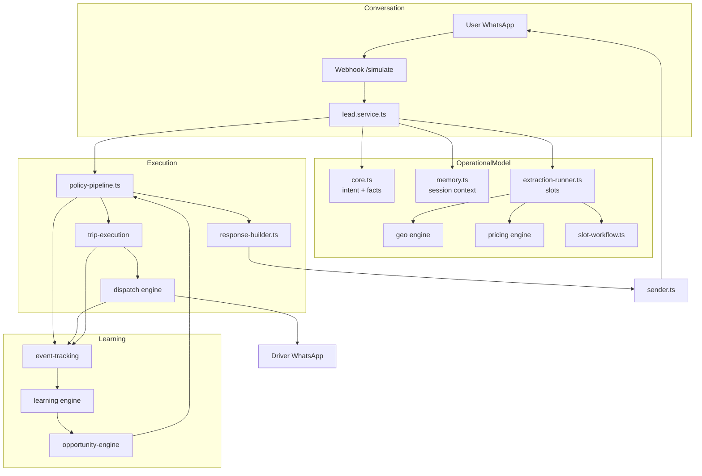
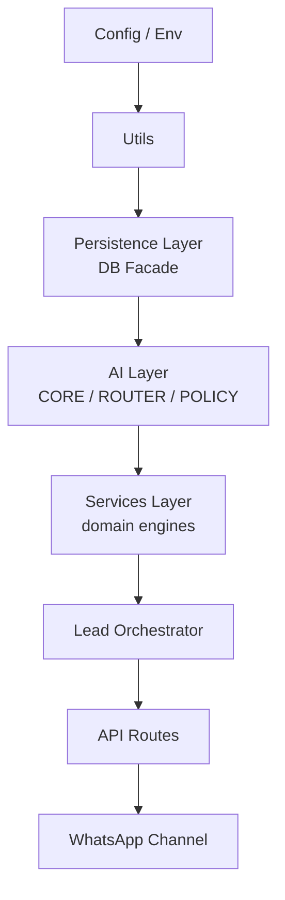

# System Overview — AITOS

> High-level view of the AI Transportation Operating System.
> Derived from source code, tests, ADRs, and database schema.

---

## 1. Mission

Convert ambiguous human language into executable transportation operations: quotes, reservations, immediate dispatches, multi-ride packages, driver assignments, and post-service follow-up.

## 2. Problem

Tourist transportation in the Iguazú region (triple frontier Argentina-Brazil-Paraguay) involves:

- Multilingual customers (Spanish, Portuguese, English)
- Ambiguous location references ("the airport", "the center", "the hotel")
- Cross-border pricing complexity
- Real-time driver coordination
- Mixed immediate and future bookings

A traditional chatbot or form-based system cannot handle this ambiguity. AITOS uses a deterministic core + optional LLM fallback to interpret, price, and execute operations.

## 3. Scope

### In scope (implemented)

- WhatsApp message ingestion and response
- Intent classification and fact extraction
- Slot-based operational model
- Location resolution
- Tariff-based pricing
- Multi-ride package pricing
- Driver dispatch workflow (4 escalation levels)
- Trip execution and state tracking
- Admin dashboard APIs
- Learning/event tracking
- Post-service surveys

### Out of scope / planned

- Multi-channel support beyond WhatsApp (roadmap)
- Real-time GPS tracking of drivers (not implemented)
- Automated payments (not implemented)
- Dynamic surge pricing beyond rule-based adjustments (partial)

## 4. Conversation → Operational Model → Execution → Learning

## 5. Key architectural properties

| Property | Implementation | Evidence |
|----------|----------------|----------|
| Deterministic core | Regex/heuristic intent classification | `src/lib/ai/core.ts` |
| LLM as fallback | Gemini → Groq → null | `src/lib/ai/llm-provider.ts` |
| Operational model | Slots (origin, destination, passengers, scheduled_at, price) | `src/lib/ai/extraction-schema.ts`, `chat_sessions.slots` |
| Phone identity | `chat_sessions.phone` PRIMARY KEY | `src/lib/db/core/connection.ts` |
| Policy authority | `handlePolicyPipeline()` gates all responses | `src/lib/services/workflow/policy-pipeline.ts` |
| Triple fallback | Regex → entity → LLM in extraction | `src/lib/services/extraction/extract-slots.ts` |
| Fail safe | Every external dependency has fallback | `src/lib/ai/handler.ts`, `src/lib/services/extraction/extraction-runner.ts` |

## 6. Logical layers

## 7. Technology stack

| Layer | Technology | Version | Purpose |
|-------|-----------|---------|---------|
| Runtime | Node.js | ≥20.9.0 | Serverless execution |
| Framework | Next.js | 15.x | App Router + API routes |
| Database | Turso (libSQL) | 0.17.3 | Cloud persistence |
| Database fallback | SQLite | — | Local development |
| LLM primary | Gemini 2.0 Flash | SDK 0.24.1 | Extraction/response |
| LLM fallback | Groq llama-3.3-70b | SDK 1.2.0 | Fallback extraction |
| Messaging | Meta WhatsApp Cloud API | v18.0 | Inbound/outbound |
| Monitoring | Sentry | 10.x | Error tracking |
| Tests | Vitest | 4.x | Test runner |
| Deployment | Vercel | — | Serverless hosting |

## 8. Entry points

| Entry point | File | Responsibility |
|-------------|------|----------------|
| WhatsApp webhook | `src/app/api/whatsapp/webhook/route.ts` | Production inbound messages |
| Admin simulation | `src/app/api/bot/simulate/route.ts` | Test conversations |
| Admin dashboard APIs | `src/app/api/bot/*` | CRUD operations |
| Cron jobs | `src/app/api/cron/*` | Scheduled maintenance |

## 9. State persistence

| State | Location | Key | Lifetime |
|-------|----------|-----|----------|
| Session slots | `chat_sessions` | phone | Until `.limpiar` or 48h inactivity |
| Conversation | `conversations` | phone | Persistent |
| Messages | `messages` | conversation_id | Persistent |
| Trip | `trips` | trip_id | Persistent |
| Dispatch | `dispatch_events` | trip_id | Persistent |
| Rate limit | `connection_state` | `rate_limit_${phone}` | 60s sliding window |
| Idempotency | `processed_messages` | message_id | Persistent |

## 10. Known limitations (AS-IS)

| Limitation | Impact | Status |
|------------|--------|--------|
| `lead.service.ts` is a god orchestrator | High coupling | ⚠️ Documented |
| `database.ts` facade is large | Hard to navigate | ⚠️ Documented |
| Learning domain bypasses facade | Architectural violation | ⚠️ Active |
| Circular dependency survey → lead | Runtime risk | ⚠️ Active |
| i18n strings inline in policies | Translation debt | ⚠️ Documented |

---

*Last updated: 2026-07-06*
