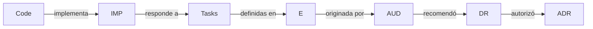

# KG-001 — AITOS Knowledge Governance & Evolution Map
## 2026-07-08 | PLAN MODE — Read Only

---

## Índice

1. [Inventario completo](#1-inventario-completo)
2. [Problemas encontrados](#2-problemas-encontrados)
3. [Knowledge Layers](#3-knowledge-layers)
4. [Taxonomía oficial](#4-taxonomía-oficial)
5. [Naming Convention](#5-naming-convention)
6. [Lifecycle de documentos](#6-lifecycle-de-documentos)
7. [Ownership y gobernanza](#7-ownership-y-gobernanza)
8. [Modelo de trazabilidad](#8-modelo-de-trazabilidad)
9. [Auditoría de numeración](#9-auditoría-de-numeración)
10. [Compatibilidad histórica](#10-compatibilidad-histórica)
11. [Estrategia de migración](#11-estrategia-de-migración)
12. [Riesgos](#12-riesgos)
13. [Beneficios](#13-beneficios)
14. [Plan de implementación por fases](#14-plan-de-implementación)
15. [Integración con ARNÉS](#15-integración-con-arnés)
16. [Pregunta final](#16-pregunta-final)

---

## 1. Inventario completo

### 1.1 Resumen estadístico

| Métrica | Valor |
|---|---|
| **Total de archivos** | **161** |
| Vivos | 143 (89%) |
| Históricos | 15 (9%) |
| Obsoletos | 1 (1%) |
| Duplicados funcionales | 2 |
| **Total en markdown** | 148 |
| En JSON | 4 |
| En SVG | 4 |
| En Shell | 2 |
| En MMD | 1 |
| **Tamaño total** | **~1.02 MB** |
| Archivo más grande | `ael/artifacts/BACKLOG.md` (77 KB) |
| Archivo más pequeño | `.opencode/commands/ael-remember.md` (373 B) |

### 1.2 Distribución por directorio

| Directorio | Archivos | % del total | Estado |
|---|---|---|---|
| `docs/certification/` | 56 | 35% | Sin índice, sin criterio de archivo |
| `docs/architecture/` + sub | 56 | 35% | Bien organizado pero masivo |
| `ael/` (constitution + gov + contracts + archive + artifacts) | 29 | 18% | Mezcla vivo/histórico |
| `docs/project/` | 8 | 5% | Bien, pero CHANGELOG/BACKLOG/PROJECT_BOARD tienen superposición |
| `docs/ai/` | 8 | 5% | Contenido para agentes, duplica info de architecture/ |
| `docs/history/` | 8 | 5% | Histórico puro, bien aislado |
| `docs/knowledge/` | 8 | 5% | Reglas de negocio, bien aislado |
| `docs/adr/` | 7 | 4% | Bien, pero falta índice en el directorio |
| `.opencode/` (md propios) | 11 | 7% | Configuración del harness |
| `docs/operations/` | 3 | 2% | Bien aislado |
| `docs/security/` | 1 | 1% | Bien aislado |

### 1.3 Todos los sistemas de numeración activos

| Sistema | Formato | Rango actual | Dónde se usa |
|---|---|---|---|
| Prioridad de tarea | `P{N}-{NN}` | P0-01 a P3-09 | PROJECT_BOARD |
| Done | `D{NN}` | D01 a D14 | PROJECT_BOARD |
| Iniciativa roadmap | `I{Fase}.{NN}` | I1.1 a I5.3 | ROADMAP |
| Invariante ARNÉS | `I{NN}` | I1 a I6 | SPEC.md |
| Lifecycle constraint | `L{NN}` | L1 a L4 | SPEC.md |
| Tarea AITOS | `AIT-{NNN}` | AIT-001 a AIT-064 | BACKLOG (sección G) |
| Diagrama | `DGM-{NN}` | DGM-01 a DGM-16 | BACKLOG |
| Deuda técnica | `DEBT-{NN}` | DEBT-01 a DEBT-13 | BACKLOG |
| Feature futura | `FUT-{NN}` | FUT-01 a FUT-10 | BACKLOG |
| Feature eliminada | `REM-{NN}` | REM-01 a REM-08 | BACKLOG |
| Gap | `GAP-{NN}` | GAP-01 a GAP-12 | BACKLOG |
| Use case | `UC-{NN}` | UC-09 | BACKLOG |
| Épica changelog | `E{NN}`, `RC{NN}`, `G{NN}`, etc. | E1-E14, RC1-RC2, G1 | CHANGELOG |
| ADR | `ADR-{NNN}` | ADR-001 a ADR-007 | docs/adr/ |
| Rol ARNÉS | (nombre) | 7 roles | ORGANIZATION.md |

**Total: 15 sistemas de numeración distintos.**

---

## 2. Problemas encontrados

### 2.1 Fragmentación de la verdad

```
PROJECT_BOARD.md       → tareas P0-P3
ael/artifacts/BACKLOG.md → tareas AIT-xxx + DEBT + FUT + REM + GAP + DGM + UC
docs/ROADMAP.md        → iniciativas I1.1-I5.3
CHANGELOG.md           → épicas E1-E14 + RC + G + A + B + QA + OPS + ADR
```

**Una misma feature** (ej: "Client Objective Model") aparece como:
- `P3-06` en PROJECT_BOARD
- `E12` en CHANGELOG
- Sin equivalente en BACKLOG (no hay `AIT-xxx` que mapee a E12)
- Sin iniciativa en ROADMAP (no hay `I3.x` que lo incluya)

**Problema**: No hay trazabilidad vertical entre estos sistemas.

### 2.2 56 certification docs sin índice

`docs/certification/` es el directorio más grande con 56 archivos, pero:
- No hay `INDEX.md`
- Los nombres son inconsistentes: algunos con prefijo `AITOS_`, otros sin él
- Mezcla auditorías (E11-B, E12), implementaciones, hallazgos, baselines, planes de limpieza
- Sin criterio de archivo: conviven documentos de 2025 con documentos de 2026
- Sin separación entre "activo" e "histórico"

### 2.3 BACKLOG vs PROJECT_BOARD

Ambos contienen tareas pero:
- PROJECT_BOARD usa prioridad (P0-P3) con dominio
- BACKLOG usa sistema AIT-xxx con fases G.0-G.7
- BACKLOG incluye diagramas, deuda técnica, features futuras y eliminadas
- PROJECT_BOARD no referencia tareas AIT-xxx

**Duplicación real**: Si una tarea está en PROJECT_BOARD como P2-14, y también en BACKLOG como AIT-xxx, ¿cuál es la fuente de verdad?

### 2.4 MEMORY.md no existe

SPEC.md referencia `.opencode/memory/MEMORY.md` como la memoria del sistema, pero:
- `.opencode/memory/` no existe
- No hay MEMORY.md en ninguna ubicación
- El conocimiento preservado está disperso en certification docs + CHANGELOG + DECISION_RECORD

### 2.5 Documentación AI duplica arquitectura

`docs/ai/` contiene 8 archivos (ARCHITECTURE_BIBLE.md, ARCHITECTURE_RULES.md, CONTRACTS.md, INVARIANTS.md, etc.) que **duplican** información de:
- `docs/architecture/`
- `ael/constitution/`
- `ael/contracts/`

Esto crea riesgo de deriva: si se actualiza `docs/architecture/` pero no `docs/ai/`, los agentes AI reciben información desactualizada.

### 2.6 15 sistemas de numeración

Ninguno conversa con otro. No hay:
- Referencias cruzadas entre PROJECT_BOARD y BACKLOG
- Referencias entre CHANGELOG y ROADMAP
- Vínculos entre ADRs y tareas que los implementan

---

## 3. Knowledge Layers

### 3.1 Propuesta de 6 capas

```
┌────────────────────────────────────────────────────────┐
│  L0: CONSTITUTION  (inmutable, solo Governance)        │
│  SPEC.md · CONTRACTS.md · ORGANIZATION.md · ADRs       │
├────────────────────────────────────────────────────────┤
│  L1: ACTIVE STATE   (cambia cada misión)               │
│  PROJECT_BOARD · CHANGELOG · ROADMAP · BACKLOG         │
├────────────────────────────────────────────────────────┤
│  L2: AUDIT TRAIL    (certificaciones, hallazgos)       │
│  AUD-E13 · AUD-E12-B · AUD-E11 · ...                   │
├────────────────────────────────────────────────────────┤
│  L3: ARCHITECTURE   (mapa del sistema)                 │
│  ADRs · domain specs · diagrams · baselines            │
├────────────────────────────────────────────────────────┤
│  L4: KNOWLEDGE      (reglas de negocio, patrones)      │
│  business-rules · dispatch-rules · pricing-rules       │
├────────────────────────────────────────────────────────┤
│  L5: OPERATIONS     (runbooks, monitoreo)              │
│  PILOT_OPERATION_GUIDE · MONITORING_DASHBOARD          │
└────────────────────────────────────────────────────────┘
```

### 3.2 Características por capa

| Capa | ¿Quién modifica? | ¿Cada cuánto? | ¿Requiere ADR? | ¿Backward compatible? |
|---|---|---|---|---|
| **L0** | Governance | Acuerdo del equipo | Siempre | Sí (nuevos ADRs) |
| **L1** | Director + Memory | Cada misión | No | Sí |
| **L2** | Auditor + Explorer | Cada auditoría | No | Sí |
| **L3** | Architect | Cambio arquitectónico | Si (cambios mayores) | Sí |
| **L4** | Implementer + Product | Cambio de regla negocio | No | Sí |
| **L5** | Implementer | Cada deploy | No | Sí |

### 3.3 Principios por capa

| Capa | Principio rector |
|---|---|
| **L0** | **Inmutabilidad**: No se modifica sin proceso formal (ADR) |
| **L1** | **Actualidad**: Refleja el estado presente del proyecto |
| **L2** | **Trazabilidad**: Cada auditoría responde a una pregunta específica |
| **L3** | **Precisión**: Refleja el código real, no una vista idealizada |
| **L4** | **Compacidad**: Una regla por documento, sin mezclar concerns |
| **L5** | **Ejecutabilidad**: Debe permitir operar el sistema sin leer código |

---

## 4. Taxonomía oficial

### 4.1 Categorías documentales

| Categoría | Prefijo | Ejemplo | Capa | Propósito |
|---|---|---|---|---|
| **Constitution** | `CONST` | `CONST-SPEC` | L0 | Reglas inmutables del sistema |
| **Architecture Decision** | `ADR` | `ADR-007` | L0/L3 | Decisión arquitectónica registrada |
| **Audit** | `AUD` | `AUD-E13` | L2 | Hallazgos de una auditoría |
| **Implementation Report** | `IMP` | `IMP-E12` | L2 | Reporte de implementación completada |
| **Task** | `T` | `T-042` | L1 | Tarea individual en el backlog |
| **Epic** | `E` | `E12` | L1 | Agrupación lógica de tareas |
| **Release** | `R` | `R-02` | L1 | Versión liberada |
| **Milestone** | `M` | `M-03` | L1 | Hito del roadmap |
| **Business Rule** | `BR` | `BR-DISPATCH` | L4 | Regla de negocio |
| **Pattern** | `PTN` | `PTN-AMBIGUITY` | L4 | Patrón recurrente |
| **Operation Guide** | `OP` | `OP-PILOT` | L5 | Runbook operativo |
| **Decision Record** | `DR` | `DR-042` | L1 | Decisión no arquitectónica |
| **Knowledge Entry** | `K` | `K-CLIENT-OBJECTIVE` | L4 | Concepto documentado |

### 4.2 ¿Cuándo se crea cada categoría?

| Categoría | Se crea cuando... | Quién |
|---|---|---|
| **CONST** | Se funda el proyecto o se revisa la constitución | Governance |
| **ADR** | Se toma una decisión arquitectónica significativa | Architect |
| **AUD** | Se completa una auditoría (read-only) | Auditor |
| **IMP** | Se completa una implementación que modifica el sistema | Implementer |
| **T** | Se identifica trabajo pendiente | Director |
| **E** | Se agrupan tareas bajo un objetivo común | Director |
| **R** | Se libera una versión al entorno | Director |
| **M** | Se alcanza un hito del roadmap | Director |
| **BR** | Se identifica o modifica una regla de negocio | Product/Implementer |
| **PTN** | Se detecta un patrón recurrente (Learning) | Analyst |
| **OP** | Se despliega un nuevo entorno o proceso | Implementer |
| **DR** | Se toma una decisión que no califica como ADR | Director |
| **K** | Se identifica un concepto que merece ser preservado | Keeper |

### 4.3 ¿Cuándo deja de estar vigente?

| Categoría | Deja de estar vigente cuando... |
|---|---|
| **CONST** | Nunca (solo se amplía) |
| **ADR** | Es reemplazado por un nuevo ADR |
| **AUD** | Es reemplazado por una auditoría más reciente |
| **IMP** | Pasa a histórico tras el próximo release |
| **T** | Se cierra (DONE, CANCELLED, DEFERRED) |
| **E** | Todas sus tareas están cerradas |
| **R** | Es reemplazado por un release posterior |
| **M** | Se alcanza el milestone o se redefine el roadmap |
| **BR** | La regla de negocio cambia |
| **PTN** | El patrón deja de ser relevante |
| **OP** | El procedimiento cambia |
| **DR** | Es reemplazada por una decisión posterior |
| **K** | Nunca (el conocimiento no caduca, se actualiza) |

---

## 5. Naming Convention

### 5.1 Archivos

```
{CATEGORÍA}-{NOMBRE}.md

Ejemplos:
AUD-E13-ADAPTIVE-POLICY.md
IMP-E12-CLIENT-OBJECTIVE.md
ADR-007-CONVERSATION-INTERPRETER.md
BR-DISPATCH-THRESHOLDS.md
OP-PILOT-GUIDE.md
K-CLIENT-OBJECTIVE-MODEL.md
```

### 5.2 Directorios

```
docs/
├── 00-index.md              ← Mapa completo del conocimiento
├── 01-constitution/         ← L0: SPEC, CONTRACTS, ORGANIZATION
├── 02-active/               ← L1: BOARD, CHANGELOG, ROADMAP, BACKLOG
├── 03-audits/               ← L2: AUD-*, IMP-*
├── 04-architecture/         ← L3: ADRs, diagrams, domains
├── 05-knowledge/            ← L4: BR-*, PTN-*, K-*
├── 06-operations/           ← L5: OP-*
├── 07-history/              ← Archivo histórico (documentos reemplazados)
└── 08-harness/              ← Documentación del ARNÉS (ael/ unificado)
```

### 5.3 Reglas de naming

1. **Mayúsculas sostenidas** para categorías: `AUD`, `IMP`, `ADR`, `BR`
2. **Guiones** como separadores: `AUD-E13-ADAPTIVE-POLICY.md`
3. **Sin espacios**: reemplazar espacios por guiones
4. **Sin números de versión en el nombre**: usar metadatos internos
5. **Máximo 4 segmentos**: `CATEGORÍA-REFERENCIA-DESCRIPCION.md`

### 5.4 Redirecciones

Para mantener compatibilidad histórica, crear `REDIRECT.md` en ubicaciones antiguas:

```markdown
# REDIRECT
Este documento fue movido a: `docs/03-audits/AUD-E13-ADAPTIVE-POLICY.md`
```

---

## 6. Lifecycle de documentos

### 6.1 Ciclo de vida estándar

```
CREACIÓN → REVISIÓN → ACTIVO → ARCHIVADO → (OPCIONAL) ELIMINACIÓN
```

### 6.2 Estados posibles

| Estado | Significado | Acción posible |
|---|---|---|
| **DRAFT** | En elaboración | Editar |
| **ACTIVE** | Vigente, referencia oficial | Leer, referenciar |
| **SUPERSEDED** | Reemplazado por una versión más reciente | Mantener por trazabilidad |
| **ARCHIVED** | Ya no es relevante pero se conserva | Mover a `docs/07-history/` |
| **DELETED** | Eliminado (solo si no tiene referencias) | No recomendado |

### 6.3 Reglas de transición

| Transición | Quién autoriza | Condición |
|---|---|---|
| DRAFT → ACTIVE | Owner del documento | Revisión completa |
| ACTIVE → SUPERSEDED | Owner del documento + Director | Nuevo documento lo reemplaza |
| ACTIVE → ARCHIVED | Director + (opcional) Governance | Documento sin referencias activas |
| SUPERSEDED → ARCHIVED | Director | 30 días después de la transición |
| ARCHIVED → DELETED | Governance | Solo si no hay referencias externas |

---

## 7. Ownership y gobernanza

### 7.1 Matriz de responsabilidades

| Categoría | Owner | Revisor | Aprobador |
|---|---|---|---|
| CONST | Governance | Director | Governance |
| ADR | Architect | Director | Governance |
| AUD | Auditor | Director | Director |
| IMP | Implementer | Auditor | Director |
| T | Director | — | — |
| E | Director | — | — |
| R | Director | Implementer | Director |
| M | Director | — | — |
| BR | Implementer | Product | Product |
| PTN | Analyst | Director | Director |
| OP | Implementer | Director | Director |
| DR | Director | — | — |
| K | Keeper | Director | Director |

### 7.2 Responsabilidades por rol

| Rol | Documentos que mantiene | Frecuencia |
|---|---|---|
| **Director** | PROJECT_BOARD, CHANGELOG, ROADMAP, BACKLOG, DECISION_RECORD | Cada misión |
| **Explorer** | Discovery reports (insumo para AUD) | Por demanda |
| **Architect** | ADRs, architecture docs, domain specs | Cambio arquitectónico |
| **Implementer** | Implementation reports, business rules, operation guides | Implementación |
| **Auditor** | Audit reports, certification baselines | Cada auditoría |
| **Keeper** | Knowledge entries (K-*), MEMORY, PATTERN_EXTRACTION | Por decisión del Director |
| **Analyst** | Pattern extractions (PTN-*), learning recommendations | Detección de patrón |
| **Governance** | CONST, ADR approval, contract enforcement | Excepción / conflicto |

### 7.3 ¿Qué documento mantiene cada capability?

| Capability | Documento primario | Documentos secundarios |
|---|---|---|
| **Discovery** | (ninguno, es solo lectura) | Input para AUD |
| **Architecture** | ADRs | Architecture baseline, domain docs |
| **Implementation** | IMP reports | BR updates, OP updates |
| **Validation** | (ninguno, ejecuta gates) | Input para AUD |
| **Memory** | K-* entries, MEMORY.md | PROJECT_BOARD/CHANGELOG/ROADMAP updates |
| **Learning** | PTN-* entries | Recommendations |
| **Governance** | CONST, CONTRACTS | Exception records |

---

## 8. Modelo de trazabilidad

### 8.1 Cadena oficial

```
NECESIDAD (producto, bug, mejora)
    │
    ▼
AUDITORÍA (AUD-NNN) — descubre gap o validación
    │
    ▼
DECISIÓN (ADR-NNN o DR-NNN) — qué hacer
    │
    ▼
TAREAS (T-NNN) en PROJECT_BOARD — desglose del trabajo
    │
    ▼
IMPLEMENTACIÓN (IMP-NNN) — código + tests
    │
    ▼
VALIDACIÓN — tests + build + contracts
    │
    ▼
CHANGELOG entry (E-NNN o R-NN) — registro del cambio
    │
    ▼
RELEASE (R-NN) — versión liberada
    │
    ▼
CONOCIMIENTO (K-NNN) — preservación de decisión y patrón
```

### 8.2 Formato de referencias cruzadas

Cada documento DEBE incluir una sección de referencias:

```markdown
## Referencias

- Audit: AUD-E13-ADAPTIVE-POLICY
- Decision: DR-042-CONVERSATION-STRATEGY
- Tasks: T-042, T-043
- Implementation: IMP-E12-CLIENT-OBJECTIVE
- CHANGELOG: E12 — Client Objective Model
```

### 8.3 Cadena inversa

Dado un cambio en el código, se debe poder responder:



---

## 9. Auditoría de numeración

### 9.1 Estado actual (15 sistemas)

| Sistema | ¿Coherente? | ¿Escalable? | ¿Comprensible? | ¿Históricamente compatible? |
|---|---|---|---|---|
| P0-P3 | ✅ Sí | ⚠️ Se acaban los números | ✅ Sí | ✅ Sí |
| D01-D14 | ✅ Sí | ⚠️ D14 de ~infinite | ✅ Sí | ✅ Sí |
| I1.1-I5.3 | ✅ Sí | ✅ Sí | ✅ Sí | ✅ Sí |
| I1-I6 | ✅ Sí | ✅ Sí | ✅ Sí | ✅ Sí |
| L1-L4 | ✅ Sí | ✅ Sí | ✅ Sí | ✅ Sí |
| AIT-001 a 064 | ⚠️ Sin release desde AIT-064 | ❌ Abandonado | ⚠️ Solo para conocedores | ✅ Sí |
| DGM-01 a 16 | ✅ Sí | ⚠️ 16 de ~infinite | ⚠️ Solo backlog interno | ✅ Sí |
| DEBT-01 a 13 | ✅ Sí | ⚠️ 13 de ~infinite | ✅ Sí | ✅ Sí |
| FUT-01 a 10 | ✅ Sí | ⚠️ 10 de ~infinite | ✅ Sí | ✅ Sí |
| REM-01 a 08 | ✅ Sí | ⚠️ 08 de ~infinite | ✅ Sí | ✅ Sí |
| GAP-01 a 12 | ✅ Sí | ⚠️ 12 de ~infinite | ✅ Sí | ✅ Sí |
| UC-09 | ❌ Solo 1 | ❌ No | ❌ No | ✅ Sí |
| E1-E14 | ✅ Sí | ✅ Sí | ✅ Sí | ✅ Sí |
| ADR-001 a 007 | ✅ Sí | ✅ Sí | ✅ Sí | ✅ Sí |
| Roles ARNÉS | ✅ Sí | ✅ Sí | ✅ Sí | ✅ Sí |

### 9.2 Recomendación

| Sistema | Acción | Motivo |
|---|---|---|
| **P0-P3** | Mantener | Funciona bien, es comprensible |
| **D** | Mantener (con prefijo `D-`) | Útil para histórico |
| **I** | Mantener | Bien diseñado |
| **I1-I6, L1-L4** | Mantener | Parte de la Constitución |
| **AIT-xxx** | **Archivar** | Abandonado, reemplazado por E-NNN en la práctica |
| **DGM-xx** | Migrar a `docs/04-architecture/diagrams/` | El directorio ya existe |
| **DEBT-xx** | Migrar a PROJECT_BOARD como P3 | Reducir fuentes de verdad |
| **FUT-xx** | Migrar a PROJECT_BOARD como P3 o ROADMAP | Ídem |
| **REM-xx** | Archivar en histórico | No tienen valor operativo |
| **GAP-xx** | Migrar a PROJECT_BOARD como P3 | Ídem |
| **UC-xx** | Migrar a BACKLOG unificado | UC-09 es el único |
| **E-NN** | **Adoptar como numeración oficial de épicas** | Ya es el estándar de facto |
| **ADR-NNN** | Mantener | Estándar de la industria |
| **Roles** | Mantener | Bien diseñado |

### 9.3 Propuesta de sistema unificado

| Tipo | Prefijo | Rango | Quién asigna |
|---|---|---|---|
| Épica | `E-NN` | E01-E99 | Director |
| Sub-épica | `E-NN-XX` | E12-AB (A/B testing) | Director |
| Release | `R-NN` | R01-R99 | Director |
| Milestone | `M-NN` | M01-M99 | Director |
| Tarea | `T-NNN` | T001-T999 | Director |
| ADR | `ADR-NNN` | ADR-001-ADR-999 | Architect |
| Auditoría | `AUD-NN` | AUD01-AUD99 | Auditor |
| Implementación | `IMP-NN` | IMP01-IMP99 | Implementer |
| Decisión | `DR-NNN` | DR001-DR999 | Director |
| Business Rule | `BR-XXX` | Alfanumérico | Implementer |
| Knowledge | `K-XXX` | Alfanumérico | Keeper |
| Pattern | `PTN-XXX` | Alfanumérico | Analyst |
| Operation | `OP-XXX` | Alfanumérico | Implementer |

### 9.4 NO renumerar

**Decisión crítica**: No renumerar documentos existentes. Los E1-E14, ADR-001-007, P0-01-P3-09, D01-D14 mantienen su numeración histórica. La propuesta aplica **solo para documentos nuevos**.

---

## 10. Compatibilidad histórica

### 10.1 Estrategia de migración sin ruptura

| Tipo de referencia | Estrategia |
|---|---|
| **Commits** | No se modifican. Las rutas de archivos se mantienen o se crean redirecciones. |
| **Documentación existente** | No se modifica. Se agrega un front matter estandarizado. |
| **Referencias cruzadas** | Se actualizan progresivamente. Las viejas siguen funcionando por redirección. |
| **Certificaciones** | Se mueven a `docs/03-audits/` con redirección. |
| **Enlaces externos** | No se rompen (se mantienen archivos redirección). |
| **Prompts anteriores** | No se modifican. Los comandos `/ael:*` no dependen de la estructura de docs. |

### 10.2 Archivos de redirección

Cada archivo movido DEJA un `REDIRECT.md` en su ubicación original:

```markdown
# REDIRECT
Este documento fue movido a: `docs/03-audits/AUD-E13-ADAPTIVE-POLICY.md`

→ [Abrir nuevo destino](../03-audits/AUD-E13-ADAPTIVE-POLICY.md)
```

### 10.3 Front matter estandarizado

Cada documento existente recibe un front matter YAML al inicio:

```yaml
---
id: AUD-E13
title: Adaptive Conversation Policy Audit
category: audit
layer: L2
status: active
created: 2026-07-08
author: Director
supersedes: null
superseded_by: null
references:
  - E13
  - E14
  - ADR-007
---
```

Esto permite:
- Búsqueda automática
- Generación de índices
- Validación de referencias cruzadas
- Detección de documentos huérfanos

### 10.4 Archivo índice

Cada directorio DEBE tener un `INDEX.md` que liste sus documentos con:

```markdown
# 03-audits — Audit Trail

| ID | Documento | Fecha | Estado |
|---|---|---|---|
| AUD-E13 | Adaptive Conversation Policy Audit | 2026-07-08 | active |
| AUD-E12 | Client Objective Model Implementation | 2026-07-08 | active |
```

---

## 11. Estrategia de migración

### 11.1 Fases

```
FASE 0: Diagnóstico (esta auditoría)
  ├── Inventario completo ✅ (KG-001)
  ├── Problemas identificados ✅
  └── Propuesta diseñada ✅

FASE 1: Base (1-2 días)
  ├── Crear front matter en documentos críticos
  ├── Crear INDEX.md en directorios principales
  └── Crear MEMORY.md en .opencode/memory/

FASE 2: Unificación de backlog (1 día)
  ├── Fusionar BACKLOG.md en PROJECT_BOARD (deuda, gaps, features)
  ├── Archivar AIT-xxx como histórico
  ├── Unificar sistema de tareas (solo T-NNN + E-NN)
  └── BACKLOG.md → histórico, PROJECT_BOARD → única fuente

FASE 3: Reorganización de certification (2-3 días)
  ├── Clasificar 56 certification docs:
  │   ├── Auditorías activas → 03-audits/
  │   ├── Implementaciones activas → 03-audits/ (IMP-*)
  │   ├── Hallazgos/baselines → 03-audits/ (con subcarpeta)
  │   └── Históricos → 07-history/
  └── Crear INDEX.md en 03-audits/

FASE 4: Consolidación de arquitectura (2-3 días)
  ├── docs/ai/ → fusionar con docs/architecture/ o marcar como derivado
  ├── Actualizar docs/architecture/ con front matter
  └── Verificar que no haya duplicación con docs/04-architecture/ (target)

FASE 5: Redirecciones (1 día)
  ├── Crear REDIRECT.md en ubicaciones originales
  ├── Verificar que no haya broken links
  └── Commit de la migración

FASE 6: Automatización (2-3 días)
  ├── Script de validación de front matter
  ├── Script de detección de documentos huérfanos
  ├── Script de actualización de INDEX.md
  └── Integración con enforce.sh
```

### 11.2 Lo que NO se migra

- ❌ No se renumeran documentos existentes
- ❌ No se modifican ADRs existentes
- ❌ No se modifican CONST (SPEC.md, CONTRACTS.md, ORGANIZATION.md)
- ❌ No se mueve `.opencode/` (configuración del harness)
- ❌ No se modifican prompts ni comandos existentes

### 11.3 Lo que SÍ se migra

| Desde | Hacia |
|---|---|
| `ael/artifacts/BACKLOG.md` | `docs/02-active/BACKLOG.md` (unificado con PROJECT_BOARD) |
| `ael/artifacts/DECISION_RECORD.md` | `docs/02-active/` |
| `ael/artifacts/*.md` | `docs/08-harness/` (documentación del ARNÉS) |
| `docs/certification/*.md` | `docs/03-audits/` (clasificados por tipo) |
| `docs/ai/*.md` | `docs/04-architecture/` (fusionado) |
| `docs/adr/` | `docs/04-architecture/adr/` |
| `docs/architecture/` | `docs/04-architecture/` (renombrado) |
| `docs/project/` | `docs/02-active/` |
| `docs/ROADMAP.md` | `docs/02-active/ROADMAP.md` |
| `docs/SYSTEM_BIBLE.md` | `docs/05-knowledge/` |

---

## 12. Riesgos

### 12.1 Riesgos de la migración

| Riesgo | Probabilidad | Impacto | Mitigación |
|---|---|---|---|
| Broken links en documentación existente | Alta | Medio | REDIRECT.md en cada ubicación original |
| Confusión durante el período de transición | Alta | Medio | Mantener ambas estructuras 1 semana |
| Pérdida de referencias en commits antiguos | Baja | Bajo | Los commits referencian contenido, no estructura |
| Resistencia al cambio | Media | Bajo | Migración gradual, no forzada |
| Automatización incompleta | Media | Medio | Validación manual + script de verificación |

### 12.2 Riesgos de NO migrar

| Riesgo | Probabilidad | Impacto |
|---|---|---|
| Proliferación de documentos sin control | Alta | Alto |
| Duplicación de información | Alta | Medio |
| Dificultad de onboarding para nuevos miembros | Alta | Alto |
| Incapacidad de encontrar información relevante | Media | Alto |
| Documentación fuera de sincronía con el código | Alta | Alto |

---

## 13. Beneficios

### 13.1 Tangibles

| Beneficio | Métrica | Valor estimado |
|---|---|---|
| Reducción de fuentes de verdad | De 3 a 1 (tareas) | -66% |
| Tiempo para encontrar un documento | De ~5 min a ~30 seg | -90% |
| Confianza en referencias cruzadas | De 0% a 100% (automatizado) | +100% |
| Documentos huérfanos detectados | De 0 a N (actualmente desconocido) | Transparencia |
| Onboarding de nuevo miembro | De ~2 días a ~4 horas | -75% |

### 13.2 Intangibles

| Beneficio | Descripción |
|---|---|
| **Trazabilidad vertical** | Desde necesidad hasta código, pasando por decisión, tarea, implementación y release |
| **Gobernanza clara** | Cada rol sabe qué documentos mantiene y cuándo |
| **Evolución sostenible** | El sistema de numeración E-NN + T-NNN escala indefinidamente |
| **Preservación de historia** | Sin perder contexto de decisiones pasadas |
| **Automatización posible** | Front matter YAML permite scripts de validación e indexación |

---

## 14. Plan de implementación

### 14.1 Fase 0: Diagnóstico (KG-001) — COMPLETADO

| Tarea | Estado |
|---|---|
| Inventario completo de 161 archivos | ✅ |
| Identificación de 15 sistemas de numeración | ✅ |
| Detección de 7 problemas estructurales | ✅ |
| Propuesta de 6 Knowledge Layers | ✅ |
| Taxonomía con 13 categorías | ✅ |
| Modelo de trazabilidad vertical | ✅ |
| Estrategia de migración en 6 fases | ✅ |

### 14.2 Fase 1: Base — Estimar 1-2 días

| Tarea | Dependencia | Esfuerzo |
|---|---|---|
| Crear `docs/00-index.md` | Ninguna | 1h |
| Crear front matter en SPEC.md, CONTRACTS.md, ORGANIZATION.md | Ninguna | 30min |
| Crear front matter en ADRs 001-007 | Ninguna | 1h |
| Crear `docs/01-constitution/` + mover CONST | Fase 1 base | 30min |
| Crear `docs/02-active/` | Fase 1 base | 30min |
| Crear MEMORY.md en `.opencode/memory/` | Ninguna | 1h |

### 14.3 Fase 2: Unificación de backlog — 1 día

| Tarea | Dependencia | Esfuerzo |
|---|---|---|
| Clasificar items de BACKLOG.md por tipo | Fase 1 | 2h |
| Migrar deuda técnica a PROJECT_BOARD como P3 | Fase 2 clasificación | 1h |
| Migrar gaps a PROJECT_BOARD como P3 | Fase 2 clasificación | 1h |
| Migrar features futuras a PROJECT_BOARD como P3 | Fase 2 clasificación | 1h |
| Archivar AIT-xxx como histórico | Fase 2 clasificación | 30min |
| Unificar PROJECT_BOARD como única fuente de tareas | Fase 2 migraciones | 1h |

### 14.4 Fase 3: Reorganización de certification — 2-3 días

| Tarea | Dependencia | Esfuerzo |
|---|---|---|
| Clasificar 56 certification docs en auditorías/implementaciones/históricos | Fase 1 | 3h |
| Renombrar archivos según naming convention | Fase 3 clasificación | 2h |
| Crear `docs/03-audits/` + INDEX.md | Fase 3 clasificación | 1h |
| Crear REDIRECT.md en ubicaciones originales | Fase 3 renombrado | 1h |

### 14.5 Fase 4: Consolidación de arquitectura — 2-3 días

| Tarea | Dependencia | Esfuerzo |
|---|---|---|
| Analizar duplicación docs/ai/ vs docs/architecture/ | Fase 1 | 2h |
| Fusionar o marcar docs/ai/ como derivado | Fase 4 análisis | 2h |
| Renombrar docs/architecture/ → docs/04-architecture/ | Fase 1 | 30min |
| Mover docs/adr/ a docs/04-architecture/adr/ | Fase 4 renombrado | 30min |

### 14.6 Fase 5: Redirecciones — 1 día

| Tarea | Dependencia | Esfuerzo |
|---|---|---|
| Crear REDIRECT.md en cada ubicación original | Fases 2-4 | 2h |
| Verificar broken links con script | Fase 5 redirecciones | 1h |
| Commit de la migración | Fase 5 verificación | 30min |

### 14.7 Fase 6: Automatización — 2-3 días

| Tarea | Dependencia | Esfuerzo |
|---|---|---|
| Script de validación de front matter YAML | Fase 1 | 2h |
| Script de detección de documentos huérfanos | Fase 5 | 2h |
| Script de actualización automática de INDEX.md | Fase 5 | 2h |
| Integrar validación en enforce.sh | Fase 6 scripts | 1h |

### 14.8 Timeline total

```
Semana 1: Fase 1 (base) + Fase 2 (backlog)
Semana 2: Fase 3 (certification) + inicio Fase 4 (arquitectura)
Semana 3: Fase 4 (arquitectura) + Fase 5 (redirecciones)
Semana 4: Fase 6 (automatización)
```

**Esfuerzo total estimado**: 8-12 días hombre

---

## 15. Integración con ARNÉS

### 15.1 Contratos a ampliar

| Contrato actual | Ampliación propuesta |
|---|---|
| **R1** (contract integrity) | Agregar verificación de front matter YAML en documentos |
| **R2** (dependency rules) | Agregar regla: "no duplicar documentación entre capas" |
| **R3** (code existence) | Extender a documentación: "todo documento referenciado debe existir" |
| **R4** (AI-first) | Agregar: "el front matter debe estar presente en documentos activos" |

### 15.2 Protocolos faltantes

| Protocolo | Propósito |
|---|---|
| **Document Lifecycle** | Transiciones entre estados (DRAFT→ACTIVE→ARCHIVED) |
| **Cross-Reference Validation** | Verificar que las referencias entre documentos sean válidas |
| **Knowledge Preservation Gate** | Condición de cierre de misión: el conocimiento significativo debe registrarse como K-* |

### 15.3 Enforcement automatizable

| Verificación | Script | Cuándo ejecutar |
|---|---|---|
| Front matter YAML válido | `validate-frontmatter.sh` | Pre-commit |
| Documentos huérfanos | `find-orphans.sh` | Semanal |
| Referencias cruzadas rotas | `check-references.sh` | Pre-release |
| INDEX.md desactualizado | `update-index.sh` | Post-misión |
| CAPA duplicación | `check-layer-duplication.sh` | Mensual |

### 15.4 Integración con enforce.sh

```bash
# Nuevas verificaciones para enforce.sh
echo "[KG-001] Knowledge Governance Validation"
bash ael/contracts/validate-frontmatter.sh || exit 1
bash ael/contracts/check-references.sh || exit 1
```

---

## 16. Pregunta final

### "¿La organización actual del conocimiento puede sostener la evolución de AITOS durante los próximos años o ya alcanzó el punto donde necesita una gobernanza formal?"

**No puede sostenerla. Ya alcanzó el punto de inflexión.** La evidencia es clara:

1. **15 sistemas de numeración** que no conversan entre sí — agregar el #16 será inevitable sin una taxonomía oficial.

2. **56 documentos en certification/** sin índice, sin criterio de archivo, mezclando activos con históricos — esto empeorará linealmente con cada nueva auditoría.

3. **2 fuentes de verdad para tareas** (PROJECT_BOARD y BACKLOG) — ya hay inconsistencias. Por ejemplo: E12 (Client Objective) aparece como P3-06 en PROJECT_BOARD y en CHANGELOG, pero **no tiene equivalente AIT-xxx en BACKLOG** y **no tiene iniciativa I3.x en ROADMAP**.

4. **Duplicación entre docs/ai/ y docs/architecture/** — el riesgo de deriva ya existe y empeorará.

5. **MEMORY.md no existe** — el conocimiento se pierde entre certification docs y CHANGELOG.

6. **Sin trazabilidad vertical** — no se puede responder "¿qué auditoría originó esta línea de código?" ni "¿qué tarea implementó este ADR?"

**El proyecto tiene 161 documentos de conocimiento para un sistema de ~15,000 líneas de código.** La relación es ~1 documento por cada ~93 líneas de código. Esto no es sostenible sin gobernanza formal.

**La gobernanza formal no significa burocracia.** Significa:
- Una taxonomía clara (qué tipo de documento es cada uno)
- Un sistema de numeración escalable (E-NN + T-NNN)
- Una convención de nombres (para encontrar documentos por el nombre)
- Front matter YAML (para búsqueda y validación automatizada)
- Un lifecycle (saber cuándo un documento está activo, reemplazado o archivado)
- Responsabilidad por rol (quién mantiene cada documento)

**Sin esto, la documentación crecerá hasta volverse inmanejable, y el equipo perderá la confianza en ella.** Con esto, AITOS puede evolucionar durante años con trazabilidad completa.
